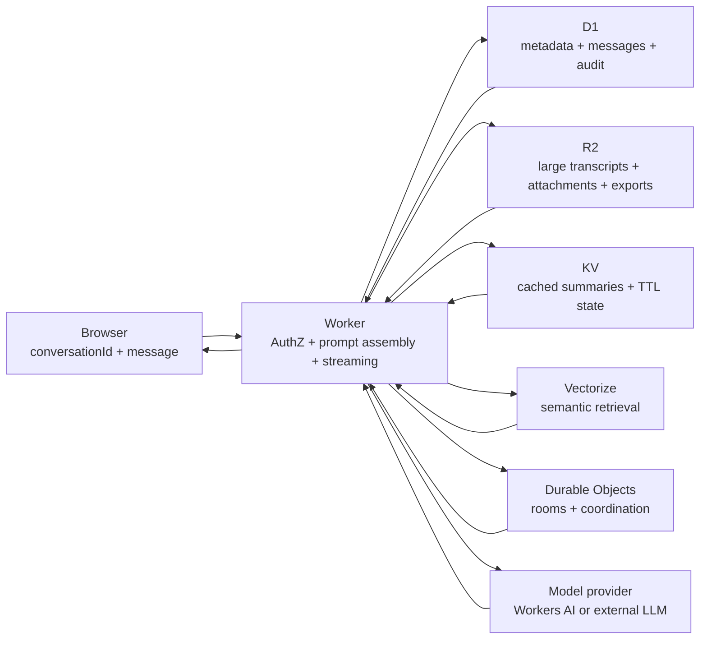

## 基本の区別

LLM API はステートレス。アプリケーションが関連する状態をもう一度送らないかぎり、モデルは前のリクエストを覚えていない。

毎回のリクエストで直近のチャット履歴を送ることは **context replay**。チャット UX には必要なことが多いが、それだけでは RAG ではない。

RAG は **retrieval-augmented generation**。Worker が関連する外部コンテキスト、古い会話ターン、プロジェクトの事実、元ドキュメントを取得し、その参照をモデルリクエストへ注入する。

## リクエスト境界

Web アプリでは、ブラウザのペイロードを小さく保ち、ポリシー境界を Worker に置く：

```typescript
type ChatRequest = {
  conversationId: string;
  message: string;
};
```

ブラウザは `conversationId` と新しいユーザーメッセージを送る。Worker はユーザーを認証・認可し、会話状態を読み込み、レート制限と費用制御を適用し、プロンプトを組み立て、モデルプロバイダーを呼び出し、ユーザーとアシスタントのターンを保存し、レスポンスをストリーミングする。

ブラウザにプロバイダーキー、プロンプト組み立てルール、永続履歴、テナント分離、レート制限、支出制御を持たせない。



## プロンプト組み立てスタック

モデル入力は予測しやすい順序で組み立てる：

| レイヤー | 目的 |
|---|---|
| System prompt | プロダクトの振る舞い、安全ルール、出力契約、ツールポリシー。 |
| Stable user/project facts | ターンをまたいで残すべきピン留め済みの事実。 |
| Rolling summary | 古い会話を短い状態スナップショットへ圧縮する。 |
| Last N messages verbatim | 直近ターンの細かなニュアンスを保つ。 |
| Retrieved context | keyword/SQL search または Vectorize から、関連する古いメッセージやドキュメントを追加する。 |
| Current user message | 新しい依頼が直近のタスクになるよう最後に置く。 |

要約や取得したスニペットの横には source ID を残す。モデルは圧縮済みメモリを使えるが、アプリには元の行、オブジェクト、ドキュメントへ戻れる監査性が必要。

## 圧縮とメモリ

決定的な圧縮と AI によるメモリは分けて考える。解決する失敗モードが違う。

| アプローチ | 使う場面 | 注記 |
|---|---|---|
| Deterministic | Last-N messages、厳密なトークン予算、ピン留め済みの事実、keyword search、SQL filters。 | 保証、課金上限、正確に含める・除外する必要があるデータにはこちらを優先する。 |
| AI-powered | Summarization、fact extraction、embeddings、semantic retrieval、reranking。 | 出力は派生データとして扱う。provenance を保存し、元メッセージやドキュメントが変わったら更新する。 |

まず決定的な枝刈りを行い、再現率を改善する場所に AI によるメモリを足す。要約を永続会話状態の唯一のコピーにしない。

## ストレージ選択

| Store | Use it for | Avoid |
|---|---|---|
| [D1](../storage/d1.mdx) | 永続的な会話行、メッセージメタデータ、ユーザーやテナントの JOIN、認可チェック、監査ログ。 | 大きなトランスクリプト、添付ファイル、不透明な blob。 |
| [R2](../storage/r2.mdx) | トランスクリプト全体のエクスポート、大きなアーカイブ済みターン、添付ファイル、生成ファイル、import/export bundle。 | ホットなリレーショナルクエリやターン単位の認可ロジック。 |
| [KV](../storage/kv.mdx) | 小さなキャッシュ済み要約、プロンプト断片、セッションスナップショット、TTL bot state、読み取り中心の参照データ。 | デフォルトの主要な永続チャット履歴。KV は結果整合で、監査性には弱い。 |
| [Vectorize](https://developers.cloudflare.com/vectorize/) | ドキュメントやメッセージの埋め込み、semantic retrieval、RAG candidate lookup。 | source-of-truth storage。正本のコンテンツは D1、R2、または別の永続システムに置く。 |
| [Durable Objects](../workers/durable-objects.mdx) | リアルタイムルーム、WebSocket fan-out、会話単位の調整、同時書き込みの直列化。 | 大きな長期アーカイブや広範な分析クエリ。 |

## 関連ドキュメント

- [D1](../storage/d1.mdx)
- [R2](../storage/r2.mdx)
- [KV](../storage/kv.mdx)
- [Durable Objects](../workers/durable-objects.mdx)
- [Workers AI Streaming SSE Proxy](../recipes/workers-ai-streaming.mdx)
