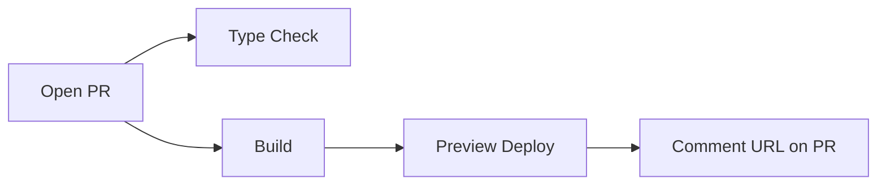

すべてのプロジェクトで GitHub Actions を使って Cloudflare にデプロイしています。このセクションでは標準的なワークフローパターンを解説します。

## 標準パイプライン

PR の場合：

## このセクションの内容

- [本番デプロイ](./production-deploy.mdx) -- main ブランチのデプロイワークフロー
- [PR プレビュー](./pr-preview.mdx) -- PR ごとのプレビューデプロイワークフロー
- [IFTTT 通知](./ifttt-notifications.mdx) -- デプロイ状況の通知
- [マルチ出力デプロイ](./multi-output-deploy.mdx) -- 複数のビルド出力を1つのデプロイにまとめる
