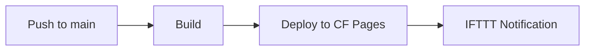
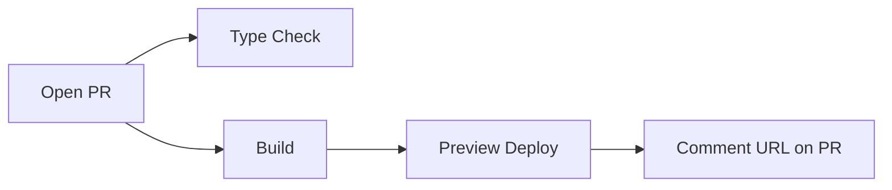

すべてのプロジェクトで GitHub Actions を使って Cloudflare にデプロイしています。このセクションでは標準的なワークフローパターンを解説します。

## 標準パイプライン

```mermaid
graph LR
  A[Push to main] --> B[Build]
  B --> C[Deploy to CF Pages]
  C --> D[IFTTT Notification]
```

PR の場合：

```mermaid
graph LR
  A[Open PR] --> B[Type Check]
  A --> C[Build]
  C --> D[Preview Deploy]
  D --> E[Comment URL on PR]
```

## このセクションの内容

- [本番デプロイ](./production-deploy.mdx) -- main ブランチのデプロイワークフロー
- [PR プレビュー](./pr-preview.mdx) -- PR ごとのプレビューデプロイワークフロー
- [IFTTT 通知](./ifttt-notifications.mdx) -- デプロイ状況の通知
- [マルチ出力デプロイ](./multi-output-deploy.mdx) -- 複数のビルド出力を1つのデプロイにまとめる
- [テンプレートリポジトリの CI](./template-repo-ci.mdx) -- シークレット未設定のテンプレート/フォークリポジトリ向けのセルフスキップ・プリフライトパターン
- [Workers PR プレビュー](./workers-pr-previews.mdx) -- バージョンエイリアスを使った、スタンドアロン Workers 向けの PR ごとのプレビューデプロイ
- [CI 向けの Access サービストークン](./access-service-tokens.mdx) -- Cloudflare Access で保護された URL に Playwright のスモークテストやヘルスチェックを通す方法と、2 つのアカウントにまたがる認証情報の扱い方
