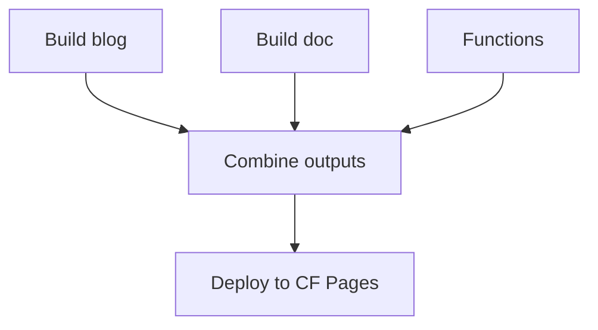

## パターン概要

一部のプロジェクトでは、複数のビルド出力（例: ブログ + ドキュメントサイト）を1つの Cloudflare Pages デプロイにまとめる必要があります。

## 例: ブログ + ドキュメントサイト

zpaper プロジェクトでは、Astro ブログと zudo-doc ドキュメントサイトを1つの Pages プロジェクトにデプロイしています：



### ビルドジョブ

両方の出力をビルドしてキャッシュします：

```yaml
  build:
    steps:
      - run: pnpm build      # Blog -> blog/dist/
      - run: pnpm doc:build   # Docs -> doc/dist/

      - uses: actions/cache/save@v4
        with:
          path: blog/dist/
          key: blog-build-${{ github.run_id }}

      - uses: actions/cache/save@v4
        with:
          path: doc/dist/
          key: doc-build-${{ github.run_id }}

      - uses: actions/cache/save@v4
        with:
          path: functions/
          key: functions-build-${{ github.run_id }}
```

### 結合とデプロイ

```yaml
  deploy:
    needs: [build, test]
    steps:
      - uses: actions/cache/restore@v4
        with:
          path: blog/dist/
          key: blog-build-${{ github.run_id }}

      - uses: actions/cache/restore@v4
        with:
          path: doc/dist/
          key: doc-build-${{ github.run_id }}

      - uses: actions/cache/restore@v4
        with:
          path: functions/
          key: functions-build-${{ github.run_id }}

      - name: Combine outputs
        run: |
          mkdir -p deploy/pj/my-site
          cp -r blog/dist/* deploy/pj/my-site/
          mkdir -p deploy/pj/my-site/doc
          cp -r doc/dist/* deploy/pj/my-site/doc/

      - name: Deploy
        run: |
          pnpm dlx wrangler@4 pages deploy deploy \
            --project-name=my-site \
            --branch=main \
            --commit-hash=${GITHUB_SHA}
        env:
          CLOUDFLARE_API_TOKEN: ${{ secrets.CLOUDFLARE_API_TOKEN }}
          CLOUDFLARE_ACCOUNT_ID: ${{ secrets.CLOUDFLARE_ACCOUNT_ID }}
```

## キャッシュ vs アーティファクト

ジョブ間のデータ受け渡しに `actions/upload-artifact` ではなく `actions/cache` を使用する場合：

| | キャッシュ | アーティファクト |
|---|---|---|
| **保存** | 実行をまたいで共有、自動的に削除される | 実行ごと、retention-days に基づく |
| **蓄積** | 蓄積の問題なし | retention が長いとストレージが肥大化する可能性あり |
| **速度** | 繰り返し内容に対して高速 | 高速 |

:::tip
ジョブ間のデータ受け渡しには `github.run_id` をスコープにしたキーで `actions/cache` を使用してください。多数の CI 実行にわたるアーティファクトストレージの蓄積を回避できます。
:::

## 依存関係のある Functions

Pages Functions が npm パッケージをインポートする場合、デプロイ前にインストールしてください：

```yaml
      - name: Install function dependencies
        run: |
          rm -rf node_modules
          pnpm add -w minisearch

      - name: Deploy
        run: pnpm dlx wrangler@4 pages deploy deploy --project-name=my-site
```
