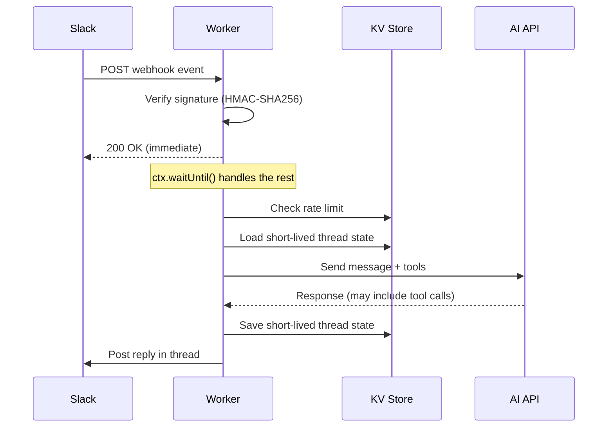

## アーキテクチャ

Webhook（Slack など）を受信し、外部 AI API で処理して返信するボット。Cloudflare Worker 上で
動作し、KV には短命な bot スレッド状態を保存する。



主要な設計判断：

- **即時レスポンス**: 処理を始める前に `200 OK` を返す。Slack は 3 秒以内のレスポンスを要求する。
- **遅延処理**: `ctx.waitUntil()` で 10 秒以上かかる実際の処理を実行する。
- **TTL 付き状態を KV に保存**: レート制限と小さな bot スレッド状態を、明示的な有効期限付きで
  KV に保存する。

永続的な Web チャット履歴、ブラウザとのリクエスト境界、プロンプト組み立て、RAG については
[チャットメモリと RAG](../ai/chat-memory-rag.mdx) を使ってください。このレシピでは状態を
Worker 側に置き、ブラウザや Webhook クライアントにチャット履歴を所有させません。

## Wrangler 設定

```toml
name = "my-bot"
main = "src/index.ts"
compatibility_date = "2025-01-01"

[[kv_namespaces]]
binding = "KV"
id = "your-kv-namespace-id"
```

シークレットはダッシュボードまたは CLI で設定：

```bash
npx wrangler secret put SLACK_BOT_TOKEN
npx wrangler secret put SLACK_SIGNING_SECRET
npx wrangler secret put API_KEY
```

## Env インターフェース

```typescript
interface Env {
  KV: KVNamespace;
  SLACK_BOT_TOKEN: string;
  SLACK_SIGNING_SECRET: string;
  API_KEY: string;
}
```

## Worker エントリーポイント

fetch ハンドラーは即座にレスポンスを返し、バックグラウンドで処理する：

```typescript
export default {
  async fetch(
    request: Request,
    env: Env,
    ctx: ExecutionContext,
  ): Promise<Response> {
    if (request.method !== "POST") {
      return new Response("Method Not Allowed", { status: 405 });
    }

    const body = await request.json().catch(() => null);
    if (!body) {
      return new Response("Bad Request", { status: 400 });
    }

    // Slack URL verification challenge
    if (body.type === "url_verification") {
      return Response.json({ challenge: body.challenge });
    }

    // Verify webhook signature
    const rawBody = JSON.stringify(body);
    const isValid = await verifySignature(request, rawBody, env);
    if (!isValid) {
      return new Response("Unauthorized", { status: 401 });
    }

    // Respond immediately, process in background
    ctx.waitUntil(handleEvent(body.event, env));
    return new Response(null, { status: 200 });
  },
};
```

:::danger[Webhook には必ず即時レスポンスを返す]
Slack、GitHub などの Webhook プロバイダーは厳格なタイムアウト制限がある（通常 3 秒）。時間内にレスポンスを返さないと、リトライや障害扱いになる。常に先にレスポンスを返し、処理は `ctx.waitUntil()` で行う。
:::

## Webhook 署名検証

HMAC-SHA256 署名を検証してリクエストの真正性を確認する：

```typescript
async function verifySignature(
  request: Request,
  rawBody: string,
  env: Env,
): Promise<boolean> {
  const timestamp = request.headers.get("x-slack-request-timestamp");
  const signature = request.headers.get("x-slack-signature");

  if (!timestamp || !signature) return false;

  // Reject requests older than 5 minutes (replay protection)
  const now = Math.floor(Date.now() / 1000);
  if (Math.abs(now - Number(timestamp)) > 300) return false;

  const sigBasestring = `v0:${timestamp}:${rawBody}`;
  const key = await crypto.subtle.importKey(
    "raw",
    new TextEncoder().encode(env.SLACK_SIGNING_SECRET),
    { name: "HMAC", hash: "SHA-256" },
    false,
    ["sign"],
  );

  const sig = await crypto.subtle.sign(
    "HMAC",
    key,
    new TextEncoder().encode(sigBasestring),
  );

  const hexSig = "v0=" + [...new Uint8Array(sig)]
    .map((b) => b.toString(16).padStart(2, "0"))
    .join("");

  return timingSafeEqual(hexSig, signature);
}
```

:::tip[タイミングセーフな比較を使う]
署名検証には必ず定数時間の比較を使う。通常の `===` 比較はタイミングサイドチャネルで情報が漏洩する可能性がある。
:::

### タイミングセーフな文字列比較

```typescript
function timingSafeEqual(a: string, b: string): boolean {
  if (a.length !== b.length) return false;
  let result = 0;
  for (let i = 0; i < a.length; i++) {
    result |= a.charCodeAt(i) ^ b.charCodeAt(i);
  }
  return result === 0;
}
```

## KV によるレート制限

TTL ベースの有効期限を使ったユーザーごとのレート制限：

```typescript
const RATE_LIMIT = 30; // ウィンドウあたりのリクエスト数
const RATE_WINDOW = 86400; // 24 時間

async function checkRateLimit(
  env: Env,
  userId: string,
  channelId: string,
): Promise<boolean> {
  const key = `rate:${channelId}:${userId}`;
  const current = await env.KV.get<number>(key, "json");
  const count = current ?? 0;

  if (count >= RATE_LIMIT) return false;

  await env.KV.put(key, JSON.stringify(count + 1), {
    expirationTtl: RATE_WINDOW,
  });
  return true;
}
```

:::warning[KV のレート制限は近似的]
KV は結果整合性。高い同時実行数では、数件の余分なリクエストが通過する可能性がある。ボットのレート制限としては許容範囲だが、正確なカウントが必要な場合は [Durable Objects](../workers/durable-objects.mdx) を使う。
:::

## KV での短命な bot スレッド状態

自動有効期限付きの小さな bot スレッド状態スナップショットを保存する。これは直近ターンが必要な
Webhook 返信には有用だが、永続的なチャット履歴や監査ログではない。

```typescript
const THREAD_STATE_TTL = 86400; // 24 時間

interface BotThreadState {
  messages: Array<{ role: string; content: string }>;
}

async function loadHistory(
  env: Env,
  threadId: string,
): Promise<BotThreadState> {
  const key = `bot-thread:${threadId}`;
  const stored = await env.KV.get<BotThreadState>(key, "json");
  return stored ?? { messages: [] };
}

async function saveHistory(
  env: Env,
  threadId: string,
  history: BotThreadState,
): Promise<void> {
  const key = `bot-thread:${threadId}`;
  await env.KV.put(key, JSON.stringify(history), {
    expirationTtl: THREAD_STATE_TTL,
  });
}
```

`KV.get()` の `"json"` 型パラメータで自動デシリアライズが行われる。TTL により古い bot スレッド
スナップショットは自動的にクリーンアップされる。永続的な複数ユーザーのチャット、認可を考慮した
読み取り、プロンプト組み立て、過去メッセージに対する RAG が必要なら、
[チャットメモリと RAG](../ai/chat-memory-rag.mdx) にあるように D1/R2/Vectorize で正本の履歴を
モデル化する。

## AI ツール使用ループ

ツール呼び出し対応の AI API を使う場合、上限付きループを実装する：

```typescript
const MAX_TOOL_ROUNDS = 5;

async function callAI(
  env: Env,
  messages: Array<{ role: string; content: string }>,
): Promise<string> {
  let round = 0;

  while (round < MAX_TOOL_ROUNDS) {
    const response = await fetch("https://api.example.com/chat", {
      method: "POST",
      headers: {
        "Content-Type": "application/json",
        Authorization: `Bearer ${env.API_KEY}`,
      },
      body: JSON.stringify({ messages, tools: TOOL_DEFINITIONS }),
    });

    const result = await response.json();

    if (result.stop_reason !== "tool_use") {
      return result.content;
    }

    // Execute tool calls and append results
    for (const toolCall of result.tool_calls) {
      const toolResult = await executeTool(toolCall, env);
      messages.push(
        { role: "assistant", content: result.content },
        { role: "tool", content: JSON.stringify(toolResult) },
      );
    }

    round++;
  }

  return "Reached maximum tool rounds.";
}
```

:::tip[ツールラウンドには必ず上限を設ける]
無制限のツールループは Worker の CPU 時間制限を消費する可能性がある。適切な上限（5-10 ラウンド）を設定し、超過時にはフォールバックメッセージを返す。
:::

## プロジェクト構造

```
packages/my-bot/
├── src/
│   ├── index.ts           # Worker エントリーポイント
│   ├── webhook.ts         # 署名検証
│   ├── ai.ts              # AI API 統合 + ツールループ
│   ├── tools.ts           # ツール定義と実行
│   ├── types.ts           # TypeScript インターフェース
│   └── utils.ts           # ヘルパー（エンコード、タイミングセーフ比較）
├── wrangler.toml
├── package.json
└── tsconfig.json
```

## 依存関係

ボット Worker は非常にスリムに構成できる。Workers の組み込み API を活用する：

```json
{
  "devDependencies": {
    "@cloudflare/workers-types": "^4.20250214.0",
    "typescript": "^5.9.3",
    "vitest": "^4.0.18",
    "wrangler": "^4.0.0"
  }
}
```

外部の HTTP やクリプトライブラリは不要。Workers はネイティブの `fetch()` と `crypto.subtle` を提供する。

## デプロイ

```bash
npx wrangler@4 deploy
```

パストリガー CI を使ったモノレポでの設定は [スタンドアロン Workers](../workers/standalone-workers.mdx#パストリガーデプロイ) を参照。

## 関連

- [チャットメモリと RAG](../ai/chat-memory-rag.mdx)
- [Workers AI ストリーミング SSE プロキシ](./workers-ai-streaming.mdx)
