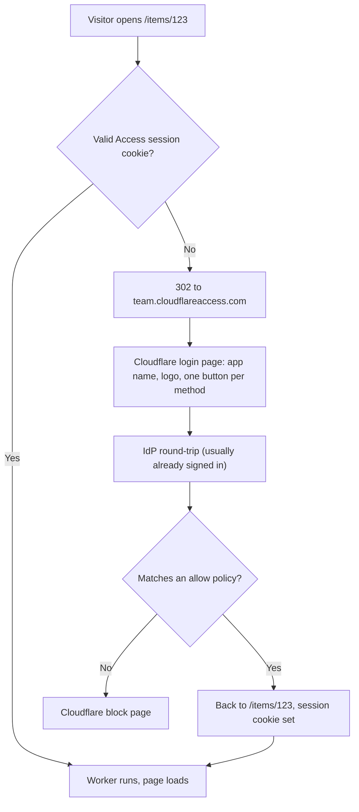

## 概要 -- Access は許可リストであって、サインアップの仕組みではない

**Cloudflare Access** は、リクエストがオリジンに届く前に、サイトの手前で identity のチェックを行う。訪問者が URL を開き、identity プロバイダーへリダイレクトされ、自分が誰であるかを証明し、署名済みのセッションを持って戻ってくる -- そのすべてが Cloudflare のエッジで強制され、そのどれもが自分で書くコードではない。

Access がどこに嵌まるかを決める言葉は**許可リスト**だ。入ってよい相手を列挙し -- 特定のメールアドレス、メールドメイン、identity プロバイダーのグループ -- 新しい誰かを迎え入れるには管理者がポリシーを編集する。セルフサービスの登録は、設計上、存在しない。

:::danger[Access にはサインアップの経路がないため、見知らぬ人が参加するプロダクトの認証システムにはなり得ない]
帰結はすべて許可リストというモデルから導かれる。シートはユーザー単位で課金され、これは会社にとっては妥当だがコンシューマー規模では意味をなさない。Access が Worker に渡すのは identity であって**ユーザーモデル**ではない -- 自分が所有するプロフィールのレコードも、パスワードリセットも、メールアドレスの確認も、ユーザーごとに紐づける行もない -- ので、その背後に作られたプロダクトは結局ユーザーシステムを自前で実装することになり、Access が提供するのは玄関だけになる。Access は社内ツール、管理画面、ステージングのデプロイ、ドキュメントサイトに使う。見知らぬ人が自分で登録するようなものには [Pages Functions での認証](./auth-functions.mdx) や [HTTP-only Cookie セッション](./cookie-sessions.mdx) を使う。
:::

## 3 つの道具、3 つの想定閲覧者

Access は[パスワードゲート](./password-gate.mdx)を置き換えるものではない。両者が答えているのは**閲覧者が誰であり、その人を登録するのにどれだけのコストがかかるか**という別々の問いであり、最も安く済む正しい道具は、たいていの場合いちばん強力な道具ではない。

| | [パスワードゲート](./password-gate.mdx) | Cloudflare Access | [アプリケーションレベルの認証](./cookie-sessions.mdx) |
|---|---|---|---|
| 閲覧者を事前に知っている必要があるか | いいえ | **はい** -- 初回訪問の前に許可リストへ登録する | いいえ -- 本人が登録する |
| 閲覧者 1 人あたりの登録コスト | ゼロ: URL とパスワードを送るだけ | シート 1 つと、管理者による編集 | サインアップフォーム |
| ログに残る identity | なし | メールアドレス、名前、グループ | 自分が保存したものすべて |
| 特定の 1 人を無効化する | 全員分をローテーションしない限り不可能 | ポリシーから外す | そのセッションを削除する |
| 適している用途 | クライアントや社外のレビュアーにステージングのリンクを渡す | 社内ツール、管理画面、プレビュー、ドキュメント | 一般公開のサインアップがあるプロダクト |

最初の行がこの区別のすべてだ。Access には、その人が現れる**前**に登録して許可リストに載せられる identity が必要になる。ステージングビルドをレビューするクライアント、2 週間だけ関わる業務委託、社内のディレクトリに追加できない社外のレビュアー -- そうした相手には「URL とパスワードを送る」が正しい答えのままであり、道具もパスワードゲートのままだ。One-time PIN はこの差を縮めるが（後述）、埋めはしない: それでも相手のアドレスを事前に知っていなければならない。

この 3 つは組み合わせられる。成熟した構成では、エンドユーザーにはアプリケーションレベルの認証を、`/admin` とすべてのプレビューデプロイには Access を、クライアントに渡す唯一のステージング URL にはパスワードゲートを、それぞれ走らせる。

## セットアップはアカウント単位であり、トークン単位ではない

API トークンのどこにも、Access が使えるかどうかを決める要素はない。Access は Zero Trust の中にあり、それは Cloudflare アカウントごとに有効化されるもので、ダッシュボードはその完全なインターフェイスになっている -- トークンが必要になるのは、Access をコードから管理するつもりがある場合だけだ。

ポリシーが 1 つでも存在する前に、一度だけ決めることが 3 つある。

1. **Zero Trust の organization**。Zero Trust ダッシュボードへの最初の訪問で**チーム名**を尋ねられ、それがチームドメイン `<team>.cloudflareaccess.com` になる。このホスト名はすべてのログインが着地する場所であり、結果として発行される JWT の `iss` クレームでもある。あとから改名するのは影響が大きい -- 慎重に選ぶこと。
2. **プラン**。現在の Free ティアの上限は、Cloudflare の Zero Trust プランページで確認する。記憶している数字を信用しないこと -- 広く言われている「50 ユーザー」という上限は 2022 年の文書に由来するもので、現在のプランページに書かれている内容とは異なる。また Cloudflare 自身のアカウント上限のページは、他のいくつかの機能をプランごとに段階分けしている一方で、ユーザー数の上限についてはまったく述べていない。
3. **ログイン方法**。本物の identity プロバイダー（Google Workspace、Microsoft Entra、Okta）か、IdP の設定をまったく必要としない **One-time PIN** のどちらかだ。One-time PIN では、訪問者がメールアドレスを入力し、**Send login code** を選び、メールで届いた PIN を貼り戻す。PIN はリクエストから 10 分で期限切れになる。

:::note[One-time PIN はもうデフォルトでは有効ではなく、そのログインページはブロックされたユーザーにも他の全員とまったく同じことを伝える]
新しい Zero Trust の organization は Cloudflare identity provider がデフォルトになっており、OTP はもう自動では追加されない。そのため Integrations > Identity providers から明示的に追加する必要がある。そして設計上、ログインページはメールが実際に送られたかどうかに関わらず、常に **A code has been emailed to you** と表示する -- どのポリシーにも一致しないアドレスにも、同じメッセージが返り、コードは届かない。これは意図的なもの（どのアドレスが許可リストにあるかを確認させないため）だが、その結果「コードが届かない」という症状は、メールの問題とポリシーの取りこぼしの*どちらの*症状でもあることになる。
:::

## ホスト名ではなく Worker に Access を紐づける

従来の Access アプリケーションは**ホスト名**に紐づくもので、これは `*.workers.dev` で配信される Worker にとって、歴史的に厄介な問いを生んでいた: それは自分が所有する zone ではない、という問いだ。Access アプリケーションは今では Worker 自体を対象にできるようになっており、この問いを丸ごと回避できる。

| 対象範囲 | `destinations[].type` | `worker_id` を取るか |
|---|---|---|
| Worker 1 つ、本番とプレビュー | `worker` | はい |
| Worker 1 つ、プレビューのみ | `preview_worker` | はい |
| アカウント上のすべての Worker、本番とプレビュー | `all_workers` | いいえ |
| アカウント上のすべての Worker、プレビューのみ | `all_preview_workers` | いいえ |

Cloudflare の Workers ドキュメントによれば、Worker スコープのアプリケーションはその Worker に紐づくすべてのドメイン -- ルート、Custom Domains、`workers.dev` のホスト名、そしてプレビュー -- を保護する。zone も、カスタムドメインも、DNS レコードも必要ない。

```bash
curl "https://api.cloudflare.com/client/v4/accounts/$ACCOUNT_ID/access/apps" \
  --request POST \
  --header "Authorization: Bearer $CLOUDFLARE_API_TOKEN" \
  --json '{
    "type": "self_hosted",
    "name": "Access for my-worker",
    "destinations": [{ "type": "worker", "worker_id": "c81a2d22c29840ed9d61681a3270dbff" }],
    "policies": [{
      "decision": "allow",
      "include": [{ "email_domain": { "domain": "example.com" } }]
    }]
  }'
```

API スキーマには書かれているが散文には書かれていない制約が 2 つある: `all_workers` と `all_preview_workers` の destination は、アカウントごとにそれぞれ最大**1 つ**しか存在できない。そして `destinations` のリストは Worker 以外のバリアントも受け付ける（ホスト名や URI を指す `public`、CIDR/ポートを指す `private`、`via_mcp_server_portal`）。`public` は*古い*ホスト名の形をした destination であり、Worker スコープのものではない。これを `worker` と同等のものだと取り違えるのは、期待した対象を何ひとつ覆わないアプリケーションを作ってしまう簡単な方法だ。

:::warning[`workers.dev` におけるホスト名ベースの Access について、ドキュメント同士が食い違っている]
Cloudflare の Zero Trust 側にあるセルフホストアプリケーションのページは、いまだにドメインは自分のアカウント内のアクティブな zone に属していなければならないと書いており、`workers.dev` にはまったく言及していない。Workers 側のページは `workers.dev` のケースについてこれと矛盾することを述べている。両者を突き合わせて調停しているページはない。`worker` あるいは `preview_worker` の destination を使えば、この食い違いを完全に回避できる。Worker スコープのアプリケーションは、そのホスト名がどの zone に属するのかを決して問わないからだ -- 利便性とはまったく別に、ここでそれを選ぶ実用上の理由はこれである。
:::

:::note[*バージョンエイリアス*のプレビュー URL が対象に含まれるかどうかは推論であって、ドキュメント化された約束ではない]
ドキュメントは「プレビュー」としか言っておらず、バージョンごとのハッシュ URL と安定した `--preview-alias` の URL を区別していない。[Workers PR プレビュー](../cicd/workers-pr-previews.mdx)のフローが依存しているのは、とりわけエイリアスの形のほうだ。Preview URLs のドキュメントには、Preview URLs を無効にするとバージョン付きとエイリアス付きの両方のプレビュー URL へのルーティングが無効になる、という記述がある。これはルーティングの面が 1 つであること、したがって対象範囲も共通であることを示唆する -- が、それは推論であって、明言ではない。頼りにする前に、生きているエイリアス URL に対して `curl -I` を 1 回叩いて確かめること。
:::

:::danger[Worker スコープのポリシーの背後では、WebSocket のアップグレードが 403 で失敗する]
Worker レベルの Access ポリシーは、現時点では WebSocket 接続をサポートしていない -- そのポリシーで保護された Worker へのアップグレードリクエストは `403` で失敗する。Cloudflare 自身のガイダンスは、WebSocket を使うものは代わりに**ホスト名ベース**のアプリケーションで保護せよというもので、[Durable Objects](../workers/durable-objects.mdx)、リアルタイムアプリケーション、WebSocket 上の RDP を明示的に名指ししている。これは 2 つの仕組みのどちらを選ぶかを決める唯一の硬い制約なので、Worker の destination を前提に設計する前に確認すること。
:::

### 優先順位と、ポリシーを削除しても何も変わらないことがある理由

もっとも具体的なルールが勝つ。まずホスト名ベース（またはパスベース）の Access、次に Worker レベル、そして最後のフォールバックとしてアカウントレベルの `all_workers` だ。頭に入れておく価値のある帰結 -- そして Cloudflare 自身が、Worker レベルの Access を削除するとその下のアカウントレベルの Access が*露出しうる*と明言している点 -- は、`all_workers` が動いているアカウントでは、ある Worker 自身のポリシーを削除してもその Worker が公開されるわけでは**ない**ということだ。その下にあるアカウント全体のルールへ落ちるだけである。

特定の Worker を除外するには、削除ではなく明示的な `bypass` が要る:

```json
{
  "decision": "bypass",
  "include": [{ "everyone": {} }]
}
```

これを、当該 Worker の `worker` デスティネーションに対して適用する。

## 訪問者に実際に見えるもの

identity プロバイダーがすでに設定されている場合 -- Zero Trust を他の用途でも使っている会社では普通のケースだ -- ほとんどの人は何も入力しない。



実務で効いてくる細部が 2 つある。

- **元のディープリンクが生き残る。** `/items/123` へのリンクをクリックした訪問者は、サイトのルートではなく `/items/123` に戻ってくる。共有されたリンクは機能し続ける。
- **拒否されたユーザーに見えるのは Cloudflare のブロックページであり、自分の 404 ではない。** ポリシーに載っていない同僚には、誰に聞けばいいのか分からない汎用的な拒否画面が見える。ブロックページはカスタマイズできる -- 名前かチャンネルを書いておくこと。さもなければ最初のサポート依頼は、リンクが壊れているのはなぜかという問い合わせになる。

IdP の代わりに **One-time PIN** を使う場合、訪問者は 2 回入力する: メールアドレスと、メールで届く 6 桁のコードだ。使えるコードが届くのは、ポリシーに一致するアドレスだけだ。

誰がどのくらいの頻度で再認証するかは設定でき、その設定は混同しやすい 3 つのレベルに分かれている。**アプリケーション**のセッション期間（Applications > Configure > Overview）は、即時タイムアウトから 1 か月までの範囲を取り、デフォルトは 24 時間だ。**ポリシー**は、そのポリシーに一致する人に対して同じ範囲でそれを上書きできる。**グローバル**のセッション期間はさらに別物で、アカウント全体での IdP への再ログインを支配し、15 分から 1 か月までの範囲を取り、こちらもデフォルトは 24 時間だ。Cloudflare One Client のセッションが存在する場合は、それがこれらすべてを上書きする。

## Worker で identity を読む

リクエストが通過してしまえば、Worker はそれを送ったのが誰かを読める -- JWT のパースもライブラリも要らない。

```typescript
export default {
  async fetch(request: Request, env: Env, ctx: ExecutionContext): Promise<Response> {
    // ctx.access is undefined when Access did not authenticate the request
    // -- e.g. the Worker is reachable on a route the application does not
    // cover. Treat that as a failure, not as an anonymous visitor.
    if (!ctx.access) {
      return new Response("Access required", { status: 403 });
    }

    const identity = await ctx.access.getIdentity();
    return new Response(`Signed in as ${identity?.email ?? "unknown"}`);
  },
};
```

アプリケーションの audience タグは同じオブジェクト上にあり、`ctx.access.aud` として取れる。

これは共有パスワードには原理的に提供できない能力だ: 訪問者ごとの帰属付けである。どの項目を誰がトリアージしたかを記録することも、サインイン中のユーザーを表示することも、認証システムを書かずに可能になる。

:::warning[名前で頼ってよいのは `email` だけ -- `getIdentity()` には公開された戻り値の型がない]
Workers のページはその結果を「email、groups、device posture」と説明し、チェンジログは「email、name、groups」と書いているが、どちらもシグネチャをドキュメント化していない。そして両者がリンクしている identity のテーブルには `email`、`idp`、`geo`、`user_uuid`、`devicePosture` などが並んでいるものの、**トップレベルの `name` や `groups` というフィールドは存在しない**。`identity?.email` を読み、それ以外は自分のデプロイから実際のレスポンスをログに取るまで未検証として扱うこと。（チェンジログはさらに `getIdentity()` を Context のランタイム API ページの `#access` アンカーにリンクしているが、そのアンカーは存在しない -- この API の背後にはまだリファレンスページがない。）
:::

**ホスト名ベース**のアプリケーションの場合、あるいは明示的な検証を行いたい場面では、代わりに `Cf-Access-Jwt-Assertion` ヘッダーをチームの JWKS エンドポイントに対して検証する。鍵は取得すること。決してハードコードしないこと。

```typescript
import { createRemoteJWKSet, jwtVerify } from "jose";

// Module-level cache so one isolate reuses a single JWKS fetcher across
// requests. It cannot be built at module scope directly: `env` only exists
// inside the handler, so the URL is not known until the first request.
const jwksCache = new Map<string, ReturnType<typeof createRemoteJWKSet>>();

function getJwks(teamDomain: string) {
  let jwks = jwksCache.get(teamDomain);
  if (!jwks) {
    jwks = createRemoteJWKSet(new URL(`${teamDomain}/cdn-cgi/access/certs`));
    jwksCache.set(teamDomain, jwks);
  }
  return jwks;
}

export async function verifyAccessJwt(request: Request, env: Env) {
  const token = request.headers.get("Cf-Access-Jwt-Assertion");
  if (!token) throw new Error("Missing Cf-Access-Jwt-Assertion header");

  return await jwtVerify(token, getJwks(env.TEAM_DOMAIN), {
    issuer: env.TEAM_DOMAIN,
    audience: env.POLICY_AUD, // the application's AUD tag
  });
}
```

ここでの `TEAM_DOMAIN` は**完全なオリジン** -- `https://my-team.cloudflareaccess.com` であり、スキームを含み、末尾のスラッシュは付けない。これが 2 回使われるのには別々の理由がある: `new URL()` は裸のホスト名をそもそも受け付けないこと、そして Access が署名する `iss` クレームがオリジンの形であるため、スキームを省いた値は URL の組み立てがたまたま通った場合でも `issuer` の検証に失敗することだ。

これと同じ RS256 + JWKS の形は [Pages Functions での認証](./auth-functions.mdx)にも登場する -- Access もまた 1 つのサードパーティ発行者であり、同じやり方で検証される。

### ローカル開発で identity を模擬する

`wrangler dev` の手前には Access がないため、ローカルのリクエストではすべて `ctx.access` が `undefined` になり、上のガードはすべてを拒否してしまう。代わりに `access.dev` ブロックが偽の identity を供給する。

```jsonc
{
  "access": {
    "dev": {
      "aud": "my-app", // required -- Wrangler will not start without it
      "identity": { "email": "admin@example.com" } // optional
    }
  }
}
```

このブロックを取り除けば `ctx.access` は `undefined` に戻る。未認証側の分岐をテストするにはこうする。

:::note[このキーは Wrangler の設定リファレンスにドキュメント化されていない]
`access.dev` が登場するのは Workers の Access ページと告知のチェンジログだけであり、[Wrangler 設定](../workers/wrangler-config.mdx)のリファレンスには `access` というキーがそもそも載っていない。Cloudflare はその目的を「デプロイせずに」identity を模擬することだと説明しているが、**このブロックがアップロード時に取り除かれると述べているページはどこにもない**。名前の印象だけで本番では無害だと決めてかからないこと。それが気になるなら、無視されることを信じるのではなく、デプロイする設定からこのブロックを外しておくこと。
:::

## API トークンの権限は、デプロイ用トークンとは別物

Access の背後に置かれる Worker をデプロイするのに、デプロイ用トークンへの Access 権限は**一切**必要ない。Access アプリケーションは `/accounts/{account_id}/access/apps` を通じて作成されるが、これは Worker のアップロードが決して触らない API サーフェスであり、Cloudflare 自身のダッシュボードが生成するデプロイ用トークンには `Access:` の権限がそもそも 1 つも含まれていない。Access を有効にしても既存のデプロイパイプラインは壊れず、デプロイ用トークンは今のまま狭く保っておけばよい（[Cloudflare セットアップ](../getting-started/cloudflare-setup.mdx)を参照）。

権限が必要になるのは、Access を*コードから*管理する場合 -- Terraform や直接の API 呼び出し -- だ。そのためには別のトークンを作る。いずれも**アカウント**スコープだ。

| 目的 | ダッシュボードのラベル | API / Terraform 上の名前 |
|---|---|---|
| アプリケーションとポリシー | `Access: Apps and Policies` : Edit | `Access: Apps and Policies Write` |
| identity プロバイダーとグループ | `Access: Organizations, Identity Providers, and Groups` : Edit | `...Write` |
| サービストークン | `Access: Service Tokens` : Edit | `...Write` |

:::tip[API が "Write" と呼ぶものを、ダッシュボードは "Edit" と呼ぶ]
Cloudflare の権限リファレンスは同じ表を 2 回描画している -- 一度はダッシュボードのラベルで、もう一度は API の権限グループ名でだ。これらは 2 つの文字列の下にある同じ権限であり、Terraform のドキュメントを "Edit" で検索しても、ダッシュボードを "Write" で検索しても、何も見つからない。zone スコープの `Access: Apps and Policies` も存在するが、それは Worker スコープのアプリケーションを対象にしない -- そちらはアカウントレベルのオブジェクトだからだ。
:::

## 関連

- [プレビュー・ステージング環境向けパスワードゲート](./password-gate.mdx) -- 共有シークレットによる代替手段。事前に許可リストへ登録できない社外の閲覧者には、いまでもこちらが正しい道具だ。
- [CI 向けの Access サービストークン](../cicd/access-service-tokens.mdx) -- Playwright のスモークテストやヘルスチェックが、ログインのリダイレクトに阻まれずに Access で保護された URL を通過する方法。
- [Pages Functions での認証](./auth-functions.mdx) -- サードパーティ IdP のトークンを検証する方法と、アプリに一般公開のサインアップがある場合に取るべき道。
- [HTTP-only Cookie セッション](./cookie-sessions.mdx) -- Access が意図的に提供しない、ユーザーごとのセッション層。
- [Workers PR プレビュー](../cicd/workers-pr-previews.mdx) -- `worker` の destination が覆うことになっている、プレビューエイリアスの URL。
- [Cloudflare セットアップ](../getting-started/cloudflare-setup.mdx) -- このページに出てくる権限をどれ 1 つ必要としない、デプロイ用トークン。
