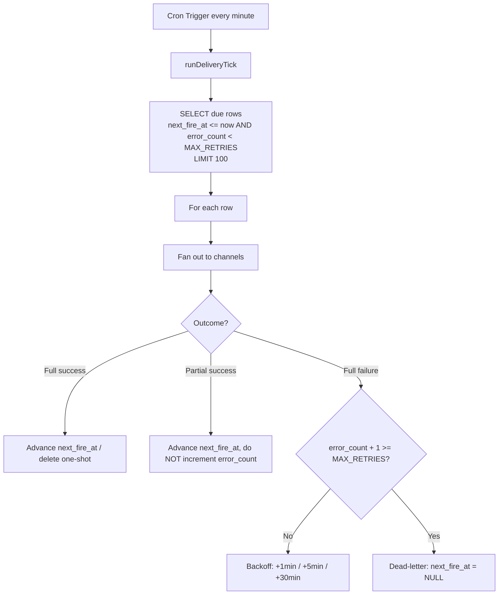

## Queues が不要なとき

定期的にこなす処理がある -- リマインダーを送る、上流 API をポーリングする、失敗した配信を再試行する -- そんなとき [Cloudflare Queues](https://developers.cloudflare.com/queues/) に手が伸びる。だがそのジョブが、イベントストリームではなく時計によって自然に駆動されるなら（行の期日が来たら発火する）、[Cron Trigger](https://developers.cloudflare.com/workers/configuration/cron-triggers/) と D1 の `next_fire_at` カラムの組み合わせのほうがシンプルだ。データベースそのものがキューになり、追加のバインディングは不要で、スケジュールは自分で覗ける素の SQL の中に存在する。

このレシピは、メールと Webhook でリマインダーを配信する notifications worker に基づいている。毎分 cron が発火するたびに、worker は期日が来た行の上限付きバッチを D1 から取り出し、各行をそれぞれのチャネルへファンアウトし、結果を書き戻す -- スケジュールを進める、バックオフを適用する、あるいはデッドレターに送る。



## Cron Trigger の設定

毎分発火する単一の cron エントリがシステム全体の鼓動になる。各起動でキューの上限付きの一部を処理する。

```toml
name = "zudo-notifications-worker"
main = "src/index.ts"
compatibility_date = "2025-04-01"

[[d1_databases]]
binding = "NOTIFICATIONS_DB"
database_name = "notifications-db"
database_id = "placeholder-replace-with-actual-id"

[triggers]
crons = ["* * * * *"]
```

ここには Queues バインディングはなく、D1 だけがある。`[triggers]` ブロックが、時計を `scheduled()` ハンドラへつなぐすべてだ。

## scheduled() ハンドラと ctx.waitUntil()

Worker ランタイムは、`scheduled()` 関数が return した瞬間にスケジュール起動が完了したとみなす。`await` を付けない呼び出しで配信を開始した場合 -- あるいはランタイムを生かしておくのを忘れた場合 -- ランタイムは非同期のメール送信や Webhook 送信が完了する前に worker を破棄しうる。`ctx.waitUntil()` はその Promise を登録し、ランタイムにそれを待たせる。

```typescript
export default {
  async fetch(request: Request, env: Env): Promise<Response> {
    return await handleRequest(request, env);
  },

  async scheduled(_event: ScheduledEvent, env: Env, ctx: ExecutionContext): Promise<void> {
    // Fires every minute (* * * * *). Delivers due notifications via
    // Resend (email) and HMAC-signed webhooks.
    ctx.waitUntil(runDeliveryTick(env));
  },
} satisfies ExportedHandler<Env>;
```

:::warning[非同期処理は必ず ctx.waitUntil() で包む]
`scheduled()` の中で、同期的な本体より長く生き残る配信はすべて `ctx.waitUntil()` に渡さなければならない。これがないと、ランタイムは途中で worker を kill しうる。すると期日が来たように見えるが実際には配信されなかった行が残り、次のティックで再発火する。これは「cron が黙って処理を取りこぼす」という症状の最も一般的な原因だ。
:::

## ポーリング型キューとしての D1

各ティックは上限付きのクエリを 1 回実行する。`next_fire_at` カラムによって「期日が来た」を SQL で表現でき、`LIMIT` はバックログがどれだけ膨らんでも 1 回の起動を Workers の CPU 時間・サブリクエスト予算の内側に収める。

```typescript
// Max rows processed per cron tick.
const TICK_LIMIT = 100;

export async function runDeliveryTick(env: Env): Promise<void> {
  const now = Date.now();

  const { results } = await env.NOTIFICATIONS_DB.prepare(
    `SELECT * FROM notifications
     WHERE next_fire_at <= ? AND error_count < ?
     ORDER BY next_fire_at ASC
     LIMIT ?`,
  )
    .bind(now, MAX_RETRIES, TICK_LIMIT)
    .all<NotificationRow>();

  if (!results || results.length === 0) return;

  // Process rows sequentially to avoid thundering-herd on D1.
  for (const row of results) {
    try {
      await processRow(row, env);
    } catch (err) {
      // Unexpected error in processRow -- log and continue to next row.
      console.error(`[scheduler] Unexpected error processing row ${row.id}:`, err);
    }
  }
}
```

このクエリは 2 つのフィルタを同時に表している。

- `next_fire_at <= now` -- スケジュール時刻が到来した行のみ。
- `error_count < MAX_RETRIES` -- すでに再試行を使い切った行をスキップする（それらはデッドレター済み、後述）。

`ORDER BY next_fire_at ASC` は最も古く期日が来た行から処理するので、バックログは公平な順序で解消されていく。毎ティックで `LIMIT` 件が満杯で返ってくる場合でも、次の 1 分が単にこのティックの続きから拾うだけだ -- バックログは自己解消する。

:::tip[1 ティックで処理しきれる LIMIT を選ぶ]
Worker の起動には有限の CPU 時間・サブリクエスト予算がある。現実的に最も遅いバッチ（行数 × チャネル数 × チャネルごとのタイムアウト）が余裕をもってその中に収まるよう `LIMIT` を決める。常に上限に張り付くなら、チャネルごとのタイムアウトを短くするかバッチを小さくする -- cron の頻度を 1 分より細かくしてはいけない。1 分が cron の最小粒度だ。
:::

## バックオフとデッドレター -- すべて D1 の中で

別途の再試行キューは存在しない。行の再試行状態は 2 つのカラムに住む。`error_count`（何回失敗したか）と `next_fire_at`（いつ再試行するか）だ。バックオフのスケジュールとデッドレターのしきい値は、どちらも `error_count` の純粋な関数である。

```typescript
// Backoff schedule: 1st failure -> +1 min, 2nd -> +5 min, 3rd -> +30 min.
// error_count is the count BEFORE this failure (0-based), so:
//   error_count === 0 -> next retry in 1 min
//   error_count === 1 -> next retry in 5 min
//   error_count === 2 -> next retry in 30 min
const BACKOFF_MS = [
  1 * 60 * 1000,  // 1 min
  5 * 60 * 1000,  // 5 min
  30 * 60 * 1000, // 30 min
] as const;

/** Maximum number of delivery attempts before a row is dead-lettered. */
export const MAX_RETRIES = 3;

export function retryNextFireAt(now: number, errorCount: number): number {
  const backoff = BACKOFF_MS[Math.min(errorCount, BACKOFF_MS.length - 1)];
  return now + backoff;
}

export function isDeadLettered(errorCount: number): boolean {
  return errorCount >= MAX_RETRIES;
}
```

行が完全に失敗したら、`error_count` をインクリメントし `next_fire_at` をバックオフ間隔ぶん先送りする。`error_count` が `MAX_RETRIES` に達すると、その行は**デッドレター**される。ワンショットの行は `next_fire_at = NULL` を設定し（期日クエリの `next_fire_at <= now` は `NULL` に決して一致しないので、検査用に恒久的に隔離される）、繰り返しの行は失敗した発火を単にスキップして次の通常スケジュールへ進む。期日クエリがすでに `error_count < MAX_RETRIES` でフィルタしているため、デッドレターされた行は追加の管理なしで以降のティックから見えなくなる。

## 部分成功のルール（2 回読むこと）

これが効いてくる微妙な正しさの要点だ。1 つの行は複数のチャネルへファンアウトしうる -- メール *と* Webhook。重要なのは 3 つの結果だ。

- **完全成功** -- すべてのチャネルが配信された。
- **完全失敗** -- すべてのチャネルが失敗した。
- **部分成功** -- 一部は配信され、一部は失敗した。

:::danger[エラーカウンタは完全失敗のときだけインクリメントする -- 部分成功では決して増やさない]
部分成功を失敗として扱って再試行をスケジュールすると、次の試行は**すべてのチャネルを再送する** -- すでに成功したものも含めて。ユーザーは同じメールを 2 回受け取る。重複配信は取りこぼしより悪い。沈黙は取り返せるが、二重送信は取り返せない。だから部分成功では `next_fire_at` を次の通常発火時刻へ進め、観測のために部分エラーを記録し、`error_count` は**触れない**。失敗したチャネルは早めに再試行されるのではなく、単に通常の次の順番を待つ。
:::

分類は結果ごとに 1 行だ。

```typescript
const failedChannels = Object.keys(channelErrors);
const succeededChannels = channels.filter((ch) => !channelErrors[ch]);
const isFullFailure = succeededChannels.length === 0 && failedChannels.length > 0;
const isPartialSuccess = succeededChannels.length > 0 && failedChannels.length > 0;
const isFullSuccess = failedChannels.length === 0;
```

そして書き戻しはこれで分岐する。**完全成功と部分成功の両方**が同じ方法でスケジュールを進める点に注意 -- 唯一の違いは、部分成功が `last_error` 文字列を記録し、完全成功がそれをクリアすることだけだ。決定的に重要なのは、どちらも再試行の意味で `error_count` に触れないことで、繰り返しのパスではむしろ `0` にリセットする。

```typescript
if (isFullSuccess || isPartialSuccess) {
  const nextFire = nextFireAt(new Date(now), recurrenceRule);

  if (nextFire === null) {
    // One-shot: delete the row on success.
    await env.NOTIFICATIONS_DB.prepare(
      "DELETE FROM notifications WHERE id = ?",
    ).bind(row.id).run();
  } else {
    // Recurring: advance to next fire time. error_count resets to 0;
    // a partial failure is recorded in last_error but is NOT a retry.
    const lastError = isPartialSuccess
      ? `partial: ${failedChannels.join(", ")}`
      : null;

    await env.NOTIFICATIONS_DB.prepare(
      `UPDATE notifications
       SET next_fire_at = ?,
           last_fired_at = ?,
           error_count = 0,
           last_error = ?,
           updated_at = ?
       WHERE id = ?`,
    )
      .bind(nextFire.getTime(), now, lastError, now, row.id)
      .run();
  }
} else if (isFullFailure) {
  // Only here does error_count climb and backoff / dead-lettering apply.
  const newErrorCount = row.error_count + 1;

  if (isDeadLettered(newErrorCount)) {
    // Park (one-shot: next_fire_at = NULL) or skip-forward (recurring).
  } else {
    const nextRetryAt = retryNextFireAt(now, row.error_count);
    await env.NOTIFICATIONS_DB.prepare(
      `UPDATE notifications
       SET next_fire_at = ?,
           error_count = ?,
           last_error = ?,
           updated_at = ?
       WHERE id = ?`,
    )
      .bind(nextRetryAt, newErrorCount, errorSummary, now, row.id)
      .run();
  }
}
```

覚えるべき唯一のルール: **`error_count` は再試行カウンタであり、再試行は行全体を再実行する。再試行に値するのは完全失敗だけだ。** 部分成功は成功と同じくスケジュールを進める。再実行すれば、すでに成功したチャネルを重複させてしまうからだ。

## タイムアウト付きの行単位の配信

各チャネルの送信はタイムアウトで上限が設けられ、1 つのハングしたエンドポイントがティック全体を止められないようにする。ファンアウトはチャネルを並列で実行し、チャネルごとのエラーをマップに集める -- これがまさに上の部分成功の分類が読む対象だ。

```typescript
// 10-second per-channel fetch timeout.
const CHANNEL_TIMEOUT_MS = 10_000;

async function withTimeout<T>(promise: Promise<T>, ms: number): Promise<T> {
  let timer: ReturnType<typeof setTimeout> | undefined;
  const timeout = new Promise<never>((_, reject) => {
    timer = setTimeout(() => reject(new Error(`operation timed out after ${ms}ms`)), ms);
  });
  try {
    return await Promise.race([promise, timeout]);
  } finally {
    clearTimeout(timer);
  }
}

// Inside processRow: fan out, recording a message per failed channel.
const channelErrors: Record<string, string> = {};

await Promise.all(
  channels.map(async (channel) => {
    let err: string | null = null;
    if (channel === "email") {
      err = await tryDeliverEmail(row, env.NOTIFICATIONS_RESEND_KEY);
    } else if (channel === "webhook") {
      err = await tryDeliverWebhook(row, channels, firedAt);
    }
    if (err !== null) {
      channelErrors[channel] = err;
    }
  }),
);
```

チャネルのヘルパーは成功時に `null`、失敗時にエラー文字列を返す -- 決して throw しない -- ので、1 つの不調なチャネルは行をクラッシュさせず部分成功に縮退する。

## なぜこれが Queues に手を伸ばすより良いのか

| 観点 | Cron + D1 | Queues |
|---|---|---|
| 追加バインディング | なし | Queue の producer + consumer |
| 保留中の処理の検査 | `SELECT * FROM notifications` | キューは不透明 |
| スケジュールの意味論 | `next_fire_at` カラム、素の SQL | メッセージごとの遅延 |
| バックオフ / デッドレター | 2 カラム、純粋関数 | 組み込み DLQ、見えにくい |
| 最適な用途 | 時計駆動・期日のある処理 | 高スループットのイベントストリーム |

Queues は、バッファして自分のペースで処理したい高ボリュームのイベントストリームとして処理が届くときに輝く。各アイテムが*期日*を持つ時計駆動の処理には、D1 テーブル上の cron の鼓動のほうが仕掛けが少なく、完全に検査でき、再試行ポリシーをユニットテスト可能なコードに保てる。

`ctx.waitUntil()` にも依存する即時レスポンス型の Webhook パターンについては [Bot Worker パターン](./bot-worker.mdx) を参照。D1 の基礎については [ストレージのドキュメント](../storage/d1.mdx) を参照。
