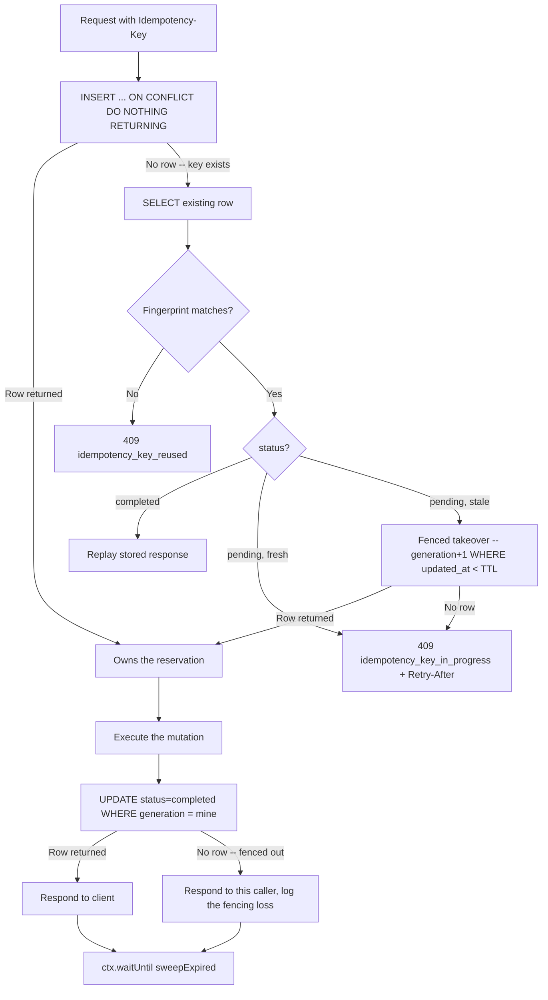

## 概要

直前のリクエストが成功したかどうかわからないクライアント -- 接続が切れた、プロキシがタイムアウトした、レスポンスの途中で Worker が再生成された -- が取れる安全な手段はただ一つ、再試行だ。`GET` なら再試行は無料だ。だがカードに課金する、メールを送る、注文を作成するといった `POST` を当てずっぽうに再試行すれば、二重実行のリスクを冒すことになる。`Idempotency-Key` ヘッダーパターン（Stripe をはじめ多くの決済 API が使うのと同じ形）は、クライアントが操作に一度だけ名前を付け、サーバーがその名前を最初に見たときに何が起きたかを覚えておくことでこれを解決する。

このレシピは、この契約のサーバー側を D1 の上に構築する。キーをアトミックに claim する台帳テーブルを用意し、mutation をキーごとにちょうど 1 回だけ実行し、すべての再試行に対して保存済みの結果を再生する -- 元の試行が死んだとみなされたあとに届く再試行も含めて。

## Idempotency-Key ヘッダーの契約

- クライアントは**論理的な操作 1 回につき 1 度だけ**、新しく一意な値（UUID v4 で十分）を生成し、mutation を行うリクエストに `Idempotency-Key: <value>` として送る。
- 同じ論理操作の再試行はすべて**同じ**キーを再利用する。本当に新しい操作（2 つ目の、別の注文）は**新しい**キーを使わなければならない。サーバー側にはキー以外にこれらを区別する手段がない。
- Idempotency による保護は安全でないメソッドにのみ適用する（`POST`、`PATCH`、`DELETE` -- エンドポイントが mutation に使うものならどれでも）。`GET` には不要だ。
- 必須のエンドポイントが `Idempotency-Key` ヘッダーを受け取らなかった場合は `400 Bad Request` で拒否する。呼び出し元が保護を期待しているのに idempotency の保護なしで mutation を実行してしまうのは、実行を拒否するよりも悪い -- 呼び出し元は保護されていると信じたまま同じリクエストを再試行しかねない。
- キーの形式はサーバー側で制限する（たとえば印字可能な ASCII 文字 1〜255 文字）。不正な形式や過大なキーで台帳テーブルを肥大化させられないようにするためだ。

:::warning[これは契約であり、検知のヒューリスティックではない]
サーバーはリクエストの内容だけから「これは再試行だ」と推測することはできない -- 2 つの同一なボディが、正当に同一な 2 つの操作であることもありうる。`Idempotency-Key` はクライアントからの明示的なシグナルであり、このパターン全体は両側がそれを守ることによってのみ機能する。同じ操作には同じキー、違う操作には違うキーを。
:::

## スキーマ

台帳全体を 1 つのテーブルが担う。`generation` は後述するフェンシングトークンであり、`status` は保存済みレスポンスを再生してよいかどうかを決める。

```sql
CREATE TABLE idempotency_keys (
  key               TEXT PRIMARY KEY,
  fingerprint       TEXT NOT NULL,
  status            TEXT NOT NULL DEFAULT 'pending', -- 'pending' | 'completed'
  generation        INTEGER NOT NULL DEFAULT 1,      -- fencing token, bumped on takeover
  response_status   INTEGER,
  response_body     TEXT,                            -- bounded, see Response Lifecycle
  response_headers  TEXT,                             -- JSON-encoded allowlisted headers
  created_at        INTEGER NOT NULL,
  updated_at        INTEGER NOT NULL
);

CREATE INDEX idx_idempotency_keys_updated_at ON idempotency_keys (updated_at);
```

`updated_at` は pending 予約の TTL チェックとスイープの両方を駆動するので、専用のインデックスに値する。

## mutate の前に claim する

claim は、既存キーの有無を確認する `SELECT` のあとに見つからなければ `INSERT` する、という形ではなく、単一のアトミックなステートメントで行わなければならない。同じキーを持つ 2 つの同時リクエストは、どちらの `INSERT` も着地する前に両方がその `SELECT` を実行しうる -- どちらも「行がない」と見て、どちらも自分がオーナーだと判断し、どちらも mutation の実行へ進んでしまう。レースを閉じるには、チェックと挿入が同一の操作でなければならない。

D1 の SQLite 方言は `INSERT ... ON CONFLICT DO NOTHING RETURNING` をサポートしており、これがまさにアトミックな test-and-set だ。同時に呼び出したちょうど 1 者だけが `RETURNING` から行を受け取る。他のすべての呼び出し元は -- 何者が同時に到着しようと -- 何も受け取れず、mutate する代わりにルックアップのパスへフォールスルーしなければならない。

```typescript
interface Env {
  DB: D1Database;
}

interface ClaimResult {
  key: string;
  generation: number;
}

const now = Date.now();

const claim = await env.DB.prepare(
  `INSERT INTO idempotency_keys (key, fingerprint, status, generation, created_at, updated_at)
   VALUES (?, ?, 'pending', 1, ?, ?)
   ON CONFLICT (key) DO NOTHING
   RETURNING key, generation`,
)
  .bind(idempotencyKey, fingerprint, now, now)
  .first<ClaimResult>();

if (claim) {
  // Won the claim: this request owns the reservation and must execute the
  // mutation, then transition the row to 'completed' (see Response Lifecycle).
} else {
  // Key already exists. Fall through to the fingerprint/status branch below.
}
```

:::danger[mutate の前に claim する、あとには決してしない]
mutation を実行した**あとに**台帳の行を挿入すると、このパターンが閉じるために存在するまさにそのレースを再び開いてしまう -- 2 つの同時再試行はどちらも行を見つけられず、どちらも mutation を実行し、そのあとになってようやくどちらかが挿入に勝つ。そのときにはもう、二重課金や注文の重複といった被害は起きてしまっている。claim は、あらゆる副作用より前の最初の書き込みでなければならない。
:::

## リクエストのフィンガープリント計算

`claim` が空だったということは、そのキーは以前にも見たということだ。他の何よりも先に、サーバーはこれが同じリクエストの**正当な再試行**なのか、それとも実質的に異なるリクエストへの**同じキーの再利用**なのかを判断しなければならない。誤ったリクエストに対して保存済みの結果を再生してしまうことや、すでに実行済みの mutation を再実行してしまうことは、どちらも偽陽性の拒否より悪い失敗だ -- だからフィンガープリントの比較は意図的に厳格にしてある。

フィンガープリントは、正規化した 3 つの入力に対する SHA-256 の 16 進ダイジェストだ。

- **メソッド**、大文字化する。`post` と `POST` は同じリクエストだ。
- **パス + クエリ文字列、そのまま** -- 受け取った通りに、キーのソートも並べ替えも削除もしない。クエリ文字列を正規化する（たとえばパラメータをソートする）と、まれな偽陽性（クライアント側での無害なパラメータの並べ替えがキー再利用として検出されてしまう）と引き換えに、クエリの順序や重複キーが意味を持つ API での微妙な偽陰性リスクを負うことになる（エンドポイントが順序付きリストとして扱うなら、`id=1&id=2` と `id=2&id=1` は同じリクエストではない）。偽陽性はクライアントに `409` と新しいキーの発行というコストを課すだけだが、偽陰性は誤った操作を実行または再生しかねない。そのまま比較するのが保守的な選択だ。
- **生のボディのバイト列**、一度だけ読み取り、受け取った通りにハッシュする -- ハッシュ計算前に `JSON.parse` してから再び `JSON.stringify` することは決してしない。[HMAC-SHA256 によるウェブフック署名](./webhook-signing.mdx)で扱ったのと同じ再シリアライズの罠がここにも当てはまる。キーの順序、空白、数値の表現はすべてパーサーを経由する往復で変化しうり、バイト列を変えてしまう。すると本来同一の 2 つのリクエストが異なるハッシュ値になってしまう。

```typescript
async function computeFingerprint(
  method: string,
  pathAndQuery: string,
  rawBody: string,
): Promise<string> {
  const canonical = `${method.toUpperCase()}\n${pathAndQuery}\n${rawBody}`;
  const digest = await crypto.subtle.digest("SHA-256", new TextEncoder().encode(canonical));
  return Array.from(new Uint8Array(digest))
    .map((b) => b.toString(16).padStart(2, "0"))
    .join("");
}

// pathAndQuery must come from the same URL the request was routed on, taken
// verbatim -- do not rebuild it from parsed route params.
const url = new URL(request.url);
const rawBody = await request.text();
const fingerprint = await computeFingerprint(request.method, url.pathname + url.search, rawBody);
```

ステータスコードと JSON ボディ（任意の追加ヘッダー付き）を `Response` に変換する小さなヘルパーを用意し、以下のすべての拒否パスで再利用する。

```typescript
function jsonResponse(
  status: number,
  body: unknown,
  headers: Record<string, string> = {},
): Response {
  return new Response(JSON.stringify(body), {
    status,
    headers: { "Content-Type": "application/json", ...headers },
  });
}
```

フィンガープリントを計算し終えたら、claim からフォールスルーした分岐が次に何をするかを決める。

```typescript
interface LedgerRow {
  fingerprint: string;
  status: "pending" | "completed";
  generation: number;
  response_status: number | null;
  response_body: string | null;
  response_headers: string | null;
}

if (!claim) {
  const existing = await env.DB.prepare(
    `SELECT fingerprint, status, generation, response_status, response_body, response_headers
     FROM idempotency_keys WHERE key = ?`,
  )
    .bind(idempotencyKey)
    .first<LedgerRow>();

  if (!existing) {
    // Extremely unlikely -- would require the row to be swept in the same
    // instant the claim missed. Handle it defensively: ask the client to
    // retry; the next attempt will see no row and win the claim.
    return jsonResponse(409, { error: "idempotency_key_retry", message: "Retry the request." });
  } else if (existing.fingerprint !== fingerprint) {
    // Same key, different request: reject, never execute, never replay.
    return jsonResponse(409, {
      error: "idempotency_key_reused",
      message: "This Idempotency-Key was already used for a different request.",
    });
  } else if (existing.status === "completed") {
    return replayResponse(existing);
  } else {
    // status === 'pending': genuine retry of the same in-flight request.
    // See Fencing a Pending-Reservation Takeover.
  }
}
```

## pending 予約の引き継ぎをフェンシングする

対応する `completed` への遷移がない `pending` の行が意味するのは 2 つのうちどちらかだ。元のリクエストがまだ正当に進行中であるか、その Worker が死んで（ネットワーク分断、退避、completion の書き込み前の未処理例外）予約が孤立し、誰かが引き継がない限り永遠にそのままになっているか、だ。

時間だけではこれらを区別できない。ある TTL より古い `pending` の行は、元のオーナーが死んでいるという*推測*にすぎない -- 単に遅いだけかもしれない。TTL の失効だけを根拠に、それ以上の保護なしに 2 番目の Worker が引き継いでしまうと、元の（まだ動いている）Worker とその後継の両方が mutation の実行へ進み、そのうえで completion 行の書き込みを競い合うことになりかねない。TTL ベースの引き継ぎは、それ単体では 2 つのオーナーが同時に mutate するのを防がない -- 2 度目の試行がいつ始まってよいかを決めているだけだ。

解決策はフェンシングトークンだ。引き継ぎが必ずインクリメントする `generation` カラムを用意し、completion の書き込みは**現在の** generation を対象にした場合にのみ受け入れる。

**フェンシングの不変条件:** すべての予約は `generation` を持つ。新しいキーを claim すると `1` から始まる。古びた `pending` の行を引き継ぐと、それをアトミックにインクリメントし、新しい値を新しいオーナーへ渡す。completion の書き込み -- `UPDATE ... WHERE key = ? AND generation = ? AND status = 'pending'` -- は、その書き込みが対象とする generation が行の現在の generation とまだ一致している場合にのみ受け入れられる。引き継ぎは必ず generation を進めるので、ある時点で「現在の」generation を持つオーナーは高々 1 者しかいない。したがって、何者が同時に mutation を実行していようと、成功しうる completion の書き込みは高々 1 回だけだ。

実際に追ってみよう。Worker A が generation 1 でキーを claim し、下流の遅い呼び出しで止まっているとする。クライアントはタイムアウトし、同じキーで再試行する。Worker B は古びた `pending` の行を見つけて引き継ぎ、行をアトミックに generation 2 へ進める。A と B の両方がこのあと mutation の実行へ進みうる -- フェンシングトークンはその部分を止めない。だからこそ TTL は現実的にありうる最も遅い完了時間より十分大きく設定すべきで、そうすれば引き継ぎは日常的なレースではなく、まれな「本当に死んだ」ときの復旧経路になる。しかしそれぞれが completion を書き込もうとすると:

- Worker B の書き込みは `generation = 2` を対象にしており、行と一致する -- 成功し、その結果が台帳の正典として再生可能な結果になる。
- Worker A の書き込みは `generation = 1` を対象にしているが、行はもうそれを持っていない -- 0 行にマッチし、黙って拒否される。台帳が、すでに引き継ぎによって上書きされたはずの古いレスポンスを保持してしまうことは決してない。

```typescript
const PENDING_TTL_MS = 30_000; // set well above the slowest realistic mutation

interface TakeoverResult {
  generation: number;
}

const takeover = await env.DB.prepare(
  `UPDATE idempotency_keys
   SET generation = generation + 1, updated_at = ?
   WHERE key = ? AND status = 'pending' AND updated_at < ?
   RETURNING generation`,
)
  .bind(now, idempotencyKey, now - PENDING_TTL_MS)
  .first<TakeoverResult>();

if (takeover) {
  // Won the takeover: proceed to execute the mutation using takeover.generation
  // for the eventual completion write.
} else {
  // Row is pending but still fresh (or was already resolved by someone else
  // between the lookup and this statement) -- do not execute, do not replay.
  // 409 rather than 425 Too Early: RFC 8470 scopes 425 to TLS early-data
  // replay specifically, and intermediaries are liable to misread it that
  // way. 409 Conflict says plainly that the request conflicts with an
  // in-flight reservation.
  return jsonResponse(
    409,
    { error: "idempotency_key_in_progress", retry_after_ms: PENDING_TTL_MS },
    { "Retry-After": String(Math.ceil(PENDING_TTL_MS / 1000)) },
  );
}
```

:::danger[completion の書き込みは、常に generation で条件づけなければならない]
completion の `UPDATE` から `generation = ?` の条件を省くと、フェンシングトークンは何もしなくなる -- 引き継がれて無効になったオーナーの completion 書き込みがそれでも成功してしまい、より新しい、すでに完了した結果を古いもので上書きしかねない。この条件こそが引き継ぎを安全にする。元のオーナーがまだ動いているかどうかを知る必要はなく、その書き込みがもう着地できないということだけが重要だ。
:::

## レスポンスのライフサイクル

3 つの状態、3 つのルール:

- **行なし（`claim` が成功）:** このリクエストが mutation を実行する。まだ再生するものは何もない。
- **`pending`:** 決して再生しない -- まだ結果がない。`pending` の間に同じフィンガープリントのリクエストが来た場合は前述の `409` と `Retry-After` を返す。再実行してもいけない。それは claim が防ごうとしていた二重 mutation のレースを再び開いてしまうからだ。
- **`completed`:** 再実行する代わりに、常に保存済みの結果を再生する。これこそが台帳の存在意義そのものだ。

completion の書き込みは、再生が元のレスポンスを再構築するために必要なものだけを保存する。ステータスコード、ボディ、そして**許可リスト化した**ヘッダー集合だ -- 全ヘッダーではない。一部のレスポンスヘッダーはコネクションスコープだったり、冗長だったり、無条件に再生するのが安全でなかったりするからだ。

```typescript
const REPLAYABLE_HEADERS = ["content-type", "location"] as const;

const RESPONSE_BODY_MAX_BYTES = 16_384; // 16 KB

function captureHeaders(headers: Headers): string {
  const captured: Record<string, string> = {};
  for (const name of REPLAYABLE_HEADERS) {
    const value = headers.get(name);
    if (value !== null) captured[name] = value;
  }
  return JSON.stringify(captured);
}
```

ボディのサイズ上限は努力目標ではなく、明示的に強制する。上限を超えたレスポンスは、切り詰められて再生時に黙って誤ったものを返されるのではなく、代わりに大きな音を立てて失敗する。

```typescript
let responseBody: string | null = result.body;
let responseStatus = result.status;

if (new TextEncoder().encode(result.body).byteLength > RESPONSE_BODY_MAX_BYTES) {
  // Do not store an oversized body. Complete the row with a sentinel so a
  // future replay fails loudly instead of serving a truncated response.
  responseBody = null;
  responseStatus = 500; // will be replayed verbatim -- this endpoint needs a smaller idempotent response
}
```

`completed` への遷移は、前節のフェンス付き `UPDATE` そのものであり、ここではレスポンスのフィールドを組み込んだ完全な形で示す。

```typescript
const headersJson = captureHeaders(result.headers);

const completed = await env.DB.prepare(
  `UPDATE idempotency_keys
   SET status = 'completed',
       response_status = ?,
       response_body = ?,
       response_headers = ?,
       updated_at = ?
   WHERE key = ? AND generation = ? AND status = 'pending'
   RETURNING key`,
)
  .bind(responseStatus, responseBody, headersJson, Date.now(), idempotencyKey, generation)
  .first();

if (!completed) {
  // Fenced out: a takeover advanced the generation past ours while we were
  // still executing. Someone else now owns (or already finished) this
  // reservation. We still answer THIS caller with the response we just
  // computed, but log loudly -- this means the TTL was too short relative to
  // real completion latency, and unless the mutation itself is safely
  // repeatable, it may have just run twice.
  console.error(
    `[idempotency] fenced out for key=${idempotencyKey}, generation=${generation} superseded`,
  );
}
```

`completed` の行を再生するのはその鏡像だ -- mutation はなく、保存済みのカラムからレスポンスを再構築するだけになる。

```typescript
function replayResponse(row: LedgerRow): Response {
  const headers = JSON.parse(row.response_headers ?? "{}") as Record<string, string>;
  return new Response(row.response_body, {
    status: row.response_status ?? 500,
    headers,
  });
}
```

## 上限付きの機会的スイープ

台帳は、見た idempotency キー 1 つにつき 1 行ずつ、何かが古い行を取り除かない限り永遠に増え続ける。ここに cron は登場しない -- スイープはリクエストのパス上で機会的に実行され、`ctx.waitUntil()` に相乗りすることでレスポンスにレイテンシを一切加えない。

D1 の SQLite 方言は `DELETE ... LIMIT` を直接サポートしていない -- 素の `DELETE` に対する `LIMIT` は妥当な SQLite 構文ではない。同等の上限付き削除は `rowid` へのサブクエリを経由する。

```typescript
const SWEEP_BATCH_SIZE = 20;
const RETENTION_MS = 24 * 60 * 60 * 1000; // 24h

async function sweepExpired(db: D1Database, now: number): Promise<void> {
  await db
    .prepare(
      `DELETE FROM idempotency_keys
       WHERE rowid IN (
         SELECT rowid FROM idempotency_keys
         WHERE updated_at < ?
         LIMIT ?
       )`,
    )
    .bind(now - RETENTION_MS, SWEEP_BATCH_SIZE)
    .run();
}
```

`updated_at < now - RETENTION_MS` は、保持期間を過ぎた古い `completed` の行と、一度も引き継がれなかった `pending` の行の両方を捕える -- 誰も見直さなかった予約は、TTL が失効したものとまったく同じくらい死んでいる。リクエストごとの小さく上限付きのバッチは、各スイープを安価で自己ペース型に保つ。バックログは、1 回のクエリで一気に片付けようとして CPU 時間の予算を吹き飛ばすのではなく、多数のリクエストにわたって自己解消していく。[Cron + D1 Queue](./cron-d1-queue.mdx) の上限付き `LIMIT` バッチと同じ形だ。

:::tip[スイープは相乗りさせる、別途スケジュールしない]
レスポンスをすでに送信し始めたあとの `ctx.waitUntil(sweepExpired(env.DB, now))` は、リクエストのクリティカルパス上では何のコストもかからず、別途 cron trigger も必要としない。エンドポイントがトラフィックを受け取ったときにしか実行されないが、それはまさに台帳の手入れが必要なタイミングそのものだ。
:::

## Worker への組み込み



ここまでのすべての部品は 1 つのハンドラへと組み上がる。claim し、ルックアップで分岐し、必要なら古びた予約を引き継ぎ、generation ごとにちょうど 1 回だけ mutation を実行し、フェンス付きの completion を書き込み、返す前に機会的にスイープする。

```typescript
export async function handleIdempotentMutation(
  request: Request,
  env: Env,
  ctx: ExecutionContext,
  runMutation: () => Promise<{ status: number; body: string; headers: Headers }>,
): Promise<Response> {
  const idempotencyKey = request.headers.get("Idempotency-Key");
  if (!idempotencyKey) {
    return jsonResponse(400, { error: "idempotency_key_required" });
  }

  const now = Date.now();
  const url = new URL(request.url);
  const rawBody = await request.text();
  const fingerprint = await computeFingerprint(request.method, url.pathname + url.search, rawBody);

  let generation: number;

  const claim = await env.DB.prepare(
    `INSERT INTO idempotency_keys (key, fingerprint, status, generation, created_at, updated_at)
     VALUES (?, ?, 'pending', 1, ?, ?)
     ON CONFLICT (key) DO NOTHING
     RETURNING key, generation`,
  )
    .bind(idempotencyKey, fingerprint, now, now)
    .first<ClaimResult>();

  if (claim) {
    generation = claim.generation;
  } else {
    const existing = await env.DB.prepare(
      `SELECT fingerprint, status, generation, response_status, response_body, response_headers
       FROM idempotency_keys WHERE key = ?`,
    )
      .bind(idempotencyKey)
      .first<LedgerRow>();

    if (!existing) {
      return jsonResponse(409, { error: "idempotency_key_retry", message: "Retry the request." });
    }
    if (existing.fingerprint !== fingerprint) {
      return jsonResponse(409, { error: "idempotency_key_reused" });
    }
    if (existing.status === "completed") {
      return replayResponse(existing);
    }

    const takeover = await env.DB.prepare(
      `UPDATE idempotency_keys
       SET generation = generation + 1, updated_at = ?
       WHERE key = ? AND status = 'pending' AND updated_at < ?
       RETURNING generation`,
    )
      .bind(now, idempotencyKey, now - PENDING_TTL_MS)
      .first<TakeoverResult>();

    if (!takeover) {
      return jsonResponse(
        409,
        { error: "idempotency_key_in_progress", retry_after_ms: PENDING_TTL_MS },
        { "Retry-After": String(Math.ceil(PENDING_TTL_MS / 1000)) },
      );
    }
    generation = takeover.generation;
  }

  const result = await runMutation();
  let responseBody: string | null = result.body;
  let responseStatus = result.status;

  if (new TextEncoder().encode(result.body).byteLength > RESPONSE_BODY_MAX_BYTES) {
    responseBody = null;
    responseStatus = 500;
  }

  const headersJson = captureHeaders(result.headers);

  const completed = await env.DB.prepare(
    `UPDATE idempotency_keys
     SET status = 'completed', response_status = ?, response_body = ?, response_headers = ?, updated_at = ?
     WHERE key = ? AND generation = ? AND status = 'pending'
     RETURNING key`,
  )
    .bind(responseStatus, responseBody, headersJson, Date.now(), idempotencyKey, generation)
    .first();

  if (!completed) {
    console.error(
      `[idempotency] fenced out for key=${idempotencyKey}, generation=${generation} superseded`,
    );
  }

  ctx.waitUntil(sweepExpired(env.DB, now));

  return new Response(responseBody, { status: responseStatus, headers: JSON.parse(headersJson) });
}
```

このパターンは D1 の基礎を [D1（SQL データベース）](../storage/d1.mdx) と共有し、上限付きバッチと `ctx.waitUntil()` 駆動のハウスキーピングを [Cron + D1 Queue](./cron-d1-queue.mdx) と共有している。フィンガープリントが依拠する生バイト列のハッシュ計算の作法については [HMAC-SHA256 によるウェブフック署名](./webhook-signing.mdx) を参照。
