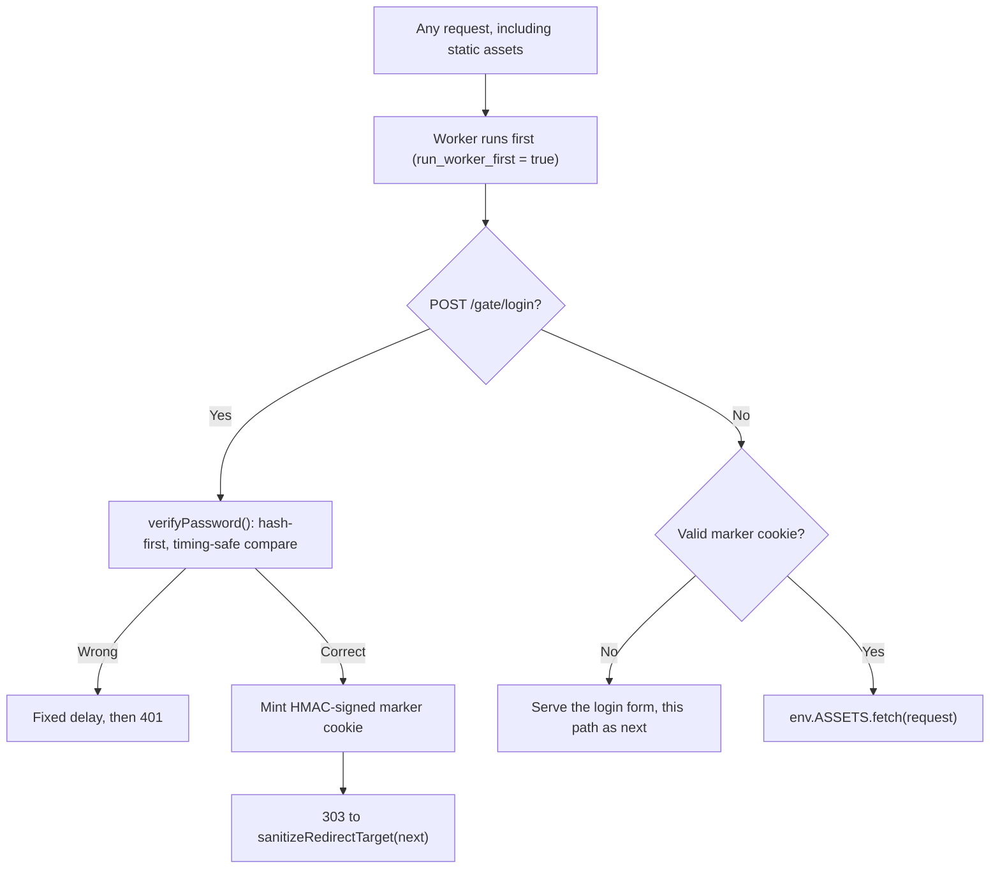

## 概要 -- ゲートは認証ではない

**パスワードゲート**は、ステージングやプレビューのデプロイを検索エンジンや通りすがりの訪問者から遠ざけるための仕組みだ。見せてよい相手全員が知っている 1 つの共有パスワードが、1 つの Cookie を介してサイト全体を保護する。これは**認証**とは根本的に別の仕事である。

:::danger[ゲートには identity がなく、ユーザーごとの境界もなく、パスワードのローテーション以外に無効化の手段もない]
ゲートを通過した全員が、まったく同じマーカー Cookie を受け取る。ユーザー名も、ユーザーごとのセッションもなく、訪問者を互いに区別する方法もない。サイトが本物のユーザーデータを扱う、ユーザーごとに異なる権限が必要である、あるいは他の全員をログアウトさせずに特定の 1 人だけをキックできる必要がある場合、このレシピは適切な道具ではない -- 閲覧者全員を事前に許可リストへ登録できるなら [Cloudflare Access](./cloudflare-access.mdx) を、サイト自身のアカウントが必要なら [HTTP-only Cookie セッション](./cookie-sessions.mdx) や [Pages Functions での認証](./auth-functions.mdx) を使う。パスワードゲートは、それが実際にできること -- 本番外のサイトを Google の検索結果や何気ない閲覧から遠ざける共有シークレット -- のためだけに使う。
:::

## ゲートのフロー

HTML、JSON、そしてすべての静的アセットを含む、あらゆるリクエストがまず Worker に届かなければならない。そうしなければ、ファイルを直接リクエストすることでゲートを迂回できてしまう。これには `run_worker_first = true` が必要だ。デフォルトの `false` では、Cloudflare のアセット層が一致する静的ファイルを Worker が実行される前に返してしまい、そこに巻いたゲートを黙って迂回してしまう。仕組みの全体と、他のユースケース向けに存在する配列形式という中間案については [Workers Static Assets: Routing Traps](../workers/static-assets.mdx#ルーティングの罠) を参照（ゲートにはサイト全体に対するデフォルト拒否が必要であり、限定されたサブツリーではないため、この中間案はここには合わない）。



## Wrangler 設定とシークレット

```toml
name = "my-preview-site"
main = "./dist/_worker.js"
compatibility_date = "2025-01-01"

[assets]
directory = "./dist"
binding = "ASSETS"
not_found_handling = "404-page"
# Every request must reach the Worker so the gate runs before any asset
# is served. See Workers Static Assets: Routing Traps for what happens
# at the default `false`.
run_worker_first = true
```

シークレットは 2 つ。どちらも平文のパスワードそのものではない。

```bash
# Compute the digest locally once; the plaintext password is never stored
# anywhere, not even as a Worker secret. `-r` prints "<hex>  *stdin" --
# copy just the hex portion into the prompt below.
printf '%s' 'correct-horse-battery-staple' | openssl dgst -sha256 -r
npx wrangler secret put GATE_PASSWORD_HASH

# A separate signing key for the marker cookie, unrelated to the password.
openssl rand -hex 32 | npx wrangler secret put GATE_SECRET
```

```typescript
interface Env {
  ASSETS: Fetcher;
  GATE_PASSWORD_HASH: string; // sha256 hex digest of the real password
  GATE_SECRET: string; // HMAC signing key for the marker cookie
}
```

:::note[`GATE_PASSWORD_HASH` はパスワード保管用のハッシュではなく、ただのダイジェストだ]
1 つの共有プレビューパスワードは、マルチユーザーのログインシステムとは異なる脅威モデルにある。ここで SHA-256 が高速であるのは意図的なもので、（後述する）生の可変長文字列同士の比較を避けるためだけに存在し、ダイジェストを盗んだ攻撃者がオフラインで総当たりすることへの耐性を持たせるためではない。このゲートが本物のユーザーごとの認証情報を守ることになった場合は、遅くてソルト付きのパスワードハッシュ（bcrypt/scrypt/Argon2）が必要になる。これは共有ゲートパスワードの範囲外だ。
:::

### Worker シークレットは GitHub Actions シークレットではない

`npx wrangler secret put GATE_PASSWORD_HASH` が書き込むのは **Cloudflare** のシークレットストアであり、デプロイされた Worker が `env.GATE_PASSWORD_HASH` を評価するときに読むのはそのストアだけだ。同じ名前の GitHub Actions リポジトリシークレット -- `gh secret set GATE_PASSWORD_HASH` -- はまったく別のストアであり、`${{ secrets.GATE_PASSWORD_HASH }}` としてワークフローのプロセスに注入されるだけで、実行中の Worker がそれを見ることはない。

片方を設定してもう片方を期待すると、何も言わずに失敗する。しかも、読み手が確認しそうなあらゆる角度から見て成功しているように見える: CI はグリーン、デプロイもグリーン、シークレットはリポジトリの設定画面に確かに存在している -- それでいて実行時の `env.GATE_PASSWORD_HASH` は `undefined` のままだ。警告は出ない。それぞれのストアの立場から見れば、何もおかしなことは起きていないからだ。

信頼できる確認方法は、Cloudflare のストアに対して問い合わせることだけだ:

```bash
npx wrangler secret list
```

空の `[]` は、リポジトリ設定画面が何を表示していようと、その Worker にシークレットが 1 つもバインドされていないことを意味する。再デプロイしても直らない: 再デプロイでは wrangler は各シークレットの現在の値を前バージョンから継承するよう API に依頼するため、そもそも Cloudflare のストアに一度も入ったことのない名前は、単に存在しないままになる。wrangler に強制させたい名前を宣言しておけば、この静かな実行時の `undefined` を、デプロイ時のエラーに変えられる:

```toml
[secrets]
required = ["GATE_PASSWORD_HASH", "GATE_SECRET"]

# Worker-level config does not inherit into named environments. Without
# this second block, `wrangler deploy --env preview` skips the check
# entirely -- and a preview deploy is exactly where a gate runs.
[env.preview.secrets]
required = ["GATE_PASSWORD_HASH", "GATE_SECRET"]
```

dev / 初回デプロイ / 再デプロイの挙動の一覧は [必須シークレットの宣言](../workers/wrangler-config.mdx#バインディング-必須シークレットの宣言) を参照。

手作業ではなく CI から投入するなら、デプロイ手順の中でリポジトリシークレットを Worker のストアへパイプで流し込む -- 2 つのストアが正当に交差する唯一の場所だ:

```yaml
- name: Bind the gate password hash as a Worker secret
  run: echo "$GATE_PASSWORD_HASH" | npx wrangler secret put GATE_PASSWORD_HASH
  env:
    GATE_PASSWORD_HASH: ${{ secrets.GATE_PASSWORD_HASH }}
    CLOUDFLARE_API_TOKEN: ${{ secrets.CLOUDFLARE_API_TOKEN }}
```

パイプで渡された値は保存前に末尾がトリムされるので、`echo` の付ける改行は無害だ -- 上にある `openssl rand -hex 32 | npx wrangler secret put GATE_SECRET` の形が成立するのも同じ理由による。ただし削られるのは*末尾*の空白だけだ: 先頭に紛れ込んだスペースはそのまま保存され、65 文字の「ダイジェスト」ができあがる。これは `verifyPassword` が計算する 64 文字と決して一致しない。

これと鏡合わせの罠 -- 壊れた **CI 認証情報**を直そうとして `wrangler secret put` に手を伸ばしてしまう、つまりワークフロー側のシークレットであって Worker シークレットではないものを扱ってしまう罠 -- については [ゼロからのデプロイ](../workers/deploy-from-zero.mdx#ci-トークン：「edit-cloudflare-workers」では足りない) を参照。

### バインドされていないシークレットは、クラッシュではなく意図的に拒否しなければならない

どちらのシークレットにも安全なデフォルト値は存在しない。だから、片方がバインドされていないときに今どうなるのかを明示しておく価値がある -- その答えが「たまたまフェイルクローズになっている」であり、たまたまであるものは最適化で消し飛ばされやすいからだ:

| バインドされていないシークレット | 実行時の挙動 |
| --- | --- |
| `GATE_PASSWORD_HASH` | `timingSafeEqualHex` が `undefined` に対して `b.length` を読み、`TypeError: Cannot read properties of undefined (reading 'length')` を投げる -- 500 になり、ログインは 1 つも通らない |
| `GATE_SECRET` | `crypto.subtle.importKey()` が長さ 0 の鍵を `DataError: Imported HMAC key length (0) must be a non-zero value...` で拒否する -- 500 になり、マーカーの発行も検証も行われない |

どちらも拒否しており、結果としては正しい。ただし `GATE_PASSWORD_HASH` の拒否は判断の結果ではなく、ハンドルされない例外の副作用にすぎない。そこで下の `verifyPassword` は、その契約を明示するガードから始めている。`GATE_SECRET` には手書きの相当物は不要だ: ランタイムが返す長さ 0 の鍵に対する `DataError` は、値に依存しない決定的なハードエラーだからだ。どちらの場合にも必要なのは、次にこのコードを読む人がその 500 を「潰すべきバグ」ではなく「ゲートが機能している証拠」として認識することだ。

:::danger[コミットされたフォールバックは、フェイルクローズをフェイルオープンに変える]
その 500 に対する誘惑的なパッチが、デフォルト値だ:

```typescript
const hash = env.GATE_PASSWORD_HASH || DEV_PASSWORD_HASH; // never do this
```

この 1 行によって、シークレットが欠けている間に処理されるすべてのリクエストに対して `DEV_PASSWORD_HASH` が**デプロイ済みの**パスワードになる -- そして「シークレットが欠けている」状態は仮定の話ではない。それはまさに、上で述べた Actions シークレットと Worker シークレットの取り違えが生む状態そのものだ: 本番環境で、静かに、グリーンなデプロイを背負ったまま。シークレットの設定を誤ったまさにその瞬間にフェイルオープンするゲートは、ゲートがないより悪い。それでもゲートがあるように見えてしまうからだ。

ローカル用の値は `.dev.vars` に置く。`wrangler dev` はそこの値を本物のシークレットとしてバインドし、このファイルはコミットもデプロイもされない。ハードコードされたフォールバックがどうしても避けられない場合は、リクエスト自身のホスト名がループバック（`localhost`、`127.0.0.1`、`[::1]`）であることを条件にして、デプロイされたリクエストには決して適用されないようにすること -- とはいえ `.dev.vars` を使えばそもそも必要ない。このやり方については [ローカル開発とバインディング](../workers/local-dev-bindings.mdx) を参照。そこには、認証ゲートが `undefined` を読んで「無効」に解決してしまい、テストが `401` を期待した場所で `200` が返るという、同じ失敗の process-env 版も載っている。
:::

## パスワードの検証: まずハッシュ化し、それから一定時間で比較する

生の送信パスワードと生の保存パスワードに対する素朴な `===` や自前の文字ループは、タイミングを通じてパスワードの長さ（そして素朴なループの場合は最初に不一致となったバイトの位置）を漏らしてしまう -- 2 つの可変長文字列が異なった時点で比較が返ってしまうためだ。まずハッシュ化することで入力を**固定長**のダイジェストに変換し、比較するのはその固定長ダイジェストだけになる。

とはいえ、2 つのダイジェストに対する自前の XOR ループそのものは、それだけでは安全な着地点にならない。ECMAScript はどの JS の一片についても一定時間実行を保証しておらず、JIT コンパイラは比較ループを、まさにそれが避けようとしていたタイミング信号を再び持ち込むような形で最適化する自由を持っている。`crypto.subtle.timingSafeEqual()` は、まさにこの比較のために Workers ランタイムが自ら提供するプリミティブだ -- JS の実行の外側で実装されており、エンジンの裁量に委ねられていない。

```typescript
async function sha256Hex(input: string): Promise<string> {
  const bytes = new TextEncoder().encode(input);
  const digest = await crypto.subtle.digest("SHA-256", bytes);
  return Array.from(new Uint8Array(digest))
    .map((b) => b.toString(16).padStart(2, "0"))
    .join("");
}

// Both arguments are fixed-length hex digests (64 chars for SHA-256) by the
// time this runs -- that is what makes the length check below safe (the
// digest length is public, not the secret's) and what guarantees the two
// encoded buffers are the same length, which crypto.subtle.timingSafeEqual()
// requires: it throws, rather than returning false, on a length mismatch.
function timingSafeEqualHex(a: string, b: string): boolean {
  if (a.length !== b.length) return false;
  const encoder = new TextEncoder();
  return crypto.subtle.timingSafeEqual(encoder.encode(a), encoder.encode(b));
}

async function verifyPassword(submitted: string, env: Env): Promise<boolean> {
  // No secret bound -- refuse every login deliberately, rather than letting an
  // undefined hash reach `b.length` in timingSafeEqualHex and throw a 500.
  if (typeof env.GATE_PASSWORD_HASH !== "string" || env.GATE_PASSWORD_HASH === "") {
    return false;
  }
  const submittedHash = await sha256Hex(submitted);
  return timingSafeEqualHex(submittedHash, env.GATE_PASSWORD_HASH);
}
```

これは、このレシピがシークレットをチェックするあらゆる箇所で使う比較だ: 可変長の入力をまずハッシュ化し、その結果の固定長ダイジェストに対してのみ `crypto.subtle.timingSafeEqual()` を走らせる。[Bot Worker](./bot-worker.mdx) と [HMAC-SHA256 によるウェブフック署名](./webhook-signing.mdx) も、同じ理由から同じ形を使っている。

## マーカー Cookie

### サーバー発行で推測不能。予測可能な固定値ではない

「この訪問者はすでにゲートを通過した」ことを示す Cookie は、訪問者が自分で作れてしまうものであってはならない。`gate=1` のような固定値は、その Cookie を一度でも見た人なら誰でも偽造できてしまう -- サーバーが発行したことの証明を何も持っていないからだ。以下のマーカーは、有効期限のタイムスタンプに対する HMAC で、`GATE_SECRET` で鍵付けされている。鍵なしでは偽造できず、期限自体も署名でカバーされているため、改ざんすると Cookie を延長するのではなく無効化する。

```typescript
const MARKER_COOKIE_NAME = "gate_ok";
const MARKER_TTL_SECONDS = 60 * 60 * 12; // 12 hours

async function hmacHex(message: string, secret: string): Promise<string> {
  const key = await crypto.subtle.importKey(
    "raw",
    new TextEncoder().encode(secret),
    { name: "HMAC", hash: "SHA-256" },
    false,
    ["sign"],
  );
  const sig = await crypto.subtle.sign("HMAC", key, new TextEncoder().encode(message));
  return Array.from(new Uint8Array(sig))
    .map((b) => b.toString(16).padStart(2, "0"))
    .join("");
}

async function mintMarker(env: Env): Promise<string> {
  const expiresAt = Math.floor(Date.now() / 1000) + MARKER_TTL_SECONDS;
  const signature = await hmacHex(`gate:${expiresAt}`, env.GATE_SECRET);
  return `${expiresAt}.${signature}`;
}

async function verifyMarker(cookieValue: string | undefined, env: Env): Promise<boolean> {
  if (!cookieValue) return false;
  const [expiresAtRaw, signature] = cookieValue.split(".");
  if (!expiresAtRaw || !signature) return false;

  const expiresAt = Number(expiresAtRaw);
  if (!Number.isInteger(expiresAt) || expiresAt < Math.floor(Date.now() / 1000)) {
    return false; // malformed, or past its own signed expiry
  }

  // The signature is a fixed-length hex digest already -- no separate
  // hashing step needed before the timing-safe compare here.
  const expected = await hmacHex(`gate:${expiresAtRaw}`, env.GATE_SECRET);
  return timingSafeEqualHex(signature, expected);
}
```

:::tip[`GATE_SECRET` をローテーションすると、既存のマーカー Cookie がすべて一度に無効化される]
`verifyMarker` は `GATE_SECRET` に対してのみ署名を検証するため、このシークレットを差し替えると、その時点ですべての訪問者が持っているマーカー Cookie がすべて即座に無効になる -- 全員が再ログインを求められる。`GATE_PASSWORD_HASH` だけをローテーションしても、これは起こらない -- それは新しいログインが何を受け入れるかを変えるだけで、古いパスワードの下ですでに発行済みのマーカーには何も影響しない。パスワードの漏洩が懸念であれば、両方をローテーションすること。
:::

### Cookie の属性は省略できない

```typescript
function buildMarkerCookie(value: string): string {
  const parts = [
    `${MARKER_COOKIE_NAME}=${value}`,
    "HttpOnly",
    "Secure",
    "SameSite=Lax",
    "Path=/",
    `Max-Age=${MARKER_TTL_SECONDS}`,
  ];
  return parts.join("; ");
}
```

- **`HttpOnly`** -- このマーカーはページの JavaScript から読む必要が一切ない。`document.cookie` からアクセスできないようにしておくことで、XSS による窃取経路を 1 つ塞ぐ。
- **`Secure`** -- 平文の HTTP では絶対に送信されない。
- **`Path=/`** -- 明示的であることが重要で、これは省略できない。この Cookie は `POST /gate/login` ハンドラーから発行される。`Path` を明示しないと、ブラウザはそれを設定したリクエストのディレクトリ（`/gate/`）をデフォルトにしてしまい、マーカーが `/gate/*` にスコープされてサイトの残りの部分がゲートされないままになる。`Path=/` があってはじめて、ゲートがサイト全体に適用される。
- **`Max-Age`** -- `MARKER_TTL_SECONDS` と一致しており、これは署名済みの `expiresAt` に焼き込まれた値と同じだ。Cookie の属性と署名済みのペイロードは意図的に一緒に期限切れになる: 属性はブラウザが古い Cookie を自発的に送らなくなる仕組みであり、署名済みのタイムスタンプは、クライアントがそれより前に保存しておいた Cookie のコピーを単純に送り返すことで期限切れを回避できないようにする仕組みだ。
- **`SameSite=Lax`** -- ゲートされたプレビューへの共有リンク（Slack のリンクやメール）はトップレベルのクロスサイト `GET` ナビゲーションであり、`Lax` はそれでも Cookie を通す。`Strict` だとそうしたリンクを踏むたびにゲートに 2 度当たることになる。[HTTP-only Cookie セッションの CSRF セクション](./cookie-sessions.mdx#csrf-cookie-はアンビエントな認証情報)も同じ `Lax` 対 `Strict` のトレードオフで締めくくられており、ここでもそのまま当てはまる。このゲートにはログイン POST 自体を除いて状態を変更するルートがないため、目の前にあるパスワードチェック以上に別途ゲートすべき CSRF の攻撃面はない。

プロジェクトにすでに Cookie ユーティリティがあるなら、汎用的な parse/serialize ヘルパーについては [HTTP-only Cookie セッション](./cookie-sessions.mdx) を参照。このゲートが必要とする Cookie は 1 つだけなので、汎用シリアライザーを持ち込むのではなく、ここで直接組み立てている。

## ログインは POST 限定、失敗時は固定の遅延を入れる

ログインルートは `POST` しか受け付けない。パスワードを送信できる `GET` は、パスワードをサーバーログ、ブラウザ履歴、そして訪問者が次にクリックするものの `Referer` ヘッダーに残してしまう -- これらはすべて、fetch によるフォーム `POST` なら避けられるものだ。

```typescript
const FAILURE_DELAY_MS = 800;

async function handleLogin(request: Request, env: Env): Promise<Response> {
  if (request.method !== "POST") {
    return new Response("Method Not Allowed", { status: 405, headers: { Allow: "POST" } });
  }

  const form = await request.formData();
  const submitted = String(form.get("password") ?? "");
  const nextRaw = String(form.get("next") ?? "");

  const ok = await verifyPassword(submitted, env);
  if (!ok) {
    // A small fixed delay on every failure is cheap and needs no storage --
    // it caps a naive online brute-force sweep to a handful of guesses per
    // second per connection. It is not a substitute for real rate limiting
    // if the gate is worth automating against at scale; for that, add a
    // per-IP failure counter in KV with expiry, the same TTL-based shape as
    // Bot Worker's [rate limiting](./bot-worker.mdx#rate-limiting-with-kv).
    await new Promise((resolve) => setTimeout(resolve, FAILURE_DELAY_MS));
    return new Response("Incorrect password", { status: 401 });
  }

  const marker = await mintMarker(env);
  const target = sanitizeRedirectTarget(nextRaw);

  return new Response(null, {
    status: 303,
    headers: new Headers([
      ["Location", target],
      ["Set-Cookie", buildMarkerCookie(marker)],
    ]),
  });
}
```

## ログイン後のリダイレクトは SSRF レシピのサニタイザーを再利用する

上記の `next` の値は、信頼できない `POST` フォームデータとして届く -- 訪問者のブラウザはログインフォームの hidden フィールドに入っていた値をそのまま送り返すだけであり、代わりに細工したリクエストが任意の値をそこへ入れることを止めるものは何もない。これはまさに [SSRF とリダイレクト安全性、パート 2](./ssrf-and-redirect-safety.mdx#パート-2-リダイレクト先サニタイザー) が扱っている形そのものだ: 同一オリジンパスの検証、デコードは 1 回だけ行ってから検証すること、そして `//host`、バックスラッシュ、埋め込まれた CR/LF の拒否。`sanitizeRedirectTarget` は再実装せずそこからインポートする -- ゲートのログインフローと一般的なログイン後リダイレクトフローは検証のセマンティクスが同一なので、正しく保つべき実装は 1 つだけでよい。

```typescript
import { sanitizeRedirectTarget } from "./redirect-safety"; // see SSRF and Redirect Safety, Part 2
```

`next` のもう 1 つの登場箇所 -- ブロックされた `GET` リクエストに対してゲートが最初にログインフォームを描画する場面 -- は信頼できないものではない。これは Worker がすでに処理しているリクエストの `url.pathname + url.search` からそのまま来ているので、構造上同一オリジンであり、hidden フィールドに書き込む前に必要なのは HTML エスケープだけで、オープンリダイレクト用のサニタイザーは不要だ。

```typescript
function escapeHtmlAttr(value: string): string {
  return value
    .replace(/&/g, "&amp;")
    .replace(/"/g, "&quot;")
    .replace(/</g, "&lt;")
    .replace(/>/g, "&gt;");
}

function gateFormHtml(next: string): string {
  return `<!doctype html>
<html>
<body>
<form method="POST" action="/gate/login">
<input type="password" name="password" required autofocus />
<input type="hidden" name="next" value="${escapeHtmlAttr(next)}" />
<button type="submit">Enter</button>
</form>
</body>
</html>`;
}
```

ここでのエスケープは HTML インジェクションを防ぐためのもので、`sanitizeRedirectTarget` が防ぐオープンリダイレクトとは別の問題だ。この 2 つのチェックは別々の問題を解決していて、どちらも必要になる: `sanitizeRedirectTarget` はログイン `POST` を経て戻ってきて `Location` ヘッダーで使われる値に対して一度だけ実行され、`escapeHtmlAttr` はその値がどこから来たかに関わらず、フォームの HTML に書き込まれる値に対して実行される。

## 全体を組み立てる

```typescript
export default {
  async fetch(request: Request, env: Env): Promise<Response> {
    const url = new URL(request.url);

    if (url.pathname === "/gate/login") {
      return handleLogin(request, env);
    }

    const cookies = parseCookieHeader(request.headers.get("Cookie") ?? "");
    const passed = await verifyMarker(cookies[MARKER_COOKIE_NAME], env);
    if (!passed) {
      const next = url.pathname + url.search;
      return new Response(gateFormHtml(next), {
        status: 401,
        headers: { "Content-Type": "text/html; charset=utf-8" },
      });
    }

    // Gate passed -- serve the real site, assets included, ourselves.
    return env.ASSETS.fetch(request);
  },
};

function parseCookieHeader(header: string): Record<string, string> {
  const cookies: Record<string, string> = {};
  for (const pair of header.split(";")) {
    const trimmed = pair.trim();
    const eq = trimmed.indexOf("=");
    if (eq === -1) continue;
    cookies[trimmed.slice(0, eq)] = trimmed.slice(eq + 1);
  }
  return cookies;
}
```

`run_worker_first = true` により、HTML、JSON、そして `directory` 配下のすべてのファイルを含む、あらゆるリクエストがまずこのハンドラーに届く。マーカー Cookie の検証を通過すると、Worker は `env.ASSETS.fetch(request)` によって実際のアセットを自ら配信する。これはまさに [完全なゲーティング修正](../workers/static-assets.mdx#ルーティングの罠) に書かれているペアリングそのものだ: フラグ単体はルーティングを変えるだけであり、Worker 自身が認可を行い、そのうえでアセットを配信する必要がある。

## 関連

- [Wrangler 設定: 必須シークレットの宣言](../workers/wrangler-config.mdx#バインディング-必須シークレットの宣言) -- バインドされていない `GATE_PASSWORD_HASH` を実行時の 500 ではなくデプロイ時のエラーに変える `[secrets] required` のチェックリスト。
- [Workers Static Assets](../workers/static-assets.mdx) -- `run_worker_first` と、デフォルトの `false` がなぜ静的サイトに巻いたゲートを黙って迂回してしまうか。
- [SSRF とリダイレクト安全性](./ssrf-and-redirect-safety.mdx) -- このレシピがログイン後のリダイレクトで再利用しているリダイレクト先サニタイザー。
- [Bot Worker](./bot-worker.mdx) -- 可変長シークレットを比較する前にハッシュ化するという `timingSafeEqualHex` の tip。
- [HMAC-SHA256 によるウェブフック署名](./webhook-signing.mdx) -- Webhook 署名検証に適用された、同じハッシュ優先・一定時間比較。
- [Cloudflare Access](./cloudflare-access.mdx) -- エッジで行う identity ベースの認可。閲覧者全員を事前に許可リストへ登録できる場合に使う。このゲートは Access にできない仕事を引き受け続ける -- 登録すべきものが何もないがゆえに登録コストがゼロである、社外の閲覧者にリンクを渡すという仕事だ。
- [HTTP-only Cookie セッション](./cookie-sessions.mdx) -- サイトが 1 つの共有パスワードではなく本物のユーザーごとの identity を必要とするようになったときに使うパターン。
