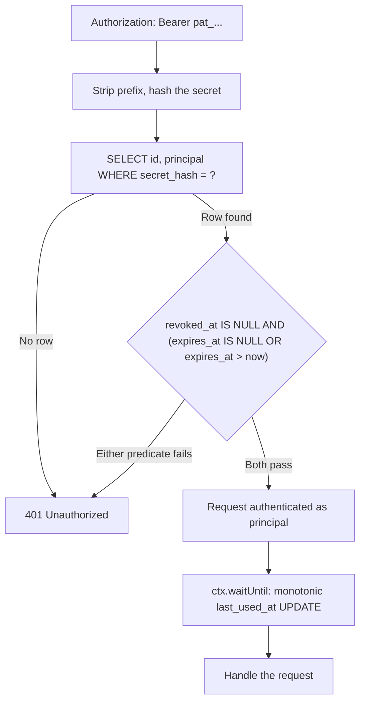

## 概要

パーソナル API トークンとは、ユーザーが自分のアカウント設定から発行する長命な資格情報であり、CI パイプライン、CLI ツール、cron ジョブなどからブラウザのセッションを持ち歩くことなくプログラム的に API を呼び出すために使う。これは [HTTP-only Cookie セッション](./cookie-sessions.mdx)とは異なる役割を担う -- セッションは短命でブラウザに紐づくのに対し、パーソナルトークンは長命で、明示的にオプトインされ、ログインとは独立に失効させられる。

この有効期間の違いこそが、雑に扱うとパーソナルトークンを危険にする理由だ。漏れたセッション Cookie は数分で失効する。だが漏れた API トークンは、ストレージ・失効・管理ルートの設計すべてが正しくない限り、無期限に有効なままとなり、正当な所有者が自分のアカウントに対して持つのと同じ権限を攻撃者に与えてしまう。このレシピが扱うのは、それを防ぐための各パーツだ: 生のシークレットを決してストレージに往復させないトークンの形、削除ではなくソフト失効するスキーマ、独立した 2 つの述語で説明される失効チェック、トークン自身が自分の管理ルートに決して触れられないという厳格なルール、そして同時アクセス下でも自壊しない `last_used_at` カラム。

## トークンの形

発行されたトークンは `pat_kR3n2Y8mQvL1xT7wZs4Jc9Hn6Ff0Ea5Dg2Bk8Ii3Cc7Aa1` のような形になる -- 固定の、見分けやすいプレフィックスに続けて、base64url エンコードされた 256 ビットのランダムなシークレットが並ぶ。

```typescript
const TOKEN_PREFIX = "pat_"; // "personal access token" -- recognizable prefix for secret scanners
const SECRET_BYTES = 32; // 256 bits of entropy

function generateSecret(): string {
  const bytes = new Uint8Array(SECRET_BYTES);
  crypto.getRandomValues(bytes);
  let binary = "";
  for (const byte of bytes) binary += String.fromCharCode(byte);
  return btoa(binary).replace(/\+/g, "-").replace(/\//g, "_").replace(/=+$/, "");
}
```

プレフィックスは装飾ではない。固定でグレップ可能なプレフィックスがあるからこそ、シークレットスキャンツール（GitHub の push protection、自前の CI リンター）は、トークンが API に提示される前に、コミットやログ行の中の漏洩を検出できる。`crypto.getRandomValues` -- 暗号学的に安全ではない `Math.random` ではなく -- がシークレット半分の唯一許容できる生成源だ。

256 ビットのエントロピーは意図的なものだ。これがあるからこそ、次節でシークレットを、遅くてソルト付きのパスワードハッシュではなく、速くてソルトなしの単一の SHA-256 でハッシュできる。人間が選ぶパスワードが bcrypt や argon2 を必要とするのは、まさにそのエントロピーが総当たり可能なほど低いからだ。`crypto.getRandomValues` が生成する 256 ビットのランダム値はそうではない。

## スキーマ

```sql
CREATE TABLE api_tokens (
  id           TEXT PRIMARY KEY,          -- server-generated UUID, safe to display and log
  principal    TEXT NOT NULL,             -- owning account/user id
  secret_hash  TEXT NOT NULL UNIQUE,      -- SHA-256 hex digest of the token secret
  name         TEXT NOT NULL,             -- user-supplied label, e.g. "CI deploy key"
  created_at   INTEGER NOT NULL,
  expires_at   INTEGER,                   -- NULL = never expires
  revoked_at   INTEGER,                   -- NULL = not revoked
  last_used_at INTEGER                    -- updated opportunistically, see below
);

CREATE INDEX idx_api_tokens_principal ON api_tokens (principal);
```

`id` はサーバー側で生成される UUID であり、トークンから導出されることも、秘密であることも決してない -- これは管理ルートが一覧表示や失効の際に参照するものであり、シークレットハッシュの元になった何かを一切露出させることなく、UI 上でトークンを識別できるようにする。`secret_hash` の `UNIQUE` 制約は、検証時のルックアップに必要なインデックスを SQLite に与える。`idx_api_tokens_principal` は、あるオーナーのトークン一覧を安価に取得できるようにする。

## ハッシュのみでの保存

生のシークレットが D1 に書き込まれることは決してない -- 書き込まれるのはそのハッシュだけだ。

```typescript
async function sha256Hex(input: string): Promise<string> {
  const bytes = new TextEncoder().encode(input);
  const digest = await crypto.subtle.digest("SHA-256", bytes);
  return Array.from(new Uint8Array(digest))
    .map((b) => b.toString(16).padStart(2, "0"))
    .join("");
}
```

これは、保存時のあらゆるシークレットを支配するのと同じ理屈だ。データベースダンプ、設定ミスのバックアップ、侵害されたレプリカのいずれも、それ単体でトークン保持者になりすませてしまってはならない。ストレージに存在するのが `secret_hash` だけなら、そこから元のシークレットを復元するには SHA-256 を逆算する必要があり、カラムを読むだけでは済まない。

:::note[ソルトなし、そして `wrangler secret put` も不要]
パスワードとは異なり、このシークレットには行ごとのソルトが要らない -- `crypto.getRandomValues` による 256 ビットのエントロピーだけで、事前計算されたレインボーテーブルはすでに現実的でなくなっており、素の SHA-256 ダイジェストで十分だ。そして [HTTP-only Cookie セッション](./cookie-sessions.mdx)の JWT セッションパターンとは異なり、この方式は `wrangler secret put` で設定する共有署名鍵をまったく必要としない -- 各トークンの安全性はそれぞれのランダムなシークレットだけに宿っており、漏れればすべてのトークンを一度に危険にさらすようなサーバー側の鍵には宿っていない。
:::

## トークンの発行

```typescript
interface Env {
  DB: D1Database;
}

const DEFAULT_TTL_MS = 365 * 24 * 60 * 60 * 1000; // 1 year, unless the caller opts into no expiry

export interface MintedToken {
  id: string;
  token: string; // shown to the caller exactly once -- never stored, never retrievable again
}

export async function mintToken(
  env: Env,
  principal: string,
  name: string,
  ttlMs: number | null = DEFAULT_TTL_MS,
): Promise<MintedToken> {
  const id = crypto.randomUUID();
  const secret = generateSecret();
  const secretHash = await sha256Hex(secret);
  const now = Date.now();
  const expiresAt = ttlMs === null ? null : now + ttlMs;

  await env.DB.prepare(
    `INSERT INTO api_tokens (id, principal, secret_hash, name, created_at, expires_at)
     VALUES (?, ?, ?, ?, ?, ?)`,
  )
    .bind(id, principal, secretHash, name, now, expiresAt)
    .run();

  return { id, token: `${TOKEN_PREFIX}${secret}` };
}
```

:::danger[mint-once とは、本当に一度きりという意味]
`mintToken` は、生のトークンがコード側で読み取れる値として存在する唯一の場所だ。発行レスポンスの中でのみ呼び出し元に返され、それ以外では決して返らない -- 後述の一覧エンドポイントが返すのは `id`・`name`・タイムスタンプであり、`secret_hash` ではないし、再構成する「表示」や「リセット」エンドポイントも存在しない。所有者が値を失ってしまった場合、唯一の対処法はこのトークンを失効させ、新しいトークンを発行し直すことだ。UI もそれを前提に設計すること: 生のトークンはコピー用のボックスに一度だけ表示し、「二度と表示されません」という明確な警告を添え、デバッグレベルであっても決してログに残さない。
:::

## トークンの検証

```typescript
export interface VerifiedToken {
  id: string;
  principal: string;
}

interface TokenRow {
  id: string;
  principal: string;
}

export async function verifyToken(
  env: Env,
  ctx: ExecutionContext,
  authHeader: string | null,
): Promise<VerifiedToken | null> {
  if (!authHeader?.startsWith(`Bearer ${TOKEN_PREFIX}`)) {
    return null;
  }
  const secret = authHeader.slice(`Bearer ${TOKEN_PREFIX}`.length);
  const secretHash = await sha256Hex(secret);
  const now = Date.now();

  const row = await env.DB.prepare(
    `SELECT id, principal FROM api_tokens
     WHERE secret_hash = ?
       AND revoked_at IS NULL
       AND (expires_at IS NULL OR expires_at > ?)`,
  )
    .bind(secretHash, now)
    .first<TokenRow>();

  if (!row) {
    return null;
  }

  ctx.waitUntil(touchLastUsed(env.DB, row.id, now));

  return row;
}
```

このルックアップ自体は `secret_hash` に対する単純なインデックス付き等価一致であり、SQLite が評価する -- 候補行を取得したあとにコード側で行う JavaScript の `===` 比較ではない。[HMAC ダイジェストの比較](./webhook-signing.mdx#受信側での検証)とは違い、ここでは覚えておくべき手動の一定時間比較のステップは存在しない。比較はすでにクエリエンジンの内部で、固定長かつ一様分布な SHA-256 ダイジェストに対して行われている。

## 二重ガード付きソフト失効

失効はソフトデリートだ: `revoked_at` にタイムスタンプが入り、行自体は残る。行を完全に削除してしまうと、監査証跡（誰がいつからいつまでトークンを持ち、いつ無効になったか）が失われるうえ、将来のトークンが再利用された `id` に衝突しかねない。

上記の `WHERE` 句は独立した 2 つの述語を強制しており、トークンが認証されるにはその両方を満たさなければならない -- どちらか一方を欠くと、それぞれ別の障害モードが再び開いてしまう。

- **`revoked_at IS NULL`** はオーナーの明示的なキルスイッチだ。ストレージ層において「失効ボタンを押した」が意味するのはこれだ。この述語がなければ、UI 上でトークンを失効させても、誰も見ない行が更新されるだけになる -- 管理 UI が何を表示していようと、トークンは永遠に認証され続けてしまう。
- **`expires_at IS NULL OR expires_at > now`** は、オーナーが行動を覚えていることに依存しない、受動的で時間ベースの減衰だ。この述語がなければ、使い捨てスクリプトのために発行されて、そのまま単に忘れられたトークン -- 誰も思い至らず、明示的に失効されることもない -- が無期限に有効なままとなる。時間ベースの失効は、誰も能動的に管理していない資格情報による被害を有限に抑えるものだ。

5 年前に一度だけ実行された CI ジョブのために発行され、一度も失効されなかったトークンは、まさに `expires_at` が塞ごうとしているケースだ。有効期限のずっと前に、オーナーが今日まさに信用しなくなったトークンは、まさに `revoked_at` が塞ごうとしているケースだ。どちらの述語も、もう一方の代わりにはならない。

```typescript
export async function revokeToken(env: Env, principal: string, id: string): Promise<boolean> {
  const revoked = await env.DB.prepare(
    `UPDATE api_tokens
     SET revoked_at = ?
     WHERE id = ? AND principal = ? AND revoked_at IS NULL
     RETURNING id`,
  )
    .bind(Date.now(), id, principal)
    .first();

  return revoked !== null;
}

export interface TokenSummary {
  id: string;
  name: string;
  created_at: number;
  expires_at: number | null;
  revoked_at: number | null;
  last_used_at: number | null;
}

export async function listTokens(env: Env, principal: string): Promise<TokenSummary[]> {
  const { results } = await env.DB.prepare(
    `SELECT id, name, created_at, expires_at, revoked_at, last_used_at
     FROM api_tokens
     WHERE principal = ?
     ORDER BY created_at DESC`,
  )
    .bind(principal)
    .all<TokenSummary>();

  return results; // secret_hash is never selected, let alone returned
}
```

`revokeToken` の `WHERE` 句は `id` だけでなく `principal` でもスコープしている -- 呼び出し元は自分自身のトークンしか失効できず、他のアカウントのトークン id を推測してその足元から無効化することはできない。

## 管理ルートはトークンを拒否する

`/account/tokens` 配下のルート -- 発行・一覧・失効 -- は、呼び出し元をセッションで認証しなければならず、API トークン自身での認証を決して受け付けてはならない。これは上記の二重ガードとは別のルールであり、別の穴を塞ぐ: 期限内で失効もされていないトークンであっても、トークン管理のための資格情報として受け入れられてはならない。

```typescript
type AuthResult =
  | { kind: "session"; principal: string }
  | { kind: "token"; principal: string; tokenId: string };

async function authenticate(
  request: Request,
  env: Env,
  ctx: ExecutionContext,
): Promise<AuthResult | null> {
  const authHeader = request.headers.get("Authorization");
  if (authHeader) {
    const verified = await verifyToken(env, ctx, authHeader);
    return verified && { kind: "token", principal: verified.principal, tokenId: verified.id };
  }
  const session = await verifySessionCookie(request, env); // your own session check, see HTTP-only Cookie Sessions
  return session && { kind: "session", principal: session.principal };
}

export async function handleCreateToken(
  request: Request,
  env: Env,
  ctx: ExecutionContext,
): Promise<Response> {
  const auth = await authenticate(request, env, ctx);

  if (!auth || auth.kind !== "session") {
    // A valid, unexpired, unrevoked token is still rejected here. No
    // separate error code either -- the same 401 an anonymous caller
    // gets, so a leaked token can't be used to probe whether it's
    // otherwise still valid.
    return new Response("Unauthorized", { status: 401 });
  }

  const { name } = (await request.json()) as { name: string };
  const minted = await mintToken(env, auth.principal, name);

  return new Response(JSON.stringify(minted), {
    status: 201,
    headers: { "Content-Type": "application/json" },
  });
}
```

:::danger[このルールが存在する理由]
もし漏洩したトークンが自分自身の管理ルートで認証できてしまうなら、それは単一の失効可能な資格情報ではなく、自己増殖する資格情報になってしまう。盗んだトークンを 1 つ持つ攻撃者は、他のすべてのトークンのメタデータを一覧して狙いを定めたり、漏洩したトークンをオーナーが失効させても生き残る新しいトークンを発行したり、侵害の後始末に必要な API そのものからオーナーを締め出すためにオーナー自身のトークンを失効させたりできてしまう。セッションを要求すること -- 漏洩したトークンしか持たない攻撃者には持ち得ないもの -- こそが、侵害されたトークン 1 つを、封じ込められた単一のインシデントのままにとどめる。
:::

`handleListTokens` と `handleRevokeToken` もまったく同じ形をたどる: `authenticate` を呼び、`kind === "session"` でないものはすべて拒否し、そのあとで初めて `listTokens` / `revokeToken` に触れる。

## `last_used_at` をレースなしで追跡する

上記の `verifyToken` は、行が見つかったあとに `ctx.waitUntil(touchLastUsed(...))` を呼び出す -- この更新はレスポンスがすでに送信され始めたあとに行われるので、リクエストのクリティカルパス上では何のコストもかからない。

```typescript
async function touchLastUsed(db: D1Database, id: string, now: number): Promise<void> {
  await db
    .prepare(
      `UPDATE api_tokens
       SET last_used_at = ?
       WHERE id = ? AND (last_used_at IS NULL OR last_used_at < ?)`,
    )
    .bind(now, id, now)
    .run();
}
```

`WHERE last_used_at IS NULL OR last_used_at < ?` という句は省略可能なものではない。自動化された高頻度の API 呼び出しに使われるトークンは、同時に多数のリクエストが飛び交い、それぞれが自分自身の `now` タイムスタンプを持つ独立した `waitUntil` の書き込みを発火させる -- そして `waitUntil` のコールバックは、それをスケジュールしたリクエストが届いた順序どおりに完了するとは保証されていない。単調性のガードがなければ、より早く始まったリクエスト（つまりより早い `now` を持つリクエスト）の書き込みが、より遅く始まったリクエストの*あとに*着地してしまい、より新しい `last_used_at` を古いもので黙って上書きしかねない。ガードがあれば、書き込みはタイムスタンプを前にしか進めない -- すでにより新しい行を対象にした順序違いの完了は、単に 0 行にマッチして何もしない。これは [D1 による Idempotency-Key 台帳](./idempotency-ledger.mdx#pending-予約の引き継ぎをフェンシングする)の completion 書き込みとまったく同じ、フェンスされた書き込みの形だ。

## ルートテーブル

| メソッド | パス | 認証 | 備考 |
|---|---|---|---|
| `POST` | `/account/tokens` | セッションのみ | トークンを発行する。生の値が返るのはこの一度きり |
| `GET` | `/account/tokens` | セッションのみ | `id`・`name`・タイムスタンプを一覧表示する -- `secret_hash` が選択されることはない |
| `DELETE` | `/account/tokens/:id` | セッションのみ | ソフト失効: `revoked_at` を設定する。呼び出し元自身の `principal` にスコープされる |
| 保護された任意の API ルート（例: `/api/*`） | `Bearer pat_...` | API トークンのみ | 二重述語でゲートされる。`last_used_at` は `ctx.waitUntil` 経由で更新される |

どの行も、「通常はこう使う」ではなく本当に排他的だ: 管理ルートは能動的にベアラートークンを拒否し（前述のとおり）、保護された API ルートにはこのレシピにおいてセッションへのフォールバックがない -- トークンなしで対話的にログイン済みのブラウザが `/api/*` を叩いても、そこでは未認証になる。2 つの異なる資格情報の種類、2 つの重ならないルート集合。（実際の API サーフェスでは、ログイン済みのブラウザが同じルートをセッション経由でも呼べるようにするのが妥当な場合もあるだろう。このレシピでは、トークンの境界を考えやすく、テストしやすく保つために、2 つの領域を意図的に重ならせていない。）

## Worker への組み込み



1 つの `fetch` ハンドラが、管理ルートをセッション限定のハンドラへ、それ以外をすべてトークン検証へと振り分ける。

```typescript
export default {
  async fetch(request: Request, env: Env, ctx: ExecutionContext): Promise<Response> {
    const url = new URL(request.url);

    if (url.pathname === "/account/tokens" && request.method === "POST") {
      return handleCreateToken(request, env, ctx);
    }
    if (url.pathname === "/account/tokens" && request.method === "GET") {
      return handleListTokens(request, env, ctx);
    }
    if (url.pathname.startsWith("/account/tokens/") && request.method === "DELETE") {
      return handleRevokeToken(request, env, ctx);
    }

    // Everything else is a token-protected API route.
    const auth = await authenticate(request, env, ctx);
    if (!auth || auth.kind !== "token") {
      return new Response("Unauthorized", { status: 401 });
    }
    return handleApiRequest(request, env, auth.principal);
  },
};
```

`handleApiRequest` は実際の API ロジックであり、検証済みの `principal` とともに実行され、トークンに関するそれ以上の後始末は必要ない -- `verifyToken` はこの行が実行される前にすでに `last_used_at` を更新している。

## 関連項目

- [HTTP-only Cookie セッション](./cookie-sessions.mdx) -- ここで管理ルートが要求するセッション Cookie 認証。
- [D1 による Idempotency-Key 台帳](./idempotency-ledger.mdx) -- 同じ D1 の基礎（条件付き `UPDATE ... RETURNING`、フェンスされた書き込み）を別の問題に適用したもの。
- [HMAC-SHA256 によるウェブフック署名](./webhook-signing.mdx) -- このサイトが Web Crypto でハッシュ計算を行うもう一つの場所であり、あちらは一定時間比較が必要でこちらは不要である理由。
