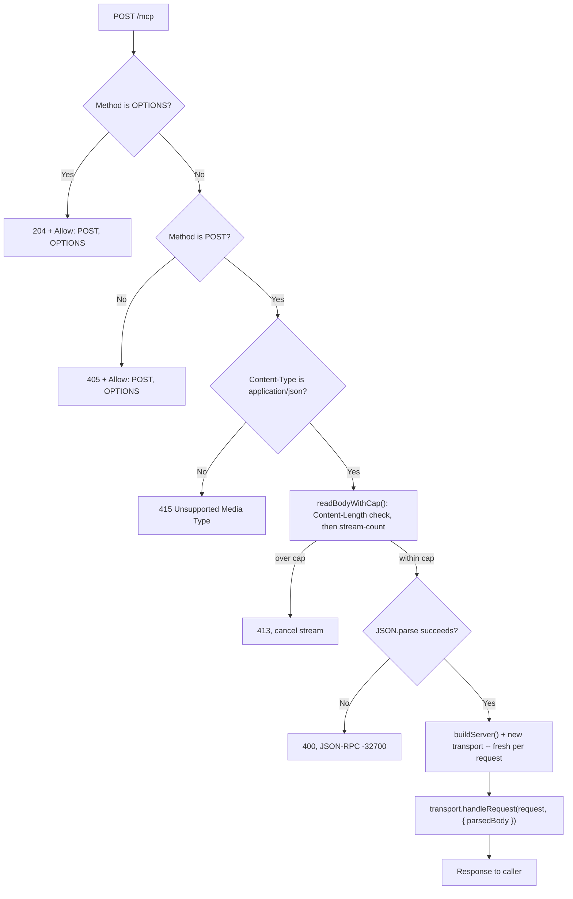

## 概要

リモート MCP（Model Context Protocol）サーバーは、単なる Worker だ -- MCP Streamable HTTP トランスポート上で JSON-RPC を話す HTTP エンドポイントであり、Claude、IDE 統合、別のエージェントなど、MCP 互換のどんなクライアントも、ローカルプロセスを管理することなく `initialize`、`tools/list`、`tools/call` を呼び出せる。`@modelcontextprotocol/sdk` パッケージはそのために必要なものを一式備えているが、そのデフォルトは長寿命の Node.js サーバー向けに形作られている -- トランスポートの選択を誤り、ヘッダーを誤って信頼し、パッケージの誤った半分をインポートすると、実行できないか、バンドルが静かに肥大化するか、受け入れるべきでないものまで受け入れる Worker になってしまう。

このレシピはステートレスな MCP サーバーを構築する -- セッションなし、Durable Object なし、リクエストのたびに新しい `McpServer` とトランスポートをインスタンス化する -- そして、それを安全かつ小さく保つための決定事項を扱う。実際に Fetch API を話すトランスポートモジュールはどれか、なぜリクエストごとのインスタンス化が Workers 特有の事情でほぼ無料なのか、トランスポートが動く前に POST 以外の呼び出し元全員へクリーンな `405` を返すリクエストゲート、JSON パースが走る *前に* 強制するボディキャップ、そして SDK のクライアント半分をうっかりインポートしてしまったことを捕まえるバンドルサイズチェックだ。

エンドポイントに OAuth 認証されたセッション、サーバー起点の通知、あるいは単一リクエストを超えて生き続ける状態が必要なら、それはこのレシピではなく、Cloudflare 自身の Agents SDK による Durable Object 裏付けの `McpAgent` の仕事だ -- [関連](#関連)を参照。

## トランスポートの選択: Node 形状ではなく WebStandard

`@modelcontextprotocol/sdk` は、同じ Streamable HTTP ワイヤプロトコルに対して 2 種類の HTTP サーバートランスポートを提供しているが、Workers 上では互換ではない。

```typescript
// Don't -- Node-shaped: handleRequest(req, res) expects Node's
// http.IncomingMessage / http.ServerResponse, and the module pulls in
// @hono/node-server as an adapter to produce them. A Worker's fetch()
// handler never has either object -- it has a Fetch API Request.
import { StreamableHTTPServerTransport } from "@modelcontextprotocol/sdk/server/streamableHttp.js";

// Do -- WebStandard: handleRequest(req: Request) takes and returns the
// Fetch API Request/Response your Worker already speaks natively.
import { WebStandardStreamableHTTPServerTransport } from "@modelcontextprotocol/sdk/server/webStandardStreamableHttp.js";
```

`streamableHttp.js` は Node の HTTP サーバー向けに作られている。`handleRequest` のシグネチャは `(req: IncomingMessage, res: ServerResponse, parsedBody?) => Promise<void>` であり、Node のリクエスト/レスポンスオブジェクトを内部で Fetch API へ橋渡しするために `@hono/node-server` に依存する。この橋渡しは Worker には何の得にもならない -- `fetch(request: Request, env, ctx)` はすでに標準の `Request` を渡してくれ、標準の `Response` を返すことを期待している。`webStandardStreamableHttp.js` は同じプロトコルをそれらの型に対して直接実装しており、間に Node のシムはなく、この Worker が本当に必要とする依存グラフに `@hono/node-server` は含まれない。

## ステートレスな設定、リクエストごとの新しいサーバー

```typescript
import { McpServer } from "@modelcontextprotocol/sdk/server/mcp.js";
import { WebStandardStreamableHTTPServerTransport } from "@modelcontextprotocol/sdk/server/webStandardStreamableHttp.js";
import { z } from "zod";

function buildServer(): McpServer {
  const server = new McpServer({ name: "wisdom-mcp", version: "1.0.0" });

  server.registerTool(
    "echo",
    {
      title: "Echo",
      description: "Echoes the input message back",
      inputSchema: { message: z.string() },
    },
    async ({ message }) => ({
      content: [{ type: "text", text: message }],
    }),
  );

  return server;
}
```

トランスポートのコンストラクタにある `sessionIdGenerator: undefined` が、これをステートレスモードにしている要点だ -- `Mcp-Session-Id` は発行されず、セッション状態はリクエスト間で追跡されず、`/mcp` へのすべての POST は、そのサーバーがこれまでに見た唯一のリクエストであるかのように扱われる。これは同時に、再開可能なストリームも、呼び出し間のサーバー起点通知もないことを意味する -- クライアントは長寿命の接続を開いて後からメッセージがプッシュされるのを期待することはできない。その代わり、特定のインスタンスに紐付けるものは何もなく、期限切れになるものも、呼び出し元同士で漏れるものも何もない。

```typescript
const transport = new WebStandardStreamableHTTPServerTransport({
  sessionIdGenerator: undefined, // stateless: no session tracking between requests
  enableJsonResponse: true, // plain JSON responses -- no SSE stream for this recipe
});
```

`buildServer()` と上記のトランスポートは、どちらも `fetch` ハンドラの **内側** で、受信リクエストごとに 1 回だけ生成される -- モジュールスコープでは決して生成せず、リクエストをまたいでキャッシュもしない。モジュールスコープで一度だけ登録したツールは、単一の isolate では動作こそするだろうが、その isolate 上の以後すべてのリクエストを、そのツールがクロージャで捕まえたモジュールレベルの状態に結び付けてしまう -- それはまさに、ステートレスな設計が避けようとしているリクエストをまたいだ共有状態そのものだ。

## プロセスではなく isolate: リクエストごとのインスタンス化が安く済む理由

すべてのリクエストで新しいサーバーオブジェクトを作るのは、長寿命の Node プロセスを頭に思い浮かべると無駄に見える -- リクエストのたびに新しい Express アプリを起動し、ルートを再登録し、コネクションプールを再確立するのは本当にコストがかかるし、誰もそんなことはしない。しかし Workers はそのモデルではない。リクエストをまたいで温かいまま再利用される単位は **V8 isolate** であって、プロセスではない -- 温かい isolate にリクエストが届く時点で、モジュールグラフはすでにロード済み、パース済み、JIT でウォームアップ済みだ。その isolate の中でもう一度 `buildServer()` を実行するのは、いくつかの JS オブジェクトを確保して、同期的な `registerTool()` 呼び出しをいくつか実行するだけのことにすぎない -- プロセスのフォークも、新しい V8 コンテキストも、このファイルの再パースもない。本当にリクエストごとにかかるコストは、それが動く環境ではなく、オブジェクトグラフそのもの（`McpServer` インスタンスとそのトランスポート）だ。

これは、ステートレスな設計がこのプラットフォームに合う理由でもある。Workers は、このスクリプトを扱っているどの温かい isolate にでも、エッジ上のどこであろうとリクエストをルーティングでき、「セッションを持っているあのインスタンス」への親和性を必要としない。セッションベースの設計はその保証を保つために、クライアントを 1 つの Durable Object インスタンスに紐付ける必要がある。ここでのステートレスな設計には保つべき保証がないので、どの isolate でもどのリクエストにも応答できる。

とはいえこれはタダというわけではない -- 安いのであって、ゼロではない。「タダだ」ではなく、実際の上限に対してどれくらい安いのかを測る価値がある。Free プランの CPU 時間予算は[リクエストあたり 10ms](https://developers.cloudflare.com/workers/platform/limits/)であり、`buildServer()` に加えていくつかの同期的な `registerTool()` 呼び出しは、温かい isolate 上ではそのごく一部にすぎない。実際に仕事をする `tools/call` は話が別だ -- アウトバウンドの `fetch()`、KV の読み取り、あるいはより重い登録ツールは、上のほぼタダな構築コストの上に、それ自身の CPU 時間を積み増し、アウトバウンド呼び出しがあればそれは Worker のインボケーションあたりのサブリクエスト上限にもカウントされる。「構築が安い」というのはこのセクションで組み立てているオブジェクトグラフについての主張であり、`tools/call` がそこへ届いたあとに特定の登録ツールが何をするかについての主張ではない。

## リクエストゲート: POST 専用、405 + Allow ヘッダー

Streamable HTTP トランスポート自身の `handleRequest` は、`GET` を SSE ストリームへ、`DELETE` をセッション終了へルーティングする -- どちらもセッションが存在して初めて意味を持つ。このレシピのトランスポートにはセッションがない（`sessionIdGenerator: undefined`）ので、どちらの動詞もここでは何もすることがない。それでもトランスポートに処理させてしまうと、`GET` や `DELETE` は、クリーンで予測可能なレスポンスの代わりに、トランスポート自身のセッション ID 欠落エラーへ落ちてしまう。代わりに、トランスポートがリクエストを目にする **前** にメソッドをゲートする: まず `OPTIONS` に専用の分岐を用意すること -- ブラウザの CORS プリフライトは `OPTIONS` リクエストとして届くので、それを下の汎用 405 に紛れ込ませると、ブラウザが実リクエストを送る前にすべてのプリフライトが失敗してしまい、後述の「CORS と認証」セクションが有効にすると説明しているブラウザからのアクセスを静かに壊してしまう -- そのうえで `POST` 以外のすべてに同じ方法で答える。

```typescript
function jsonRpcError(
  status: number,
  code: number,
  message: string,
  extraHeaders: Record<string, string> = {},
): Response {
  return new Response(JSON.stringify({ jsonrpc: "2.0", id: null, error: { code, message } }), {
    status,
    headers: { "content-type": "application/json", ...extraHeaders },
  });
}

// Inside the fetch handler, before any body is read. OPTIONS is a CORS
// preflight, not a method to reject -- see "CORS and Auth" for what this
// branch needs to add if browser access to this endpoint is enabled.
if (request.method === "OPTIONS") {
  return new Response(null, { status: 204, headers: { Allow: "POST, OPTIONS" } });
}
if (request.method !== "POST") {
  return jsonRpcError(405, -32000, "Method not allowed", { Allow: "POST, OPTIONS" });
}
```

レスポンスボディは、それでも有効な JSON-RPC のエラーエンベロープ（`code: -32000` は SDK 自身がメソッド不許可のケースで使うのと同じ汎用サーバーエラーコードだ）のままなので、ボディを常に JSON-RPC としてパースしようとするクライアントは、どちらにしても筋の通ったものを受け取る -- それに加えて、SDK が関与するより前に走るチェックから、安定した `405` と `Allow: POST, OPTIONS` も得られる。

## ボディキャップ: JSON パースより前に強制する

MCP のペイロードは、ツールが返す画像や、リソース読み取りがそのまま返すファイルなど、バイナリコンテンツを JSON ボディの中に base64 文字列としてインラインで運ぶことがある。base64 は実バイト数をおよそ 4/3 に膨らませるので、ワイヤ上は控えめに見えるリクエストでも大きなインメモリデコードを強いることがあり、意図的に肥大化させたリクエストならさらに大きなデコードを強いることができる。`await request.json()`（あるいは `.text()`）は、コード側がサイズに異議を唱える機会を得るより前に、ボディ **全体** をメモリへバッファする -- その呼び出しの後でサイズチェックを走らせられる頃には、コストのかかる部分はすでに終わっている。

対処法は、パースより **前** にサイズをチェックすることであり、それを 2 層で行う。分かりやすい 1 つ目のチェックだけでは十分ではないからだ。

```typescript
const MAX_BODY_BYTES = 256 * 1024; // 256 KiB -- generous for JSON-RPC args, tight against base64-inflated abuse

async function readBodyWithCap(request: Request, maxBytes: number): Promise<string> {
  // Content-Length is attacker-supplied and can be absent entirely (chunked
  // transfer-encoding) or simply wrong -- a cheap early reject, not the guard.
  const declaredLength = request.headers.get("content-length");
  if (declaredLength && Number(declaredLength) > maxBytes) {
    throw new Error(`Body exceeds ${maxBytes} bytes (Content-Length: ${declaredLength})`);
  }

  if (!request.body) return "";

  // Stream-count the actual bytes and abort mid-stream once the cap is
  // crossed, instead of letting request.json()/.text() buffer everything
  // first and only checking size after the fact.
  const reader = request.body.getReader();
  const chunks: Uint8Array[] = [];
  let total = 0;
  for (;;) {
    const { done, value } = await reader.read();
    if (done) break;
    total += value.byteLength;
    if (total > maxBytes) {
      await reader.cancel();
      throw new Error(`Body exceeds ${maxBytes} bytes while streaming`);
    }
    chunks.push(value);
  }

  const bytes = new Uint8Array(total);
  let offset = 0;
  for (const chunk of chunks) {
    bytes.set(chunk, offset);
    offset += chunk.byteLength;
  }
  return new TextDecoder().decode(bytes);
}
```

`Content-Length` のチェックは、ボディに一切触れることなく、正直に大きいと申告されたリクエストを拒否できる、安価な最初の一手だ。しかしこれだけをチェックにすることはできない -- `Content-Length` はチャンク転送のリクエストでは存在しないし、クライアントが小さい宣言長と、それより大きい実際のストリームを送ってくる（あるいはその逆をする）のを止めるものは何もない。ストリーミングのループこそが本当の境界だ -- 到着するバイトを数え、累計がキャップを超えた瞬間にリーダーをキャンセルする。だから最悪のケースでも `maxBytes` プラス 1 チャンク分をバッファするだけで済み、無制限のボディになることはない。

ここで組み立てが完成したときの順序について、ひとつ注意点がある: この先の完成版ハンドラーでは、このキャップは次に扱う `Content-Type` チェックの**あとに**実行される。前ではない -- そもそも JSON になるはずのないボディをストリームでカウントする理由はないからだ。このページのセクションは、完成版ハンドラーが実際に実行する順序ではなく、概念ごとに並んでいる。実際の順序については、下の [Content-Type と JSON-RPC のエラー形状](#content-type-と-json-rpc-のエラー形状) を参照。

## Content-Type と JSON-RPC のエラー形状

ボディキャップが走るより前に `Content-Type` を検証する -- そもそも JSON になり得ないリクエストのバイトを 1 つでも読む理由はない。

```typescript
function isJsonContentType(contentType: string): boolean {
  // Parse the media type -- the part before any `;` parameter -- instead
  // of a substring match. The SDK's own transport does the same (its
  // internal `isJsonContentType` explicitly rejects substring matching),
  // and a plain `.includes("application/json")` also passes something like
  // `text/plain; charset=application/json`, which is not JSON.
  const mediaType = contentType.split(";", 1)[0].trim().toLowerCase();
  return mediaType === "application/json";
}

const contentType = request.headers.get("content-type") ?? "";
if (!isJsonContentType(contentType)) {
  return jsonRpcError(415, -32000, "Content-Type must be application/json");
}
```

ボディが読まれてキャップを通過した後、`JSON.parse` が失敗した場合には、上で使った汎用の `-32000` ではなく、まさにこのケースのために JSON-RPC が予約しているコード -- `-32700`、パースエラー -- を返す。

```typescript
let parsedBody: unknown;
try {
  parsedBody = JSON.parse(bodyText);
} catch {
  return jsonRpcError(400, -32700, "Parse error: invalid JSON");
}
```

このレシピ自身のゲートが生む拒否 -- メソッド、Content-Type、ボディサイズ、パース失敗 -- はすべて、SDK のトランスポート自身が内部の拒否（不正な `Accept`、セッション欠落、非対応のプロトコルバージョン）に対して返すのと同じ `{ jsonrpc: "2.0", id: null, error: { code, message } }` のエンベロープを返す。このエンドポイントから JSON-RPC のエラーを読み取る方法をすでに知っているクライアントは、SDK が動く前に走るチェックのために別のコードパスを必要としない。

ゲートを、実際に各チェックが走る順番でまとめると次のようになる。

```typescript
// No bindings required for this minimal example. `Record<string, never>`
// (not an empty `interface Env {}`) types "no properties" without tripping
// the no-empty-object-type lint rule most configs enable -- switch to a
// real `interface Env { ... }` once your registered tools need KV, D1, or
// secrets.
type Env = Record<string, never>;

export default {
  async fetch(request: Request, env: Env): Promise<Response> {
    const url = new URL(request.url);
    if (url.pathname !== "/mcp") {
      return new Response("Not found", { status: 404 });
    }

    if (request.method === "OPTIONS") {
      return new Response(null, { status: 204, headers: { Allow: "POST, OPTIONS" } });
    }
    if (request.method !== "POST") {
      return jsonRpcError(405, -32000, "Method not allowed", { Allow: "POST, OPTIONS" });
    }

    const contentType = request.headers.get("content-type") ?? "";
    if (!isJsonContentType(contentType)) {
      return jsonRpcError(415, -32000, "Content-Type must be application/json");
    }

    let bodyText: string;
    try {
      bodyText = await readBodyWithCap(request, MAX_BODY_BYTES);
    } catch (err) {
      return jsonRpcError(413, -32000, (err as Error).message);
    }

    let parsedBody: unknown;
    try {
      parsedBody = JSON.parse(bodyText);
    } catch {
      return jsonRpcError(400, -32700, "Parse error: invalid JSON");
    }

    // Fresh server + transport per request -- see "Stateless Config" above.
    const server = buildServer();
    const transport = new WebStandardStreamableHTTPServerTransport({
      sessionIdGenerator: undefined,
      enableJsonResponse: true,
    });
    await server.connect(transport);

    // request.body was already drained by readBodyWithCap above -- pass the
    // parsed result directly so handleRequest uses it instead of trying to
    // read the (now-empty) stream itself.
    return transport.handleRequest(request, { parsedBody });
  },
};
```

上のどこにも `server` も `transport` も明示的にクローズする箇所がないが、これは見落としではなく意図的なものだ。どちらも永続的なハンドルを何も持たない関数ローカルのオブジェクトであり -- 開いたソケットもタイマーも Durable Object のコネクションもない -- `fetch()` が返ったあとに `close()` が解放すべきものは、通常のガベージコレクション以外に何もない。SDK 自身の Node ベースの例が両方をクローズしているのは、長寿命の Node プロセスが、次のリクエストが同じサーバーオブジェクトを再利用する前にコネクションごとの状態を明示的に後始末しなければならないからだ。Worker の `fetch()` ハンドラーは単に return し、他の外部リソースを持たない関数ローカルの値とまったく同じように、リクエストスコープのオブジェクトを手放すだけでよい。

## SDK を正確なバージョンにピン留めする

```json
{
  "dependencies": {
    "@modelcontextprotocol/sdk": "1.30.0"
  }
}
```

`"^1.30.0"` ではなく、レンジ演算子なしの正確なバージョンだ。このパッケージのマイナーリリースは、このレシピ自身のセキュリティロジックが依拠している挙動を変えたことがある -- 過去のあるマイナーバンプは、デフォルトの JSON スキーマバリデータを `ajv@6.12.6` から `ajv@8.17.1` へ引き上げ、旧バージョンの Workers 互換な挙動に依存していたビルドを壊した。ステータスコードのマッピングやエラー形状といったトランスポートレベルの細部も、リリースをまたいでシフトしたことがある。`^1.x` という浮動レンジは、日常的な `npm install` や CI のキャッシュミスがそうした変更のどれかを拾ってしまい得ることを意味する -- このリポジトリの 1 行も変えていないのに、`405` の契約、JSON-RPC のエラーコード、あるいは[バンドルサイズ](#バンドルサイズ-サーバー半分だけをインポートする)でチェックした依存グラフが、静かに変わってしまう。正確にピン留めし、バンプのたびに[検証チェックリスト](#検証チェックリスト)を意図的に再実行すること。

## バンドルサイズ: サーバー半分だけをインポートする

この SDK は、2 つの半分それぞれに別々のサブパスエクスポートを公開している -- 誰か他人の MCP サーバーへ *外向きに* 接続するものを作るための `@modelcontextprotocol/sdk/client/*` と、サーバー自体を作るための `@modelcontextprotocol/sdk/server/*` だ。このレシピが必要とするのは後者だけ。このレシピのすべてのインポートは `.../server/mcp.js` と `.../server/webStandardStreamableHttp.js` から来ており、`.../client/*` からも、パッケージの裸のルート `@modelcontextprotocol/sdk` からも、何もインポートしていない。

この区別を意図的に守る価値があるのは、2 つの半分のコストが同じではないからだ。クライアント半分は自分自身のトランスポートと認証スタックを抱えており、パッケージのデフォルトの JSON スキーマ検証パスは `ajv` と `ajv-formats` に依存している -- Workers のバンドルを肥大化させたり壊したりしてきた実績が記録されている依存関係だ。パッケージのルートから型をインポートするサンプルをコピーしたり、「型のためだけに」クライアント側のヘルパーへ手を伸ばしたりするだけで、実行時には一切必要としていないそのグラフを Worker に引きずり込むのに十分だ。

インポート一覧から推測するのではなく、実際に何が出荷されたかを確認する。

```bash
npx wrangler deploy --dry-run
```

`--dry-run` は公開せずに実際にデプロイされるバンドルを構築し、そのサイズを報告する。まずクリーンなサーバーのみのインポート構成に対して一度実行してベースラインを確立し、依存関係のバンプやリファクタのたびにもう一度実行する -- 意図的な機能追加では説明できないサイズの跳ね上がりは、何かがクライアント半分に手を伸ばしたか、デフォルトの `ajv` ベースのバリデータが引き込まれたことの合図だ。SDK は `ajv` を丸ごと Workers のバンドルへ持ち込まないよう専用に作られた `@modelcontextprotocol/sdk/validation/cfworker` プロバイダーも出荷している。`--dry-run` の悪化がデフォルトバリデータに起因すると分かったときには、これに手を伸ばす価値がある。

## CORS と認証: 誰がこのエンドポイントを呼べるか

これは明示的に決めておくこと -- `tools/call` を受け付ける MCP エンドポイントは、データを配信するだけでなく、実際の副作用を持ち得るリクエストを受け付けている。

- このエンドポイントをブラウザ以外の MCP クライアント（別の Worker、バックエンドジョブ、ローカルで stdio-to-HTTP ブリッジとして動かす `mcp-remote`）だけが呼ぶのであれば、**CORS ヘッダーを一切付けない**。ブラウザは CORS を強制するが、ブラウザ以外の HTTP クライアントはそれをチェックしない。だから `Access-Control-Allow-Origin` を省略することは、見落としではなく、ブラウザベースの呼び出し元に対する実質的な制限になる。
- ブラウザベースの MCP クライアントが本当にこのエンドポイントを直接呼ぶ必要があるなら、`Access-Control-Allow-Origin` を小さく明示的な許可リストにする -- `*` は同じ理由で絶対に避ける。
- `buildServer()` や `handleRequest` が走るより前に、`Authorization` に対してチェックするベアラートークンや API キーで呼び出し元を認証する。上で扱った [パーソナル API トークン](./personal-api-tokens.mdx) と同じ形がここにもそのまま当てはまる -- 未認証の MCP エンドポイントは、URL に到達できる誰にでも `tools/list` と、`tools/call` が実際に行うことを渡してしまう。
- トランスポートのコンストラクタは DNS リバインディング対策として `allowedHosts` / `allowedOrigins` / `enableDnsRebindingProtection` も公開しているが、現行の SDK はこの 3 つすべてを「external middleware」を推奨する形で `@deprecated` としている -- 実務上は、トランスポートのコンストラクタオプションではなく、上のメソッドチェックや Content-Type チェックと並んで fetch ハンドラの中で行う、自前の `Host` / `Origin` チェックのことだ。

## 検証チェックリスト

デプロイした Worker（あるいは `wrangler dev`）に対して、この順番で実行する -- 実際の MCP クライアントは最初に `initialize` を送るので、この記録もそれに倣う。以下のレスポンスボディは、重要なフィールド（`jsonrpc`、`id`、`result`/`error`）を示す例として扱ってほしい。正確なキー順や SDK が追加する追加のメタデータフィールドまで一字一句合わせるべき契約ではない。

**1. `initialize`**

```bash
curl -s -X POST https://your-worker.example.workers.dev/mcp \
  -H "Content-Type: application/json" \
  -H "Accept: application/json, text/event-stream" \
  -d '{
    "jsonrpc": "2.0",
    "id": 1,
    "method": "initialize",
    "params": {
      "protocolVersion": "2025-11-25",
      "capabilities": {},
      "clientInfo": { "name": "curl-check", "version": "1.0.0" }
    }
  }'
```

```json
{"jsonrpc":"2.0","id":1,"result":{"protocolVersion":"2025-11-25","capabilities":{"tools":{}},"serverInfo":{"name":"wisdom-mcp","version":"1.0.0"}}}
```

`protocolVersion` は、インストールした SDK バージョンが実際に広告する値に合わせること -- 上の値がバンプ後も通用すると仮定するのではなく、その `LATEST_PROTOCOL_VERSION` エクスポートを確認する。

**2. `tools/list`**

```bash
curl -s -X POST https://your-worker.example.workers.dev/mcp \
  -H "Content-Type: application/json" \
  -H "Accept: application/json, text/event-stream" \
  -d '{"jsonrpc":"2.0","id":2,"method":"tools/list","params":{}}'
```

```json
{"jsonrpc":"2.0","id":2,"result":{"tools":[{"name":"echo","title":"Echo","description":"Echoes the input message back","inputSchema":{"type":"object","properties":{"message":{"type":"string"}},"required":["message"]}}]}}
```

**3. `tools/call`**

```bash
curl -s -X POST https://your-worker.example.workers.dev/mcp \
  -H "Content-Type: application/json" \
  -H "Accept: application/json, text/event-stream" \
  -d '{"jsonrpc":"2.0","id":3,"method":"tools/call","params":{"name":"echo","arguments":{"message":"hello from curl"}}}'
```

```json
{"jsonrpc":"2.0","id":3,"result":{"content":[{"type":"text","text":"hello from curl"}]}}
```

**4. 405 プローブ**

```bash
curl -s -i -X GET https://your-worker.example.workers.dev/mcp
```

```
HTTP/1.1 405 Method Not Allowed
Allow: POST, OPTIONS
content-type: application/json

{"jsonrpc":"2.0","id":null,"error":{"code":-32000,"message":"Method not allowed"}}
```

このレスポンスは、SDK のトランスポートが動くより前の、このレシピ自身のゲートから来ている -- `GET` だけでなく `PUT` や `DELETE` でも同じように発火すること、そして `OPTIONS` はこの `405` 分岐に落ちるのではなく、同じ `Allow` ヘッダーを持つ独自の `204` を返すことを確認して、それを裏付けること。



## 関連

[パーソナル API トークン](./personal-api-tokens.mdx) は、上で触れたベアラートークン認証の形を扱っている。セッションベースの MCP サーバー -- OAuth 認証されたクライアント、サーバー起点の通知、単一リクエストを超えて生き続ける状態 -- が必要なら、このステートレスなパターンの代わりに、Cloudflare の Agents SDK による Durable Object 裏付けの `McpAgent` に手を伸ばすこと。そのパターンが依拠している状態永続化のモデルについては [Durable Objects](../workers/durable-objects.mdx) を参照。この 2 つは同じことをする 2 通りの方法ではなく、異なるセッション要件のための異なる道具だ。
