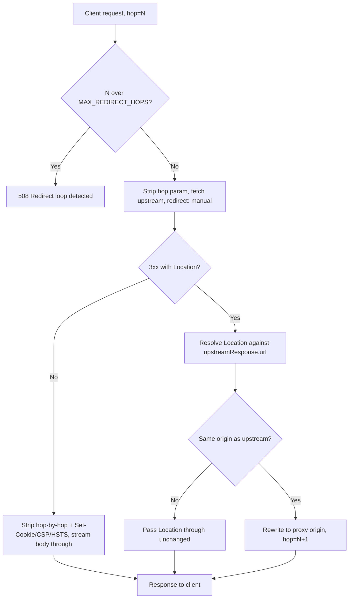

## 概要

リバースプロキシ Worker は、デプロイ時に固定された 1 つのアップストリームオリジンの前に立ち、各リクエストをそこへ転送する -- 途中で必要な書き換えを行い、クライアントには常にプロキシ自身のホスト名だけが見えるようにする。この「デプロイ時に固定」という条件は付け足しではない。これがこのレシピ全体が拠って立つ安全性モデルそのものであり、その理由は次のセクションで説明する。

このWorkerを通るすべてのリクエストは 2 つのレグを横断し、それぞれに独自の処理パスが必要だ。

- **リクエストレグ** -- クライアントから Worker、Worker からアップストリームへ。ホップバイホップヘッダーが取り除かれ、アウトバウンドの送信先は固定されたアップストリームオリジンから組み立てられ、ボディは読まれることなくストリームで通過する。
- **レスポンスレグ** -- アップストリームから Worker、Worker からクライアントへ。ホップバイホップヘッダーが再び取り除かれ（アップストリーム自身の `Connection` ヘッダーから計算される、また別の集合だ）、いくつかのセキュリティ / セッションヘッダーが意図的なトラストモデルの選択として取り除かれ、ボディはやはり読まれることなくストリームで返る。

このレシピは両方のレグを組み立て、そのうえに手動リダイレクト処理、キャッシュ、そして実トラフィックを通したときに実際に表面化する 2 つのトラップを重ねていく。

## 固定ターゲットであって URL リライターではない

以下のすべては `UPSTREAM_ORIGIN` が固定値 -- デプロイ時に設定される環境変数やバインディング -- であり、受信リクエストから導出される値（クエリパラメータ、ヘッダー、デコードしてホスト名になるパスセグメント）では決してないことを前提にしている。

:::danger[呼び出し元が制御できるターゲットは、このレシピを SSRF ベクタに変えてしまう]
アップストリームオリジンが呼び出し元が影響を与えられる何かから来た瞬間、これはリバースプロキシではなくなり、[SSRF とリダイレクト安全性](./ssrf-and-redirect-safety.mdx)が扱っているのとまったく同じアウトバウンド fetch の問題になる -- 渡された URL であれば何でも fetch してしまう Worker、自分自身のインフラやクラウドメタデータエンドポイントも含めてだ。プロダクトが本当に呼び出し元が指定するターゲットへプロキシする必要があるなら、代わりにそのレシピのブロックリストまたは allowlist ガードから始めるべきだ -- 以下のリダイレクト処理を含め、ここでの内容はすべてターゲットがすでに分かっていて信頼できるものであることを前提にしている。
:::

## 両方のレグでのヘッダー衛生

### 静的なリスト

RFC 9110 は、固定された一群のヘッダーを **ホップバイホップ** と定めている。それが到達した単一のコネクションでのみ意味を持ち、中継者が次のホップへ転送すべきものでは決してない。

| ヘッダー | ホップバイホップである理由 |
| --- | --- |
| `Connection` | このコネクション自身の制御トークンを名指しする -- 詳細は以下 |
| `Keep-Alive` | このホップだけのコネクション管理パラメータ |
| `Proxy-Authenticate` | このクライアントとこのプロキシの間の認証チャレンジ |
| `Proxy-Authorization` | このプロキシ向けの資格情報であり、次のプロキシ向けではない |
| `TE` | このホップが受け入れる意思のある転送コーディング |
| `Trailer` | このホップのフレーミングにおけるトレーラーフィールドを告知する |
| `Transfer-Encoding` | このホップのワイヤーフレーミングを表すものであり、メッセージボディではない |
| `Upgrade` | このコネクションだけのプロトコルアップグレード |

### ほとんどのプロキシが見落とす部分：Connection によって指名されるヘッダー

上の静的なリストが全体像ではない。RFC 9110 §7.6.1 は、どちらの側も `Connection` ヘッダー自体にヘッダー名を列挙することで、1 つの特定のメッセージに限って **追加の** ヘッダーをホップバイホップとして指名できるとしている -- `Connection: close, X-Internal-Trace` は、`X-Internal-Trace` が `Connection` や `TE` とまったく同じくメッセージローカルであることを意味しており、転送する中継者はそれも取り除かなければならない。上の静的なリストのどこにも載っていないにもかかわらずだ。

```typescript
// Static hop-by-hop headers per RFC 9110 §7.6.1 -- meaningful only for a
// single connection, never forwarded by an intermediary.
const STATIC_HOP_BY_HOP_HEADERS = [
  "connection",
  "keep-alive",
  "proxy-authenticate",
  "proxy-authorization",
  "te",
  "trailer",
  "transfer-encoding",
  "upgrade",
];

/**
 * Strip hop-by-hop headers before forwarding a message to the next hop.
 * Applied to both legs: once on the request on its way to the upstream,
 * once on the response on its way back to the client.
 */
function stripHopByHopHeaders(headers: Headers): Headers {
  const result = new Headers(headers);

  // Connection can nominate EXTRA headers as hop-by-hop for this message
  // only -- e.g. `Connection: close, X-Internal-Trace`. Those named headers
  // are just as message-local as the static list and must be stripped too.
  const nominated = (headers.get("connection") ?? "")
    .split(",")
    .map((name) => name.trim().toLowerCase())
    .filter(Boolean);

  for (const name of [...STATIC_HOP_BY_HOP_HEADERS, ...nominated]) {
    result.delete(name);
  }

  return result;
}
```

これをアウトバウンド `fetch()` の前にリクエストのヘッダーに対して 1 回、クライアントへのレスポンスを組み立てる前にアップストリームのレスポンスのヘッダーに対してもう 1 回実行する -- クライアントが送ってきた `Connection` ヘッダーとアップストリームが返してきたそれとでは、指名する追加の名前がまったく異なりうるので、1 つの共有ストリップリストではなく、各レグごとに独自のパスが必要だ。

## アウトバウンドリクエストの構築

```typescript
const upstreamTarget = new URL(requestUrl.pathname + requestUrl.search, env.UPSTREAM_ORIGIN);

const upstreamResponse = await fetch(upstreamTarget, {
  method: request.method,
  headers: stripHopByHopHeaders(request.headers),
  body: request.body, // streamed through unread -- see "Pass-Through Body Rule" below
  redirect: "manual", // see "Manual Redirects" below
});
```

最初の実装でつまずきがちな点がいくつかある。

- **クライアントの `Host` ヘッダーは転送できないし、その必要もない。** `Host` は Fetch API における禁止ヘッダー名だ -- Workers は fetch の送信先 URL からそれを導出し、明示的に設定しようとしても黙って無視される。固定アップストリームプロキシの要点は、アウトバウンドリクエストが常に `env.UPSTREAM_ORIGIN` を宛先にすることなので、正しいアウトバウンドの `Host` はそのオリジンのホスト名そのものであり、転送すべきものは何もない。アップストリーム側の下流コードがクライアントが接続してきた本来の公開ホスト名を知る必要があるなら、`Host` をめぐってランタイムと争う代わりに、`X-Forwarded-Host`（および `X-Forwarded-Proto`、`X-Forwarded-For`）として明示的に送るべきだ。
- **`duplex` オプションは不要。** ブラウザや Node の `fetch()` はボディが `ReadableStream` の場合に `duplex: "half"` を要求するが、Workers の `fetch()` にはその要件がないので、`body: request.body` はストリーミングリクエストボディに対してそのまま動作する。

## 手動リダイレクト：Location の書き換えとチェーンの上限設定

`fetch()` をデフォルトの `redirect: "follow"` のままにしておくと、リダイレクトチェーン全体をランタイムに渡してしまい、最終レスポンスだけが返る -- クライアントは途中の 3xx を一切見ることがなく、プロキシにも `Location` を書き換える機会が与えられないまま、まだプロキシと話していると思っているブラウザにアップストリームの本当のホスト名が漏れてしまうことになる。`redirect: "manual"` を指定することで、各ホップがそれ自身の `Response` として可視化されるので、プロキシはクライアントに何を見せるか決める前にそれを書き換えられる。

### 相対値を解決し、オリジンを書き換える

`Location` の値は相対の場合があり、それはそれを運んできたレスポンスに対して解決される -- 元のリクエスト URL に対してではない。元のリクエスト URL は、それより前の同一オリジンのホップを経た後では違う値になっていることがある。

```typescript
const MAX_REDIRECT_HOPS = 5;
const HOP_COUNT_PARAM = "__proxy_hop";

function rewriteLocationForClient(
  location: string,
  upstreamResponseUrl: string,
  upstreamOrigin: string,
  proxyOrigin: string,
  hopCount: number,
): string {
  // Relative Location values resolve against the response that carried
  // them, per RFC 9110 §10.2.2 -- never against the original request URL.
  const target = new URL(location, upstreamResponseUrl);

  if (target.origin !== upstreamOrigin) {
    // Left the fixed, configured upstream entirely -- outside this
    // recipe's trust model (see "Fixed Target" above), but not necessarily
    // wrong: an OAuth callback or a payment redirect legitimately leaves
    // the proxied origin. Pass it through unchanged rather than rewriting
    // a host nobody configured this proxy to serve.
    return target.href;
  }

  // Same-origin hop: rewrite so the client keeps talking to the proxy's
  // own public hostname, never the upstream's real one.
  const rewritten = new URL(target.pathname + target.search + target.hash, proxyOrigin);
  rewritten.searchParams.set(HOP_COUNT_PARAM, String(hopCount + 1));
  return rewritten.href;
}
```

### チェーンの上限は 1 回の fetch 呼び出しの中ではなく、複数回にまたがって設定する

これは [SSRF とリダイレクト安全性](./ssrf-and-redirect-safety.mdx#ホップごとのリダイレクト再チェック)のホップごとのリダイレクト再チェックとは異なる種類のループ上限問題だ。あのガードは **1 回の `fetch()` 呼び出しの中で** ループする。ターゲットが信頼できないため、コードがさらに追跡する前に各ホップを再検証しなければならないからだ。ここではアップストリームは固定されていて信頼できるが、プロキシは各リダイレクトを自分で追跡するのではなく、そのままクライアントへ返す -- つまりチェーンは **複数の独立したクライアントの往復** をまたぐ。ブラウザは書き換えられた `Location` を追ってプロキシへ戻ってきて、新しい、状態を持たない Worker の呼び出しがそれを処理する。それより前に何ホップあったかの記憶は一切ない。両者の間で生き残るインメモリのカウンタは存在しない。

その解決策は、生き残る場所にホップ数を持たせることだ。つまりリダイレクト URL 自体の中にだ。上の `rewriteLocationForClient` は、同一オリジンへの書き換えのたびに `HOP_COUNT_PARAM` を付加する。ハンドラーは受信リクエストからそれを読み戻し、`MAX_REDIRECT_HOPS` を超えて続行することを拒否する。

```typescript
function currentHopCount(url: URL): number {
  const raw = url.searchParams.get(HOP_COUNT_PARAM);
  const parsed = raw ? Number.parseInt(raw, 10) : 0;
  return Number.isFinite(parsed) && parsed >= 0 ? parsed : 0;
}
```

このカウンタはプロキシ内部の帳簿であり -- ホップバイホップヘッダーがホップを越える前に取り除かれるのと同じように、アップストリームへ届く前に URL から取り除く。



## レスポンスレグ：Cookie、CSP、HSTS はトラストモデルの選択だ

`Set-Cookie`、`Content-Security-Policy`（およびその `-Report-Only` 版）、`Strict-Transport-Security` はいずれも特定のオリジンのアイデンティティへの信頼を表現している -- そしてこのプロキシがアップストリームのコンテンツを自分自身の公開ホスト名の下で配信するようになった瞬間、そのアイデンティティはもはやアップストリームのものではなくなる。これらのヘッダーを無修正で転送することは、実装の詳細を漏らすリスクがあるだけでなく、積極的に間違っていることさえある。

- **`Set-Cookie`** -- アップストリームが明示的な `Domain` なしで設定した cookie はホスト限定であり、アップストリームの正確なホスト名に紐付いている。プロキシのホスト名としか話さないクライアントへそのまま転送すると、ブラウザは実際には一切接続することのないドメインに紐付いた cookie を保存する（あるいは黙って破棄する）-- 何も役に立たないうえ、cookie 自体にアップストリームの本当のホスト名を漏らしてしまうことさえある。
- **`Content-Security-Policy`** -- アップストリーム自身のホスト名向けに書かれたポリシー（`script-src 'self' https://upstream-actual-host.example`）は、同じバイト列がプロキシのホスト名から配信されるようになった途端にマッチしなくなる。`'self'` は、ポリシーの作者が想定していたのとは別のオリジンを指すようになる。
- **`Strict-Transport-Security`** -- ブラウザは HSTS を、ヘッダーの作者ではなく、実際にレスポンスを返したオリジンに紐付ける。これを無修正で転送すると、*プロキシの* ドメイン（`includeSubDomains` が設定されていればすべてのサブドメインも含めて）が、アップストリームがそのドメイン向けにはまったく意図していなかったヘッダーによって、すべての訪問者のブラウザで HSTS ピン留めされてしまう。

このレシピのデフォルトは、この 3 つすべてを `Content-Security-Policy-Report-Only` とともに取り除き、アップストリームが何を送ってこようと関係なく、プロキシ自身のオリジンをセッション状態とセキュリティポリシーの権威として扱うことだ。

```typescript
// Response headers this recipe never forwards -- each one is a
// trust-boundary decision, not routine hygiene. See "The Response Leg" above.
const STRIPPED_RESPONSE_HEADERS = [
  "set-cookie",
  "content-security-policy",
  "content-security-policy-report-only",
  "strict-transport-security",
];
```

:::note[これはこのレシピのトラストモデルであり、普遍的なプロキシのルールではない]
プロキシとアップストリームが別々のトラストバウンダリである場合 -- これがよくあるケースであり、このレシピが想定しているケースだ -- この 3 つを取り除くのが正しいデフォルトだ。プロキシが意図的に透過的である場合 -- 自分でも管理しているサービスの前段に置く内部ロードバランサーで、アップストリームの cookie や CSP が公開ドメインにそのまま適用されることが意図されている場合 -- は逆に、それらをそのまま転送する（あるいは丸ごと取り除くのではなく、`Domain` と CSP のホスト参照をプロキシのホスト名に合わせて書き換える）のが正しい選択になる。セッションがこのホップを越えて生き残る必要があるなら、[HTTP-Only Cookie セッション](./cookie-sessions.mdx)がその `Set-Cookie` の書き換えを手作業で行う方法を扱っている。
:::

## パススルーボディのルールと workerd の Content-Encoding トラップ

### 必要のないものは読まない

アップストリームのレスポンスボディを絶対にバッファしないこと -- `.text()`、`.json()`、`.arrayBuffer()` はもちろん、ロギングのために `TransformStream` に通すことも避ける -- レシピが本当にそれを変換する必要がある場合を除いてだ。`upstreamResponse.body` が触られることなくそのままストリームで通過する限り、Cloudflare が文書化しているパススルー最適化が適用される。何もデコードされず、何も再圧縮されず、`Content-Encoding` はワイヤー上のバイト列をそのまま正確に表し続ける。

```typescript
function buildClientResponse(upstreamResponse: Response): Response {
  const headers = stripHopByHopHeaders(upstreamResponse.headers);
  for (const name of STRIPPED_RESPONSE_HEADERS) headers.delete(name);

  // Stream the body through unread -- see below for what happens the
  // moment something reads it instead.
  return new Response(upstreamResponse.body, {
    status: upstreamResponse.status,
    statusText: upstreamResponse.statusText,
    headers,
  });
}
```

### トラップ：workerd はボディをデコードした後に Content-Encoding を更新しない

[`workerd#5112`](https://github.com/cloudflare/workerd/issues/5112) が正確にこれを追跡している。圧縮された `fetch()` のレスポンスボディを JavaScript から読むと、workerd は **デコード済み** のバイト列を返す -- Fetch 仕様がそう要求しているからだ -- が、`Response` オブジェクトの `Content-Encoding` は `gzip`（あるいは元のエンコーディングが何であれ）のままにしておく。仕様がそれを取り除くべきだとはどこにも書いていないからだ。下流のコードがそのヘッダーを、自分が組み合わせようとしているボディがすでにプレーンであると知らないまま新しい `Response` にコピーしてしまうと、クライアントはデコード済みのバイト列を「まだ圧縮されている」というラベル付きで受け取ることになり、クライアント自身のデコーダーは、そもそも gzip ではなかったデータを前にして詰まってしまう。

この issue に対する Cloudflare のメンテナー自身の回答は、その位置づけを理解するためにぜひ全文を読む価値がある。これは修正すべき workerd のバグではなく仕様準拠の挙動であり、プロダクションでは同じようには再現しない。というのも、Cloudflare のエッジ（FL）がすべての Worker の手前で独自のデコンプレッションパスを一貫したヘッダー処理とともに実行しているからだ -- `wrangler dev` の下で実際に動いている `workerd` にはそのレイヤーがない。このギャップこそが、開発中にこのトラップが見逃されやすい理由だ。ボディを読むプロキシは -- `response.clone().text()` を呼ぶだけのささやかなデバッグログであっても -- ローカルでは正しく見えてプロダクションで不一致を起こすことも、あるいはその逆もありうる。どちらのエンコーディングが関わっているか、そもそも読み込みが発生するかどうかによって変わる。

このレシピが従うルールはこうだ。どの環境であれ、何かが JavaScript を通じて `response.body` を読んだ瞬間、そのレスポンスの `Content-Encoding` はもう自分が手にしているバイト列を正しく表しているとは信頼できなくなる。読んだものを転送する前にヘッダーを削除する（デコード済みのバイト列を非圧縮のまま再配信するなら正しい）か、自分で圧縮して実際に送るものに合わせて `Content-Encoding` を設定するかのどちらかにすること -- ボディを一度でも触った後は、`fetch()` から得たヘッダーを未検査のまま転送してはいけない。同じ状況では `Content-Length` も落とすこと。元の値はアップストリームのエンコード済みバイト数を数えたものであり、今送ろうとしているものとは違う。

## エッジキャッシュ：cacheEverything は共有キャッシュであり、プライベートなものではない

Cloudflare の fetch 時オプション `cf.cacheEverything` は、アップストリーム自身の `Cache-Control` がキャッシュするなと言っていても、アップストリームのレスポンスを Cloudflare のエッジでキャッシュする -- キャッシュヘッダーの規律が保たれていない、あるいは自分で管理していないアップストリームの前段では便利だ。しかしここでの「キャッシュ」とは Cloudflare の **共有** エッジキャッシュを意味する。同じキャッシュされたオブジェクトが、同じ PoP で同じキャッシュキーにヒットしたすべての訪問者に対して配信される。ブラウザキャッシュのような、訪問者ごとのプライベートなキャッシュではない。

そこから譲れない帰結が 1 つ導かれる。**`Authorization` または `Cookie` を伴ったリクエストへのレスポンスは決してキャッシュしないこと。** それをしてしまうと、最初の訪問者の認証済みまたはパーソナライズされたレスポンスが、キャッシュエントリが生きている限り、2 番目の訪問者のレスポンスにもなってしまう -- アップストリーム自身の `Cache-Control` が何と言っていようと関係なく、単純明快なユーザー間データ漏洩だ。

```typescript
function isCacheableRequest(request: Request): boolean {
  return (
    (request.method === "GET" || request.method === "HEAD") &&
    !request.headers.has("authorization") &&
    !request.headers.has("cookie")
  );
}
```

```typescript
const upstreamResponse = await fetch(upstreamTarget, {
  method: request.method,
  headers: stripHopByHopHeaders(request.headers),
  body: request.body,
  redirect: "manual",
  cf: isCacheableRequest(request)
    ? { cacheEverything: true, cacheTtl: 300 }
    : { cacheTtl: 0 },
});
```

:::warning[デフォルトのキャッシュキーは、レスポンスが他に何によって変化するかを知らない]
上のチェックは、キャッシュが資格情報の漏洩に変わる唯一のケースを防ぐものだ。それはすべてのレスポンスに対してキャッシュを安全にするわけではない。Cloudflare のデフォルトのキャッシュキーは URL から導出されるものであり、`Accept-Language` や、モバイル / デスクトップを分ける `User-Agent`、あるいはアップストリームのレスポンスが変化しうる他のどんなリクエストプロパティからも導出されない。そうした軸のどれかに沿って変化するレスポンスが、すべてのバリアントと同じキャッシュキーを共有してしまうと、一部の訪問者に間違ったコンテンツが配信される -- 漏洩ではなく正しさの問題だが、それでもバグだ。これを直すにはキャッシュキーをカスタマイズする（あるいは何らかの形で `Vary` を考慮させる）ことでアップストリームが実際に何によって変化するかを捉える必要があり、それはここでは対象外だ。
:::

## すべてを組み合わせる

```typescript
export interface Env {
  UPSTREAM_ORIGIN: string; // fixed at deploy time -- see "Fixed Target" above
}

const REDIRECT_STATUSES = new Set([301, 302, 303, 307, 308]);

export default {
  async fetch(request: Request, env: Env): Promise<Response> {
    const upstreamOrigin = new URL(env.UPSTREAM_ORIGIN).origin;
    const requestUrl = new URL(request.url);

    const hopCount = currentHopCount(requestUrl);
    if (hopCount > MAX_REDIRECT_HOPS) {
      return new Response("Redirect loop detected", { status: 508 });
    }

    // Hop counter is this proxy's own bookkeeping -- never forward it upstream.
    requestUrl.searchParams.delete(HOP_COUNT_PARAM);
    const upstreamTarget = new URL(requestUrl.pathname + requestUrl.search, env.UPSTREAM_ORIGIN);

    const upstreamResponse = await fetch(upstreamTarget, {
      method: request.method,
      headers: stripHopByHopHeaders(request.headers),
      body: request.body,
      redirect: "manual",
      cf: isCacheableRequest(request)
        ? { cacheEverything: true, cacheTtl: 300 }
        : { cacheTtl: 0 },
    });

    const location = upstreamResponse.headers.get("location");
    if (REDIRECT_STATUSES.has(upstreamResponse.status) && location) {
      const rewritten = rewriteLocationForClient(
        location,
        upstreamResponse.url,
        upstreamOrigin,
        requestUrl.origin,
        hopCount,
      );
      const headers = stripHopByHopHeaders(upstreamResponse.headers);
      for (const name of STRIPPED_RESPONSE_HEADERS) headers.delete(name);
      headers.set("location", rewritten);
      return new Response(null, { status: upstreamResponse.status, headers });
    }

    return buildClientResponse(upstreamResponse);
  },
};
```

## 関連

- [SSRF とリダイレクト安全性](./ssrf-and-redirect-safety.mdx) -- 固定ではなく呼び出し元が指定するターゲットという別のケース向けの、アウトバウンド fetch ガードとリダイレクト先サニタイザー。
- [HTTP-Only Cookie セッション](./cookie-sessions.mdx) -- セッション cookie がこのホップを越えて生き残る必要がある場合に、取り除く代わりに使う手作業の `Set-Cookie` パースとシリアライズ。
- [スタンドアロン Workers](../workers/standalone-workers.mdx) -- このようなプロキシ Worker が独立したデプロイ対象プロジェクトとして収まる場所。
