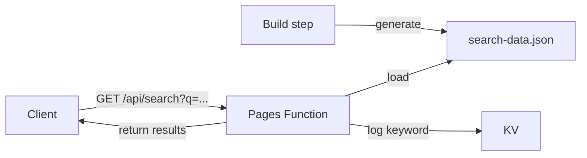

## アーキテクチャ

以下を使った検索 API パターン：

- **ビルド時のインデックス生成**: ビルドステップで検索インデックス JSON を生成
- **Pages Function**: MiniSearch を使ってランタイムで検索クエリを処理
- **KV ロギング**: 分析のために検索キーワードを KV に記録



## ビルド時のインデックス生成

ビルド中に検索インデックスを生成します：

```javascript
// scripts/generate-search-index.mjs
import MiniSearch from 'minisearch';
import fs from 'fs';

const documents = loadDocuments(); // ドキュメント読み込みロジック

const miniSearch = new MiniSearch({
  fields: ['title', 'description', 'content'],
  storeFields: ['title', 'description', 'slug', 'createdAt'],
});

miniSearch.addAll(documents);

fs.writeFileSync(
  'functions/pj/my-site/api/search-data.json',
  JSON.stringify(documents) // 生ドキュメントを保存、MiniSearch はランタイムでインデックス化
);
```

## Pages Function

```typescript
// functions/pj/my-site/api/search.ts
import MiniSearch from 'minisearch';
// @ts-expect-error JSON import bundled by esbuild
import searchData from './search-data.json';

interface Env {
  KEYWORD_LOGS: KVNamespace;
}

let searchIndex: MiniSearch | null = null;

function getSearchIndex(): MiniSearch {
  if (!searchIndex) {
    searchIndex = new MiniSearch({
      fields: ['title', 'description', 'content'],
      storeFields: ['title', 'description', 'slug', 'createdAt'],
    });
    searchIndex.addAll(searchData);
  }
  return searchIndex;
}

export const onRequestGet: PagesFunction<Env> = async (context) => {
  const url = new URL(context.request.url);
  const query = url.searchParams.get("q")?.trim();

  if (!query) {
    return new Response(JSON.stringify({ results: [] }), {
      headers: { "Content-Type": "application/json" },
    });
  }

  // キーワードを非同期でログ
  const logKey = `search:${Date.now()}:${crypto.randomUUID()}`;
  context.waitUntil(
    context.env.KEYWORD_LOGS.put(logKey, JSON.stringify({
      query,
      timestamp: new Date().toISOString(),
    }), { expirationTtl: 86400 * 30 })
  );

  const index = getSearchIndex();
  const results = index.search(query, { fuzzy: 0.2 });

  return new Response(JSON.stringify({ results }), {
    headers: { "Content-Type": "application/json" },
  });
};
```

## Wrangler 設定

```toml
compatibility_date = "2024-12-01"

[[kv_namespaces]]
binding = "KEYWORD_LOGS"
id = "your-kv-namespace-id"
```

## CI での注意点

関数はランタイムで `minisearch` をインポートします。デプロイ前にインストールされていることを確認してください：

```yaml
- name: Install function dependencies
  run: pnpm add -w minisearch

- name: Deploy
  run: pnpm dlx wrangler@4 pages deploy deploy --project-name=my-site
```
