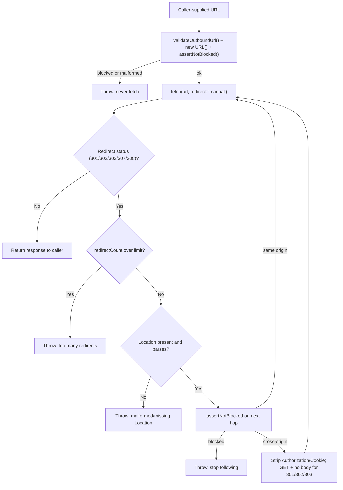

## 概要

Worker が自分で選んだわけではない URL を扱うとき、関連しつつも別々の 2 つのリスクが出てくる。

- **サーバーサイドリクエストフォージェリ（SSRF）:** Worker が、信頼できない呼び出し元から全体または一部を渡された URL に対して **アウトバウンド** の `fetch()` を実行するケース。ウェブフック送信先、リンクプレビュー生成、「URL からインポート」機能などが典型例。この fetch が自分自身のインフラやクラウドメタデータエンドポイントを向いてしまうと、Worker は呼び出し元が直接到達できないものへ到達するためのプロキシになってしまう。
- **オープンリダイレクト / レスポンス分割:** Worker が信頼できない値 -- ログイン後の `?next=` や `?returnTo=` クエリパラメータが典型例 -- を読み取り、それをブラウザへ送るリダイレクト先としてそのまま返してしまうケース。ここを誤ると、Worker は攻撃者のサイトへの信頼された見た目のバウンス台になったり、さらには自分自身のレスポンスに余分な HTTP ヘッダーを注入する手段になったりする。

このレシピは両方を扱う。完全な文字列ブロックリストとホップごとの再チェックを持つアウトバウンド fetch ガードと、パーセントエンコーディングのトリック・バックスラッシュ・CRLF インジェクションを耐え抜くリダイレクト先サニタイザーだ。

## パート 1: SSRF ガード

### 文字列ブロックリストにできること、できないこと

以下のガードは、対象 URL の **ホスト名** が -- URL に書かれた文字どおりの形で -- 既知の危険な値、つまりループバックアドレス、プライベートレンジ、クラウドメタデータエンドポイント、そしてそれらを見慣れない構文の裏に隠すいくつかのエンコーディングトリックのいずれかに一致する場合、`fetch()` が実行される前に拒否する。

:::danger[ブロックリストがチェックするのは文字列であり、fetch() が実際に接続するアドレスではない]
以下のチェックは `url.hostname` -- ネットワーク通信が起こる前に URL から解析された文字列 -- に対して実行される。DNS 解決は基盤の `fetch()` 実装の内部で起こるものであり、このチェックからは見えない。`attacker-controlled.example` のようなホスト名自体はどのブロックリストにも載っていない。もしこれが `169.254.169.254` に解決するなら -- それがチェック実行時点で真であっても、あるいは TTL 失効後の DNS リバインディングによって後から真になるのであっても -- ブロックリストにはそれについて言えることが何もない。そもそも捕まえるべき「ブロック対象の文字列」が URL 内に存在しなかったからだ。

**正当な到達先の集合があらかじめ分かっている場合 -- 固定されたウェブフックプロバイダーのリスト、少数の内部サービスなど -- その固定集合に対してチェックするホスト名または URL の ALLOWLIST の方が強いパターンであり、このギャップを完全に塞ぐ。** 以下のブロックリストに頼るのは、プロダクトが本当に任意のユーザー指定 URL を受け付ける必要があり、allowlist が現実的でない場合に限るべきだ。
:::

### ブロックリスト

| ブロック対象の値 | 理由 |
| --- | --- |
| `localhost`（ホスト名）と `127.0.0.0/8`（その IPv4 ループバックレンジ） | ループバック -- Worker 自身のランタイムや同居するサービスへ到達する |
| `0.0.0.0/8`（ベアな `http://0/` を含む） | IPv4 の未指定アドレス -- 多くのネットワークスタックではこれがローカル、つまり「このホスト自身」に解決される、ループバックと同じ種類の到達先だ。`new URL()` はベアな数値リテラル `0` を `0.0.0.0` に正規化するので、`http://0/` はドット区切り 10 進の IP を一切書かずにこのレンジへ到達する |
| `10.0.0.0/8`、`172.16.0.0/12`、`192.168.0.0/16` | RFC 1918 プライベートアドレスレンジ |
| `169.254.0.0/16`（`169.254.169.254` を含む） | リンクローカルレンジ。`169.254.169.254` は特に、AWS・GCP・Azure でよく知られたクラウドインスタンスメタデータエンドポイント |
| `::1` | IPv6 ループバック |
| `::` | IPv6 の未指定アドレス -- 上の `0.0.0.0` の IPv6 版 |
| `fc00::/7` | IPv6 ユニークローカルアドレス（ULA）レンジ -- RFC 1918 の IPv6 版 |
| `fe80::/10` | IPv6 リンクローカルレンジ |
| `::ffff:a.b.c.d`（IPv4 射影 IPv6） | IPv6 構文で包まれた IPv4 アドレス -- 別のアドレスファミリーとして扱うのではなく、包みを解いて再チェックする必要がある |
| `64:ff9b::/96`（NAT64 well-known プレフィックス） | こちらも下位 32 ビットに IPv4 アドレスを埋め込んでいる -- 同じく包みを解いての再チェックが必要 |
| ベア整数ホスト、10 進 / 16 進 / 8 進（`http://2130706433/`、`http://0x7f000001/`、`http://017700000001/`） | いずれも `127.0.0.1` として有効な URL 構文 -- 詳細は以下で説明する |

### まず正規化する。生の文字列を自分でパースしてはいけない

上のチェックはすべて、生の入力文字列ではなく `new URL()` の出力に対して実行しなければならない。`new URL()` は WHATWG URL Standard を実装しており、これは Workers・ブラウザ・Node が共有する同じパーサーで、ホスト名がコードに渡ってくる前に、面倒な正規化作業の大半をすでに済ませてくれる。

```typescript
new URL("http://trusted.example@evil.example/").hostname; // "evil.example" -- userinfo stripped from the host
new URL("http://[::FFFF:127.0.0.1]/").hostname; // "[::ffff:7f00:1]" -- IPv4-mapped, canonical hex form
new URL("http://2130706433/").hostname; // "127.0.0.1" -- bare decimal integer
new URL("http://0x7f000001/").hostname; // "127.0.0.1" -- bare hex integer
new URL("http://017700000001/").hostname; // "127.0.0.1" -- bare octal integer
new URL("http://127.1/").hostname; // "127.0.0.1" -- shorthand IPv4
new URL("http://0/").hostname; // "0.0.0.0" -- bare zero, the unspecified address
```

最後のブロックが、ブロックリスト表のベア整数ホストの行が重要である理由だ。`2130706433`、`0x7f000001`、`017700000001` はいずれも `127.0.0.1` として有効な URL ホスト構文であり、`new URL()` はそのすべてを同じ正規のドット区切り 10 進文字列へ畳み込む。`/^(\d{1,3}\.){3}\d{1,3}$/` のようなドット区切り 10 進の正規表現を **生の未パース** ホスト文字列に対して素朴に実行するガードは、`2130706433` に対して一切マッチしない -- 拒否もされず、範囲チェックすべき IP リテラルとしても認識されず、普通のホスト名であるかのようにすり抜けてしまう。まず `new URL()` を呼び出してから `.hostname` をチェックすることで、このギャップは構造的に塞がれる。コードがそれを見る時点で、これらの形式はすべてすでに `127.0.0.1` になっているからだ。

`new URL()` が **やらない** 正規化が 1 つある。普通のホスト名の末尾のドットはそのまま残す。

```typescript
new URL("http://LOCALHOST./").hostname; // "localhost." -- not "localhost"
```

DNS は `example.com.` と `example.com` を同じ完全修飾名として扱うため、文字列 `"localhost"` に完全一致するチェックだけでは `"localhost."` を見逃す。以下のガードは、`new URL()` がすでに提供する正規化に加えて、末尾のドットを取り除くことをそれ自体の正規化ステップとして明示的に行う。

### ガードの実装

```typescript
interface Ipv4Range {
  base: string;
  bits: number;
}

// Literal ranges rejected outright. These are the forms an attacker can put
// directly in a URL -- a DNS name that later resolves to one of these is a
// different problem, covered above.
const BLOCKED_IPV4_RANGES: Ipv4Range[] = [
  { base: "0.0.0.0", bits: 8 }, // unspecified -- many stacks route this to "this host"
  { base: "127.0.0.0", bits: 8 }, // loopback
  { base: "10.0.0.0", bits: 8 }, // RFC1918 private
  { base: "172.16.0.0", bits: 12 }, // RFC1918 private
  { base: "192.168.0.0", bits: 16 }, // RFC1918 private
  { base: "169.254.0.0", bits: 16 }, // link-local, incl. 169.254.169.254 cloud metadata
];

// Prefix (first 6 groups of 8) an IPv4-mapped or NAT64 IPv6 address must
// match. The final 2 groups carry the embedded IPv4 address in both cases.
const IPV4_MAPPED_PREFIX = [0, 0, 0, 0, 0, 0xffff];
const NAT64_WELL_KNOWN_PREFIX = [0x64, 0xff9b, 0, 0, 0, 0];

function ipv4ToInt(ip: string): number | null {
  const parts = ip.split(".");
  if (parts.length !== 4) return null;
  let n = 0;
  for (const part of parts) {
    // Canonical decimal octet only -- no leading zeros, no hex, no whitespace.
    if (!/^(25[0-5]|2[0-4]\d|1\d\d|[1-9]?\d)$/.test(part)) return null;
    n = (n << 8) | Number(part);
  }
  return n >>> 0;
}

function isBlockedIpv4(ip: string): boolean {
  const target = ipv4ToInt(ip);
  if (target === null) return false;
  return BLOCKED_IPV4_RANGES.some(({ base, bits }) => {
    const baseInt = ipv4ToInt(base)!;
    const mask = bits === 0 ? 0 : (~0 << (32 - bits)) >>> 0;
    return (target & mask) === (baseInt & mask);
  });
}

// Expand a bracketed, "::"-compressed IPv6 literal (exactly what url.hostname
// produces) into its 8 16-bit groups. Returns null if it does not parse.
function expandIpv6(hostname: string): number[] | null {
  const inner = hostname.replace(/^\[|\]$/g, "");
  const parts = inner.split("::");
  if (parts.length > 2) return null; // more than one "::" is not valid IPv6

  const toGroups = (s: string) => (s === "" ? [] : s.split(":").map((h) => parseInt(h, 16)));
  const head = toGroups(parts[0]);
  const tail = parts.length === 2 ? toGroups(parts[1]) : [];
  if (head.some(Number.isNaN) || tail.some(Number.isNaN)) return null;

  if (parts.length === 1) {
    return head.length === 8 ? head : null;
  }
  const zeros = 8 - head.length - tail.length;
  return zeros >= 0 ? [...head, ...Array(zeros).fill(0), ...tail] : null;
}

// If `groups` starts with `prefix`, extract the last 2 groups as an IPv4
// address. Used for both IPv4-mapped (::ffff:a.b.c.d) and NAT64 (64:ff9b::/96).
function unwrapEmbeddedIpv4(groups: number[], prefix: number[]): string | null {
  if (groups.length !== 8 || !prefix.every((g, i) => groups[i] === g)) return null;
  const hi = groups[6];
  const lo = groups[7];
  return [(hi >> 8) & 0xff, hi & 0xff, (lo >> 8) & 0xff, lo & 0xff].join(".");
}

function isBlockedHost(hostname: string): boolean {
  // Strip a trailing dot -- new URL() does not do this, and DNS treats
  // "example.com." and "example.com" as the same name.
  const host = hostname.replace(/\.$/, "");

  if (host === "localhost") return true;
  if (isBlockedIpv4(host)) return true;

  if (host.startsWith("[") && host.endsWith("]")) {
    const groups = expandIpv6(host);
    if (!groups) return true; // unparsable IPv6 literal -- fail closed

    if (groups.every((g) => g === 0)) return true; // :: unspecified address
    if (groups.every((g, i) => g === (i === 7 ? 1 : 0))) return true; // ::1
    if ((groups[0] & 0xfe00) === 0xfc00) return true; // fc00::/7 ULA
    if ((groups[0] & 0xffc0) === 0xfe80) return true; // fe80::/10 link-local

    // Unwrap first so a bypass can't hide behind either encoding, then
    // reject the encoding outright -- a legitimate outbound URL has no
    // reason to arrive as an IPv4-mapped or NAT64 IPv6 literal at all.
    if (unwrapEmbeddedIpv4(groups, IPV4_MAPPED_PREFIX)) return true;
    if (unwrapEmbeddedIpv4(groups, NAT64_WELL_KNOWN_PREFIX)) return true;
  }

  return false;
}

function assertNotBlocked(url: URL): void {
  if (url.protocol !== "http:" && url.protocol !== "https:") {
    throw new Error(`SSRF guard: unsupported protocol ${url.protocol}`);
  }
  if (isBlockedHost(url.hostname)) {
    throw new Error(`SSRF guard: blocked host ${url.hostname}`);
  }
}

function validateOutboundUrl(input: string): string {
  let url: URL;
  try {
    url = new URL(input);
  } catch {
    throw new Error(`SSRF guard: malformed URL: ${input}`);
  }
  assertNotBlocked(url);
  return url.href;
}
```

### ホップごとのリダイレクト再チェック

エントリ URL のチェックだけでは足りない。チェックを通過した URL であっても、`http://169.254.169.254/latest/meta-data/` へ 302 することはあり得る -- そして `fetch()` はデフォルトでリダイレクトを内部で自動的に追跡してしまい、周りに書いたどんなガードコードからも見えなくなる。

:::warning[デフォルトの redirect: "follow" はこのガード全体を素通りさせる]
デフォルトのリダイレクトモードでは、`fetch()` がリダイレクトチェーン全体を自分で解決し、最終レスポンスだけを返す。この場合 `assertNotBlocked()` は途中のホップを一切見ることがなく、検証済みのエントリ URL がブロック対象のホストへリダイレクトしても、そのまま到達してしまう。`redirect: "manual"` を指定することで、リダイレクトが `Response` として可視化され、追跡するかどうかをコード側で判断してから決められるようになる。
:::

### クロスオリジンのホップでは元の資格情報とボディを引き継いではならない

`redirect: "manual"` はリダイレクトを可視化するだけでなく、ネイティブの `fetch()` がリダイレクトを自動で追跡するときに普段行っていることすべてからガードを外してしまう。つまり、別オリジンへ渡る際に `Authorization` と `Cookie` を取り除くことと、`301`/`302`/`303` で元のメソッドが `GET`/`HEAD` のいずれでもなかった場合にボディなしの `GET` へダウングレードすることの 2 つだ。各ホップを手動で再フェッチするガードは、この両方を自前で再実装しなければならない。さもないと `init` -- 呼び出し元が渡したもの、資格情報やボディを含めてそのまま -- が、攻撃者が選んだホップを含むすべてのホップに対してそのまま再送されてしまう。これを怠ると、検証済みのウェブフック URL が `https://attacker.example/collect` へ 302 したときに、呼び出し元自身の `Authorization` ヘッダーやセッションクッキーを攻撃者に渡してしまうことになる。

```typescript
const MAX_REDIRECTS = 5;
const REDIRECT_STATUSES = new Set([301, 302, 303, 307, 308]);

// Headers that must never cross to a different origin on a redirect --
// mirrors the Fetch standard's own cross-origin-redirect header stripping,
// which redirect: "manual" opts this guard out of.
const CROSS_ORIGIN_STRIPPED_HEADERS = ["authorization", "cookie"];

function rebuildForRedirect(init: RequestInit, status: number): RequestInit {
  const headers = new Headers(init.headers);
  for (const name of CROSS_ORIGIN_STRIPPED_HEADERS) headers.delete(name);

  const next: RequestInit = { ...init, headers };
  const method = (init.method ?? "GET").toUpperCase();

  // 301/302/303 downgrade any non-GET/HEAD method to GET and drop the body,
  // the same as a browser and native fetch() -- 307/308 preserve both by design.
  if (
    (status === 301 || status === 302 || status === 303) &&
    method !== "GET" &&
    method !== "HEAD"
  ) {
    next.method = "GET";
    next.body = undefined;
  }

  return next;
}

export async function fetchGuarded(input: string, init: RequestInit = {}): Promise<Response> {
  let currentUrl = validateOutboundUrl(input);
  let currentOrigin = new URL(currentUrl).origin;
  let currentInit = init;

  for (let redirectCount = 0; ; redirectCount++) {
    const res = await fetch(currentUrl, { ...currentInit, redirect: "manual" });

    if (!REDIRECT_STATUSES.has(res.status)) return res;

    if (redirectCount >= MAX_REDIRECTS) {
      throw new Error(`SSRF guard: exceeded ${MAX_REDIRECTS} redirects fetching ${input}`);
    }

    const location = res.headers.get("Location");
    if (!location) {
      throw new Error(`SSRF guard: redirect (${res.status}) with no Location header`);
    }

    let nextUrl: URL;
    try {
      // Resolve relative to the URL that issued this redirect, not the
      // original input -- a relative Location is relative to its own hop.
      nextUrl = new URL(location, currentUrl);
    } catch {
      throw new Error(`SSRF guard: malformed Location header: ${location}`);
    }

    assertNotBlocked(nextUrl); // same checks as the entry guard, every hop

    if (nextUrl.origin !== currentOrigin) {
      // Cross-origin hop: strip credentials and downgrade per Fetch's own
      // redirect rules before following, so a validated entry URL that
      // redirects off-origin can't hand the receiver an Authorization
      // header, a session cookie, or a POST body it was never meant to see.
      currentInit = rebuildForRedirect(currentInit, res.status);
    }

    currentUrl = nextUrl.href;
    currentOrigin = nextUrl.origin;
  }
}
```

:::tip[代替案としてクロスオリジンのリダイレクトを丸ごと拒否する方法もある]
このレシピはクロスオリジンのホップを丸ごと拒否するのではなく、リクエストを組み直す道を選んでいる。リンクプレビュー生成やウェブフック送信先ガードには、URL 短縮サービス・CDN・署名付き URL のリダイレクトなど、別ホストへのリダイレクトを追跡する正当な理由があることが多く、それらを丸ごと拒否してしまうと脅威でも何でもないリンクまでガードが拒否してしまうからだ。その代償は静かな失敗だ。クロスオリジンの到達先に到達するために本来 `Authorization` や `Cookie` が必要だった呼び出し元は、このガードからのエラーではなく、その到達先が返す未認証のレスポンスをそのまま受け取ることになる。正当なクロスオリジンの到達先があらかじめ分かっているなら、その allowlist の外にあるリダイレクトをすべて拒否する方が強い選択だ -- 上のブロックリスト自体について述べた allowlist の議論と同じことだ。
:::



最初のホップを含め、すべてのホップがまったく同じ `assertNotBlocked()` を通る。ブロックリストのロジックが存在する場所は 1 か所だけになる。クロスオリジンのホップはさらに `rebuildForRedirect()` を通るので、呼び出し元が明示的に選んだそのオリジンへ送った資格情報が、そのオリジンより先へ渡ってしまうことはない。

## パート 2: リダイレクト先サニタイザー

### 問題

「元いた場所へリダイレクトして戻す」フロー -- 最もよくあるのはログイン後の `?next=` や `?returnTo=` パラメータ -- は、呼び出し元が制御する値を読み取り、それをブラウザが追跡することになる `Location` へそのまま反映する。ここを誤る形は 2 つある。

- **オープンリダイレクト:** 値がサイト外を指しており、ログインフローが攻撃者のページへの信頼された見た目のバウンス台になってしまう。
- **レスポンス分割:** 値に、Worker 自身が送るレスポンスを壊す文字が含まれている -- 最も危険なのは埋め込まれた CR/LF バイトで、`Location` の値がプラットフォームの `Headers` API を経由せず生のヘッダー文字列に連結されてしまった場合に、追加のヘッダー行を注入する。

### デコードは正確に 1 回だけ -- そしてその 1 回はすでに上流で済んでいる

**生の、まだエンコードされた** クエリ値をスキャンするチェックは、危険なバイトを一切見ない -- `%0d%0a` はデコードされて実際の CR/LF のペアになるまでは無害な 4 文字の ASCII として読める。検証はデコード後の文字列に対して行わなければならず、そのデコードは **正確に 1 回だけ** でなければならない -- 文字列が変化しなくなるまでループでデコードしてはいけない。繰り返しデコードすると、本当のペイロードが何層下に潜んでいるかを攻撃者に選ばせてしまう。`%250d%250a` のような値は 1 回デコードすると `%0d%0a` というリテラルな 4 文字（制御バイトは含まれず無害）になり、そのままであるべきだ。もう一度デコードすると本物の CR/LF に変わってしまう。

その必要な 1 回のデコードは、値が `sanitizeRedirectTarget` に届く前にすでに済んでいる。`URLSearchParams.get()`（クエリパラメータの場合）と `request.formData().get()`（[パスワードゲート](./password-gate.mdx#ログインは-post-限定、失敗時は固定の遅延を入れる)のような POST フィールドの場合）は、どちらもクエリ文字列やフォームボディをパースする一環として、入力を 1 回パーセントデコードする。`sanitizeRedirectTarget` は受け取った値をその 1 回のデコード結果として扱い、そのまま検証しなければならない -- もう一度 `decodeURIComponent()` を呼んではいけない。それをしてしまうと、上のデコードループと同じバグを、呼び出し元ではなくサニタイザー自身が持ち込むことになる。

具体例で見てみよう。到達先自身のクエリ文字列がエンコードされた値を持つ場合 -- たとえば `/search?q=a%26role%3Dadmin` で、`%26` と `%3D` はその到達先自身がエスケープした `&` と `=` だ -- これが外側の `next` パラメータの中を無事に通り抜けるには、二重にエスケープされた形（`%2526`、`%253D`）で渡ってこなければならない。`URLSearchParams.get()` はその 1 回のデコードを行い、`sanitizeRedirectTarget` にはちょうど `/search?q=a%26role%3Dadmin` -- 到達先自身のエンコーディングがそのまま残った状態 -- が渡される。サニタイザー内部でさらに `decodeURIComponent()` を呼ぶと、これもデコードされてしまい、`/search?q=a&role=admin` になる -- 元の到達先には存在しなかった 2 つ目のクエリパラメータ `role=admin` が、サニタイザーが返す URL に注入されてしまう。

### 制御文字とバックスラッシュを拒否し、固定オリジンへ紐付ける

```typescript
const SITE_ORIGIN = "https://app.example.com";

/**
 * Sanitize a redirect target (?next=, ?returnTo=, etc.) into a same-origin
 * path safe to send back in a Location header. `next` must already be
 * decoded by the caller -- e.g. `url.searchParams.get("next")` or
 * `(await request.formData()).get("next")` -- this function does not
 * decode it again.
 */
export function sanitizeRedirectTarget(next: string | null): string {
  const FALLBACK = "/";
  if (!next) return FALLBACK;

  // Reject C0 control characters (includes CR and LF) and backslash.
  // Response-splitting needs CR/LF; the WHATWG URL parser treats "\" as a
  // path separator for special schemes, which is its own bypass -- see below.
  if (/[\x00-\x1f\x7f\\]/.test(next)) {
    return FALLBACK;
  }

  // Must be a same-origin path. A protocol-relative "//host" is not fixed up
  // -- it is rejected outright, because a browser resolves it as absolute.
  if (!next.startsWith("/") || next.startsWith("//")) {
    return FALLBACK;
  }

  // Build the final URL against a fixed, hardcoded origin -- never against
  // request.url or a Host header, both of which are attacker-influenced.
  const target = new URL(next, SITE_ORIGIN);
  if (target.origin !== SITE_ORIGIN) {
    return FALLBACK; // defense in depth; unreachable given the checks above
  }

  return target.pathname + target.search + target.hash;
}
```

:::tip[プラットフォームも埋め込み CR/LF で例外を投げるが、それは防衛線であって本命の対策ではない]
`Headers` オブジェクトを生の CR/LF を含む値で構築すると例外が発生する（`TypeError: ... is an invalid header value`）。これは Fetch 標準がヘッダー値に含まれる制御文字の拒否を実装に義務付けているためで、Workers と Node は同じ標準を実装しているのでこの挙動を共有している。これは有用なフェイルセーフだが、上記の明示的なチェックの代わりにはならない -- これに頼ると、見逃した検証バグがクリーンなフォールバックリダイレクトではなく未処理の例外になってしまうし、そもそも標準の `Headers` / `Response` API を経由してレスポンスを組み立てているコードパスでしか助けにならない。
:::

### 3 つの攻撃形、実例で見る

| URL のクエリ文字列に書かれたとおりの値 | `sanitizeRedirectTarget` が受け取る値（`URLSearchParams` の 1 回のデコード後） | 何が起こるか |
| --- | --- | --- |
| `//evil.example/steal` | `//evil.example/steal`（デコードすべきものなし） | `//` で始まっているため、`new URL()` を実行する前に拒否される。ブラウザはプロトコル相対の `//evil.example` を `https://evil.example` として解決する -- 同じスキームだが別のオリジン -- これがまさに、スラッシュを 1 つ足して「修正」するのではなく丸ごと拒否している理由だ。 |
| `%2Fdashboard%0D%0ASet-Cookie:%20evil=1` | `/dashboard\r\nSet-Cookie: evil=1` | デコード後の文字列には実際の CR/LF バイトが含まれており、制御文字チェックに一致して拒否される。生の、まだエンコードされたままの値をチェックしていたら、これは完全に見逃されていたはずだ。 |
| `/\evil.example/steal` | `/\evil.example/steal`（デコードすべきものなし） | バックスラッシュを含んでおり、同じ正規表現で拒否される。このチェックがなければ、`new URL("/\\evil.example/steal", SITE_ORIGIN)` は `https://evil.example/steal` に解決してしまう -- WHATWG URL パーサーは特殊スキームにおいて `\` を `/` と同等に扱うため、先頭のバックスラッシュは上記の `//host` バイパスに到達するもう 1 つの、より気づきにくい経路になっている。 |

### ログインハンドラーへの組み込み

```typescript
export function loginSuccessResponse(request: Request): Response {
  const url = new URL(request.url);
  const target = sanitizeRedirectTarget(url.searchParams.get("next"));
  return Response.redirect(new URL(target, SITE_ORIGIN).href, 303);
}
```

`sanitizeRedirectTarget` はすでに `target` が同一オリジンのパスであることを保証しているので、ここで `SITE_ORIGIN` に再度紐付けているのは `Response.redirect()` が要求する絶対 URL を作っているだけであり、2 段目の検証を行っているわけではない。

## 関連

[HTTP-Only Cookie セッション](./cookie-sessions.mdx)は、このリダイレクトサニタイザーが通常組み込まれるログインフローを扱っている。[ボット Worker](./bot-worker.mdx)は、アウトバウンド fetch ガードを最も必要とする形の Worker -- 外部の信頼できない呼び出し元から渡された URL を fetch するハンドラー -- だ。
