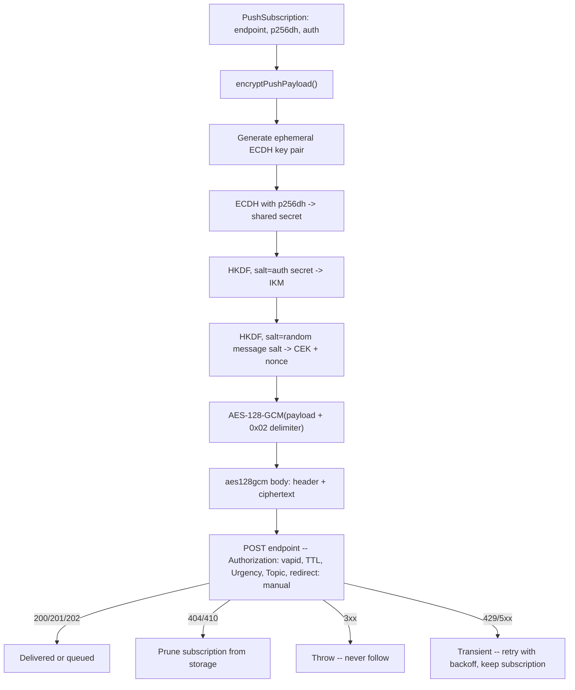

## 概要

Web Push のフローには 2 つの半分がある。ブラウザ側では、Service Worker が VAPID
公開鍵を渡して `PushManager.subscribe()` を呼び出し、`PushSubscription` -- ブラウザが
使うプッシュサービス（Firefox の autopush、Chrome/Edge の FCM、Safari のもの）を指す
`endpoint` URL と、サブスクリプションごとの 2 つの鍵 `p256dh`・`auth` -- を受け取る。
クライアントはこのサブスクリプションを保存のためにサーバーへ送る。このレシピが扱う
のはもう一方の半分だけだ: 後になって通知をプッシュしたいサーバー（仕様の用語では
「application server」）が、その特定のサブスクリプション向けにペイロードを暗号化し、
自分が誰であるかを証明する VAPID JWT に署名し、結果を `endpoint` へ `POST` する。
サブスクライブすることや `push` イベントハンドラで通知を表示することは標準的な
Push API / Notifications API の作業であり、Worker には一切触れない -- ここでは対象外
とする。

3 つの RFC がワイヤーフォーマットを定義している: [RFC 8291](https://www.rfc-editor.org/rfc/rfc8291.html)
（メッセージ暗号化、`aes128gcm`）、[RFC 8292](https://www.rfc-editor.org/rfc/rfc8292.html)
（VAPID）、そして [RFC 8030](https://www.rfc-editor.org/rfc/rfc8030.html)（HTTP
配信プロトコルそのもの -- `TTL`・`Urgency`・`Topic`）。どれも Workers 固有のもので
はなく、どのサーバー上でも同じように動く。Workers によって変わるのは、それを
*どう実装するか* だけだ。

## `web-push` が Workers で動かない理由

素直な選択は `npm install web-push` で済ませることだ。だがこのパッケージは Node の
`crypto` モジュール（`crypto.createECDH`、`crypto.createSign`）と Node の
`http`/`https` リクエスト API の上に直接構築されており、どちらも Workers ランタイムが
デフォルトで公開しているものではない。`nodejs_compat` 互換フラグは部分的な
`node:crypto` シムを提供するが、このレシピはいずれにせよそれに依存しない --
以下のすべては Web Crypto API（`crypto.subtle`）の上で動作し、これは Workers
ランタイムで無条件に使える。これは [HMAC-SHA256 によるウェブフック署名](./webhook-signing.mdx)
や [パーソナル API トークン](./personal-api-tokens.mdx) と同じ「`node:crypto` なし」
というテーマであり、対象が HMAC・SHA-256 から楕円曲線の署名と鍵合意に変わっている
だけだ。

## VAPID: 送信者を証明する

VAPID（RFC 8292）は、事前の登録手続きなしに、プッシュサービスがあなたのアプリケー
ションサーバーを他の誰かと区別できるようにする。P-256 曲線上の ECDSA 鍵ペアを一度
だけ生成する。公開鍵はブラウザで `PushManager.subscribe()` に渡す
`applicationServerKey` になり、すべてのプッシュリクエストには対応する秘密鍵を保持
していることを証明する `ES256` 署名付き JWT が添えられる。

### VAPID 鍵ペアの生成と保存

これは一度だけ生成する -- あとで削除するスクラッチ用の Worker ルート、ローカルの
Node 19+ の REPL、あるいはブラウザのコンソールで。3 つとも同じ `crypto.subtle` を
公開している。

```typescript
interface VapidKeyJwk {
  kty: "EC";
  crv: "P-256";
  d: string; // private scalar, base64url -- secret
  x: string; // public X coordinate, base64url
  y: string; // public Y coordinate, base64url
}

function base64UrlEncode(bytes: Uint8Array): string {
  let binary = "";
  for (const byte of bytes) binary += String.fromCharCode(byte);
  return btoa(binary).replace(/\+/g, "-").replace(/\//g, "_").replace(/=+$/, "");
}

async function generateVapidKeyPair(): Promise<{
  publicKey: string;
  privateKeyJwk: VapidKeyJwk;
}> {
  const keyPair = await crypto.subtle.generateKey(
    { name: "ECDSA", namedCurve: "P-256" },
    true, // extractable -- this run only, to print the values once
    ["sign", "verify"],
  );
  const publicRaw = await crypto.subtle.exportKey("raw", keyPair.publicKey);
  const privateKeyJwk = (await crypto.subtle.exportKey(
    "jwk",
    keyPair.privateKey,
  )) as VapidKeyJwk;

  return {
    publicKey: base64UrlEncode(new Uint8Array(publicRaw)),
    privateKeyJwk,
  };
}
```

`publicKey` は base64url エンコードされた非圧縮 EC 点（P-256 の場合 65 バイト、
`0x04 || X || Y`）であり、これはまさに `PushManager.subscribe({ applicationServerKey })`
が期待する形であり、後述の Authorization ヘッダーの `k=` パラメータにもそのまま入る
ものだ。`privateKeyJwk` は素のスカラーではなく完全な JWK オブジェクトであり、それ
全体を保存する必要がある。理由は次節で説明する。

### トラップ: WebCrypto は生の秘密スカラーをインポートできない

```typescript
async function importVapidPrivateKey(jwk: VapidKeyJwk): Promise<CryptoKey> {
  return crypto.subtle.importKey(
    "jwk",
    { ...jwk, ext: true },
    { name: "ECDSA", namedCurve: "P-256" },
    false,
    ["sign"],
  );
}
```

:::danger[トラップ: "raw" インポートは EC 鍵の公開半分しか受け付けない]
`"ECDSA"`/`"ECDH"` に対する `crypto.subtle.importKey("raw", ...)` は **公開** 点
（`0x04 || X || Y`）しか受け付けない。WebCrypto の楕円曲線鍵には `"raw"` 形式での
秘密鍵インポートが存在しない -- HMAC や AES のシークレットであれば
`importKey("raw", ...)` が素のバイト列を素直に受け付けてくれるのとは対照的だ（[HMAC-SHA256
によるウェブフック署名](./webhook-signing.mdx)を参照）。EC の秘密鍵は `"jwk"` か
`"pkcs8"` として渡す必要があり、JWK には `d` と並んで `x` と `y` が要る -- 秘密
スカラーだけでは足りない。これこそ、上記の `generateVapidKeyPair` が `d` だけでなく
`"jwk"` を丸ごとエクスポートしている理由だ: このインポートが必要とする `{ x, y, d }`
の三つ組をまとめて渡してくれる呼び出しはそれだけだからだ。保存してあるものが他の
ツールからコピーした生の 32 バイトのスカラーだけなら、曲線から `x`/`y` を再計算
しない限り WebCrypto でインポート可能な鍵を再構成できない -- 最初から JWK 全体を
シークレットとして保存し、`d` だけを保存することは決してしないこと。
:::

### VAPID JWT への署名

```typescript
function jsonToBase64Url(value: unknown): string {
  return base64UrlEncode(new TextEncoder().encode(JSON.stringify(value)));
}

// RFC 8292 caps exp at 24h from the request. This recipe uses a much shorter
// window: a leaked JWT is replayable against the push service until it
// expires, so there is no reason to hand out anything near the ceiling.
const VAPID_EXP_SECONDS = 60 * 60; // 1 hour

async function signVapidJwt(
  audienceOrigin: string,
  subject: string,
  privateKeyJwk: VapidKeyJwk,
): Promise<string> {
  const header = { typ: "JWT", alg: "ES256" };
  const claims = {
    aud: audienceOrigin, // scheme + host of the push endpoint, no path -- see below
    exp: Math.floor(Date.now() / 1000) + VAPID_EXP_SECONDS,
    sub: subject, // "mailto:push@example.com" -- RFC 8292 says this SHOULD be included, and several push services reject requests without it
  };
  const signingInput = `${jsonToBase64Url(header)}.${jsonToBase64Url(claims)}`;

  const privateKey = await importVapidPrivateKey(privateKeyJwk);
  const signature = await crypto.subtle.sign(
    { name: "ECDSA", hash: "SHA-256" },
    privateKey,
    new TextEncoder().encode(signingInput),
  );

  return `${signingInput}.${base64UrlEncode(new Uint8Array(signature))}`;
}
```

`aud` はプッシュエンドポイントの **オリジン** -- スキームとホストのみで、パスも
末尾のスラッシュもない。`new URL(subscription.endpoint).origin` がまさにこれを
生成する。`aud` を間違える（フル URL、別のホスト）とプッシュサービス側で静かに
拒否される。WebCrypto のエラーにはならないので、キャッシュされた値や思い込みでは
なく、これから実際に `POST` する `endpoint` そのものと突き合わせて確認する価値が
ある。

### トラップ: WebCrypto の ECDSA 署名はすでに生の r‖s である

:::warning[トラップ: WebCrypto の ECDSA 署名を DER デコードしない]
JWS -- したがって VAPID の `ES256` -- は、署名を固定幅のビッグエンディアン整数 2 つ
を連結した `r || s` として要求する: P-256 では各 32 バイト、合計 64 バイト（IEEE
P1363 形式）。`crypto.subtle.sign({ name: "ECDSA", hash: "SHA-256" }, ...)` は
すでにまさにこのレイアウトを返す。これは `node:crypto` の `sign()` とは正反対だ --
`node:crypto` はデフォルトで ASN.1 DER エンコーディングを使い、一致させるには
`{ dsaEncoding: "ieee-p1363" }` を明示的に指定する必要がある。Node ベースの JWT
ライブラリから移植したコードが base64url エンコードの前に署名を DER デコードしよう
とすると、そもそも DER ではなかった WebCrypto の署名を壊してしまう -- Workers での
正しい対処は、何もしないことだ。上の `signVapidJwt` がそうしているように、
`crypto.subtle.sign` の生の出力をそのまま base64url すればよい。
:::

### Authorization ヘッダー

```typescript
function vapidAuthorizationHeader(jwt: string, publicKey: string): string {
  return `vapid t=${jwt}, k=${publicKey}`;
}
```

`k` は、ブラウザが `PushManager.subscribe()` からすでに持っている
`applicationServerKey` と同じ base64url 公開鍵だ -- プッシュサービスは `t` の JWT が
`k` で示された鍵で署名されていることを確認し、さらに別に、その `k` がサブスクリプ
ション作成時の鍵と一致することも確認する。ブラウザがサブスクライブに使った鍵と
サーバーが署名に使う鍵が食い違うと、自分のコードではなくプッシュサービス側で失敗
する -- 環境ごとに VAPID 鍵ペアはちょうど 1 組だけ保ち、すべてのクライアントを
再サブスクライブさせずに再生成することは決してしないこと。

## ペイロードの暗号化（`aes128gcm`）

RFC 8291 は RFC 8188 の汎用的な `aes128gcm` コンテンツエンコーディングの上に積み
重なっている。各サブスクリプションは `PushSubscription.keys` から 2 つのクライアント
側シークレットを持つ: `p256dh`（クライアント自身の ECDH 公開鍵）と `auth`（サブス
クライブ時に一度だけ共有される 16 バイトのシークレット）。あるサブスクリプション
向けにペイロードを暗号化するとは、次を意味する:

1. このメッセージのために、P-256 上で新しい **一時的な** ECDH 鍵ペアを生成する。
2. その一時秘密鍵とクライアントの `p256dh` 公開鍵の間で ECDH を実行し、共有シーク
   レットを得る。
3. その共有シークレットを、サブスクリプションの `auth` シークレットをソルトとして
   HKDF し、32 バイトの入力鍵材料（IKM）にする。
4. その IKM を再び HKDF する -- 今度は `auth` とは無関係な、新しい 16 バイトの
   **メッセージ** ソルトをソルトとして -- 16 バイトのコンテンツ暗号化鍵（CEK）と
   12 バイトのノンスにする。
5. ペイロードの末尾に単一の `0x02` パディング区切りバイト（RFC 8188 の「これが最後の
   レコードである」というマーカー）を付加したうえで、その CEK とノンスを使って
   AES-128-GCM で暗号化する。
6. 暗号文の先頭に `aes128gcm` ヘッダーを付ける: メッセージソルト、レコードサイズ
   フィールド、そしてこのメッセージの一時公開鍵 -- 受信側のブラウザが何のサイド
   チャネルもなしにステップ 2〜4 をやり直せるようにするためだ。

```typescript
async function hkdf(
  ikm: BufferSource,
  salt: BufferSource,
  info: BufferSource,
  lengthBits: number,
): Promise<ArrayBuffer> {
  const key = await crypto.subtle.importKey("raw", ikm, "HKDF", false, ["deriveBits"]);
  return crypto.subtle.deriveBits({ name: "HKDF", hash: "SHA-256", salt, info }, key, lengthBits);
}

function concatBytes(...arrays: Uint8Array[]): Uint8Array {
  const total = arrays.reduce((sum, a) => sum + a.length, 0);
  const out = new Uint8Array(total);
  let offset = 0;
  for (const a of arrays) {
    out.set(a, offset);
    offset += a.length;
  }
  return out;
}

function base64UrlDecode(value: string): Uint8Array {
  const padded = value
    .replace(/-/g, "+")
    .replace(/_/g, "/")
    .padEnd(Math.ceil(value.length / 4) * 4, "=");
  const binary = atob(padded);
  const bytes = new Uint8Array(binary.length);
  for (let i = 0; i < binary.length; i++) bytes[i] = binary.charCodeAt(i);
  return bytes;
}

const textEncoder = new TextEncoder();
const RECORD_SIZE = 4096; // rs field -- see "Push payloads are small" below

async function encryptPushPayload(
  payload: Uint8Array,
  p256dhB64: string,
  authB64: string,
): Promise<Uint8Array> {
  const uaPublicRaw = base64UrlDecode(p256dhB64); // 65 bytes: 0x04 || X || Y
  const authSecret = base64UrlDecode(authB64); // 16 bytes

  // Public-key import -- "raw" works here, unlike the private-key trap above.
  const uaPublicKey = await crypto.subtle.importKey(
    "raw",
    uaPublicRaw,
    { name: "ECDH", namedCurve: "P-256" },
    false,
    [],
  );

  const asKeyPair = await crypto.subtle.generateKey(
    { name: "ECDH", namedCurve: "P-256" },
    false, // not extractable -- the private half is never exported, only used for deriveBits below
    ["deriveBits"],
  );
  const asPublicRaw = new Uint8Array(await crypto.subtle.exportKey("raw", asKeyPair.publicKey));

  const sharedSecret = await crypto.subtle.deriveBits(
    { name: "ECDH", public: uaPublicKey },
    asKeyPair.privateKey,
    256,
  );

  // RFC 8291 stage 1: shared secret -> IKM, salted with the subscription's
  // own (long-lived) auth secret -- not the message salt used below.
  const ikmInfo = concatBytes(textEncoder.encode("WebPush: info\0"), uaPublicRaw, asPublicRaw);
  const ikm = await hkdf(sharedSecret, authSecret, ikmInfo, 256);

  // RFC 8188 stage 2: a fresh, message-specific salt derives the actual CEK
  // and nonce from the IKM above -- this salt goes in the header, in the clear.
  const salt = crypto.getRandomValues(new Uint8Array(16));
  const cekBits = await hkdf(ikm, salt, textEncoder.encode("Content-Encoding: aes128gcm\0"), 128);
  const nonceBits = await hkdf(ikm, salt, textEncoder.encode("Content-Encoding: nonce\0"), 96);

  const cek = await crypto.subtle.importKey("raw", cekBits, { name: "AES-GCM" }, false, [
    "encrypt",
  ]);

  // Single-record aes128gcm: 0x02 marks this as the last (and only) record.
  const recordPlaintext = concatBytes(payload, new Uint8Array([0x02]));
  const ciphertext = new Uint8Array(
    await crypto.subtle.encrypt({ name: "AES-GCM", iv: nonceBits }, cek, recordPlaintext),
  );

  // Header: salt(16) || rs(4, big-endian) || idlen(1) || keyid(idlen)
  const header = new Uint8Array(16 + 4 + 1 + asPublicRaw.length);
  header.set(salt, 0);
  new DataView(header.buffer).setUint32(16, RECORD_SIZE, false);
  header[20] = asPublicRaw.length;
  header.set(asPublicRaw, 21);

  return concatBytes(header, ciphertext);
}
```

`hkdf` の各引数は、`crypto.subtle.importKey()` と `deriveBits()` が実際に受け付ける型である `BufferSource` として型付けされており、より狭い `ArrayBuffer` ではない。上のすべての呼び出し箇所は `Uint8Array`（`authSecret`、`ikmInfo`、`TextEncoder` の出力、`crypto.getRandomValues` によるランダムなソルト）を渡しており、`strict` な TypeScript の下では `Uint8Array` は素の `ArrayBuffer` パラメータには代入できない -- `hkdf` を `ArrayBuffer` として型付けすると、これらの呼び出し箇所のどれか一つが `tsc` を通った瞬間にコンパイルが失敗する。実行時にはどれも正しく動作するにもかかわらずだ。

:::note[プッシュのペイロードが小さいのは意図的]
RFC 8030 §5.2 が要求しているのは、プッシュサービスが暗号化済みコンテンツを
**少なくとも** 4096 オクテットまで**受け付ける**ことであり -- これは上限では
なく下限だ -- とはいえ実務上はほとんどのプッシュサービスがその下限に近いところ
を実質的な上限として運用しているので、それを前提に設計しておくのが無難な既定
値になる。単一の `aes128gcm` レコードの
オーバーヘッドは固定だ -- P-256 の key id を使う場合ヘッダーが 86 バイト、GCM タグ
が 16 バイト、パディング区切りが 1 バイトで、合計およそ 103 バイト -- これにより
平文には概ね 3900 バイト程度の余裕が残る: 通知のタイトル・本文・遷移先 URL を持つ
JSON ペイロードには十分だが、任意のアプリケーションデータには足りない。このレシピ
は常に単一レコードを生成する -- `aes128gcm` がより大きなストリーム向けにサポートする
マルチレコードのチャンク分割（RFC 8188 セクション 4）は、このサイズのプッシュ
ペイロードには存在理由がない。
:::

### 既知解テストベクター（RFC 8291）

検証可能なベクターのない暗号化の説明文は、微妙なバグが出荷される典型的な経路だ --
入れ違った HKDF の `info` 文字列、ソルトと auth シークレットの取り違え、順序の
間違ったヘッダーフィールド、そのいずれも実ブラウザに対する手動テストでは「動いて
いるように見えてしまう」。ブラウザ側の復号失敗は静かだからだ。
[RFC 8291 セクション 5](https://www.rfc-editor.org/rfc/rfc8291.html#section-5)
からそのまま採った以下の固定入力に対して `encryptPushPayload` を実行し、実装を
信頼する前に、結果を期待される出力とバイト単位で突き合わせること。

| 入力 | 値（base64url） |
| --- | --- |
| 平文 | `V2hlbiBJIGdyb3cgdXAsIEkgd2FudCB0byBiZSBhIHdhdGVybWVsb24`（`"When I grow up, I want to be a watermelon"`） |
| `auth` シークレット | `BTBZMqHH6r4Tts7J_aSIgg` |
| メッセージソルト | `DGv6ra1nlYgDCS1FRnbzlw` |
| ユーザーエージェント（受信側）秘密鍵 | `q1dXpw3UpT5VOmu_cf_v6ih07Aems3njxI-JWgLcM94` |
| ユーザーエージェント（受信側）公開鍵 -- `p256dh` | `BCVxsr7N_eNgVRqvHtD0zTZsEc6-VV-JvLexhqUzORcxaOzi6-AYWXvTBHm4bjyPjs7Vd8pZGH6SRpkNtoIAiw4` |
| アプリケーションサーバー（送信側）一時秘密鍵 | `yfWPiYE-n46HLnH0KqZOF1fJJU3MYrct3AELtAQ-oRw` |
| アプリケーションサーバー（送信側）一時公開鍵 | `BP4z9KsN6nGRTbVYI_c7VJSPQTBtkgcy27mlmlMoZIIgDll6e3vCYLocInmYWAmS6TlzAC8wEqKK6PBru3jl7A8` |

実装がデバッグ用に途中の値を露出させている場合の中間値:

| 導出値 | 値（base64url） |
| --- | --- |
| ECDH 共有シークレット | `kyrL1jIIOHEzg3sM2ZWRHDRB62YACZhhSlknJ672kSs` |
| IKM | `S4lYMb_L0FxCeq0WhDx813KgSYqU26kOyzWUdsXYyrg` |
| コンテンツ暗号化鍵（CEK） | `oIhVW04MRdy2XN9CiKLxTg` |
| ノンス | `4h_95klXJ5E_qnoN` |

期待される出力 -- `aes128gcm` ボディ全体（ヘッダー + 暗号文）、144 バイト、
base64url:

```
DGv6ra1nlYgDCS1FRnbzlwAAEABBBP4z9KsN6nGRTbVYI_c7VJSPQTBtkgcy27ml
mlMoZIIgDll6e3vCYLocInmYWAmS6TlzAC8wEqKK6PBru3jl7A_yl95bQpu6cVPT
pK4Mqgkf1CXztLVBSt2Ks3oZwbuwXPXLWyouBWLVWGNWQexSgSxsj_Qulcy4a-fN
```

これを上記の `encryptPushPayload` で再現するには、一時鍵ペアとソルトを乱数生成
ではなく注入可能にするという変更だけで済む（`crypto.getRandomValues` と
`crypto.subtle.generateKey` を固定のテスト値に固定することはもとより不可能なので）
-- 固定の秘密鍵・公開鍵を、実際の鍵に対してこの関数がすでにやっているのと同じ
方法で JWK/raw としてインポートし、`crypto.getRandomValues` を呼ぶ代わりに固定の
ソルトを直接渡す。それ以外 -- HKDF の呼び出し、info 文字列、ヘッダーのレイアウト
-- はすべて変更なしで動く。

## プッシュの送信

### TTL・Urgency・Topic

RFC 8030 は配信の挙動を左右する 3 つのリクエストヘッダーを定義している。どれも
「考えなくていいもの」ではない -- 省略すればプッシュサービスがたまたま選んだデフォ
ルトを受け入れることになり、それはサービスによって異なる:

- **`TTL`**（秒）: デバイスがオフラインの間、プッシュサービスがメッセージを保持し
  配信を再試行してよい時間。`TTL: 0` は「デバイスが今まさに接続していれば今すぐ
  配信し、そうでなければ破棄する」を意味する -- ライブカーソルの更新のように、
  数分後の古い配信が配信なしより悪い場合に正しい選択だ。`TTL` がゼロでない場合も、それは
  再試行時間の上限であって配信の保証ではない -- プッシュサービスはリソース圧迫下で
  `TTL` が切れる前にメッセージを破棄することが明示的に許されている。
- **`Urgency`**: `very-low`・`low`・`normal`・`high` のいずれか。バッテリー制約の
  あるデバイス上で、プッシュサービスが低緊急度の配信を遅らせて電力を節約できるように
  する。通知の目的が許す最も低い緊急度を選ぶこと -- `high` はユーザーが実際に待って
  いるもの（着信、二要素認証コード）のためのものであり、日常的な更新のためのもの
  ではない。
- **`Topic`**: 不透明な文字列。まだ配信されていないプッシュと同じ `Topic` を持つ
  2 番目のプッシュは、両方をキューに積むのではなく、プッシュサービスのキューの中で
  それを **置き換える** -- デバイスは最新のものだけを目にすることになる。同期
  トリガーや未読数のように、最新の値だけが意味を持つものに使うことで、短時間
  オフラインだったデバイスが今となっては古くなったプッシュの山を起こしに戻される
  ことがなくなる。

```typescript
const headers = new Headers({
  Authorization: vapidAuthorizationHeader(jwt, env.VAPID_PUBLIC_KEY),
  "Content-Type": "application/octet-stream",
  "Content-Encoding": "aes128gcm",
  TTL: String(ttlSeconds), // 0 = deliver now or drop, never queue
  Urgency: urgency, // "very-low" | "low" | "normal" | "high"
});
if (topic) headers.set("Topic", topic);
```

### プッシュサービスのリダイレクトには決して従わない

`PushSubscription.endpoint` はクライアントが送信してくるデータだ -- 通常の使い方
では `PushManager.subscribe()` から来るが、サーバー側にはそれを独立に検証する手段が
何もない。サーバーは、自分では選んでいない URL に対してアウトバウンドの `fetch()`
を行っていることになり、これは [SSRF とリダイレクトの安全性](./ssrf-and-redirect-safety.mdx)
で扱っているのと同じ形のリスクだ。

:::danger[プッシュサービスがリダイレクトすることは決して正当ではない]
FCM、Mozilla の autopush、Apple の web push サービスのいずれも、通常の動作では
配信リクエストに 3xx を返すことはない。`fetch()` のデフォルトである
`redirect: "follow"` は、VAPID JWT を運ぶ `Authorization` ヘッダーと暗号化済み
ボディを、`Location` ヘッダーが指す先へ黙って再送してしまう -- 呼び出しの周りに
どんなチェックを書いていても見えない場所で。`redirect: "manual"` で送信し、
`3xx` レスポンスはすべて致命的な失敗として扱うこと。これは
[SSRF とリダイレクトの安全性](./ssrf-and-redirect-safety.mdx#パート-1-ssrf-ガード-ホップごとのリダイレクト再チェック)
がアウトバウンド fetch 全般に対して使っているのと同じ規律だ -- ここには従うべき
正当なホップは存在しないので、リクエストを組み直す必要もない。
:::

### サブスクライブ時にエンドポイントのホストを検証する

上の `redirect: "manual"` はリダイレクトのホップを塞いでくれるが、*最初の*リクエ
ストについては何もしてくれない: `subscription.endpoint` はクライアントのサブス
クライブリクエストが言っている値そのものであり、それが本物の
`PushManager.subscribe()` 呼び出しから来たことを強制するものは何もない。サブス
クライブ用エンドポイントに到達できる者なら誰でも、内部サービスやクラウドのメタ
データエンドポイントを含む任意の URL をそこへ送信でき、サーバーは律儀に VAPID
JWT に署名し、暗号化済みのボディをそこへ `POST` してしまう -- これは
[SSRF とリダイレクトの安全性](./ssrf-and-redirect-safety.mdx)が一般的に扱ってい
るのと同じアウトバウンド fetch のリスクを、リダイレクトではなくサブスクリプショ
ンを経由して届く URL に当てはめたものだ。

実在するプッシュサービスは短く安定したホストのリストなので、除外したいものを
ブロックしようとするのではなく、サブスクライブ時に許可リストと突き合わせて検証
すること -- これは [SSRF とリダイレクトの安全性](./ssrf-and-redirect-safety.mdx)
がアウトバウンド fetch 全般に対して使っているのと同じ、ブロックリストではなく
許可リストというフレーミングだ:

```typescript
const PUSH_ENDPOINT_HOST_SUFFIXES = [
  "googleapis.com", // Chrome/Edge -- FCM
  "push.services.mozilla.com", // Firefox -- autopush
  "web.push.apple.com", // Safari
  "notify.windows.com", // legacy Edge/WNS
];

function isAllowedPushEndpoint(endpoint: string): boolean {
  let host: string;
  try {
    host = new URL(endpoint).host;
  } catch {
    return false;
  }
  return PUSH_ENDPOINT_HOST_SUFFIXES.some(
    (suffix) => host === suffix || host.endsWith(`.${suffix}`),
  );
}
```

このチェックはサブスクリプションが最初に送信された時点、保存する前に実行する
こと -- サブスクライブ時に不正な `endpoint` を弾いておけば、`sendPushMessage` が
それを目にすることは二度とない。

### 404/410 と一時的な失敗の違い

レスポンスステータスは 3 つの実行可能なバケットに分かれ、そのうちの 2 つを混同
すると、死んだサブスクリプションを永遠に漏らし続けるか、生きているサブスクリプ
ションを捨ててしまうことになる:

- **`201`（サービスによっては `200`/`202`）:** 配信またはキューイングに成功した。
  何もする必要はない。
- **`404` または `410`:** サブスクリプションは永続的に失われている -- ユーザーが
  アプリをアンインストールした、通知許可を取り消した、ブラウザデータを消去した、
  などだ。プッシュサービスは、再試行をやめるようはっきりと伝えてきている。
  サブスクリプションをストレージ -- サブスクリプションがどこに置かれているかに
  よって [KV](../storage/kv.mdx) か [D1](../storage/d1.mdx) -- から削除するの
  は、蓄積された失敗回数ではなく、このレスポンスを受けた時点にすること。
- **`429` または `5xx`:** 一時的なもの。バックオフしながら再試行し、削除しない。
  プッシュサービスが一時的に過負荷だったりダウンしていたりしたからといって、
  サブスクリプションが死んだわけではない。

```typescript
export interface PushSubscription {
  endpoint: string;
  keys: { p256dh: string; auth: string };
}

export interface Env {
  VAPID_PUBLIC_KEY: string;
  VAPID_PRIVATE_KEY_JWK: string; // JSON-stringified VapidKeyJwk
  VAPID_SUBJECT: string; // "mailto:push@example.com"
}

export type PushResult =
  | { outcome: "delivered" }
  | { outcome: "expired"; status: number } // caller must prune the subscription
  | { outcome: "transient"; status: number }; // caller should retry with backoff

type PushOptions = {
  ttlSeconds?: number;
  urgency?: "very-low" | "low" | "normal" | "high";
  topic?: string;
};

const PUSH_SUCCESS = new Set([200, 201, 202]);

// The actual delivery, given an already-signed JWT -- shared by the
// single-message path below and the fan-out batch in "Fan-Out" further down,
// which signs one JWT per push-service origin instead of one per message.
async function deliverPush(
  subscription: PushSubscription,
  payload: Uint8Array,
  jwt: string,
  env: Env,
  options: PushOptions,
): Promise<PushResult> {
  const body = await encryptPushPayload(payload, subscription.keys.p256dh, subscription.keys.auth);

  const headers = new Headers({
    Authorization: vapidAuthorizationHeader(jwt, env.VAPID_PUBLIC_KEY),
    "Content-Type": "application/octet-stream",
    "Content-Encoding": "aes128gcm",
    TTL: String(options.ttlSeconds ?? 0),
    Urgency: options.urgency ?? "normal",
  });
  if (options.topic) headers.set("Topic", options.topic);

  const res = await fetch(subscription.endpoint, {
    method: "POST",
    headers,
    body,
    redirect: "manual", // see "Never Follow a Push Service Redirect" above
  });

  if (PUSH_SUCCESS.has(res.status)) {
    return { outcome: "delivered" };
  }
  if (res.status === 404 || res.status === 410) {
    return { outcome: "expired", status: res.status };
  }
  if (res.status >= 300 && res.status < 400) {
    throw new Error(`Push endpoint returned an unexpected redirect: ${res.status}`);
  }
  // 429 / 5xx, and anything else not covered above -- treat as transient.
  return { outcome: "transient", status: res.status };
}

export async function sendPushMessage(
  subscription: PushSubscription,
  payload: Uint8Array,
  env: Env,
  options: PushOptions = {},
): Promise<PushResult> {
  const endpointUrl = new URL(subscription.endpoint);
  const privateKeyJwk = JSON.parse(env.VAPID_PRIVATE_KEY_JWK) as VapidKeyJwk;
  const jwt = await signVapidJwt(endpointUrl.origin, env.VAPID_SUBJECT, privateKeyJwk);
  return deliverPush(subscription, payload, jwt, env, options);
}
```



## ファンアウト: サブリクエストの上限と VAPID JWT の使い回し

多数のサブスクライバーへ通知する自然なやり方は、サブスクリプションごとに
`sendPushMessage` を 1 回呼ぶループだ -- つまりサブスクリプションごとに 1 回の
アウトバウンド `fetch()` になり、それは Workers のインボケーションあたりのサブ
リクエスト上限（**Free プランで 50、Paid プランでデフォルト 10,000**、Paid の
上限は最大 1000 万まで設定変更可能。最新の数値は
[Limits](https://developers.cloudflare.com/workers/platform/limits/) を参照）
に対してのことだ。どちらの上限であれそれを超える規模のメーリングリストへの通
知は、単一のインボケーションからこれを軽く突破してしまい、その失敗は分かりや
すいエラーではなく、部分的で一見ランダムな配信の抜け落ちとして現れる。

`sendPushMessage` はメッセージ 1 件ごとに新しい VAPID JWT を署名してもいて、
これもまったく同じファンアウトにとって無駄が多い。`signVapidJwt` のクレームが
依存しているのは `audienceOrigin`（プッシュエンドポイントのオリジン）だけであ
り、上の `VAPID_EXP_SECONDS` は丸ごと 1 時間だ。数千人規模のファンアウトが実
際に触れるオリジンは、現実的にはひと握り（FCM、Mozilla の autopush、Apple の
web push サービス、あとはサブスクライバー層次第でいくつか）にすぎないので、
メッセージごとに署名すると、まだ 1 時間有効な同じオリジンに対して同じ ECDSA
署名を何十回、何百回と繰り返すことになる。オリジンごとに 1 回だけ署名し、それ
を共有するすべてのサブスクリプションで使い回すこと:

```typescript
export async function sendPushBatch(
  subscriptions: PushSubscription[],
  payload: Uint8Array,
  env: Env,
  options: PushOptions = {},
): Promise<PushResult[]> {
  const privateKeyJwk = JSON.parse(env.VAPID_PRIVATE_KEY_JWK) as VapidKeyJwk;

  // One JWT per push-service origin, reused across every subscription that
  // shares it -- not one per message.
  const jwtByOrigin = new Map<string, Promise<string>>();
  const jwtFor = (origin: string): Promise<string> => {
    let cached = jwtByOrigin.get(origin);
    if (!cached) {
      cached = signVapidJwt(origin, env.VAPID_SUBJECT, privateKeyJwk);
      jwtByOrigin.set(origin, cached);
    }
    return cached;
  };

  return Promise.all(
    subscriptions.map(async (subscription) => {
      const origin = new URL(subscription.endpoint).origin;
      const jwt = await jwtFor(origin);
      return deliverPush(subscription, payload, jwt, env, options);
    }),
  );
}
```

### サブリクエスト上限を超えて分割する

上の `sendPushBatch` は依然として単一の Worker インボケーションからサブスクリ
プションごとに 1 回の `fetch()` を発行するので、安全なのはサブリクエスト上限
そのものまでだ。それより大きなサブスクライバーリストは、1 回のインボケーショ
ンから送るのではなく、複数のインボケーションへ分割する必要がある:

- `ctx.waitUntil(sendPushBatch(chunk, payload, env))` はリストの大きさにかか
  わらず使う価値がある: 通知のファンアウトを起動すること自体はクライアントを
  ブロックする必要が何もないので、これによって呼び出し元がすべてのプッシュ配
  信を待つ代わりに、トリガーとなったリクエストをすぐに返せる。これ単体ではサ
  ブリクエスト上限は上がらない -- その上限は、fetch がハンドラー内で同期的に
  実行されようと `waitUntil` に遅延されようと、1 つのインボケーションが生きて
  いる間ずっと適用される。
- 1 回のインボケーションに許された上限を超えて、合計でより多くのメッセージを
  送る唯一の方法は、リストを複数のインボケーションへ分割することだ。
  [Cloudflare Queues](https://developers.cloudflare.com/queues/) はまさにこの
  ための標準的な形だ: 上限に収まるサイズのサブスクライバーのチャンクごとに 1
  つのメッセージをキューへ入れ、それぞれのキューコンシューマー -- それ自体が
  独自のサブリクエスト予算を持つ新しい Worker インボケーションだ -- にそのチ
  ャンクに対して `sendPushBatch` を呼ばせる。Queues 組み込みのリトライも、こ
  こに自然に収まる: あるチャンクの中の 1 サブスクライバーが `transient` にな
  ったからといって、そのチャンク全体の配信を失敗させるべきではない。

## Wrangler 設定: secret と vars の使い分け

`VAPID_PUBLIC_KEY` は機密ではない -- サブスクライブするすべてのブラウザに
`applicationServerKey` として渡されるものなので、守るべき機密性がそもそもない。
`VAPID_SUBJECT` は連絡先アドレスであり、これも機密ではない。`VAPID_PRIVATE_KEY_JWK`
は秘密スカラー `d` を含んでいる -- これを保持する者は誰でもあなたに成りすまして
VAPID JWT に署名でき、捕捉した `endpoint`/`p256dh`/`auth` と組み合わせればプッシュ
配信を偽造できる。`wrangler.toml` に置いてはならない。

```toml
name = "push-sender"
main = "src/index.ts"
compatibility_date = "2025-01-01"

[vars]
VAPID_PUBLIC_KEY = "BExample_Replace_With_Your_Own_Generated_VAPID_Public_Key"
VAPID_SUBJECT = "mailto:push@example.com"
```

```bash
npx wrangler secret put VAPID_PRIVATE_KEY_JWK
# paste the JSON-stringified { kty, crv, d, x, y } from generateVapidKeyPair()
```

ローカル開発では、`wrangler secret put` をローカル環境に対して実行する代わりに、
同じ JSON 文字列を `.dev.vars`（gitignore 済みで、決してコミットしない）に置く:

```
# .dev.vars
VAPID_PRIVATE_KEY_JWK={"kty":"EC","crv":"P-256","d":"...","x":"...","y":"..."}
```

:::danger[secret と同じ名前を `[vars]` にも宣言しないこと]
`VAPID_PRIVATE_KEY_JWK` の型は、このページの前半で宣言した `Env` インターフェー
スがすでに与えている -- `[vars]` は型付けの仕組みではなく、secret として設定さ
れている名前のために空のプレースホルダーエントリを持つ必要は一切ない。1 つの
Worker には名前ごとに 1 つのバインディングしかないので、`[vars]` と secret の
両方に同じ名前を宣言するのは無害な重複ではなく衝突だ -- `wrangler deploy` に対
する複数の報告が、デプロイ時にダッシュボードや CLI で設定した secret の値を
`[vars]` の値で静かに上書きしてしまう挙動を記述している
（[workers-sdk#276](https://github.com/cloudflare/wrangler2/issues/276)、
[workers-sdk discussion #8219](https://github.com/cloudflare/workers-sdk/discussions/8219)）。
良くて両者の優先順位が未文書化、悪くすると次のデプロイで、動いていた VAPID の
秘密鍵が空文字列に静かに置き換わり、すべてのプッシュが不可解なプッシュサービ
スの拒否で失敗し始める。実際の secret の値がどこに設定されていようと、それが
漏れることは、この Worker に紐づくすべての VAPID 署名済みプッシュの身元を一度
に漏らすことに等しく、[HTTP-only Cookie セッション](./cookie-sessions.mdx)や
[HMAC-SHA256 によるウェブフック署名](./webhook-signing.mdx)で扱った共有署名鍵
と同じ被害半径を持つ。
:::

:::warning[上の `VAPID_PUBLIC_KEY` の例はプレースホルダーであり、そのまま使える鍵ではない]
上の「VAPID 鍵ペアの生成と保存」にある `generateVapidKeyPair()` で自分自身の鍵
を生成すること。このページの前半にある RFC 8291 の既知解テストベクターの公開
鍵を使い回してはいけない -- あれはそのベクターの **一時的な** ECDH 公開鍵であ
り、対応する秘密鍵は 2 行上に印刷されていて、RFC として世界中に公開されている。
それを実際の設定にコピーすると、このページが前半で丁寧に分けている 2 つの異な
る P-256 鍵ペア（長寿命の VAPID **ECDSA** アイデンティティと、メッセージごとの
一時的な **ECDH** 鍵）を混同することになり、しかも秘密鍵が世界に知られている公
開鍵を配ってしまうことになる。
:::

## 関連項目

[SSRF とリダイレクトの安全性](./ssrf-and-redirect-safety.mdx)は、このレシピが
プッシュ配信に適用しているリダイレクト拒否とアウトバウンド fetch の規律を扱って
いる。[HMAC-SHA256 によるウェブフック署名](./webhook-signing.mdx)と
[パーソナル API トークン](./personal-api-tokens.mdx)は、このサイトの他の
`crypto.subtle` のみに依拠したレシピだ -- あちらは HMAC と SHA-256、こちらは
ECDSA/ECDH/HKDF という違いがある。
