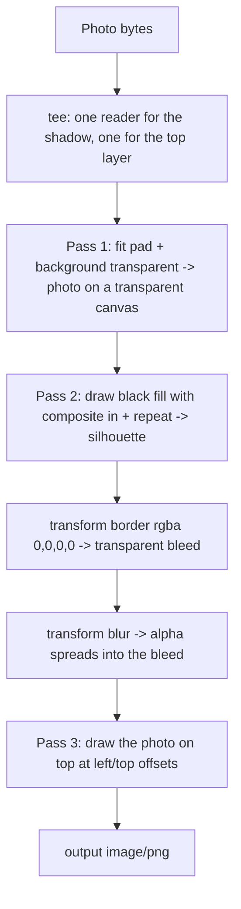

## 概要 -- ひとつのチェーンに多数のレイヤー、そしてすべてのハンドルは使い捨て

Images バインディングはたいてい、リサイズとトランスコードのための RPC として紹介される。バイト列を入れて、小さくなったバイト列が出てくる、と。その紹介の仕方は実力を過小評価している。`env.IMAGES` は合成もできる——`.draw()` は 2 枚目の画像（あるいは別の `.input()` チェーン）を受け取り、Porter-Duff のモード、絶対オフセット、タイリング、レイヤーごとの不透明度を使って現在の画像に混ぜ込む。本来なら Worker にデコーダを同梱するか、Sharp を使ったオフラインのバッチ処理を回すことになる種類の仕事が、Worker の外で実行され、CPU ではなく実時間を消費するだけの数回のチェーン呼び出しで済む。

このページで扱う題材は**ドロップシャドウ付きのカード**だ。任意のユーザー写真を透明なキャンバスに収め、固定のアセットからではなく写真自身のシルエットから生成した柔らかいシャドウを添える。記録する価値のある合成プリミティブをひととおり使うことになり、そしてそのどれもが、パラメータ一覧からは推測できない挙動を持っている。

以下の観察は、Wrangler `4.85.0` で本物の高忠実度バインディングに対して行った範囲を限った `wrangler dev --remote` のプローブと、そのあとに続いた実際にデプロイしたレンダラーから得たものだ。うち 2 つは実際のデバッグ時間を消費した。

- `composite` は **overlay のバウンディングボックスの内側にしか効かない**。したがって 1×1 の塗りつぶしを `in` で合成すると、`repeat: true` も渡さないかぎり、ちょうど 1 ピクセルにしか作用しない。
- transformer は描画または出力された時点で**消費される**。同じものを再利用すると `IMAGES_TRANSFORM_ERROR 9525` が投げられ、しかもその失敗は、最初の分岐では正しく見えたパイプラインの*2 番目*の分岐で表面化する。

:::warning[素の `wrangler dev` ではここに書いたことは何ひとつ動かない]
オフラインの低忠実度バインディングがサポートするのは `width`、`height`、`rotate`、そして出力 `format` だけで、それ以外はない。このページに出てくるオプション（`fit`、`background`、`border`、`blur`、`composite`、`repeat`、`opacity`、位置指定）はすべて高忠実度バインディングを必要とする。つまり `wrangler dev --remote` か、デプロイだ。[バインディングのサポート表](../workers/local-dev-bindings.mdx#バインディング対応表)を参照。「ローカルでは通る」合成パイプラインは、まったくテストされていない。
:::

## バインディングが適用する順序どおりのパイプライン

合成は可換ではないし、バインディングが順序を並べ替えてくれることもない。チェーンした `.transform()` は順番に適用され、`.draw()` は現れた位置で混ぜ、`.output()` がチェーンを終わらせる。カードは 3 パスで、それぞれの `.output()` のバイト列が次のパスに渡る。



以降の各節がこのグラフの 1 本の辺を説明する。組み上がった関数は[レンダラー全体](#レンダラー全体)にある。

## 透明パディングが以降のすべてを可能にする

`fit: "pad"` は画像を要求された枠の中に収め、余った領域を埋める。何で*埋めるか*は `background` が決め、そのデフォルトは**不透明な白**だ——ここではまさにそれが間違っている。不透明なキャンバスには、シルエットが切り抜く先の透明ピクセルも、ぼかしが広がっていく先の透明ピクセルも存在しないからだ。

```ts
const padded = await env.IMAGES
  .input(photo)
  .transform({ width: 640, height: 480, fit: "pad", background: "transparent" })
  .output({ format: "image/png" });
```

外してはいけない点が 2 つある。

- **出力フォーマットをアルファ対応のまま保つこと。** `image/png`、`image/webp`、`image/avif` はアルファチャンネルを持つが、`image/jpeg` は持たない。中間段階で JPEG を挟むと、いま指定したばかりの透明度が、自分で選んだわけでもない背景に対して黙って平坦化される。以降のパスが PNG のままなのはそのためで、配信用のフォーマットを選ぶのは最後だけだ。
- **`background` は `.output()` にも存在する。** そちらで指定するとエンコード時にアルファが合成されて消える。意図的な最終フラット化としては有用だが、中間パスにコピペすると罠になる。

高忠実度バインディングに対して確認済み: `fit: "pad"` と `background: "transparent"` の組み合わせは、空に見えるだけの白いピクセルではなく、本物のアルファチャンネルを生成する。

## シルエット -- そしてそれを黙って縮めるバウンディングボックス

`composite: "in"` は、*ベース*が不透明な場所にだけ overlay を表示する。パディング済みの写真に不透明な黒レイヤーをこのモードで描くと、結果は黒い写真のシルエットで、パディングされた周囲は透明なままになる。これが、まだ柔らかくなる前のシャドウだ。

落とし穴は Cloudflare の [draw ドキュメント](https://developers.cloudflare.com/images/optimization/draw-overlays/)の一文にある。*composite モードは overlay のバウンディングボックス内の領域にしか影響しない*。そのボックスの外側では、ベース画像はそのまま保たれる。

孤立したプローブではこれは表面化しない。プローブは自然とベースと overlay を同じサイズにするので、バウンディングボックスが全面を覆い、モードが全体に効いているように見えるからだ。一方、実運用のコードは **1×1 の塗りつぶしアセット**を使いたがる。単色ならそれ以上は要らないからだ。overlay が 1×1 だと、バウンディングボックスは 1 ピクセルになる。`composite: "in"` はその 1 ピクセルだけを黒くし、他の写真ピクセルはすべてそのまま残す。*それ*をボーダーとぼかしに通せば、シャドウではなく弱い色付きのハローが得られる——ぼかし半径のバグのように見えて、そうではない結果だ。

`repeat: true` は overlay をキャンバス全体にタイル状に敷き詰め、バウンディングボックスをフレーム全体まで広げる。これで composite は、孤立したプローブが示唆したとおりに振る舞う。

```ts
// A 1x1 opaque black PNG, inlined so no asset fetch is needed.
const BLACK_PIXEL =
  "iVBORw0KGgoAAAANSUhEUgAAAAEAAAABCAIAAACQd1PeAAAADElEQVR42mNgYGAAAAAEAAHI6uv5AAAAAElFTkSuQmCC";

// A fresh stream per call -- see the single-use rule below.
const blackPixel = () => new Blob([BLACK_PIXEL]).stream();

const silhouette = env.IMAGES
  .input(padded.image())
  .draw(env.IMAGES.input(blackPixel(), { encoding: "base64" }), {
    composite: "in",
    // Without `repeat`, `composite` only touches the overlay's 1x1 bounding box.
    repeat: true,
    opacity: 0.35,
  });
```

同じ呼び出しの `opacity` が、シャドウの濃さを決める手段になる。`in` では結果のアルファが overlay のアルファとベースのアルファの積になるので、`0.35` は別途フェード用のパスを挟まずに 35% の黒のシルエットを直接与える。`repeat` は 1 軸だけのタイリング用に `"x"` と `"y"` も受け付ける。

:::tip[`composite` の経験則]
composite モードとベースより小さい overlay の組み合わせは、その矩形にだけ効かせるつもりでないかぎりバグだ。overlay をベースと同じサイズにするか、`repeat` を渡すこと。
:::

## ぼかす前にキャンバスをブリードさせる

ぼかしはピクセルを外側に広げる。シルエットがすでにキャンバスの端に接していれば、広がる先がないので、その辺でシャドウは平らに切り取られる。キャンバスはぼかしの*前*に大きくしておく必要があり、しかも透明なピクセルで大きくしなければ、足したマージンが目に見える枠になってしまう。

`border` がまさにそれをやる。`color: "rgba(0,0,0,0)"` を指定すると、中身を再スケールせずにキャンバスだけを拡張する——4×2 の入力で確認済みで、`width: 3` を指定すると 10×8 になって返り、2×4 の中身は中央でそのままだった。

```ts
.transform({ border: { color: "rgba(0,0,0,0)", width: BLEED } })
```

`border` は同じチェーン内のリサイズの*あと*に適用されるので、最終的な寸法はリサイズ後の枠に各軸ボーダー幅の 2 倍を足したものになる。後続レイヤーのオフセットを計算するときはこれを見込んでおくこと——以降に描画するものはすべて、元の枠ではなく**ブリード後**の座標系で位置指定される。

:::warning[辺ごとの `border` 形式は TypeScript の型に `color` を持たない]
`ImageTransform["border"]` はユニオンだ: `{ color?, width? }` **または** `{ top?, bottom?, left?, right? }`。後者には `color` がないので、Cloudflare 自身の `cf.image` の例から類推して書きたくなる非対称ブリードの形——`{ color: "rgba(0,0,0,0)", top: 8, bottom: 24 }`——は `@cloudflare/workers-types` に対して型検査を通らない。オフセット付きのシャドウが欲しい場合は、必要な最大の辺に合わせた一様な `width` 形式を使い、代わりに上に載せるレイヤーのほうをずらすこと。
:::

## ぼかしはアルファも見る

`blur` は `0` から `250` までの整数を取り、高忠実度バインディングでは色だけでなくアルファチャンネルにも作用する。アルファが完全に透明なピクセルへと外側に広がるわけで、これこそが硬いシルエットを柔らかいシャドウに変える。RGB にしか触れないぼかしなら、シルエットの縁はくっきりしたまま色だけがにじむことになる。

```ts
.transform({ blur: BLUR })
```

実務上の注意が 2 つ。ぼかしは現在のキャンバスに対して走るので、ブリードのあとに来なければならない——チェーンした 2 つの `.transform()` を逆にするとシャドウが切れる。そして半径は出力ピクセル単位なので、デバイスピクセル比 2 倍で描画するカードは同じ見た目にするのにおよそ 2 倍の半径を要する。解像度をまたいで半径をそのまま使い回さないこと。

## `draw()` の絶対位置指定と不透明度

`draw()` は overlay を、名前付きの辺からのピクセルオフセットで位置決めする: `top`、`left`、`bottom`、`right`。4 つとも省略すると中央に配置され、`0` はその辺にぴったり接する。`left` と `right` の両方、あるいは `top` と `bottom` の両方を指定するのは、引き伸ばしの指示ではなくエラーになる。プローブではオフセットは正確なピクセル座標で尊重された——`{ left: 2, top: 3, opacity: 0.5 }` は指定どおりの位置に、指定どおりの不透明度で載った。

カードでは、写真はぼかしたシャドウの上に戻され、自分自身のシルエットの上に重なるようブリード分だけ内側に寄せ、シャドウがグローではなくドロップに見えるよう数ピクセル持ち上げられる。

```ts
.draw(photoLayer, { left: BLEED, top: BLEED - SHADOW_DROP })
```

出力の寸法は常に**ベース**画像のものだ。overlay はそのキャンバスに描かれるだけで、キャンバスを広げることは決してない。したがって端をはみ出す位置に置いたものは、収まるように調整されるのではなく切り取られる。これがブリード計算のもう半分だ。ブリードは、自力では大きくならないキャンバスの内側に、ぼかしと*オフセットしたレイヤー*の両方の余地を作るために存在する。

## transformer は一度しか使えない -- エラー 9525

これが一番刺さりやすいルールだ。パイプラインが完全に正しくても、2 番目の分岐で失敗しうるからだ。

`ImageTransformer`——`env.IMAGES.input(...)` が返すもの、およびそのあと `.transform()` が返すもの——は**一度しか使えない**ハンドルだ。`.output()` を呼ぶか、`.draw()` に渡すと消費される。同じハンドルを 2 度使うと投げられる。

```text
IMAGES_TRANSFORM_ERROR 9525: ImageTransformer consumed; you may only call .output() or draw a transformer once
```

やりたくなる共通化が、まさに壊れる書き方だ。

```ts
// Wrong: `overlay` is consumed by the first draw.
const overlay = env.IMAGES.input(overlayStream).transform({ width: 2, height: 2 });

await env.IMAGES.input(firstBackdrop)
  .draw(overlay, { left: 0, top: 0 })
  .output({ format: "image/png" });

await env.IMAGES.input(secondBackdrop)
  .draw(overlay, { left: 6, top: 6 })   // throws 9525
  .output({ format: "image/png" });
```

分岐ごとに新しい `input()` を作れば直るが、それは問題を一段下に移すだけだ。`input()` は `ReadableStream` を取り、ストリームもまた使い捨てだからだ。同じ body を 2 度読むのも、理由は別だが同じくらい確実に失敗する。つまりルールは 2 つで構成され、その両方を満たす必要がある。

- **消費するたびに新しい transformer を。** チェーンを分岐の内側で組み立てるか、新しいものを返す関数で包むこと——共有の `const` に巻き上げてはいけない。
- **input ごとに新しいストリームを。** `ReadableStream.prototype.tee()` はひとつの body を 2 つの独立したリーダーに分割する。3 つ以上必要なら `tee()` を連鎖させる。Cloudflare 自身の角丸の例が 1 本のマスク body を 4 つに tee しているのは、まさにこの理由だ。小さな定数アセットなら、呼ばれるたびにストリームを構築するヘルパー（上の `blackPixel()` のように）のほうが tee より簡単だ。

```ts
// Right: a factory, so every branch gets its own handle and its own stream.
const overlay = () =>
  env.IMAGES.input(blackPixel(), { encoding: "base64" }).transform({ width: 2, height: 2 });
```

防ぐのではなく失敗に*反応*したい場合、`ImagesError` は数値の `code` を持つので、メッセージを文字列マッチせずに `9525` を判別できる。

```ts
try {
  return await renderShadowCard(env, photo, box);
} catch (err) {
  if ((err as ImagesError).code === 9525) {
    // A handle was reused -- a bug in the pipeline, not a transient failure. Do not retry.
  }
  throw err;
}
```

覚えておく価値がある: 9525 は**一時的なエラーではなくプログラミングのエラー**だ。同じコードパスをリトライすれば正確に再現する。5xx ではなく `TypeError` のように扱うこと。

## レンダラー全体

3 つのパスと、「一度しか使えない」ルールの両方の半分が見えるかたちで組み上げると、こうなる。

```ts
// A 1x1 opaque black PNG, inlined so the shadow needs no asset fetch.
const BLACK_PIXEL =
  "iVBORw0KGgoAAAANSUhEUgAAAAEAAAABCAIAAACQd1PeAAAADElEQVR42mNgYGAAAAAEAAHI6uv5AAAAAElFTkSuQmCC";

const BLEED = 24;          // transparent margin added before the blur, in output pixels
const BLUR = 8;            // blur radius, in output pixels
const SHADOW_ALPHA = 0.35; // strength of the silhouette
const SHADOW_DROP = 6;     // how far the photo is lifted above its shadow

interface Env {
  IMAGES: ImagesBinding;
}

// A new stream on every call -- streams, like transformers, are single-use.
const blackPixel = () => new Blob([BLACK_PIXEL]).stream();

export async function renderShadowCard(
  env: Env,
  photo: ReadableStream<Uint8Array>,
  box: { width: number; height: number },
): Promise<Response> {
  // Two independent readers of the same upload: one feeds the shadow, one is drawn on top.
  const [forShadow, forTop] = photo.tee();

  const contain = { ...box, fit: "pad", background: "transparent" } as const;

  // Pass 1 -- photo contained on a transparent canvas.
  const padded = await env.IMAGES
    .input(forShadow)
    .transform(contain)
    .output({ format: "image/png" });

  // Pass 2 -- silhouette, bled, blurred.
  const shadow = await env.IMAGES
    .input(padded.image())
    .draw(env.IMAGES.input(blackPixel(), { encoding: "base64" }), {
      composite: "in",
      repeat: true, // without this, the composite only touches the fill's 1x1 bounding box
      opacity: SHADOW_ALPHA,
    })
    .transform({ border: { color: "rgba(0,0,0,0)", width: BLEED } })
    .transform({ blur: BLUR })
    .output({ format: "image/png" });

  // Pass 3 -- the photo back on top, in the bled coordinate space.
  return (
    await env.IMAGES
      .input(shadow.image())
      .draw(env.IMAGES.input(forTop).transform(contain), {
        left: BLEED,
        top: BLEED - SHADOW_DROP,
      })
      .output({ format: "image/webp", quality: 90 })
  ).response();
}
```

:::warning[`.output()` はどれも課金対象の変換]
バインディングの呼び出しはユニークな変換として課金される——ソース画像とパラメータのユニークな組み合わせごとに、暦月あたり 1 回。3 パスのパイプラインは、異なるカード 1 枚あたり 1 回ではなく 3 回だ。結果をキャッシュして（`[cache] enabled = true` とレスポンスの `Cache-Control` ヘッダー）繰り返しのリクエストがチェーンを再実行しないようにし、入力が事前にわかるところではリクエストごとではなく取り込み時にレンダリングすること。`.info()` は無料だ。
:::

## 失敗させるのではなく劣化させる

合成パイプラインはリサイズより失敗の仕方が多く、そのほとんどはページ全体を落とすに値しない。実運用で持ちこたえた形はこうだ。**合成したカードは付加価値であり、素の写真が契約である。** チェーンを包み、`ImagesError` が出たら要求サイズの元バイト列を返すフォールバックに落とす——シャドウのないカードは見た目の劣化にすぎないが、500 は障害だ。

例外は 9525 だ。これは決定的なので、握りつぶすフォールバックは本物のバグを永久に隠す。一時的なコードとは区別してログに残すこと。

## 検証 -- ゴールデン、許容誤差、そして EXIF の驚き

ローカルのバインディングではここに書いたことが何も動かない以上、誠実なテストは本物に対して行うものだけだ。うまくいったのは次の方法だった。

- **Sharp によるオフラインのゴールデン。** 同じパイプラインを Node スクリプト上の Sharp で再実装し、その出力をコミットしておく。Sharp と Cloudflare のパイプラインは実装が別物なので、比較は等値ではなく**許容誤差**になる。ポートレート、ランドスケープ、正方形、EXIF orientation 6 の各入力にわたって、デプロイしたカードとオフラインのゴールデンの差はチャンネルあたり平均 RGB で **0.97〜1.30 レベル**にとどまった。しきい値を 2〜3 レベルあたりに置けば、本当に壊れた composite（1×1 のバウンディングボックスのバグはそれをはるかに超えて動かした）を捕まえつつ、エンコーダのノイズでは落ちない。
- **ローカルではなくプレビューデプロイのゲートで。** 比較は CI でデプロイ済みのプレビューに対して走らせる。`wrangler dev --remote` は対話的なプローブには適しているが、PR ごとに通らなければならないチェックの依存先としては間違っている。
- **向きのケースを明示的に網羅する。** 実運用の Images パイプラインは、`fit` を適用する前に EXIF orientation 6 の JPEG を**自動で回転させる**。アプリケーション側に保存された `width` と `height` が転置されたままであってもだ。保存済みの寸法から目標の枠を計算するコードは、したがってバインディングが実際に行ったことと食い違う。取り込み時に向きを正規化するか、データベースを信じるのではなく `.info()` で変換後の寸法を読むこと。

:::note[効果を示せる最小の画像でプローブする]
このページの観察はすべて、数ピクセルの入力から得られたものだ。ボーダーが再スケールなしにキャンバスを 10×8 に広げたことを証明するには 4×2 の画像で足り、しかもレスポンスをピクセル単位で読める程度に小さい。本物の写真はゴールデン比較のために取っておくこと。
:::

## 関連

- [Worker 側の画像前処理と BlurHash プレースホルダ](./worker-image-preprocessing-blurhash.mdx) -- 取り込み側: デコード前の検証、Worker 内での上限付きピクセル処理、プレースホルダのメタデータ。
- [Wrangler 設定](../workers/wrangler-config.mdx#バインディング-images) -- `[images]` バインディングの宣言と、名前付き環境がそれを継承しないという事実。
- [バインディングを使ったローカル開発](../workers/local-dev-bindings.mdx#バインディング対応表) -- オフラインのバインディングが何をエミュレートし、何をしないか。
- Cloudflare: [Optimize with Workers](https://developers.cloudflare.com/images/optimization/binding/)、[Draw overlays and watermarks](https://developers.cloudflare.com/images/optimization/draw-overlays/)、[Features](https://developers.cloudflare.com/images/optimization/features/)。
