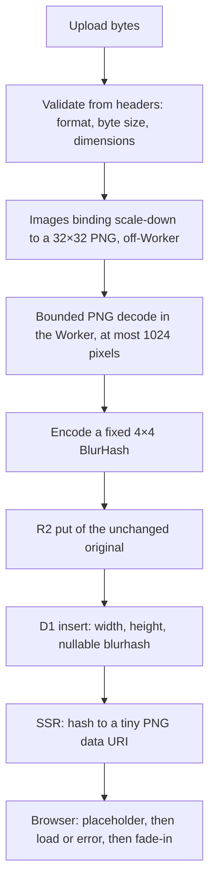

## 概要 -- プレースホルダは一度だけ計算するメタデータであり、リクエストごとの変換ではない

BlurHash は短い文字列——ここで使う固定 4×4 の変種なら 36 文字——で、画像の DCT 係数をひと握りだけ符号化したものだ。デコードすると、本物の画像が届く前にページが描画できる、ぼやけているが色の正確なサムネイルが得られる。Workers 上で興味深いのはエンコードそのものではなく（`blurhash` パッケージは数 KB の純粋な JavaScript だ）、**エンコーダが必要とするピクセルをどこから持ってくるか**だ。エンコーダは RGBA バッファを欲しがるが、それを得るために 4 MB の JPEG を Worker 内でデコードするのは、このランタイムには合わない形の仕事になる。CPU は無制限、メモリも無制限、そしてユーザーが制御するバイト列を任せなければならないデコーダ依存関係が増える。

以下のパイプラインはハッシュを**取り込み時に一度だけ**、意図的に小さくしたラスターから計算し、画像の寸法と並べて普通のメタデータとして保存する。以降の読み取りはすべて行の参照だ。リクエストごとに残る唯一の作業は、36 文字のハッシュを幅 16 ピクセル以下の PNG にデコードする SSR のステップで——安価だが、描画するカード 1 枚につき 1 回走るので、測るべき数字はアップロード 1 回ではなく一覧ページ全体だ（あるいは描画済みの data URI をキャッシュする）。



検証より下流はすべてベストエフォートだ。変換やデコードの失敗は `NULL` を保存し、アップロード自体は成功し、ブラウザ契約はハッシュの欠落を「画像を表示する」として扱う——エラーとしてではなく。このページのコードは本番のギャラリーから取ったもので、その Workers ランタイムの統合テスト、デプロイ先でのスモークテスト、294 行のバックフィルがすべて通っている。以下で引用する数字はその実行から来ている。

## 何かをデコードする前に、ヘッダーから検証する

デコーダがファイルを見る前に、最初の数十バイトから弾けるものは弾く。3 つのチェック、どれも安価だ：

- **フォーマット**はマジックバイトで判定する——`Content-Type` やファイル名は決して使わない。どちらもクライアントが指定するものだ。
- **バイトサイズ**は固定の上限と比較する。`Content-Length` は早期リジェクトに便利だが、あくまでヒントだ。クライアントは嘘をつけるし省略もできるので、バッファに読み込んだバイト列で上限を再チェックする。
- **寸法**はコンテナのヘッダーから読む。ピクセルをひとつもデコードせずに幅と高さを読めるので、信頼できない入力に対して実行しても安全になる。

| フォーマット | 寸法がある場所 | ガード |
|---|---|---|
| PNG | IHDR チャンク: 16–23 バイト目に幅と高さがビッグエンディアン u32 で入る | まず 8 バイトのシグネチャを確認する。IHDR は常に最初のチャンク |
| JPEG | 最初の SOF マーカー（`0xFFC0`–`0xFFCF`、ただし `C4`・`C8`・`CC` を除く）: セグメントのオフセット 3 と 5 に高さ、幅の順でビッグエンディアン u16 | マーカーテーブルを走査する。単独マーカー（`D0`–`D9`、`01`）には長さフィールドがない |
| WebP | `VP8 `（非可逆: `9D 01 2A` の開始コードの後に 14 ビットの幅/高さ）、`VP8L`（可逆: `0x2F` の後に 14 ビット値プラス 1 がパックされる）、`VP8X`（拡張: 24 ビットのキャンバスサイズプラス 1） | RIFF チャンクサイズをバッファ長と照合してから、その先を読む |

```ts
export const MAX_UPLOAD_BYTES = 4 * 1024 * 1024;
export const ALLOWED_IMAGE_TYPES = ["image/jpeg", "image/png", "image/webp"] as const;
export type AllowedImageType = (typeof ALLOWED_IMAGE_TYPES)[number];
export type ImageExt = "jpg" | "png" | "webp";

export function sniffImageType(
  bytes: Uint8Array,
): { contentType: AllowedImageType; ext: ImageExt } | null {
  if (bytes[0] === 0xff && bytes[1] === 0xd8 && bytes[2] === 0xff) {
    return { contentType: "image/jpeg", ext: "jpg" };
  }
  if (
    bytes.length >= 8 &&
    [0x89, 0x50, 0x4e, 0x47, 0x0d, 0x0a, 0x1a, 0x0a].every(
      (value, index) => bytes[index] === value,
    )
  ) {
    return { contentType: "image/png", ext: "png" };
  }
  if (
    bytes.length >= 12 &&
    bytes[0] === 0x52 && bytes[1] === 0x49 && bytes[2] === 0x46 && bytes[3] === 0x46 &&
    bytes[8] === 0x57 && bytes[9] === 0x45 && bytes[10] === 0x42 && bytes[11] === 0x50
  ) {
    return { contentType: "image/webp", ext: "webp" };
  }
  return null;
}

/** Cheap pre-parse reject. `Content-Length` is a hint, not authoritative. */
export function contentLengthExceedsLimit(request: Request): boolean {
  const raw = request.headers.get("content-length");
  if (raw === null || !/^\d+$/.test(raw)) return false;
  const length = Number(raw);
  // A syntactically numeric value can still overflow to Infinity. Treat that
  // as oversized instead of falling through to request.formData().
  return !Number.isSafeInteger(length) || length > MAX_UPLOAD_BYTES;
}

type StoreFailure =
  | { ok: false; reason: "empty" }
  | { ok: false; reason: "too-large"; size: number; limit: number }
  | { ok: false; reason: "unsupported-type" }
  | { ok: false; reason: "undecodable" };

type ValidatedImage = {
  ok: true;
  contentType: AllowedImageType;
  ext: ImageExt;
  size: number;
  width: number;
  height: number;
};

function validateImage(bytes: ArrayBuffer): ValidatedImage | StoreFailure {
  const size = bytes.byteLength;
  if (size === 0) return { ok: false, reason: "empty" };
  if (size > MAX_UPLOAD_BYTES) return { ok: false, reason: "too-large", size, limit: MAX_UPLOAD_BYTES };

  const view = new Uint8Array(bytes);
  const imageType = sniffImageType(view);
  if (!imageType) return { ok: false, reason: "unsupported-type" };
  // Reads PNG IHDR / JPEG SOF / WebP VP8, VP8L, VP8X headers -- no pixel decode.
  const dimensions = readImageDimensions(view);
  if (!dimensions) return { ok: false, reason: "undecodable" };
  return { ok: true, ...imageType, size, ...dimensions };
}
```

ヘッダーリーダーはプローブ用ライブラリを入れるより自分で書く価値がある——3 フォーマットで 100 行ほどで、どの分岐も切り詰められた入力や非正の寸法に対して例外を投げずに `null` を返す。検証を通ったファイルはデコード可能だと証明されたわけではない。*次の段階に渡す価値がある*ことが証明されただけだ。

このスニペットが呼び出し側に委ねている改良点が 2 つある。**宣言された寸法にも上限をかける**：4 MB のファイルでも 60,000×60,000 のラスターを正当に宣言できる。Images バインディングは Worker の外でそれを縮小するか拒否するが、軸ごとの上限（積がオーバーフローしないよう軸ごとに確認する）は変換リクエストを健全に保ち、SSR 側のガードも兼ねる。そして**マルチパートフォームでは、`request.formData()` を呼ぶ*前に* `Content-Length` をファイル上限プラス小さな枠組み分と比較する**——このヘッダーが表すのはマルチパートのボディ全体であってファイルではなく、`formData()` はファイルごとのチェックが走る前にそのすべてをバッファするからだ。

## ピクセル処理の前に縮小する: 重いデコードは Images バインディングが Worker の外で行う

このパイプラインを Worker に収まらせるただひとつのアイデア：**オリジナルを JavaScript で決してデコードしない**。Cloudflare Images バインディングは isolate の外にあるサービスへの RPC なので、それを await するのは I/O であって、あなたの予算に対する CPU 時間ではない。最大 32×32 への `scale-down` と PNG 出力を頼めば、あなたのコードが触るピクセルはその結果に含まれる 1,024 個以下だけになる。

```toml
# wrangler.toml -- environment bindings are non-inheritable, so a preview
# environment has to declare the binding again.
[images]
binding = "IMAGES"

[env.preview.images]
binding = "IMAGES"
```

```ts
import { encode as encodeBlurhash } from "blurhash";

export const BLURHASH_COMPONENTS = 4;
export const MAX_BLURHASH_AXIS = 32;
export const MAX_BLURHASH_PIXELS = MAX_BLURHASH_AXIS * MAX_BLURHASH_AXIS;
export const MAX_TRANSFORMED_PNG_BYTES = 64 * 1024;

type BlurhashStage = "transform" | "buffer" | "decode" | "normalise" | "encode";

function freshByteStream(bytes: ArrayBuffer): ReadableStream<Uint8Array> {
  return new ReadableStream({
    start(controller) {
      controller.enqueue(new Uint8Array(bytes));
      controller.close();
    },
  });
}

/** Best-effort wrapper used by photo ingestion; it never exposes upload data in logs. */
export async function tryGeneratePhotoBlurhash(env: Env, originalBytes: ArrayBuffer): Promise<string | null> {
  let stage: BlurhashStage = "transform";
  try {
    const transformed = await env.IMAGES.input(freshByteStream(originalBytes))
      .transform({ fit: "scale-down", width: MAX_BLURHASH_AXIS, height: MAX_BLURHASH_AXIS })
      .output({ format: "image/png", anim: false });
    stage = "buffer";
    const png = await readBounded(transformed.image(), MAX_TRANSFORMED_PNG_BYTES);
    stage = "decode";
    const decoded = decodeTransformedPng(png);
    stage = "normalise";
    const image = ensureMinimumAxes(decoded.pixels, decoded.width, decoded.height);
    stage = "encode";
    return encodeBlurhash(
      image.pixels,
      image.width,
      image.height,
      BLURHASH_COMPONENTS,
      BLURHASH_COMPONENTS,
    );
  } catch (error) {
    console.warn({
      event: "photo_blurhash_generation_failed",
      stage,
      errorType: error instanceof Error ? error.name : typeof error,
      // ImagesError carries a numeric code (9422 = transformation quota exhausted);
      // the code is safe to log and separates "quota" from "outage" and "bad input".
      errorCode: typeof (error as { code?: unknown })?.code === "number" ? (error as { code: number }).code : undefined,
    });
    return null;
  }
}
```

この関数の中で重みを持つ細部が 3 つある：

- **`contain` や `cover` ではなく `scale-down`。** 決して拡大せず、決してクロップしないので、6×5 のテストフィクスチャは 6×5 のまま返り、4000×3000 の写真は 32×24 で返る——アスペクト比が保たれ、プレースホルダが欲しい入力そのものになる。
- **出力ストリームの上限付き読み取り。** `readBounded` はチャンクを積み上げ、累計が 64 KiB を超えた瞬間にリーダーをキャンセルする——MCP レシピの [`readBodyWithCap`](./remote-mcp-workers.mdx#ボディキャップ-json-パースより前に強制する) と同じ形を、リクエストボディではなくバインディングの出力に適用したものだ。32×32 の PNG は数百バイトから数 KiB だ。この上限は、振る舞いのおかしい変換が Worker に大きなものをバッファさせることを決して許さないために存在する。
- **固定 4×4 のコンポーネント数。** BlurHash はエンコーダに軸ごと 1–9 のコンポーネント数を選ばせるが、4×4 に固定すると 36 文字の定長文字列、一定のデコードコスト、そしてサイズフラグ——`(4-1) + (4-1) * 9 = 30` の base83 桁である `U`——を先頭文字として確認できるバリデータが手に入る。

`anim: false` と `errorCode` フィールドは、本番コードの上に足した小さな追加 2 つで、このページのためにローカルの Workers ランタイムで再検証している。前者は静的な単一フレーム出力を固定し（後述のデコーダによる APNG の拒否は多層防御として残る）、後者はベストエフォートの節で説明する。

`ensureMinimumAxes` は、いずれかの軸で 4 ピクセル未満のものを最近傍法でアップサンプルする。エンコーダは軸ごとに少なくともコンポーネント数と同じピクセル数を必要とし、1×1 のアップロードもまた正当なアップロードだからだ。

```ts
async function readBounded(
  stream: ReadableStream<Uint8Array>,
  limit: number,
): Promise<Uint8Array> {
  const reader = stream.getReader();
  const chunks: Uint8Array[] = [];
  let length = 0;

  try {
    while (true) {
      const { done, value } = await reader.read();
      if (done) break;
      if (!(value instanceof Uint8Array)) throw new Error("invalid transformed chunk");
      length += value.byteLength;
      if (length > limit) {
        await reader.cancel("transformed PNG exceeds byte limit");
        throw new Error("transformed PNG exceeds byte limit");
      }
      chunks.push(value);
    }
  } finally {
    reader.releaseLock();
  }

  const bytes = new Uint8Array(length);
  let offset = 0;
  for (const chunk of chunks) {
    bytes.set(chunk, offset);
    offset += chunk.byteLength;
  }
  return bytes;
}

function ensureMinimumAxes(
  pixels: Uint8ClampedArray,
  width: number,
  height: number,
): { pixels: Uint8ClampedArray; width: number; height: number } {
  const targetWidth = Math.max(BLURHASH_COMPONENTS, width);
  const targetHeight = Math.max(BLURHASH_COMPONENTS, height);
  if (targetWidth === width && targetHeight === height) return { pixels, width, height };

  const resized = new Uint8ClampedArray(targetWidth * targetHeight * 4);
  for (let y = 0; y < targetHeight; y += 1) {
    const sourceY = Math.min(height - 1, Math.floor(y * height / targetHeight));
    for (let x = 0; x < targetWidth; x += 1) {
      const sourceX = Math.min(width - 1, Math.floor(x * width / targetWidth));
      const source = (sourceY * width + sourceX) * 4;
      resized.set(pixels.subarray(source, source + 4), (y * targetWidth + x) * 4);
    }
  }
  return { pixels: resized, width: targetWidth, height: targetHeight };
}
```

:::note[生ピクセル出力なら PNG デコードを丸ごと省けるかもしれない]
現在の Workers の型定義は `ImageOutputOptions` に `format: "rgb" | "rgba"` も列挙している——バインディングから直接得られる生のピクセルで、出力寸法は検証済みのソースのアスペクト比から導く（生の出力にはヘッダーがない）。これなら後述の PNG 段階全体が、32 × 32 × 4 = 4 KiB の上限付き読み取り 1 回に置き換わる。このページのパイプラインは PNG 経路で検証したものだ。生出力を採用するならローカルのシミュレータ*と*デプロイ先の両方で検証し、`readBounded` は残すこと——生のバッファには照合できるヘッダーがない。
:::

## 小さな PNG を、信用せずにデコードする

変換後の PNG は Cloudflare 自身のサービスから来るので脅威モデルは穏やかだ——しかしデコーダは JavaScript の依存関係（`fast-png`）で、自分のコードが生成したのではないバイト列に対して Worker 内で動くのであり、ガードのコストはほとんどゼロだ。ガードはまた、変換が期待どおりに振る舞わ*なかった*ときにもパイプラインを安全に保つ（後述のローカルとデプロイ先の節を参照）。もし 200×200 の PNG が届いても、ピクセルを 1 行もインフレートする前に契約チェックが弾く。

3 つの層を、この順で：

1. **IHDR 契約。** 幅と高さは 32 以下、幅 × 高さは 1,024 以下、ビット深度 8、チャンネル数に対応づけられるカラータイプ、インターレースなし、未知の圧縮方式やフィルタ方式なし。
2. **バイト予算付きのインフレート事前確認。** PNG のピクセルデータは zlib 圧縮されており、小さな IDAT が際限なく膨張しうる。`fflate` のストリーミング `Unzlib` で一度インフレートし、累計が `height * (1 + width * channels)`——整形式の画像が生成しなければならない正確なバイト数——を超えたら例外を投げるコールバックを付ける。`Unzlib` は各 `push()` を丸ごとインフレートしてからコールバックを呼ぶので、IDAT は 512 バイトずつ切って渡す。deflate の膨張率の上限は約 1032:1 なので、1 スライスが膨らめる量は約 512 KiB に収まる——64 KiB のストリームを一度に渡すと、チェックが走る前に約 66 MB まで膨らみうる。同じチャンク走査で `iCCP`（埋め込みプロファイル）、APNG のチャンク、そして未知の*クリティカル*チャンクを弾く。
3. **デコードと正規化。** ここで初めて本物のデコーダを（CRC チェックを有効にして）呼び、報告された幅・高さ・深度・チャンネル数を IHDR 契約と突き合わせ、グレー、グレー+アルファ、RGB、RGBA をひとつの RGBA バッファに展開する——`tRNS` の透明度を尊重して、透明な PNG が黙って不透明にならないようにする。

正規化では直せないものが 1 つある：**BlurHash にはアルファチャンネルがない。** エンコーダは RGB を読み、アルファを無視するので、透明なピクセルはその下にある RGB——多くの場合は黒——をそのまま寄与させる。透明なアップロードが重要なら、まず既知の背景に合成し（バインディングの `background` 出力オプション、または RGBA バッファに対する合成ステップ）、バックフィルでも同じ背景を使う。さもないと 2 つの経路が食い違う。

```ts
import { decode as decodePng } from "fast-png";
import { Unzlib } from "fflate";

type PngContract = {
  width: number;
  height: number;
  channels: 1 | 2 | 3 | 4;
};

const PNG_SIGNATURE = [0x89, 0x50, 0x4e, 0x47, 0x0d, 0x0a, 0x1a, 0x0a] as const;
// Colour type -> channel count. Indexed colour (3) is deliberately absent: the
// transform never emits it, and a palette would make the byte budget below wrong.
const PNG_CHANNELS = new Map<number, PngContract["channels"]>([
  [0, 1],
  [2, 3],
  [4, 2],
  [6, 4],
]);

function inspectPngContract(bytes: Uint8Array): PngContract {
  if (bytes.byteLength < 33) throw new Error("truncated PNG");
  for (let index = 0; index < PNG_SIGNATURE.length; index += 1) {
    if (bytes[index] !== PNG_SIGNATURE[index]) throw new Error("invalid PNG signature");
  }

  const view = new DataView(bytes.buffer, bytes.byteOffset, bytes.byteLength);
  if (
    view.getUint32(8) !== 13 ||
    bytes[12] !== 0x49 || bytes[13] !== 0x48 || bytes[14] !== 0x44 || bytes[15] !== 0x52
  ) {
    throw new Error("invalid PNG IHDR");
  }

  const width = view.getUint32(16);
  const height = view.getUint32(20);
  if (width === 0 || height === 0) throw new Error("zero PNG dimension");
  if (width > MAX_BLURHASH_AXIS || height > MAX_BLURHASH_AXIS) {
    throw new Error("PNG dimension exceeds limit");
  }
  if (width * height > MAX_BLURHASH_PIXELS) throw new Error("PNG pixel count exceeds limit");
  if (bytes[24] !== 8) throw new Error("unsupported PNG bit depth");

  const channels = PNG_CHANNELS.get(bytes[25]);
  if (channels === undefined) throw new Error("unsupported PNG colour type");
  if (bytes[26] !== 0 || bytes[27] !== 0) throw new Error("unsupported PNG compression or filter");
  if (bytes[28] !== 0) throw new Error("unsupported interlaced PNG");
  return { width, height, channels };
}

function chunkType(bytes: Uint8Array, offset: number): string {
  return String.fromCharCode(bytes[offset], bytes[offset + 1], bytes[offset + 2], bytes[offset + 3]);
}

// fflate's Unzlib inflates a whole push() before it calls back, so the budget
// is only checked per push. Deflate expands at most ~1032:1, which bounds one
// slice to ~512 KiB of inflated data no matter what the IDAT contains.
const INFLATE_PUSH_BYTES = 512;

/**
 * Inflate once with a strict output budget before handing data to fast-png.
 * Pushing in small slices keeps a malicious IDAT from expanding far past the
 * budget before the check runs.
 */
function verifyPngDataBudget(bytes: Uint8Array, contract: PngContract): void {
  const expectedBytes = contract.height * (1 + contract.width * contract.channels);
  let inflatedBytes = 0;
  const inflater = new Unzlib((chunk) => {
    inflatedBytes += chunk.byteLength;
    if (inflatedBytes > expectedBytes) throw new Error("inflated PNG data exceeds pixel budget");
  });

  const view = new DataView(bytes.buffer, bytes.byteOffset, bytes.byteLength);
  let offset = 8;
  let sawIdat = false;
  let idatEnded = false;
  let sawIend = false;

  while (offset < bytes.byteLength) {
    if (bytes.byteLength - offset < 12) throw new Error("truncated PNG chunk");
    const length = view.getUint32(offset);
    if (length > bytes.byteLength - offset - 12) throw new Error("PNG chunk exceeds encoded data");
    const typeOffset = offset + 4;
    const type = chunkType(bytes, typeOffset);
    const dataOffset = offset + 8;

    if (offset === 8 && type !== "IHDR") throw new Error("PNG IHDR is not first");
    if (offset !== 8 && type === "IHDR") throw new Error("duplicate PNG IHDR");
    if (type === "iCCP") throw new Error("embedded PNG profile is unsupported");
    if (type === "acTL" || type === "fcTL" || type === "fdAT") {
      throw new Error("animated PNG is unsupported");
    }

    if (type === "IDAT") {
      if (idatEnded) throw new Error("non-consecutive PNG IDAT chunks");
      sawIdat = true;
      for (let start = dataOffset; start < dataOffset + length; start += INFLATE_PUSH_BYTES) {
        inflater.push(bytes.subarray(start, Math.min(start + INFLATE_PUSH_BYTES, dataOffset + length)), false);
      }
    } else if (sawIdat) {
      idatEnded = true;
    }

    if (type === "IEND") {
      if (length !== 0) throw new Error("invalid PNG IEND");
      sawIend = true;
      offset += 12;
      break;
    }

    // Reject unknown critical chunks (uppercase first letter); this also rejects a
    // suggested PLTE, which the transform never emits. Remaining ancillary chunks
    // are bounded by their encoded size and fast-png reads or skips them -- iCCP,
    // the one it would inflate, was rejected above.
    if (type !== "IHDR" && type !== "IDAT" && type.charCodeAt(0) <= 0x5a) {
      throw new Error("unsupported critical PNG chunk");
    }
    offset += length + 12;
  }

  if (!sawIdat || !sawIend || offset !== bytes.byteLength) throw new Error("incomplete PNG chunk sequence");
  inflater.push(new Uint8Array(0), true);
  if (inflatedBytes !== expectedBytes) throw new Error("inflated PNG data is inconsistent");
}

export function decodeTransformedPng(
  bytes: Uint8Array,
): { pixels: Uint8ClampedArray; width: number; height: number } {
  const contract = inspectPngContract(bytes);
  verifyPngDataBudget(bytes, contract);
  const decoded = decodePng(bytes, { checkCrc: true });
  if (
    decoded.width !== contract.width ||
    decoded.height !== contract.height ||
    decoded.depth !== 8 ||
    decoded.channels !== contract.channels
  ) {
    throw new Error("decoded PNG metadata is inconsistent");
  }

  const expectedLength = contract.width * contract.height * contract.channels;
  if (decoded.data.BYTES_PER_ELEMENT !== 1 || decoded.data.length !== expectedLength) {
    throw new Error("decoded PNG channel data is inconsistent");
  }

  const transparency = decoded.transparency;
  if (transparency !== undefined) {
    const expected = contract.channels === 1 ? 1 : contract.channels === 3 ? 3 : 0;
    if (transparency.length !== expected) throw new Error("invalid PNG transparency data");
  }

  const rgba = new Uint8ClampedArray(contract.width * contract.height * 4);
  for (let pixel = 0; pixel < contract.width * contract.height; pixel += 1) {
    const source = pixel * contract.channels;
    const target = pixel * 4;
    if (contract.channels === 1) {
      const grey = decoded.data[source];
      rgba[target] = grey;
      rgba[target + 1] = grey;
      rgba[target + 2] = grey;
      rgba[target + 3] = transparency?.[0] === grey ? 0 : 255;
    } else if (contract.channels === 2) {
      const grey = decoded.data[source];
      rgba[target] = grey;
      rgba[target + 1] = grey;
      rgba[target + 2] = grey;
      rgba[target + 3] = decoded.data[source + 1];
    } else {
      const red = decoded.data[source];
      const green = decoded.data[source + 1];
      const blue = decoded.data[source + 2];
      rgba[target] = red;
      rgba[target + 1] = green;
      rgba[target + 2] = blue;
      rgba[target + 3] = contract.channels === 4
        ? decoded.data[source + 3]
        : transparency?.[0] === red && transparency[1] === green && transparency[2] === blue
          ? 0
          : 255;
    }
  }
  return { pixels: rgba, width: contract.width, height: contract.height };
}
```

## Images バインディング、純 JS デコーダ、WASM: 大きなデコードがどこで起きるかで選ぶ

| 経路 | オリジナルがデコードされる場所 | Worker 内の CPU / メモリ | バンドルコスト | ローカル開発 | 用途 |
|---|---|---|---|---|---|
| **Images バインディング**（`env.IMAGES`） | Worker の外、Cloudflare のサービス内 | 小さな結果の分だけ | なし | オプションのサブセットがエミュレートされる | オリジナルの縮小——常に最初のステップ |
| **純 JS デコーダ**（`fast-png`、`jpeg-js` など） | isolate の中 | ピクセル数に比例 | 数十 KB | 完全 | すでに上限のかかったラスターのデコード |
| **WASM コーデック**（photon、squoosh のコーデック、libvips ビルド） | isolate の中 | ピクセル数に比例、加えてインスタンス化のコスト | 数百 KB から MB 単位の `.wasm` | 完全 | バインディングでは表現できない変換を、すでに上限のかかった入力に対して行う |
| **Sharp** | -- | -- | ネイティブアドオン: `workerd` では動かない | -- | バックフィルスクリプトのような Node 専用ツール。Worker では決して使わない |

ここから出てくるルール：**バインディングで問題を小さくし、それから JavaScript で小さな問題を解く。** 純 JS や WASM のデコーダは 32×32 の PNG には十分だが、4 MB のオリジナルに対しては無制限の CPU とメモリの負債になる。Worker 内でオリジナルをデコードするために WASM に手を伸ばすのは、Images のクォータをコードサイズの増加、isolate ごとのインスタンス化コスト、そして新たな故障モードとしての 128 MB のメモリ上限と引き換えにすることだ——しかもバイト数と寸法の上限は依然として必要になる。小さなファイルが非常に大きなラスターにデコードされることがあるからだ。

バインディングを飛ばして上限付きのラスターを直接デコードする理由は 2 つある。アカウントが Images の変換を使えない場合と、入力が構造上すでに小さい場合（アイコンのエンドポイント、スプライトシート）だ。どちらの場合もヘッダー検証は先に走り、`MAX_BLURHASH_PIXELS` は依然として適用される——ファイルサイズにではなく、デコード後のラスターに。

## 設計としてのベストエフォート: NULL は正当な結果であり、ログに画像は決して含めない

検証より後はすべて任意だ。`tryGeneratePhotoBlurhash` はどんな失敗でも `null` を返し、アップロードは進行し、D1 のカラムは nullable になっている。これはエンジニアリング上の判断であると同時にプロダクト上の判断でもある。プレースホルダはおまけであり、おまけが失敗したせいで失敗するアップロードはバグだ。

`catch` がログに出すのはちょうど 3 つ：失敗した段階、エラーのコンストラクタ名、そして——バインディングが `ImagesError` を投げた場合は——その数値の `code` だ。メッセージ（デコーダのメッセージはバイト列を引用しうる）でも、キーでも、ユーザーでも、寸法でもない。段階は「Images サービスが落ちている」（`transform`）と「デコーダが何かを弾いた」（`decode`）と「出力が予算を超えた」（`buffer`）を見分け、コードは `transform` 段階の中でクォータ超過（`9422`）を障害や不正入力から見分ける。オペレータに必要なのはそれだけだ。

:::warning[Images の変換にはクォータがあり、それに達してもアップロードを失敗させてはならない]
生成するハッシュ 1 つにつき Images の変換が 1 回かかる。Free プランでは月あたりの*ユニーク*変換回数に固定の上限がある（執筆時点で 5,000——現在の料金ページを確認すること）。アップロードはどれも新しい画像なので、予算はおおよそアップロード 1 回につき 1 回と見積もる。それを超えるとバインディングは `ERROR 9422` で失敗する。この設計では、それはアップロードごとに 1 件の `transform` 段階の警告と `NULL` のハッシュとして現れ、オリジナルは依然として R2 に、行は依然として D1 に着地する。あとで意図的なバックフィルが穴を埋める。もしプレースホルダが必須だったなら、クォータは障害になっていた。
:::

したがって失敗時の順序は明示的だ：

| 失敗する段階 | ユーザーに見えるもの | 保存されるもの |
|---|---|---|
| 検証（フォーマット、サイズ、寸法） | 4xx、ファイルを選び直す | 何も保存しない |
| 変換 / バッファ / デコード / エンコード | 成功 | R2 オブジェクトと、`blurhash = NULL` の D1 の行 |
| R2 の `put()` | 5xx、リトライ | 何も保存しない——まだ何も書いていない |
| D1 の INSERT | 5xx、リトライ | 何も保存しない——R2 オブジェクトはベストエフォートで削除する（次節） |

この表が開いたままにしている判断が 1 つある。ヘッダー検査が証明するのは*もっともらしい*画像であることだけだ。ヘッダーチェックが通したバイト列をバインディングが画像ではないとして拒否したとき、あなたはブラウザも描画に失敗しかねないオリジナルを保存しようとしている。検証済みの設計はそれをベストエフォートのままにしている——ヘッダーチェックが門であり、行は依然として着地する——が、より厳格な代替案は、バインディングからの入力フォーマットエラーを 4xx として扱い、`NULL` はクォータと一時的な失敗のために取っておくことだ。どちらも擁護できる。選択を自分の失敗表に書き込むこと。

## ブロブを先に、行を最後に永続化し、ハッシュはその両方より前に計算する

メタデータはこれから保存するバイト列から導出するので、順序は 検証 → ハッシュ → R2 の `put()` → D1 の INSERT になる。帰結が 2 つある：

- **ハッシュは R2 への書き込みより前に計算する。** したがってハッシュの失敗が孤立オブジェクトを残すことは決してない——片付けるものが何もなく、コードは `null` のまま先に進む。
- **どの行からも参照される前に R2 オブジェクトが存在する**——R2 のページがあらゆる R2 + D1 の組み合わせについて導いているのと同じ [ブロブを先に、行を最後に](../storage/r2.mdx#r2-と-d1-のペアリング-ブロブを先に、行を最後に) の不変条件だ。行は存在しないブロブを決して指してはならない。

```ts
/** Validate, best-effort preprocess, then persist unchanged original photo bytes. */
export async function preprocessAndStorePhoto(
  env: Env,
  bytes: ArrayBuffer,
): Promise<PhotoStoreResult> {
  const validated = validateImage(bytes);
  if (!validated.ok) return validated;
  const blurhash = await tryGeneratePhotoBlurhash(env, bytes);
  const key = buildKey("photos", crypto.randomUUID(), validated.ext);
  await env.BUCKET.put(key, bytes, { httpMetadata: { contentType: validated.contentType } });
  return { ...validated, key, blurhash };
}
```

オリジナルは**無変更のまま**保存する——32×32 の PNG は使い捨ての中間物で、R2 に触れることはない。無変更にはメタデータも含まれる。EXIF と、その中の GPS 位置情報は、他の何かが取り除かない限りアップロードされたとおりに配信される——このレシピが代わりに決めてはくれないプロダクト上の判断だ。アップロードハンドラはそのあと行を INSERT し、それに失敗したら、いま書いたばかりのオブジェクトをベストエフォートで削除する：

```ts
let stored: PhotoStoreResult;
try {
  stored = await preprocessAndStorePhoto(env, await photo.arrayBuffer());
} catch (error) {
  const failure = storageFailure(error);
  return renderPage({ request, user, values, error: failure.message, status: failure.status, photoReselect: true });
}
if (!stored.ok) {
  const failure = resultFailure(stored);
  return renderPage({ request, user, values, error: failure.message, status: failure.status, photoReselect: true });
}

let photoId: number;
try {
  photoId = await insertPhoto(env, {
    userId: user.id,
    title,
    description,
    r2Key: stored.key,
    contentType: stored.contentType,
    width: stored.width,
    height: stored.height,
    blurhash: stored.blurhash,
    tags,
  });
} catch {
  // A thrown D1 error is not proof the insert did not commit. Delete the object
  // only when the query succeeds AND finds no row; if D1 is unreachable, leave
  // the orphan for the reclamation job rather than risk a dangling pointer.
  const committed = await env.DB
    .prepare("SELECT id FROM photos WHERE r2_key = ?")
    .bind(stored.key)
    .first<{ id: number }>()
    .catch(() => undefined);
  if (committed === null) {
    try {
      await deleteObjects(env, [stored.key]);
    } catch {
      // Cleanup is best effort; never replace the user-facing D1 failure.
    }
  }
  return renderPage({
    request,
    user,
    values,
    error: "Could not save your photo, please try again.",
    status: 500,
    photoReselect: true,
  });
}
```

本番のハンドラはこの `catch` の中で無条件に削除している。上の存在確認はより厳格な形だ。`batch()` はトランザクショナルだが、コミット*後*のネットワーク障害も同じ例外として現れ、そこでオブジェクトを削除すれば、この順序付けが防ぐはずの宙ぶらりんのポインタそのものを製造してしまう。`r2_key` は一意な UUID なので確認は安価で、削除するのは確定的な「行なし」のときだけだ——D1 に到達できなければ孤立オブジェクトが残り、猶予期間の後に [回収ジョブ](../storage/r2.mdx#r2-と-d1-のペアリング-孤立したブロブの回収) が集める。

リトライの意味論は不変キーから導かれる。ユーザーがリトライするとハンドラは**新しい** UUID キーを発行し、前回の試行の残りものがあっても孤立オブジェクトであって、宙ぶらりんのポインタには決してならない。新しいキーが与えて*くれない*のは冪等性だ。実際にはコミットされていたリクエストのタイムアウト後にクライアントがリトライすると、写真が重複する。それが問題になるなら、クライアントに idempotency キーを渡して書き込みの前に claim する——[Idempotency-Key 台帳](./idempotency-ledger.mdx) のレシピがそのパターンだ。

## D1 のカラムか R2 の customMetadata か: 読み取り経路に従う

どちらのストアも 36 文字の文字列を保持できる。決め手になる問いは、**ハッシュを必要とするページがすでにどちらのストアを読んでいるか**だ。

| 読み取り経路 | ハッシュの正しい置き場所 |
|---|---|
| N 件の D1 の行から N 枚のカードを描画するギャラリーや一覧ページ | **D1 のカラム**——ハッシュは同じ `SELECT` で届く。`customMetadata` だと HTML の最初の 1 バイトを出す前に N 回の余分な `head()` 呼び出しがかかる |
| そのオブジェクトに対してすでに `env.BUCKET.get(key)` をしている配信プロキシ | `customMetadata` はただで使える——しかしそれは*画像のバイト列と一緒に*届くので、その同じ画像のプレースホルダを描くには遅すぎる |
| まだハッシュのない行を見つけなければならないバックフィルや監査 | **D1 のカラム**——`WHERE blurhash IS NULL` はクエリ 1 つで済む。R2 に「このメタデータキーを持たないオブジェクトはどれか」と尋ねるには、バケット全体を list してオブジェクトごとに `head()` を呼ぶしかない |

プレースホルダについての答えは D1（あるいは一覧ページが読む行ストアがどれであれ、それ）だ。要点は画像リクエストが出て行く*前に*ハッシュを手にしていることだからだ。`put()` 時に `customMetadata` へコピーを書いておくのは無害で——行が失われた場合にもオブジェクトが自己記述的であり続ける——しかしそれは二次的なコピーであって、読み取り経路ではない。

```sql
-- width / height are NOT NULL: they come from header validation and always exist.
-- blurhash is nullable: generation is best-effort, and legacy rows predate the feature.
ALTER TABLE photos ADD COLUMN blurhash TEXT;
```

## 同期処理か Queues か waitUntil() か: レスポンスが何を約束するかで選ぶ

| ハッシュを計算する場所 | 保証 | コスト | 向いている状況 |
|---|---|---|---|
| **アップロードリクエストの中で同期的に**（このレシピ） | レスポンスは最終状態を反映する。行はハッシュ付きか `NULL` で書かれている | アップロードに Images RPC 1 回分のレイテンシ。1,024 ピクセル以下に対する数 ms の CPU | 作業が小さく上限があり、「アップロード完了」が「メタデータ完了」を意味すべきとき |
| **レスポンス後に `ctx.waitUntil()`** | ベストエフォート——30 秒の経過時間で静かにキャンセルされる——しかも D1 への 2 回目の書き込みが必要 | 追加のレイテンシはゼロ。書き込みが 1 回から 2 回に。同時に走るバックフィルとのレース | アップロードのレスポンスがレイテンシ重視で、ハッシュがしばらく欠けていても許容できるとき |
| **Queues** | 少なくとも 1 回、リトライとデッドレターキュー付きで、独自の CPU 予算を持つコンシューマ内で実行 | レスポンス前に await するプロデューサの `send()` には行 id と R2 キーを載せる——バイト列は決して載せない。Queues のメッセージは 128 KB が上限だ。コンシューマ Worker。プレースホルダは結果整合になる | より重い派生物（複数サイズ、フォーマット変換）や、変換クォータのエラーを `NULL` として永続化するのではなく後でリトライしたいとき |

同期処理が正しいデフォルトなのは、まさに縮小が高コストな部分を Worker の外へ移したから*こそ*だ。残るのは await する RPC 1 回と自明なエンコードで、リクエストの中に十分収まる。アップロードごとの作業が増えた瞬間——複数の派生物、より大きなラスターに対する WASM コーデック——CPU コストが判断を Queues へ動かすのであって、`waitUntil()` へではない。`waitUntil()` が延ばすのは経過時間であって CPU ではなく、誰にも告げずにキャンセルされる。[ランタイムの落とし穴](../workers/runtime-gotchas.mdx#ctx-waituntil-と-scheduled-2-つの異なる時計) のページが 2 つの時計と [Queues という逃げ道](../workers/runtime-gotchas.mdx#ctx-waituntil-と-scheduled-2-つの異なる時計-30-秒では足りないときの-3-つの逃げ道) を扱っている。

それでも遅延させるなら、`blurhash = NULL` の行を**先に** INSERT し、バックグラウンドのタスクには条件付き UPDATE で埋めさせる。そうすればバックフィルや同時に走る書き込み手を決して上書きできない：

```ts
export default {
  async fetch(request: Request, env: Env, ctx: ExecutionContext): Promise<Response> {
    const bytes = await request.arrayBuffer();
    // validateAndStore is preprocessAndStorePhoto without the hash step; the
    // delete-on-insert-failure cleanup from the previous section still applies.
    const stored = await validateAndStore(env, bytes, { prefix: "photos" });
    if (!stored.ok) return failureResponse(stored);
    const id = await insertPhoto(env, { ...rowFrom(stored), blurhash: null });

    // Best-effort: shares the 30s elapsed window with every other waitUntil()
    // in this invocation, and is cancelled silently if it overruns.
    ctx.waitUntil(
      tryGeneratePhotoBlurhash(env, bytes).then(async (blurhash) => {
        if (blurhash === null || !isCanonicalPhotoBlurhash(blurhash)) return;
        await env.DB
          .prepare("UPDATE photos SET blurhash = ? WHERE id = ? AND blurhash IS NULL")
          .bind(blurhash, id)
          .run();
      }),
    );
    return Response.json({ id }, { status: 201 });
  },
};
```

## 出荷前に記録しておくべきランタイム制約

これらはリポジトリ（README やランブック）に書き留めておく。どれも、ローカルテストが通っている限り見えないものだからだ：

- **バンドル: Sharp を Worker に決して到達させない。** Sharp はネイティブの libvips バインディングで、`workerd` ではまったく動かない。Worker のコードからバックフィルのヘルパーへ至るどんな import 経路も、ビルド時か起動時の失敗になる。Sharp は `devDependency` に留め、バックフィルは `scripts/` 配下の Node 専用 `.mjs` に留め、ビルド済みバンドルにそれが含まれていないことを確認するチェックを足す：

  ```sh
  # Fails if the Node-only Sharp path leaked into the Worker bundle.
  if grep -q 'sharp' dist/_worker.js; then
    echo "sharp leaked into the Worker bundle" >&2
    exit 1
  fi
  ```

- **コードサイズ。** `blurhash`、`fast-png`、`fflate` は小さな純 JS パッケージだ——合わせて minify 後に数十 KB。針を動かすのは WASM コーデックで、採用する前に自分のプランの圧縮後 Worker サイズ上限（執筆時点で Free は 3 MB、Paid は 10 MB）と照らし合わせる。
- **初期化。** モジュールスコープにデコーダのセットアップや WASM のインスタンス化を置かない。アップロード時にだけ画像処理をする Worker が、あらゆるルートのあらゆるコールドスタートでそのコストを払うべきではない。
- **CPU。** 縮小の後、Worker 内の作業は `MAX_BLURHASH_PIXELS`（1,024 ピクセル）で上限がかかるので、Free プランの 10 ms の CPU 予算にも収まる。Images の RPC 自体は壁時計時間であって CPU ではない。実際に測るべき数字は SSR 側——描画するカード 1 枚につき BlurHash のデコード 1 回と PNG のエンコード 1 回——を、最大の一覧ページで測ったものだ。
- **メモリ。** 最大の割り当てはオリジナルのアップロードバッファ（`MAX_UPLOAD_BYTES` で上限）と 64 KiB 以下の PNG だ。どちらも 128 MB の isolate 上限からは遠く、そう保っているのが上限値だ。
- **Images のクォータとコスト。** アップロード 1 回につき 1 回の変換がアカウントの Images 割当に対して数えられる（上の警告を参照）。予算はページビューではなく想定アップロード数に対して見積もる——ページビューは決して変換を起こさない。
- **ローカルとデプロイ先。** 次の節。

### ローカルの Images バインディングはサブセットなので fit とクロップはデプロイ先で検証する

`wrangler dev` はクレデンシャルなしで Images バインディングをエミュレートし、それが後述の Workers ランタイムのテストを可能にしている。しかしローカル実装がカバーするのは変換オプションのサブセットだけで——観測できたのは `width`、`height`、`rotate`、`format`——Cloudflare のネットワーク側のデコードやクロップの挙動は再現しない。実際には：

- 出力のコンテンツタイプと、32×32 以下のラスターが返ってくることは、ローカルで**アサートできる**。
- `fit` の意味論——出力の正確な寸法も含む。それを決めるのは `scale-down` だからだ——、`gravity: "auto"`、その他本物のデコーダに依存するものは**できない**——デプロイしたプレビューに対して一度検証する。
- パイプラインはどちらでも安全だ。`inspectPngContract` が 32×32 を超えるどんなラスターも弾くので、`fit` を無視して予期しないものを返すローカルの変換があっても、結果は `decode` 段階の `NULL` であって、無制限のデコードにはならない。

ローカルのバインディングは「API の形が正しい」、デプロイ先のチェックは「ピクセルが正しい」として扱う。[バインディング対応表](../workers/local-dev-bindings.mdx#バインディング対応表) が他のバインディングと並べてこれを載せている。

## ブラウザ契約: プレースホルダ、次に load か error、次にフェードイン -- そして画像はデフォルトでは決して隠さない

描画側にはひとつだけ譲れないルールがある：**JavaScript が動かなかった、遅れて動いた、2 回動いた、という理由で画像が見えなくなってはならない。** 以下のすべての判断はそこから導かれる。

### SSR がハッシュを小さな PNG に変換し、その前に検証する

サーバーはハッシュを幅 16 ピクセル以下の PNG にデコードし、ラッパーの `::before` に `data:` URI としてインライン化する——プレースホルダは HTML だけで描画され、クライアント側のデコードも、canvas も、スクリプトへの依存もない。幅と高さも行から来るので、バイトが 1 つも届く前にボックスは最終的なアスペクト比を持ち、レイアウトシフトは起きない。

```ts
import { decode } from "blurhash";
import { encode as encodePng } from "fast-png";

const BASE83_ALPHABET = "0123456789ABCDEFGHIJKLMNOPQRSTUVWXYZabcdefghijklmnopqrstuvwxyz#$%*+,-.:;=?@[]^_{|}~";
const BASE83 = new Set(BASE83_ALPHABET);
const BLURHASH_COMPONENTS = 4;
const SIZE_FLAG = (BLURHASH_COMPONENTS - 1) + (BLURHASH_COMPONENTS - 1) * 9;
const HASH_LENGTH = 4 + 2 * BLURHASH_COMPONENTS * BLURHASH_COMPONENTS;

export const PLACEHOLDER_MAX_SOURCE_AXIS = 100_000;
export const PLACEHOLDER_MAX_DECODE_AXIS = 16;
export const PLACEHOLDER_MIN_DECODE_AXIS = 4;
export const PLACEHOLDER_MAX_PIXELS = PLACEHOLDER_MAX_DECODE_AXIS ** 2;
export const PLACEHOLDER_MAX_DATA_URI_BYTES = 4 * 1024;

export type ImagePlaceholder = {
  dataUri: string;
  width: number;
  height: number;
};

export function isCanonicalPhotoBlurhash(value: unknown): value is string {
  if (typeof value !== "string" || value.length !== HASH_LENGTH) return false;
  if (BASE83_ALPHABET.indexOf(value[0] ?? "") !== SIZE_FLAG) return false;
  for (const character of value) if (!BASE83.has(character)) return false;
  return true;
}

function boundedDimension(value: number): number {
  if (!Number.isFinite(value)) return 1;
  return Math.min(PLACEHOLDER_MAX_SOURCE_AXIS, Math.max(1, Math.round(value)));
}

/** Preserve the stored aspect ratio while keeping decode work at a fixed tiny budget. */
export function placeholderDimensions(sourceWidth: number, sourceHeight: number): { width: number; height: number } {
  const width = boundedDimension(sourceWidth);
  const height = boundedDimension(sourceHeight);
  if (width >= height) {
    return {
      width: PLACEHOLDER_MAX_DECODE_AXIS,
      height: Math.max(PLACEHOLDER_MIN_DECODE_AXIS, Math.round(PLACEHOLDER_MAX_DECODE_AXIS * height / width)),
    };
  }
  return {
    width: Math.max(PLACEHOLDER_MIN_DECODE_AXIS, Math.round(PLACEHOLDER_MAX_DECODE_AXIS * width / height)),
    height: PLACEHOLDER_MAX_DECODE_AXIS,
  };
}

/** Best-effort bounded SSR conversion. Invalid database values never reach markup. */
export function createImagePlaceholder(
  blurhash: unknown,
  sourceWidth: number,
  sourceHeight: number,
): ImagePlaceholder | null {
  if (!isCanonicalPhotoBlurhash(blurhash)) return null;
  try {
    const dimensions = placeholderDimensions(sourceWidth, sourceHeight);
    if (dimensions.width * dimensions.height > PLACEHOLDER_MAX_PIXELS) return null;
    const pixels = decode(blurhash, dimensions.width, dimensions.height);
    if (pixels.byteLength !== dimensions.width * dimensions.height * 4) return null;
    const png = encodePng({ ...dimensions, data: pixels, depth: 8, channels: 4 });
    const dataUri = `data:image/png;base64,${base64(png)}`;
    // A base64 data URI is pure ASCII, so length is the byte count.
    if (dataUri.length > PLACEHOLDER_MAX_DATA_URI_BYTES) return null;
    return { dataUri, ...dimensions };
  } catch {
    return null;
  }
}
```

`base64`、`buildKey`、`deleteObjects`、`readImageDimensions`、`insertPhoto` といったヘルパーはプロジェクト側の接着コードなので、スニペットからは省いている。`isCanonicalPhotoBlurhash` は描画のたびに走る。カラムはただの `TEXT` だからだ。手で編集された行、バグのあるバックフィル、将来のフォーマット変更は「プレースホルダなし」へ縮退しなければならず、壊れた `background-image` になってはならない。コンポーネントはフォールバックを明示する——ハッシュがなければ、ラッパーもなく、画像だけ：

```tsx
/** SSR-only wrapper: without JS, the real image remains fully visible. */
export function PlaceholderImage({ blurhash, fit, wrapperClass = "", ...image }: Props) {
  const placeholder = createImagePlaceholder(blurhash, image.width, image.height);
  if (!placeholder) return ;

  return (
    <span
      data-image-placeholder="true"
      data-placeholder-fit={fit}
      class={`relative block ${wrapperClass}`.trim()}
      style={`--image-placeholder:url("${placeholder.dataUri}")`}
    >
      
    </span>
  );
}
```

### CSS: opacity 1 がデフォルトで、それを変えるのは pending 属性だけ

```css
/* The pseudo-element survives gallery innerHTML snapshots; the image remains
   visible until the controller marks a hash-bearing, incomplete image pending. */
[data-image-placeholder="true"]::before {
  position: absolute;
  inset: 0;
  background-image: var(--image-placeholder);
  background-position: center;
  background-repeat: no-repeat;
  background-size: cover;
  content: "";
}
[data-image-placeholder="true"][data-placeholder-fit="contain"]::before {
  background-size: contain;
}
[data-placeholder-image="true"] {
  position: relative;
  opacity: 1;
  transition: opacity 180ms ease;
}
[data-image-placeholder="true"][data-placeholder-pending] > [data-placeholder-image="true"] {
  opacity: 0;
}

@media (prefers-reduced-motion: reduce) {
  [data-placeholder-image="true"] {
    transition-duration: 0.01ms;
  }
}
```

画像は `position: relative` で DOM 順でも後ろにあるので、`::before` の上に重なる。属性がなければ完全に不透明で、単にプレースホルダを覆う。`data-placeholder-pending` が付くと透明になり、プレースホルダが透けて見える。表示の際にはプレースホルダの上で 1 へフェードして戻る。疑似要素の `cover` と `contain` は本物の画像の `object-fit` を写しているので、ぼかしは写真が着地する場所に座る。

### JS: 本当に未完了のものだけを pending にし、load *と* error の両方で表示する

コントローラの仕事は狭い。JavaScript が動き出したあと、まだ読み込み中のハッシュ付き画像を見つけ、プレースホルダの後ろに隠し、決着したら——成功でも失敗でも——表示する。

```ts
const IMAGE_SELECTOR = 'img[data-placeholder-image="true"]';
const WRAPPER_SELECTOR = '[data-image-placeholder="true"]';

export class ImagePlaceholderController {
  readonly #document: Document;
  #observer: MutationObserver | null = null;

  static mount(document = globalThis.document): ImagePlaceholderController | null {
    return document ? new ImagePlaceholderController(document) : null;
  }

  private constructor(document: Document) {
    this.#document = document;
    // Capture-phase listeners must exist before the first scan: cached images can
    // settle while initial reconciliation is walking the document.
    document.addEventListener("load", this.#onSettle, true);
    document.addEventListener("error", this.#onSettle, true);
    document.addEventListener("zfb:after-swap", this.#onAfterSwap);
    if (typeof MutationObserver !== "undefined") {
      this.#observer = new MutationObserver(this.#onMutations);
      this.#observer.observe(document, { childList: true, subtree: true });
    }
    this.reconcile(document);
  }

  /** Reset serialized/stale state, then resolve every image currently under root. */
  reconcile(root: ParentNode = this.#document): void {
    this.#images(root).forEach((image) => this.#prepare(image));
  }

  destroy(): void {
    this.#observer?.disconnect();
    this.#document.removeEventListener("load", this.#onSettle, true);
    this.#document.removeEventListener("error", this.#onSettle, true);
    this.#document.removeEventListener("zfb:after-swap", this.#onAfterSwap);
  }

  #images(root: ParentNode): HTMLImageElement[] {
    const images: HTMLImageElement[] = [];
    if (root instanceof HTMLImageElement && root.matches(IMAGE_SELECTOR)) images.push(root);
    root.querySelectorAll<HTMLImageElement>(IMAGE_SELECTOR).forEach((image) => images.push(image));
    return images;
  }

  #wrapper(image: HTMLImageElement): HTMLElement | null {
    return image.closest<HTMLElement>(WRAPPER_SELECTOR);
  }

  #resetState(wrapper: HTMLElement): void {
    wrapper.removeAttribute("data-placeholder-pending");
    wrapper.removeAttribute("data-placeholder-loaded");
    wrapper.removeAttribute("data-placeholder-error");
  }

  #reveal(image: HTMLImageElement): void {
    const wrapper = this.#wrapper(image);
    if (!wrapper) return;
    this.#resetState(wrapper);
    wrapper.setAttribute(image.naturalWidth > 0 ? "data-placeholder-loaded" : "data-placeholder-error", "true");
  }

  #prepare(image: HTMLImageElement): void {
    const wrapper = this.#wrapper(image);
    if (!wrapper) return;
    this.#resetState(wrapper);
    // `complete` cannot flip mid-scan: load/error are delivered as separate tasks,
    // and the capture-phase listeners registered before the scan catch those.
    if (image.complete) {
      this.#reveal(image);
      return;
    }
    wrapper.setAttribute("data-placeholder-pending", "true");
  }

  readonly #onSettle = (event: Event): void => {
    const target = event.target;
    if (target instanceof HTMLImageElement && target.matches(IMAGE_SELECTOR)) this.#reveal(target);
  };

  readonly #onAfterSwap = (): void => {
    this.reconcile(this.#document);
  };

  readonly #onMutations: MutationCallback = (records): void => {
    for (const record of records) {
      for (const node of record.addedNodes) {
        if (node instanceof Element) this.#images(node).forEach((image) => this.#prepare(image));
      }
    }
  };
}
```

このクラスの各分岐は、ブラウザ側のテストスイートが明示的に検証する状態のひとつひとつを押さえている：

| 状態 | 扱い |
|---|---|
| JS が動く時点ですでにキャッシュ済み・完了済みの画像 | `image.complete` が true → 即座に表示し、pending にはしない |
| 初回スキャンの直後に決着する画像 | キャプチャフェーズの `load` / `error` リスナーは `reconcile()` が走る**前に**登録されるので、同期的なスキャンがドキュメントを走査している間にキューされたイベントでも画像は表示される |
| 読み込みエラー（404、ブロック、破損） | `error` も `load` と同じく表示する。`naturalWidth === 0` がスタイル用に両者を区別するが、いずれにせよ画像は隠されない |
| フォールドのはるか下にある遅延画像（`loading="lazy"`） | ブラウザが実際に取得するまで pending のまま。その間はプレースホルダを出しておくのが正しい |
| 無限スクロールで追加されたカード | `MutationObserver` が追加されたサブツリーをすべて準備する |
| SPA ナビゲーションによるドキュメントの差し替え | ルーターの `after-swap` イベントが `reconcile()` を全体に対して起動する |
| バック/フォワードキャッシュからの復元（`persisted` な `pageshow`） | 呼び出し側が `reconcile()` を起動する——シリアライズされた `data-placeholder-*` 属性は古く、リセットしなければならない |
| reduced motion | トランジション時間が潰れる。属性の流れは変わらない |
| JavaScript がまったくない | 何も `data-placeholder-pending` を付けないので、画像は最初の描画からプレースホルダの上に見えている |

クライアントのエントリからドキュメントごとに一度マウントし、bfcache からの復元時には `reconcile()` を再実行する：

```ts
const images = ImagePlaceholderController.mount();
window.addEventListener("pageshow", (event) => {
  if (event.persisted) images?.reconcile();
});
```

### ハッシュのない行は素の画像のまま

`createImagePlaceholder` は `NULL` に対して `null` を返すので、レガシー行は素の `` を描画する——この機能が存在する前に描画していたものとまったく同じだ。opacity のルールは適用されず（ラッパーがない）、コントローラも触らない。これが次節の頼るフォールバックだ。サイトはバックフィルの前も、最中も、後も正しく、バックフィルは純粋に追加だけを行う。

## レガシー行: フォールバックを維持し、バックフィルは意図的に、Worker の外で行う

新しいアップロードは取り込み時にハッシュを得る。この機能より前の行はオペレータが埋めるまで `NULL` のままで、そのための正しい道具は Worker では**ない**。バックフィルはフルサイズのオリジナルをデコードするのであり、それはまさに取り込み経路が拒んだ無制限の作業だ。それは明示的な制限の下で走らせる、Sharp を使う Node スクリプトになる。

検証済みのスクリプトが行うことを、再実行しても安全になる順で：

1. **必要なものだけを選ぶ**——`WHERE blurhash IS NULL AND id > ?cursor`、不変 id でページングし、`--limit`（デフォルト 100、上限 10,000）で上限をかける。
2. **R2 は読むだけ。** どのオリジナルも取得するだけで、書き込み、置き換え、削除は決してしない。ダウンロードサイズ、オブジェクトサイズ、Sharp の `limitInputPixels` はすべて上限付き（デフォルトで 4 MiB、4 MiB、1,600 万ピクセル）で、行ごとのタイムアウトと並列度の上限もある。
3. **Worker 経路と同じ 32×32 → 4×4 の形を生成する**——Sharp の引数なしの `.rotate()` は EXIF から自動的に向きを補正し、`fit: "inside", withoutEnlargement: true` は `scale-down` の Sharp 流の書き方だ——ので、バックフィルしたハッシュと取り込み時のハッシュは交換可能だ。向きの一致は、EXIF で回転されたフィクスチャを使ってデプロイ先で一度検証しておく。
4. **生成したすべてのハッシュを**書き込む前に正規のアルファベットで**検証する**（次節）。
5. **条件付きで書き込む**——`UPDATE photos SET blurhash = ? WHERE id = ? AND blurhash IS NULL`——ので、同時に走るアップロードや 2 つ目のバックフィルのインスタンスを決して上書きしない。`--force` は非 NULL の値を上書きするための明示的なオプトインだ。
6. **リモートのリソース名を明示的に要求する。** `--remote` はコマンドラインに `--d1 <name>` と `--bucket <name>` の両方がなければ実行を拒否する。`wrangler.toml` の本番バインディングを黙って拾うことは決してない。
7. **まず dry-run する。** `--dry-run` は選択、読み取り、デコード、レポートを行い、D1 の更新も R2 の変更もゼロだ。

```sh
# Local state first, against the same --persist-to directory wrangler dev uses.
node scripts/backfill-blurhash.mjs --d1 img-gallery --bucket img-gallery --persist-to .wrangler/state --dry-run --limit 100
node scripts/backfill-blurhash.mjs --d1 img-gallery --bucket img-gallery --persist-to .wrangler/state --limit 100

# Remote: both resource names are mandatory, and the dry run comes first.
node scripts/backfill-blurhash.mjs --remote --d1 img-gallery --bucket img-gallery --dry-run --limit 100
node scripts/backfill-blurhash.mjs --remote --d1 img-gallery --bucket img-gallery --limit 100
```

失敗した行は `NULL` のまま残り、画像のバイト列やクレデンシャルを含まずに報告される。同じ上限付きコマンドを再実行するのが復旧の経路だ。このページの背後にある本番の実行では、294 のレガシー行が nullable から 294 件あり / 0 件欠落 / 0 件不正になり、R2 は全体を通して読み取り専用のままで、直後の再実行は 0 行を選択した——これがランブックに書き込む価値のある冪等性のチェックだ。

:::note[バックフィルと Worker が共有するのはエンコーダであって、デコーダではない]
`blurhash`（エンコーダ）は両方が使うランタイム依存関係だ。Sharp は `scripts/` 配下でだけ import される `devDependency` だ。この分離こそ、制約の節にあるバンドルチェックが守っているものだ。
:::

## 生成したハッシュは本物の base83 アルファベットで検証する -- カンマの落とし穴

:::danger[base83 のアルファベットにはカンマが含まれ、手書きの文字クラスはそれを忘れる]
BlurHash の base83 の桁は `0-9`、`A-Z`、`a-z`、そして 21 個の記号 `#$%*+,-.:;=?@[]^_{|}~` だ。このページの背後にある本番のバックフィルでは、正規表現の文字クラスとして書かれたバリデータが `,` を落としていて——`[...]` の中のカンマは区切りに見えるので、やりがちだ——バグが見つかるまでに完全に正当な生成済みハッシュを 21 件弾いた。条件付き書き込みのおかげでそれらの行は壊れるのではなく*安全に* `NULL` のまま残され、修正後の再実行で埋まった。完了した実行全体では 294 件のハッシュのうち 64 件にカンマが含まれている——つまり、このバグを持つバリデータはおよそ 5 枚に 1 枚の画像のプレースホルダを黙って捨てることになる。
:::

ここから 3 つのルールが導かれる：

1. **明示的なアルファベット文字列か、ライブラリ自身のバリデータで検証する**——記憶から打ち込んだ正規表現の文字クラスでは決してない。
2. **すべての記号の桁を個別にテストする**、カンマも含めて。既知の正しいハッシュを 2、3 件確認するだけのテストは、バグがあっても通ってしまう。
3. **検証は条件付き書き込みの前に置く**、Worker でもバックフィルでも。不正なハッシュは `NULL` とログの 1 行になるべきで、行になってはならない。

```ts
import { describe, expect, it } from "vitest";
import { isCanonicalPhotoBlurhash } from "../../lib/image-placeholder";

const PUNCTUATION = "#$%*+,-.:;=?@[]^_{|}~";

describe("isCanonicalPhotoBlurhash", () => {
  it("accepts every base83 punctuation digit, comma included", () => {
    for (const digit of PUNCTUATION) {
      // "U" is the 4x4 size flag; the remaining 35 digits may be any base83 character.
      expect(isCanonicalPhotoBlurhash(`U${digit.repeat(35)}`)).toBe(true);
    }
  });

  it("rejects the wrong length, the wrong size flag, and non-alphabet characters", () => {
    expect(isCanonicalPhotoBlurhash(`U${"0".repeat(34)}`)).toBe(false);
    expect(isCanonicalPhotoBlurhash(`L${"0".repeat(35)}`)).toBe(false);
    expect(isCanonicalPhotoBlurhash(`U${"0".repeat(34)} `)).toBe(false);
    expect(isCanonicalPhotoBlurhash(`U${"0".repeat(34)}"`)).toBe(false);
    expect(isCanonicalPhotoBlurhash(null)).toBe(false);
  });
});
```

このバリデータは*フォーマット*のチェック——長さ、サイズフラグ、アルファベット——であって、その文字列がまともなピクセルにデコードされる証明ではない。それは意図的なものだ。SSR のデコードは `try` で包まれ、ライブラリが弾くものには何であれ `null` を返すので、バリデータは安価であることとアルファベットについて正しいことだけを求められる。

## テスト: ユニットテストの決定的フィクスチャに加え、本物の Workers ランタイムでの一周

Node だけのテストではこのパイプラインを証明できない。Sharp は Worker にはなく、Images バインディングは Node にはなく、`workerd` の I/O ルールは Node のものとは違う（[ストアされた fetch の罠](../workers/runtime-gotchas.mdx#ストアされた-fetch-のレシーバの罠-node-ではパスし、本番では例外) が典型例だ）。3 つの層：

**決定的なフィクスチャ。** 小さな*本物の* JPEG、PNG、WebP ファイルを base64 文字列としてチェックインする——それぞれ数百バイトで、どのデコーダでもデコードでき、寸法が既知のものだ。base64 であればファイルシステムなしで isolate へ持ち込め、テスト時に生成するための Sharp も要らない。

```ts
export const PNG_FIXTURE = fixture(
  "png",
  "image/png",
  "png",
  6,
  5,
  "iVBORw0KGgoAAAANSUhEUgAAAAYAAAAFCAYAAABmWJ3mAAAACXBIWXMAAAPoAAAD6AG1e1JrAAAAEklEQVR4nGMQWfDsDDbMQAcJAG4cR/Xn+WWaAAAAAElFTkSuQmCC",
);
```

**ユニットテスト（Node、高速）。** 純粋関数——ヘッダー検証、`inspectPngContract`、`verifyPngDataBudget`、`decodeTransformedPng`、`isCanonicalPhotoBlurhash`、`createImagePlaceholder`——をフィクスチャと、作り込んだリジェクト対象に対して走らせる。33×1 を主張する IHDR、予算を超えて膨らむ IDAT、`iCCP` チャンク、APNG の `acTL`、切り詰められたチャンクテーブル、そしてカンマを含むハッシュだ。

**Workers ランタイムの統合テスト（`@cloudflare/vitest-pool-workers`）。** テストは `workerd` の*中で*、プロジェクトの本物のローカルバインディングを使って走り、実際の取り込み関数を呼ぶ：

```ts
/// <reference types="@cloudflare/vitest-pool-workers/types" />

import { env } from "cloudflare:test";
import { describe, expect, it } from "vitest";
import type { Env } from "../../lib/env";
import { isCanonicalPhotoBlurhash } from "../../lib/image-placeholder";
import { getObject, preprocessAndStorePhoto } from "../../lib/storage";
import { imageFixtureArrayBuffer, REAL_IMAGE_FIXTURES } from "../helpers/image-fixtures";

describe("local Images upload preprocessing", () => {
  it.each(REAL_IMAGE_FIXTURES)(
    "decodes a real $name, stores a fixed-4x4 hash, and preserves the original bytes",
    async (fixture) => {
      const worker = env as unknown as Env;
      const result = await preprocessAndStorePhoto(worker, imageFixtureArrayBuffer(fixture));
      expect(result).toMatchObject({
        ok: true,
        contentType: fixture.contentType,
        width: fixture.width,
        height: fixture.height,
        size: fixture.bytes.byteLength,
      });
      if (!result.ok) throw new Error(`unexpected ${fixture.name} validation failure: ${result.reason}`);
      expect(isCanonicalPhotoBlurhash(result.blurhash)).toBe(true);
      expect(result.blurhash).toHaveLength(36);

      const object = await getObject(worker, result.key);
      expect(object).not.toBeNull();
      expect(object?.httpMetadata?.contentType).toBe(fixture.contentType);
      expect(new Uint8Array(await object!.arrayBuffer())).toEqual(fixture.bytes);

      await worker.BUCKET.delete(result.key);
    },
  );
});
```

```ts
// vitest.config.ts -- the integration project boots workerd with the real wrangler.toml bindings.
import { cloudflareTest } from "@cloudflare/vitest-pool-workers";
import { defineConfig } from "vitest/config";

export default defineConfig({
  test: {
    projects: [
      {
        extends: true,
        test: { name: "unit", environment: "node", include: ["tests/unit/**/*.test.ts"] },
      },
      {
        extends: true,
        plugins: [cloudflareTest({ wrangler: { configPath: "./wrangler.toml" } })],
        test: { name: "integration", include: ["tests/integration/**/*.test.ts"] },
      },
    ],
  },
});
```

Worker のエントリがビルド成果物（`main = "./dist/_worker.js"`）である場合は `build` の後に実行する。プールは `wrangler.toml` が指すものをそのまま読み込むからだ。これが証明するもの：バインディングが配線されていること、変換 → デコード → エンコードの経路が `workerd` の下で動くこと、ハッシュが正規であること、R2 オブジェクトがアップロードとバイト単位で同一であること。証明できないもの：本物のクロップと fit の挙動（ローカルはサブセット）——それは次の層の仕事だ。

**デプロイ先のスモーク（プレビューまたは本番 URL に対する Playwright）。** ネットワーク層で画像リクエストを保留し、SSR のプレースホルダが描画されていて画像が `opacity: 0` にあることをアサートし、それからリクエストを解放して `data-placeholder-loaded` 属性付きで `opacity: 1` になることをアサートする。エラー時の表示経路を証明するエラーケース（404 の画像）を 1 つ、フォールバックを証明する nullable な行を 1 つ、そして reduced motion の実行を 1 つ加える。このページの背後にある本番のチェックでは、ライブサイト上で 24 個のプレースホルダが画像 opacity 0 で描画され、その後 opacity 1 の loaded 状態になることを観測した——どのユニットテストも代わりにはなれないアサーションだ。デプロイ先での*寸法*チェックも足す。縦長、横長、32 ピクセル未満のフィクスチャでデプロイ済みのプレビューに対して変換を走らせ、出力サイズをアサートする——ローカルのシミュレータでは証明できない `fit` の意味論だ。

## 関連

- [R2（オブジェクトストレージ）](../storage/r2.mdx) -- ブロブを先に / 行を最後にの不変条件、不変な UUID キー、そしてここでのリトライが依存する孤立ブロブの回収ジョブ。
- [ランタイムの落とし穴](../workers/runtime-gotchas.mdx) -- `waitUntil()` の経過時間予算と CPU 予算の違い、そして Queues という逃げ道。
- [ローカル開発: バインディング対応表](../workers/local-dev-bindings.mdx) -- どのバインディングがローカルでエミュレートされるか。Images のサブセットを含む。
- [D1 による Idempotency-Key 台帳](./idempotency-ledger.mdx) -- クライアントのリトライを冪等にする claim-before-mutate パターン。新しい UUID キーだけでは手に入らないもの。
- [Cron + D1 キュー](./cron-d1-queue.mdx) -- 前処理が 1 リクエストに収まらなくなったときに手を伸ばすワークキューの形。
- [Wrangler Config](../workers/wrangler-config.mdx) -- 環境ごとのバインディングと、`[env.preview.images]` を繰り返さなければならない理由。
- [Images バインディングによるレイヤー合成](./worker-image-composition.mdx) -- 同じバインディングのもう半分: `draw()`、Porter-Duff のモード、透明ブリード、そしてエラー `9525` の背後にある「transformer は一度しか使えない」というルール。
