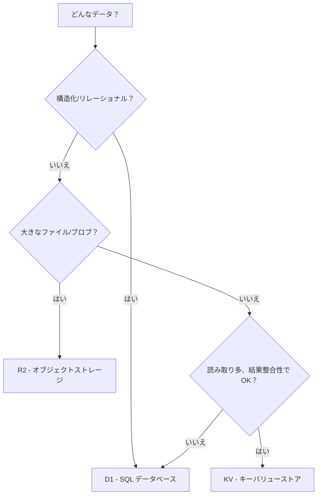

Cloudflare は異なるアクセスパターンに最適化された3つのストレージサービスを提供する。

## 概要

| サービス | 種類 | 最適な用途 | 整合性 |
|---|---|---|---|
| **KV** | キーバリューストア | 読み取り多、結果整合性データ | 結果整合性 |
| **D1** | SQL データベース（SQLite） | リレーショナルデータ、複雑なクエリ | 強整合性 |
| **R2** | オブジェクトストレージ（S3 互換） | ファイル、画像、大きなブロブ | 強整合性 |

## 適切なサービスの選択

## このセクションの内容

- [KV](./kv.mdx) -- キーバリューネームスペースの使用パターン
- [D1](./d1.mdx) -- SQLite による SQL データベース
- [R2](./r2.mdx) -- ファイル用オブジェクトストレージ
