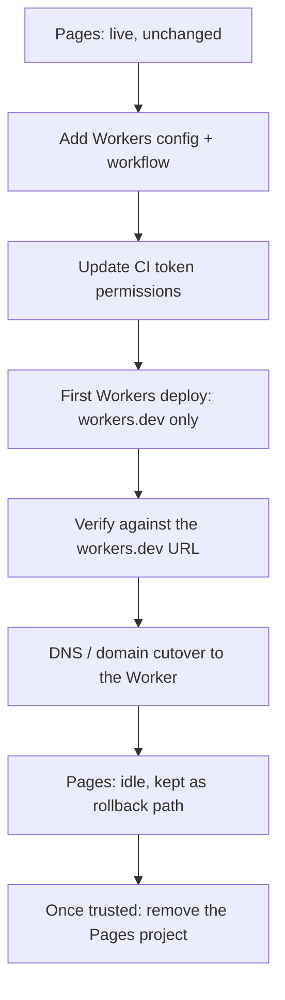

## なぜ移行するのか

[Workers Static Assets](./static-assets.mdx) は、静的サイトと SSR サイトにおける Cloudflare Pages の後継だ -- 別個の Pages プロジェクトとそのデプロイパイプラインを持つ代わりに、アセットディレクトリとリクエストロジックの両方を 1 つの Worker が持つ。ゼロから作るならこれを直接使えばいい。このページが扱うのは別のケースだ：すでに Pages でライブ稼働しているサイトを、いきなり切り替えるのではなく、短く計画された切り替えウィンドウだけで Workers に移したい場合。

移行する前に [Workers Static Assets](./static-assets.mdx) を読んでおくこと -- そこに書かれている `[assets]` の罠（ゲーティングの順序、SPA フォールバック、末尾スラッシュのリライト）は、どんな経路を辿ってきたかに関係なく、これから立ち上げる Worker にそのまま当てはまる。

## ライブ移行の順序

この流れのほとんどの間、サイトは変わらず Pages によって配信され続ける。本番に何か変化が起きるのは DNS/ドメインの切り替えステップだけだ -- それより前はすべて追加的な作業であり、既存の Pages デプロイの隣に手つかずのまま置かれる。



1. **Workers の設定とワークフローを追加する。** `[assets]` ブロックを持つ `wrangler.toml` と新しいデプロイワークフローファイルを、既存の Pages プロジェクトとそのワークフローの隣にコミットする。この時点ではまだ本番に対して何も実行されない -- ファイルが増えるだけだ。
2. **CI トークンの権限を更新する。** Workers デプロイには、Pages トークンが一度も持たなかった権限が必要になる（下の[トークンの差分](#トークンの差分)を参照）。新しいトークンを新規発行するのではなく、*既存の*トークンを編集すること -- これは後述するロールバックに関わってくる。
3. **`*.workers.dev` のみで最初の Workers デプロイを行う。** ルートやカスタムドメインを一切アタッチせずにデプロイする。これによって、設定・トークン・ビルド・アセットアップロードというパイプライン全体を、ライブトラフィックに触れずに一通り検証できる。
4. **`workers.dev` の URL に対して検証する。** アセットレイヤーが正しいファイルを配信しているか、Worker のロジックが正しく動作しているかを、まだライブのままの Pages サイトと並べて確認する。
5. **DNS/ドメインの切り替え。** 実トラフィックが動くのはこのステップだけだ -- バックグラウンドでの入れ替えではなく、メンテナンスウィンドウとして扱うこと。詳細は後述する。
6. **古い Pages プロジェクトはそのまま残す。** Worker がライブになったからといって削除しない。これは余りものではなく、ロールバック経路そのものだ。
7. **信頼できるようになってから、後で削除する。** Workers デプロイが十分な期間、本番トラフィックを問題なく処理し続けたことを確認できたら、Pages プロジェクトとそのワークフロー、そして Pages 専用のトークン権限を廃止する。

## トークンの差分

Pages のデプロイトークンと Workers のデプロイトークンは、思っているより重なりが少ない。しかもその差分を取り違える方向は、まさにライブ切り替えを壊す方向だ。

| Scope | Pages token (existing) | Workers, `*.workers.dev` only | Workers, plain route (no `custom_domain`) | Workers, custom domain |
| --- | --- | --- | --- | --- |
| Account -- Cloudflare Pages | Edit | -- | -- | -- |
| Account -- Workers Scripts | -- | Edit | Edit | Edit |
| Account -- Account Settings | Read | Read | Read | Read |
| Zone -- Workers Routes | -- | -- | Edit | Edit |
| Zone -- DNS | -- | -- | -- | Edit |
| Zone -- Zone | -- | -- | -- | Read |

正確に言うとこうなる：**`*.workers.dev` のみの Workers デプロイには、Zone の行は一切要らない。** `Account -- Cloudflare Pages: Edit` が `Account -- Workers Scripts: Edit` に置き換わるだけで、それ以外の形は変わらない -- 置き換え元の Pages トークンとまったく同じ、アカウント内だけで完結する影響範囲のままだ。

Zone の行が現れるのは、ルートかカスタムドメインをアタッチする場合だけだ。ただしこの 2 つが必要とするものは違うので、CI トークンのスコープを決めるときに一緒くたにしないこと。プレーンなルート（`{ pattern = "example.com/*" }`、`custom_domain = true` なし）は既存のゾーンルートに Worker をアタッチするだけで、必要なのは `Zone -- Workers Routes: Edit` だけだ -- DNS には一切触れないので、ルートだけの CI トークンに `Zone -- DNS: Edit` を持たせるべきではない。カスタムドメイン（`custom_domain = true`）はコストが違う：Pages のカスタムドメインと同じように、DNS レコードとエッジ証明書の作成・管理を Cloudflare にまかせるので、`Zone -- Workers Routes: Edit` に加えて `Zone -- DNS: Edit` と `Zone -- Zone: Read` も必要になる。

サイトが `workers.dev` の URL だけで完結するなら、2 列目で止めていい -- それで完了だ。既存のルートパターンに `custom_domain = true` なしでアタッチするだけなら、`Zone -- Workers Routes: Edit` を付与してそこで止めること -- DNS を一切書き込まないトークンに `Zone -- DNS: Edit` を与えるのは権限の過剰付与だ。Pages サイトが現在応答しているのと同じカスタムドメインが必要なら、Zone の行一式（Workers Routes、DNS、Zone）のぶんの予算は切り替えステップの最中ではなく、その前に確保しておくこと。

:::note[この表の外にあるフル権限セット]
この表は Pages と Workers の差分だけをカバーしている。D1、KV、R2、Vectorize、Workers AI、そして実証済みのカスタムドメイン権限セット（wrangler のバージョンによる `Zone -- DNS: Edit` と `Zone -- Zone: Read` だけの違いを含む）については、[CI トークン：「Edit Cloudflare Workers」では足りない](./deploy-from-zero.mdx)を参照。
:::

既存トークンの権限を編集しても、そのシークレットの値は変わらない -- 権限を足すためだけに `gh secret set` する必要はない。代わりに新しいトークンを発行すると、古いシークレットの値は Pages に対しては引き続き動くのに、新しい値はまだどこにも配線されていない、という状態になる。両方の経路を同時にライブに保ちたい移行にとっては、これはまさに逆方向だ。

## 移行期間中のトリック：セルフスキップするプリフライト

新しい Workers ワークフローはステップ 1 で入るが、実際にデプロイしてほしいのはステップ 3 になってからだ -- まだトークンに必要な権限が付いていないし、付いた後でさえ、マージ後の最初の push がそのまま最初の本番デプロイになってしまうのではなく、意図的にオンにする瞬間がほしい。

ワークフローが `main` に用意されるのを準備ができるまで遅らせるのではなく、1 つのフラグですべてのジョブをゲートするプリフライトジョブを持たせる：

```yaml
jobs:
  preflight:
    runs-on: ubuntu-latest
    outputs:
      active: ${{ steps.check.outputs.active }}
    steps:
      - id: check
        run: echo "active=${{ vars.WORKERS_MIGRATION_ACTIVE == 'true' }}" >> "$GITHUB_OUTPUT"
      - name: Verify deploy credentials are set
        run: |
          test -n "$CLOUDFLARE_API_TOKEN" || { echo "::error::CLOUDFLARE_API_TOKEN is not set"; exit 1; }
          test -n "$CLOUDFLARE_ACCOUNT_ID" || { echo "::error::CLOUDFLARE_ACCOUNT_ID is not set"; exit 1; }
        env:
          CLOUDFLARE_API_TOKEN: ${{ secrets.CLOUDFLARE_API_TOKEN }}
          CLOUDFLARE_ACCOUNT_ID: ${{ secrets.CLOUDFLARE_ACCOUNT_ID }}

  deploy:
    needs: preflight
    if: needs.preflight.outputs.active == 'true'
    runs-on: ubuntu-latest
    timeout-minutes: 10
    steps:
      - name: Deploy to Cloudflare Workers
        run: npx wrangler@4 deploy
        env:
          CLOUDFLARE_API_TOKEN: ${{ secrets.CLOUDFLARE_API_TOKEN }}
          CLOUDFLARE_ACCOUNT_ID: ${{ secrets.CLOUDFLARE_ACCOUNT_ID }}
```

リポジトリ変数 `WORKERS_MIGRATION_ACTIVE` が `true` にセットされるまでは、`preflight` は実行されて `active=false` と評価され、`deploy` は失敗ではなく**スキップ**として報告される。`Verify deploy credentials are set` ステップが重要なのは、フラグのチェックだけでは足りないからだ -- ジョブレベルの `if:` によるスキップは、`deploy` 自身の `env:` ブロックがスキップ中は一切評価されないことを意味する。つまりスキップされたジョブの中にある `secrets.CLOUDFLARE_API_TOKEN` の参照は何も証明しないし、シークレットが未設定でもエラーにはならず空文字列に解決されるだけだ。実際に push のたびに実行される `preflight` 側にプレゼンスチェックを置くことで、はじめてこの主張が真実になる：これにより、移行期間の全体を通じて、ワークフローは push のたびにマージ済み・構文チェック済みで、かつデプロイ用クレデンシャルが実際に機能することを確認済みの状態を保ちながら、誤って何かをデプロイしてしまうことはない。トークンを更新して最初の手動デプロイを確認し終えたら、この変数を切り替えるだけでいい。同じ、すでに PR でテスト済みのワークフローがそのまま本番デプロイを始める -- 初めて信頼しなければならない別の「有効化」コードパスは存在しない。

ビルド/デプロイのジョブ分割そのものは [本番デプロイ](../cicd/production-deploy.mdx)と同じ形をとっている -- 新しいのは、その手前に置かれたプリフライトのゲートだけだ。

## DNS とドメインの切り替え

ここまでの作業は、訪問者から見れば何も起きていないのと同じだ。実際にトラフィックを動かすのはこの切り替えステップだけであり、これは追加的な操作ではなく、デタッチしてからアタッチする操作になる：1 つのホスト名は同時に 1 つの宛先にしかアタッチできないため、カスタムドメインは Worker にアタッチする前に（あるいは同じタイミングで）Pages プロジェクトから外す必要がある。

```toml
routes = [
  { pattern = "example.com", custom_domain = true }
]
```

:::warning[このステップはメンテナンスウィンドウとしてスケジュールすること]
デタッチしてからアタッチするという操作に加えて、下で説明する伝播ウィンドウがあるため、レコードと証明書が落ち着くまでの数分間、訪問者が Cloudflare 自身のエラーページを目にすることがある。これは他の計画済みメンテナンスと同じように、トラフィックの少ない時間帯に、誰かが見守っている状態で実施すること -- たまたま安全なバックグラウンド変更として扱わないこと。
:::

`custom_domain = true` を指定すると、Pages のカスタムドメインと同じように、DNS レコードとエッジ証明書の作成・管理を Cloudflare 側にまかせられる -- その代償として何が必要になるかは上の Zone 権限の表の通りだ。アタッチした後は、新規のカスタムドメインをアタッチしたときと同じ伝播ウィンドウが発生すると考えておく：レコードと証明書が落ち着くまでの短い間、エッジが Cloudflare 自身のエラーページで応答することがあり、その直後の秒単位のスモークテストだけを見て切り替えが失敗したと判断しないこと。AAAA が A より先に反映される件や証明書が落ち着くまでの挙動については、[新しくアタッチしたカスタムドメインはすぐには使えない](./deploy-from-zero.mdx)を参照 -- 今回はその隙間を実トラフィックが通過することになるぶん、なおさら鋭く効いてくる。

## ロールバック：Pages プロジェクトだけでなく経路ごと残す

ロールバックとは、カスタムドメインを Pages に向け直すことを意味する。それが機能するのは、Pages 側がまだ完全な、デプロイ可能な経路として残っている場合だけだ -- ダッシュボードに削除されずに残っているプロジェクト、というだけでは足りない。

切り替えが信頼できるようになるまで、次のものを残しておく：

- **Pages プロジェクトそのもの。** 必要ではあるが、それだけでは十分ではない。
- **Pages のデプロイワークフローファイル。** Worker がライブになった時点でこれを削除してしまうと、ロールバックしても Pages 側に修正を出す経路がなくなる -- 最後にデプロイされたコミットのまま凍結されたプロジェクトに戻すことになり、ロールバックの理由が単なる DNS の切り戻しではなくコード修正を必要とする場合に、更新する手段がない。
- **そのワークフローが使うトークンのクレデンシャル。** 別個の Workers 専用トークンを新規発行するのではなく、既存の Pages トークンを編集して Workers の権限を足すことが重要なのはこのためだ：同じ `CLOUDFLARE_API_TOKEN` シークレットが引き続き `Account -- Cloudflare Pages: Edit` を持ち続けるので、いざ必要になった瞬間に Pages のワークフローはそのまま動く。切羽詰まった状況で何かを作り直したり配線し直したりする必要がない。

Workers デプロイが十分な期間、本番トラフィックを問題なく処理し続けたことを確認し -- かつ、ロールバックはもう現実的な選択肢ではないと意図的に判断できたときに初めて、Pages プロジェクトを削除し、そのワークフローファイルを消し、トークンから今や不要になった `Account -- Cloudflare Pages: Edit` 権限を外す。それより早くこれらのどれかをやってしまうと、「Pages プロジェクトをそのまま残す」は本物のロールバック経路ではなく、そう見えるだけの廃墟に成り下がる。

関連ページ：`[assets]` の設定モデルについては [Workers Static Assets](./static-assets.mdx)、CI トークン権限の全体像については [ゼロからのデプロイ](./deploy-from-zero.mdx)、下敷きになっているワークフローの形については [本番デプロイ](../cicd/production-deploy.mdx)を参照。
