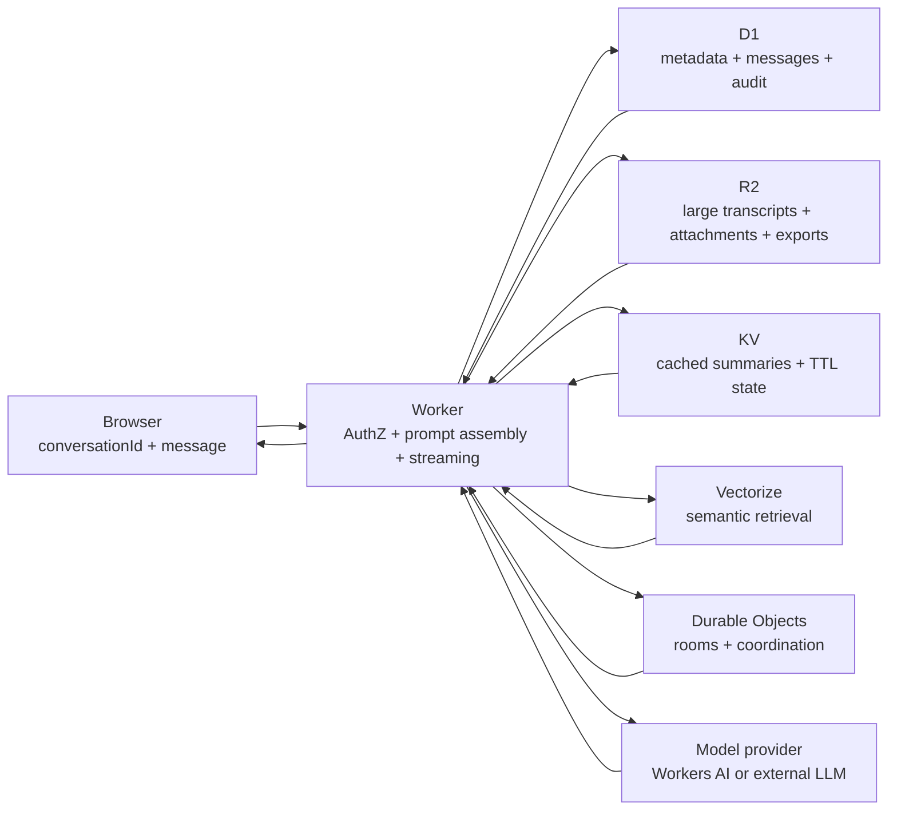

## Core Distinction

LLM APIs are stateless. A model does not remember a prior request unless the
application sends the relevant state again.

Sending recent chat history on each request is **context replay**. It is usually
necessary for chat UX, but it is not RAG by itself.

RAG means **retrieval-augmented generation**: the Worker retrieves relevant
external context, older conversation turns, project facts, or source documents
and injects those references into the model request.

## Request Boundary

For a web app, keep the browser payload small and keep the policy boundary in the
Worker:

```typescript
type ChatRequest = {
  conversationId: string;
  message: string;
};
```

The browser sends `conversationId` plus the new user message. The Worker
authenticates and authorizes the user, loads conversation state, applies rate
limits and cost controls, assembles the prompt, calls the model provider, stores
the user and assistant turns, and streams the response.

The browser should not own provider keys, prompt assembly rules, durable history,
tenant isolation, rate limiting, or spend controls.



## Prompt Assembly Stack

Build the model input in a predictable order:

| Layer | Purpose |
|---|---|
| System prompt | Product behavior, safety rules, output contract, and tool policy. |
| Stable user/project facts | Pinned facts that should survive across turns. |
| Rolling summary | Compact older conversation into a short state snapshot. |
| Last N messages verbatim | Preserve recent turn-by-turn nuance. |
| Retrieved context | Add relevant older messages or documents from keyword/SQL search or Vectorize. |
| Current user message | Put the new request at the end so it is the immediate task. |

Keep source IDs beside summaries and retrieved snippets. The model can use the
compressed memory, but the app still needs auditability back to original rows,
objects, or documents.

## Compaction and Memory

Separate deterministic compaction from AI-powered memory. They solve different
failure modes.

| Approach | Use for | Notes |
|---|---|---|
| Deterministic | Last-N messages, hard token budgets, pinned facts, keyword search, SQL filters. | Prefer this for guarantees, billing limits, and data that must be exactly included or excluded. |
| AI-powered | Summarization, fact extraction, embeddings, semantic retrieval, reranking. | Treat outputs as derived data. Store provenance and refresh them when source messages or documents change. |

Do deterministic pruning first, then add AI-powered memory where it improves
recall. Do not let a summarizer become the only copy of durable conversation
state.

## Storage Choices

| Store | Use it for | Avoid |
|---|---|---|
| [D1](../storage/d1.mdx) | Durable conversation rows, message metadata, user or tenant joins, authorization checks, audit trails. | Large transcripts, attachments, or opaque blobs. |
| [R2](../storage/r2.mdx) | Full transcript exports, large archived turns, attachments, generated files, import/export bundles. | Hot relational queries or per-turn authorization logic. |
| [KV](../storage/kv.mdx) | Small cached summaries, prompt fragments, session snapshots, TTL bot state, read-heavy lookup data. | Default primary durable chat history. KV is eventually consistent and is weak for auditability. |
| [Vectorize](https://developers.cloudflare.com/vectorize/) | Embeddings over docs or messages, semantic retrieval, RAG candidate lookup. | Source-of-truth storage. Keep canonical content in D1, R2, or another durable system. |
| [Durable Objects](../workers/durable-objects.mdx) | Realtime rooms, WebSocket fan-out, per-conversation coordination, serializing concurrent writes. | Large long-term archives or broad analytical queries. |

## Related Docs

- [D1](../storage/d1.mdx)
- [R2](../storage/r2.mdx)
- [KV](../storage/kv.mdx)
- [Durable Objects](../workers/durable-objects.mdx)
- [Workers AI Streaming SSE Proxy](../recipes/workers-ai-streaming.mdx)
