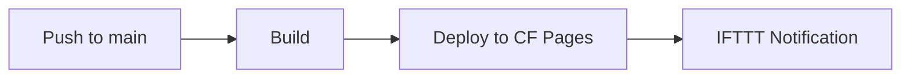
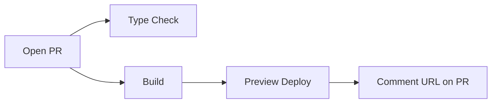

All our projects use GitHub Actions to deploy to Cloudflare. This section covers the standard workflow patterns.

## Standard Pipeline

For PRs:

## In This Section

- [Production Deploy](./production-deploy.mdx) -- Main branch deploy workflow
- [PR Preview](./pr-preview.mdx) -- Per-PR preview deployment workflow
- [IFTTT Notifications](./ifttt-notifications.mdx) -- Deploy status notifications
- [Multi-Output Deploy](./multi-output-deploy.mdx) -- Combining multiple builds into one deploy
