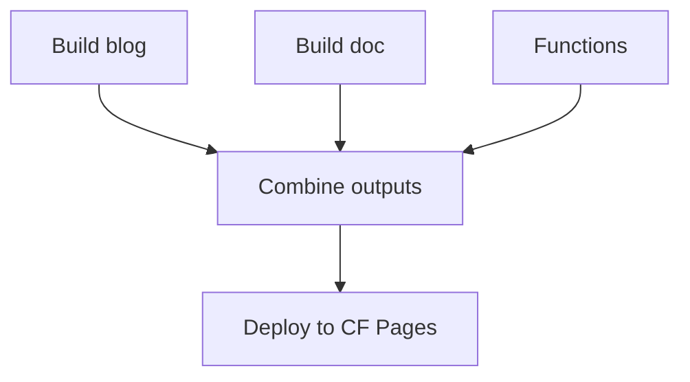

## The Pattern

Some projects produce multiple build outputs (e.g., a blog + a doc site) that need to be combined into a single Cloudflare Pages deployment.

## Example: Blog + Doc Site

From our zpaper project, which deploys an Astro blog and a zudo-doc documentation site under one Pages project:



### Build Job

Build both outputs and cache them:

```yaml
  build:
    steps:
      - run: pnpm build      # Blog -> blog/dist/
      - run: pnpm doc:build   # Docs -> doc/dist/

      - uses: actions/cache/save@v4
        with:
          path: blog/dist/
          key: blog-build-${{ github.run_id }}

      - uses: actions/cache/save@v4
        with:
          path: doc/dist/
          key: doc-build-${{ github.run_id }}

      - uses: actions/cache/save@v4
        with:
          path: functions/
          key: functions-build-${{ github.run_id }}
```

### Combine and Deploy

```yaml
  deploy:
    needs: [build, test]
    steps:
      - uses: actions/cache/restore@v4
        with:
          path: blog/dist/
          key: blog-build-${{ github.run_id }}

      - uses: actions/cache/restore@v4
        with:
          path: doc/dist/
          key: doc-build-${{ github.run_id }}

      - uses: actions/cache/restore@v4
        with:
          path: functions/
          key: functions-build-${{ github.run_id }}

      - name: Combine outputs
        run: |
          mkdir -p deploy/pj/my-site
          cp -r blog/dist/* deploy/pj/my-site/
          mkdir -p deploy/pj/my-site/doc
          cp -r doc/dist/* deploy/pj/my-site/doc/

      - name: Deploy
        run: |
          pnpm dlx wrangler@4 pages deploy deploy \
            --project-name=my-site \
            --branch=main \
            --commit-hash=${GITHUB_SHA}
        env:
          CLOUDFLARE_API_TOKEN: ${{ secrets.CLOUDFLARE_API_TOKEN }}
          CLOUDFLARE_ACCOUNT_ID: ${{ secrets.CLOUDFLARE_ACCOUNT_ID }}
```

## Cache vs Artifacts

Using `actions/cache` instead of `actions/upload-artifact` for inter-job data:

| | Cache | Artifact |
|---|---|---|
| **Storage** | Shared across runs, auto-evicted | Per-run, retention-days based |
| **Accumulation** | No accumulation issues | Can bloat storage if retention is high |
| **Speed** | Fast for repeated content | Fast |

:::tip
Use `actions/cache` with a `github.run_id` scoped key for inter-job data. This avoids artifact storage accumulation across many CI runs.
:::

## Functions with Dependencies

If your Pages Functions import npm packages, install them before deploying:

```yaml
      - name: Install function dependencies
        run: |
          rm -rf node_modules
          pnpm add -w minisearch

      - name: Deploy
        run: pnpm dlx wrangler@4 pages deploy deploy --project-name=my-site
```
