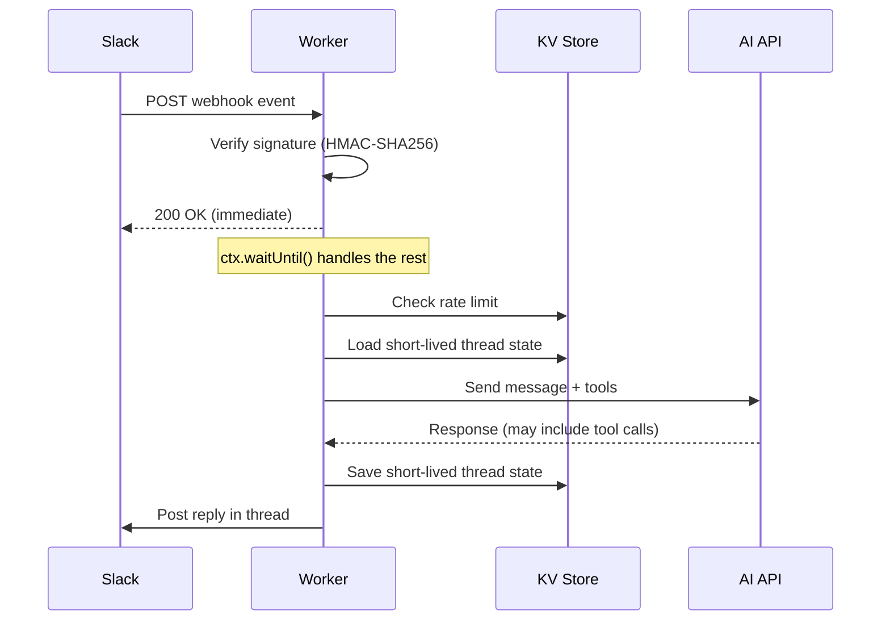

## Architecture

A bot that receives webhooks (e.g., from Slack), processes them with an
external AI API, and replies -- all running on a Cloudflare Worker with KV for
short-lived bot-thread state.



Key design decisions:

- **Immediate response**: Return `200 OK` before doing any work. Slack requires a response within 3 seconds.
- **Deferred processing**: Use `ctx.waitUntil()` for the actual processing that may take 10+ seconds.
- **KV for TTL state**: Rate limits and small bot-thread state are stored in KV
  with explicit expiration.

For durable web chat history, browser request boundaries, prompt assembly, and
RAG, use [Chat Memory and RAG](../ai/chat-memory-rag.mdx). This recipe keeps
state server-side in the Worker and does not ask the browser or webhook client to
own chat history.

## Wrangler Config

```toml
name = "my-bot"
main = "src/index.ts"
compatibility_date = "2025-01-01"

[[kv_namespaces]]
binding = "KV"
id = "your-kv-namespace-id"
```

Secrets set via dashboard or CLI:

```bash
npx wrangler secret put SLACK_BOT_TOKEN
npx wrangler secret put SLACK_SIGNING_SECRET
npx wrangler secret put API_KEY
```

## Env Interface

```typescript
interface Env {
  KV: KVNamespace;
  SLACK_BOT_TOKEN: string;
  SLACK_SIGNING_SECRET: string;
  API_KEY: string;
}
```

## Worker Entry Point

The fetch handler must respond immediately, then process in the background:

```typescript
export default {
  async fetch(
    request: Request,
    env: Env,
    ctx: ExecutionContext,
  ): Promise<Response> {
    if (request.method !== "POST") {
      return new Response("Method Not Allowed", { status: 405 });
    }

    const body = await request.json().catch(() => null);
    if (!body) {
      return new Response("Bad Request", { status: 400 });
    }

    // Slack URL verification challenge
    if (body.type === "url_verification") {
      return Response.json({ challenge: body.challenge });
    }

    // Verify webhook signature
    const rawBody = JSON.stringify(body);
    const isValid = await verifySignature(request, rawBody, env);
    if (!isValid) {
      return new Response("Unauthorized", { status: 401 });
    }

    // Respond immediately, process in background
    ctx.waitUntil(handleEvent(body.event, env));
    return new Response(null, { status: 200 });
  },
};
```

:::danger[Always respond immediately to webhooks]
Slack, GitHub, and most webhook providers have strict timeout limits (typically 3 seconds). If your Worker doesn't respond in time, the provider may retry or mark your endpoint as failed. Always return a response first, then use `ctx.waitUntil()` for processing.
:::

## Webhook Signature Verification

Verify the HMAC-SHA256 signature to ensure the request is authentic:

```typescript
async function verifySignature(
  request: Request,
  rawBody: string,
  env: Env,
): Promise<boolean> {
  const timestamp = request.headers.get("x-slack-request-timestamp");
  const signature = request.headers.get("x-slack-signature");

  if (!timestamp || !signature) return false;

  // Reject requests older than 5 minutes (replay protection)
  const now = Math.floor(Date.now() / 1000);
  if (Math.abs(now - Number(timestamp)) > 300) return false;

  const sigBasestring = `v0:${timestamp}:${rawBody}`;
  const key = await crypto.subtle.importKey(
    "raw",
    new TextEncoder().encode(env.SLACK_SIGNING_SECRET),
    { name: "HMAC", hash: "SHA-256" },
    false,
    ["sign"],
  );

  const sig = await crypto.subtle.sign(
    "HMAC",
    key,
    new TextEncoder().encode(sigBasestring),
  );

  const hexSig = "v0=" + [...new Uint8Array(sig)]
    .map((b) => b.toString(16).padStart(2, "0"))
    .join("");

  return timingSafeEqual(hexSig, signature);
}
```

:::tip[Use timing-safe comparison]
Always use a constant-time comparison for signature verification. A naive `===` comparison can leak information via timing side-channels.
:::

### Timing-Safe String Comparison

```typescript
function timingSafeEqual(a: string, b: string): boolean {
  if (a.length !== b.length) return false;
  let result = 0;
  for (let i = 0; i < a.length; i++) {
    result |= a.charCodeAt(i) ^ b.charCodeAt(i);
  }
  return result === 0;
}
```

## Rate Limiting with KV

Per-user rate limiting using KV with TTL-based expiration:

```typescript
const RATE_LIMIT = 30; // requests per window
const RATE_WINDOW = 86400; // 24 hours

async function checkRateLimit(
  env: Env,
  userId: string,
  channelId: string,
): Promise<boolean> {
  const key = `rate:${channelId}:${userId}`;
  const current = await env.KV.get<number>(key, "json");
  const count = current ?? 0;

  if (count >= RATE_LIMIT) return false;

  await env.KV.put(key, JSON.stringify(count + 1), {
    expirationTtl: RATE_WINDOW,
  });
  return true;
}
```

:::warning[KV rate limiting is approximate]
KV is eventually consistent. Under high concurrency, a few extra requests may slip through. This is acceptable for bot rate limiting -- use [Durable Objects](../workers/durable-objects.mdx) if you need precise counting.
:::

## Short-Lived Bot Thread State in KV

Store a small bot-thread state snapshot with automatic expiration. This is useful
for webhook replies that need recent turns, but it is not a durable chat history
or audit log.

```typescript
const THREAD_STATE_TTL = 86400; // 24 hours

interface BotThreadState {
  messages: Array<{ role: string; content: string }>;
}

async function loadHistory(
  env: Env,
  threadId: string,
): Promise<BotThreadState> {
  const key = `bot-thread:${threadId}`;
  const stored = await env.KV.get<BotThreadState>(key, "json");
  return stored ?? { messages: [] };
}

async function saveHistory(
  env: Env,
  threadId: string,
  history: BotThreadState,
): Promise<void> {
  const key = `bot-thread:${threadId}`;
  await env.KV.put(key, JSON.stringify(history), {
    expirationTtl: THREAD_STATE_TTL,
  });
}
```

Use `"json"` type parameter with `KV.get()` for automatic deserialization. The
TTL ensures old bot-thread snapshots are cleaned up automatically. If you need
durable multi-user chat, authorization-aware reads, prompt assembly, or RAG over
past messages, model the canonical history in D1/R2/Vectorize as described in
[Chat Memory and RAG](../ai/chat-memory-rag.mdx).

## AI Tool Use Loop

When using an AI API with tool calling, implement a bounded loop:

```typescript
const MAX_TOOL_ROUNDS = 5;

async function callAI(
  env: Env,
  messages: Array<{ role: string; content: string }>,
): Promise<string> {
  let round = 0;

  while (round < MAX_TOOL_ROUNDS) {
    const response = await fetch("https://api.example.com/chat", {
      method: "POST",
      headers: {
        "Content-Type": "application/json",
        Authorization: `Bearer ${env.API_KEY}`,
      },
      body: JSON.stringify({ messages, tools: TOOL_DEFINITIONS }),
    });

    const result = await response.json();

    if (result.stop_reason !== "tool_use") {
      return result.content;
    }

    // Execute tool calls and append results
    for (const toolCall of result.tool_calls) {
      const toolResult = await executeTool(toolCall, env);
      messages.push(
        { role: "assistant", content: result.content },
        { role: "tool", content: JSON.stringify(toolResult) },
      );
    }

    round++;
  }

  return "Reached maximum tool rounds.";
}
```

:::tip[Always cap tool rounds]
An unbounded tool loop could consume your Worker's CPU time limit. Set a reasonable maximum (5-10 rounds) and return a fallback message when exceeded.
:::

## Project Structure

```
packages/my-bot/
├── src/
│   ├── index.ts           # Worker entry point
│   ├── webhook.ts         # Signature verification
│   ├── ai.ts              # AI API integration + tool loop
│   ├── tools.ts           # Tool definitions and execution
│   ├── types.ts           # TypeScript interfaces
│   └── utils.ts           # Helpers (encoding, timing-safe compare)
├── wrangler.toml
├── package.json
└── tsconfig.json
```

## Dependencies

Bot workers can be extremely lean -- leverage Workers built-in APIs:

```json
{
  "devDependencies": {
    "@cloudflare/workers-types": "^4.20250214.0",
    "typescript": "^5.9.3",
    "vitest": "^4.0.18",
    "wrangler": "^4.0.0"
  }
}
```

No external HTTP or crypto libraries needed. Workers provide native `fetch()` and `crypto.subtle`.

## Deployment

```bash
npx wrangler@4 deploy
```

For monorepo setups with path-triggered CI, see [Standalone Workers](../workers/standalone-workers.mdx#path-triggered-deploys).

## Related

- [Chat Memory and RAG](../ai/chat-memory-rag.mdx)
- [Workers AI Streaming SSE Proxy](./workers-ai-streaming.mdx)
