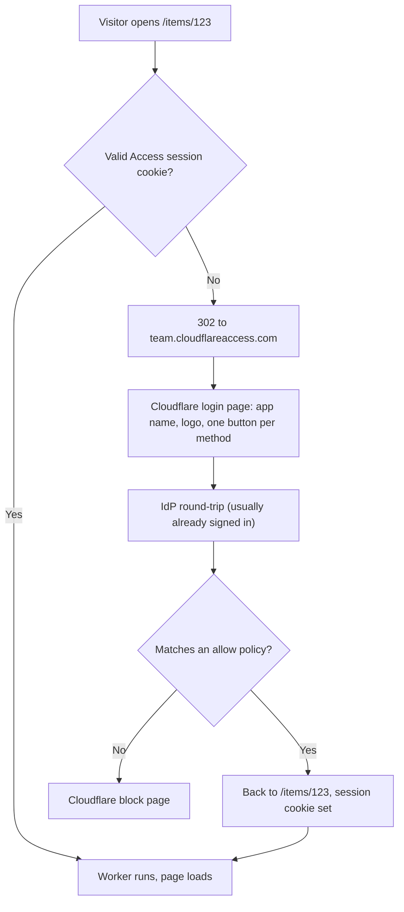

## Overview -- Access Is an Allowlist, Not a Signup System

**Cloudflare Access** puts an identity check in front of a site before any request reaches the origin. A visitor hits the URL, gets redirected to an identity provider, proves who they are, and comes back with a signed session -- all of it enforced at Cloudflare's edge, none of it code you write.

The word that decides where Access fits is **allowlist**. You enumerate who may enter -- specific email addresses, an email domain, an identity-provider group -- and an administrator edits a policy to admit anyone new. There is no self-service registration, by design.

:::danger[Access has no signup path, so it cannot be the auth system for a product strangers join]
Every consequence follows from the allowlist model. Seats are billed per user, which is fine for a company and nonsensical at consumer scale. Access hands your Worker an identity but no **user model** -- no profile record you own, no password reset, no email verification, no per-user rows to attach -- so a product built behind it ends up implementing the user system anyway, with Access contributing only the front door. Use Access for internal tools, admin panels, staging deploys, and documentation sites. For anything a stranger signs themselves up for, reach for [Auth with Pages Functions](./auth-functions.mdx) or [HTTP-only Cookie Sessions](./cookie-sessions.mdx).
:::

## Three Tools, Three Audiences

Access does not supersede the [password gate](./password-gate.mdx). They answer different questions about **who the viewer is and what it costs to enroll them**, and the cheapest correct tool is usually not the strongest one.

| | [Password gate](./password-gate.mdx) | Cloudflare Access | [App-level auth](./cookie-sessions.mdx) |
|---|---|---|---|
| Viewer must be known in advance | No | **Yes** -- allowlisted before first visit | No -- they register |
| Enrollment cost per viewer | Zero: send URL + password | A seat, and an admin edit | A signup form |
| Identity in logs | None | Email, name, groups | Whatever you store |
| Revoke one person | Impossible without rotating for all | Remove from the policy | Delete their session |
| Right for | Handing a staging link to a client or outside reviewer | Internal tools, admin, previews, docs | A product with public signup |

That first row is the whole distinction. Access needs an identity it can enroll and allowlist **before** the person shows up. A client reviewing a staging build, a contractor on a two-week engagement, an outside reviewer you cannot add to the corporate directory -- for those, "send the URL and the password" stays the right answer, and a password gate remains the tool. One-time PIN narrows the gap (see below) but does not close it: you still have to know their address ahead of time.

The three compose. A mature setup runs app-level auth for end users, Access over `/admin` and every preview deployment, and a password gate on the one staging URL that goes out to a client.

## Setup Is Account-Level, Not Token-Level

Nothing about an API token decides whether Access is available. Access lives inside Zero Trust, which is turned on per Cloudflare account, and the dashboard is a complete interface to it -- a token is only needed if you intend to manage Access from code.

Three one-time decisions before any policy exists:

1. **A Zero Trust organization.** The first visit to the Zero Trust dashboard asks for a **team name**, which becomes the team domain `<team>.cloudflareaccess.com`. That hostname is where every login lands and is the `iss` claim in the resulting JWT. Renaming it later is disruptive -- choose deliberately.
2. **A plan.** Zero Trust has a free tier with a seat cap. Check the current number on Cloudflare's plan page rather than trusting any figure written down elsewhere, including here.
3. **A login method.** Either a real identity provider (Google Workspace, Microsoft Entra, Okta) or **One-time PIN**, which needs no IdP configuration at all: the visitor types an email address and receives a six-digit code. One-time PIN is the shortest path from nothing to a working gate.

## Attaching Access to a Worker Instead of a Hostname

The traditional Access application is bound to a **hostname**, which historically raised an awkward question for Workers served on `*.workers.dev`: that is not a zone you own. Access applications can now target the Worker itself, which sidesteps the question entirely.

| Coverage | `destinations[].type` |
|---|---|
| One Worker, production and previews | `worker` |
| One Worker, previews only | `preview_worker` |
| Every Worker on the account, production and previews | `all_workers` |
| Every Worker on the account, previews only | `all_preview_workers` |

Cloudflare's Workers documentation states that a Worker-scoped application protects every domain associated with that Worker -- its routes, Custom Domains, `workers.dev` hostname, and previews. No zone, no custom domain, and no DNS record required.

:::warning[The docs disagree with each other about hostname-based Access on `workers.dev`]
Cloudflare's Zero Trust page for self-hosted applications still says domains must belong to an active zone in your account, and never mentions `workers.dev`. The Workers-side page contradicts this for the `workers.dev` case. No page reconciles the two. Using a `worker` or `preview_worker` destination avoids the disagreement completely, because a Worker-scoped application never asks which zone the hostname belongs to -- which is the practical reason to prefer it here, quite apart from the convenience.
:::

:::note[Whether *version-alias* preview URLs are covered is an inference, not a documented promise]
The documentation says "previews" without distinguishing the per-version hash URL from a stable `--preview-alias` URL. The [Workers PR Previews](../cicd/workers-pr-previews.mdx) flow depends on the alias form specifically. The Preview URLs documentation notes that disabling Preview URLs disables routing to both versioned and aliased preview URLs, which implies a single routing surface and therefore common coverage -- but that is reasoning, not a statement. Confirm with one `curl -I` against a live alias URL before you rely on it.
:::

:::danger[WebSocket upgrades fail with 403 behind a Worker-scoped policy]
A Worker protected by a `worker`-destination policy rejects WebSocket upgrade requests. Anything real-time -- a [Durable Objects](../workers/durable-objects.mdx) coordination endpoint, a live-update channel -- must use hostname-based Access instead. This is the single hard constraint that decides between the two mechanisms, so check it before designing around Worker destinations.
:::

### Precedence, and Why Deleting a Policy May Change Nothing

Rules resolve hostname-based first, then Worker-level, then account-level. The consequence worth internalizing: on an account running `all_workers`, removing a Worker's own policy does **not** make that Worker public -- it falls through to the account-wide rule underneath. Exempting one Worker takes an explicit `bypass` policy, not a deletion.

## What the Visitor Actually Sees

With an identity provider already configured -- the normal case in a company that uses Zero Trust for anything else -- most people type nothing at all:



Two details that matter in practice:

- **The original deep link survives.** A visitor who clicks a link to `/items/123` lands back on `/items/123`, not on the site root. Shared links keep working.
- **Denied users get Cloudflare's block page, not your 404.** A colleague who is not on the policy sees a generic refusal with no idea who to ask. The block page is customizable -- put a name or a channel on it, or the first support request will be someone asking why the link is broken.

With **One-time PIN** in place of an IdP, the visitor types twice: their email address, then the six-digit code that arrives by email. Only addresses matching a policy get a code that works.

Session duration is configured per application, so how often anyone re-authenticates is your choice rather than a fixed behavior.

## Reading the Identity in the Worker

Once a request is through, the Worker can read who sent it -- no JWT parsing, no library:

```typescript
export default {
  async fetch(request: Request, env: Env, ctx: ExecutionContext): Promise<Response> {
    // ctx.access is undefined when the request was not authenticated by Access
    // -- e.g. the Worker is reachable on a route the application does not cover.
    // Treat that as a failure, not as an anonymous visitor.
    if (!ctx.access) {
      return new Response("Access required", { status: 403 });
    }

    const identity = await ctx.access.getIdentity();
    return new Response(`Signed in as ${identity.email}`);
  },
};
```

This is the capability a shared password fundamentally cannot offer: per-visitor attribution. Features that were impossible behind a gate -- recording who triaged an item, showing the signed-in user, scoping a view by group -- become available without writing an auth system.

For **hostname-based** applications, or anywhere explicit verification is wanted, validate the `Cf-Access-Jwt-Assertion` header against the team's JWKS endpoint instead. Fetch the keys; never hardcode one:

```typescript
import { createRemoteJWKSet, jwtVerify } from "jose";

const JWKS = createRemoteJWKSet(
  new URL(`${env.TEAM_DOMAIN}/cdn-cgi/access/certs`),
);

const { payload } = await jwtVerify(token, JWKS, {
  issuer: env.TEAM_DOMAIN,
  audience: env.POLICY_AUD, // the application's AUD tag
});
```

The same RS256-plus-JWKS shape appears in [Auth with Pages Functions](./auth-functions.mdx) -- Access is one more third-party issuer, verified the same way.

## API Token Permissions Are Separate from the Deploy Token

Deploying a Worker that sits behind Access needs **no** Access permission on the deploy token. Access configuration is a different API surface, and there is no deployable `access` key in Wrangler configuration -- the only `access` block that exists is a development-only simulation used by `wrangler dev`, never uploaded. Enabling Access does not break an existing deploy pipeline, and the deploy token should stay as narrow as it already is (see [Cloudflare Account Setup](../getting-started/cloudflare-setup.mdx)).

Managing Access *from code* -- Terraform, or direct API calls -- is what needs permissions. Create a separate token for it. All of them are **Account**-scoped:

| Purpose | Dashboard label | API / Terraform name |
|---|---|---|
| Applications and policies | `Access: Apps and Policies` : Edit | `Access: Apps and Policies Write` |
| Identity providers and groups | `Access: Organizations, Identity Providers, and Groups` : Edit | `...Write` |
| Service tokens | `Access: Service Tokens` : Edit | `...Write` |

:::tip[The dashboard says "Edit" where the API says "Write"]
Cloudflare's permission reference renders the same table twice, once with dashboard labels and once with API permission-group names. They are the same permission under two strings, and searching Terraform documentation for "Edit" -- or the dashboard for "Write" -- finds nothing. A zone-scoped `Access: Apps and Policies` also exists, but it does not cover Worker-scoped applications, which are account-level objects.
:::

## Related

- [Password Gate for Preview and Staging Sites](./password-gate.mdx) -- the shared-secret alternative, and still the right tool for outside viewers who cannot be allowlisted in advance.
- [Access Service Tokens for CI](../cicd/access-service-tokens.mdx) -- how Playwright smoke tests and health checks get through an Access-protected URL without a login redirect.
- [Auth with Pages Functions](./auth-functions.mdx) -- verifying a third-party IdP token, and the path to take when the app has public signup.
- [HTTP-only Cookie Sessions](./cookie-sessions.mdx) -- the per-user session layer Access deliberately does not provide.
- [Workers PR Previews](../cicd/workers-pr-previews.mdx) -- the preview-alias URLs a `worker` destination is meant to cover.
- [Cloudflare Account Setup](../getting-started/cloudflare-setup.mdx) -- the deploy token, which needs none of the permissions on this page.
