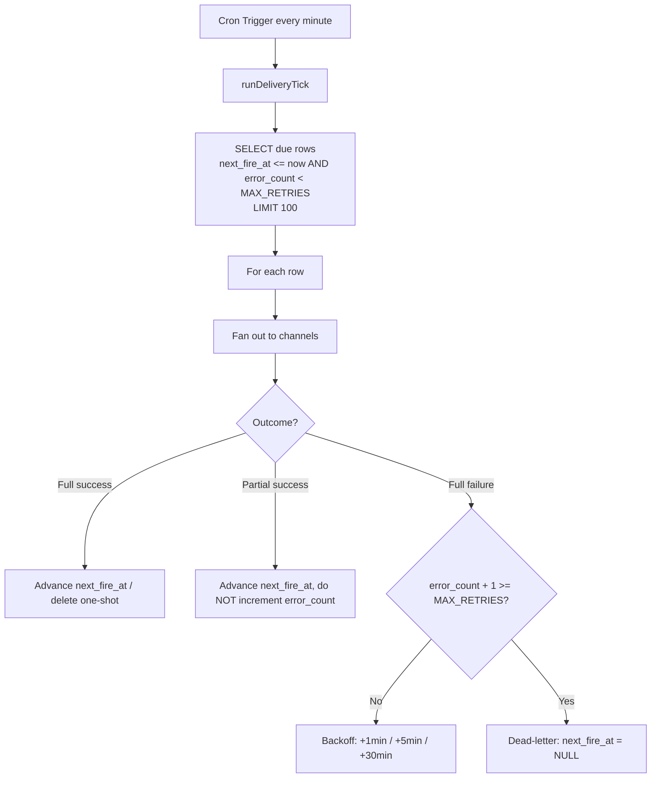

## When you don't need Queues

You have recurring work to do -- send reminders, poll an upstream API, retry failed deliveries -- and you reach for [Cloudflare Queues](https://developers.cloudflare.com/queues/). But if your job is naturally driven by a clock (fire when a row's due time arrives) rather than by an event stream, a [Cron Trigger](https://developers.cloudflare.com/workers/configuration/cron-triggers/) plus a `next_fire_at` column in D1 is simpler: the database **is** the queue, no extra binding, and the schedule lives in plain SQL you can inspect.

This recipe is grounded in a notifications worker that delivers reminders over email and webhooks. Every minute the cron fires, the worker pulls a bounded batch of due rows out of D1, fans each one out to its channels, and writes the outcome back -- advancing the schedule, applying backoff, or dead-lettering.



## Cron Trigger Config

A single cron entry firing every minute is the heartbeat of the whole system. Each invocation drains a bounded slice of the queue.

```toml
name = "zudo-notifications-worker"
main = "src/index.ts"
compatibility_date = "2025-04-01"

[[d1_databases]]
binding = "NOTIFICATIONS_DB"
database_name = "notifications-db"
database_id = "placeholder-replace-with-actual-id"

[triggers]
crons = ["* * * * *"]
```

There is no Queues binding here -- only D1. The `[triggers]` block is all that connects the clock to your `scheduled()` handler.

## The scheduled() handler and ctx.waitUntil()

The Worker runtime considers a scheduled invocation finished as soon as the `scheduled()` function returns. If you kick off delivery with a bare `await`-less call -- or even forget to keep the runtime alive -- the runtime can tear down the worker before your asynchronous email and webhook sends complete. `ctx.waitUntil()` registers the promise so the runtime waits for it.

```typescript
export default {
  async fetch(request: Request, env: Env): Promise<Response> {
    return await handleRequest(request, env);
  },

  async scheduled(_event: ScheduledEvent, env: Env, ctx: ExecutionContext): Promise<void> {
    // Fires every minute (* * * * *). Delivers due notifications via
    // Resend (email) and HMAC-signed webhooks.
    ctx.waitUntil(runDeliveryTick(env));
  },
} satisfies ExportedHandler<Env>;
```

:::warning[Always wrap async work in ctx.waitUntil()]
Inside `scheduled()`, any delivery that outlives the synchronous body must be passed to `ctx.waitUntil()`. Without it the runtime may kill the worker mid-flight, leaving rows that look due but were never delivered -- and which then re-fire on the next tick. This is the single most common cause of "my cron silently drops work."
:::

## D1 as a poll-based queue

Each tick runs one bounded query. The `next_fire_at` column makes "due" expressible in SQL, and the `LIMIT` keeps a single invocation inside the Workers CPU-time and subrequest budget no matter how large the backlog grows.

```typescript
// Max rows processed per cron tick.
const TICK_LIMIT = 100;

export async function runDeliveryTick(env: Env): Promise<void> {
  const now = Date.now();

  const { results } = await env.NOTIFICATIONS_DB.prepare(
    `SELECT * FROM notifications
     WHERE next_fire_at <= ? AND error_count < ?
     ORDER BY next_fire_at ASC
     LIMIT ?`,
  )
    .bind(now, MAX_RETRIES, TICK_LIMIT)
    .all<NotificationRow>();

  if (!results || results.length === 0) return;

  // Process rows sequentially to avoid thundering-herd on D1.
  for (const row of results) {
    try {
      await processRow(row, env);
    } catch (err) {
      // Unexpected error in processRow -- log and continue to next row.
      console.error(`[scheduler] Unexpected error processing row ${row.id}:`, err);
    }
  }
}
```

The query encodes two filters at once:

- `next_fire_at <= now` -- only rows whose scheduled time has arrived.
- `error_count < MAX_RETRIES` -- skip rows that have already exhausted their retries (they are dead-lettered, see below).

`ORDER BY next_fire_at ASC` drains the oldest-due rows first, so a backlog clears in fairness order. If `LIMIT` rows come back full every tick, the next minute simply picks up where this one left off -- the backlog is self-draining.

:::tip[Pick a LIMIT you can finish in one tick]
A Worker invocation has a finite CPU-time and subrequest budget. Size `LIMIT` so the slowest realistic batch (rows times channels times per-channel timeout) fits comfortably inside it. If you routinely hit the limit, shorten the per-channel timeout or shrink the batch -- do not raise the cron frequency past one minute, which is the finest cron granularity.
:::

## Backoff and dead-lettering -- all in D1

There is no separate retry queue. A row's retry state lives in two columns: `error_count` (how many times it has failed) and `next_fire_at` (when to try again). The backoff schedule and the dead-letter threshold are pure functions of `error_count`.

```typescript
// Backoff schedule: 1st failure -> +1 min, 2nd -> +5 min, 3rd -> +30 min.
// error_count is the count BEFORE this failure (0-based), so:
//   error_count === 0 -> next retry in 1 min
//   error_count === 1 -> next retry in 5 min
//   error_count === 2 -> next retry in 30 min
const BACKOFF_MS = [
  1 * 60 * 1000,  // 1 min
  5 * 60 * 1000,  // 5 min
  30 * 60 * 1000, // 30 min
] as const;

/** Maximum number of delivery attempts before a row is dead-lettered. */
export const MAX_RETRIES = 3;

export function retryNextFireAt(now: number, errorCount: number): number {
  const backoff = BACKOFF_MS[Math.min(errorCount, BACKOFF_MS.length - 1)];
  return now + backoff;
}

export function isDeadLettered(errorCount: number): boolean {
  return errorCount >= MAX_RETRIES;
}
```

When a row fails fully, you increment `error_count` and push `next_fire_at` out by the backoff interval. Once `error_count` reaches `MAX_RETRIES`, the row is **dead-lettered**: a one-shot row sets `next_fire_at = NULL` (the due query's `next_fire_at <= now` can never match `NULL`, so it is permanently parked for inspection), while a recurring row simply skips the failed fire and advances to its next regular schedule. Because the due query already filters `error_count < MAX_RETRIES`, a dead-lettered row is invisible to future ticks without any extra bookkeeping.

## The partial-success rule (read this twice)

This is the subtle correctness point that bites. A row can fan out to several channels -- email *and* a webhook. Three outcomes matter:

- **Full success** -- every channel delivered.
- **Full failure** -- every channel failed.
- **Partial success** -- some delivered, some failed.

:::danger[Increment the error counter ONLY on full failure -- never on partial success]
If you treat partial success like a failure and schedule a retry, the next attempt **re-sends every channel** -- including the ones that already succeeded. The user gets the same email twice. A duplicate delivery is worse than a missed one: silence is recoverable, a double-send is not. So on partial success you advance `next_fire_at` to the next regular fire time, record the partial error for observability, and **leave `error_count` untouched**. The failed channel is not retried sooner; it simply gets its normal next turn.
:::

The classification is a one-liner per outcome:

```typescript
const failedChannels = Object.keys(channelErrors);
const succeededChannels = channels.filter((ch) => !channelErrors[ch]);
const isFullFailure = succeededChannels.length === 0 && failedChannels.length > 0;
const isPartialSuccess = succeededChannels.length > 0 && failedChannels.length > 0;
const isFullSuccess = failedChannels.length === 0;
```

And the write-back branches on it. Note that **both** full success and partial success advance the schedule the same way -- the only difference is that partial success records a `last_error` string and full success clears it. Crucially, neither one touches `error_count` in the retry sense; the recurring path even resets it to `0`.

```typescript
if (isFullSuccess || isPartialSuccess) {
  const nextFire = nextFireAt(new Date(now), recurrenceRule);

  if (nextFire === null) {
    // One-shot: delete the row on success.
    await env.NOTIFICATIONS_DB.prepare(
      "DELETE FROM notifications WHERE id = ?",
    ).bind(row.id).run();
  } else {
    // Recurring: advance to next fire time. error_count resets to 0;
    // a partial failure is recorded in last_error but is NOT a retry.
    const lastError = isPartialSuccess
      ? `partial: ${failedChannels.join(", ")}`
      : null;

    await env.NOTIFICATIONS_DB.prepare(
      `UPDATE notifications
       SET next_fire_at = ?,
           last_fired_at = ?,
           error_count = 0,
           last_error = ?,
           updated_at = ?
       WHERE id = ?`,
    )
      .bind(nextFire.getTime(), now, lastError, now, row.id)
      .run();
  }
} else if (isFullFailure) {
  // Only here does error_count climb and backoff / dead-lettering apply.
  const newErrorCount = row.error_count + 1;

  if (isDeadLettered(newErrorCount)) {
    // Park (one-shot: next_fire_at = NULL) or skip-forward (recurring).
  } else {
    const nextRetryAt = retryNextFireAt(now, row.error_count);
    await env.NOTIFICATIONS_DB.prepare(
      `UPDATE notifications
       SET next_fire_at = ?,
           error_count = ?,
           last_error = ?,
           updated_at = ?
       WHERE id = ?`,
    )
      .bind(nextRetryAt, newErrorCount, errorSummary, now, row.id)
      .run();
  }
}
```

The single rule to remember: **`error_count` is a retry counter, and a retry re-runs the whole row. Only a full failure earns a retry.** Partial success advances the schedule like a success because re-running it would duplicate the channels that already worked.

## Per-row delivery with timeouts

Each channel send is bounded by a timeout so one hung endpoint cannot stall the whole tick. The fan-out runs the channels in parallel and collects per-channel errors into a map, which is exactly what the partial-success classification above reads from.

```typescript
// 10-second per-channel fetch timeout.
const CHANNEL_TIMEOUT_MS = 10_000;

async function withTimeout<T>(promise: Promise<T>, ms: number): Promise<T> {
  let timer: ReturnType<typeof setTimeout> | undefined;
  const timeout = new Promise<never>((_, reject) => {
    timer = setTimeout(() => reject(new Error(`operation timed out after ${ms}ms`)), ms);
  });
  try {
    return await Promise.race([promise, timeout]);
  } finally {
    clearTimeout(timer);
  }
}

// Inside processRow: fan out, recording a message per failed channel.
const channelErrors: Record<string, string> = {};

await Promise.all(
  channels.map(async (channel) => {
    let err: string | null = null;
    if (channel === "email") {
      err = await tryDeliverEmail(row, env.NOTIFICATIONS_RESEND_KEY);
    } else if (channel === "webhook") {
      err = await tryDeliverWebhook(row, channels, firedAt);
    }
    if (err !== null) {
      channelErrors[channel] = err;
    }
  }),
);
```

A channel helper returns `null` on success or an error string on failure -- never throws -- so a single bad channel degrades to a partial success rather than crashing the row.

## Why this beats reaching for Queues

| Concern | Cron + D1 | Queues |
|---|---|---|
| Extra binding | None | Queue producer + consumer |
| Inspecting pending work | `SELECT * FROM notifications` | Queue is opaque |
| Schedule semantics | `next_fire_at` column, plain SQL | Delay per message |
| Backoff / dead-letter | Two columns, pure functions | Built-in DLQ, less visible |
| Best fit | Clock-driven, due-time work | High-throughput event streams |

Queues shine when work arrives as a high-volume event stream you want to buffer and process at your own pace. For clock-driven work where every item has a *due time*, a cron heartbeat over a D1 table is less machinery, fully inspectable, and keeps the retry policy in code you can unit-test.

For the immediate-response webhook pattern that also leans on `ctx.waitUntil()`, see [Bot Worker Pattern](./bot-worker.mdx). For D1 fundamentals, see the [storage docs](../storage/d1.mdx).
