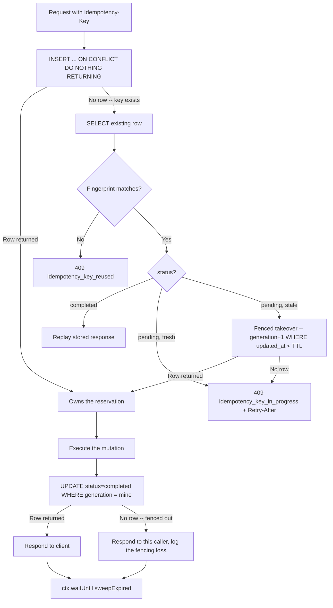

## Overview

A client that does not know whether its last request succeeded -- the connection dropped, a proxy timed out, the Worker was recycled mid-response -- has exactly one safe move: retry. For a `GET`, retrying is free. For a `POST` that charges a card, sends an email, or creates an order, retrying blind risks doing it twice. The `Idempotency-Key` header pattern (the same shape used by Stripe and most payment APIs) solves this by having the client name the operation once and the server remember what happened the first time it saw that name.

This recipe builds the server side of that contract on D1: a ledger table that claims a key atomically, executes the mutation exactly once per key, and replays the stored result for every retry -- including retries that arrive after the original attempt is presumed dead.

## The Idempotency-Key Header Contract

- The client generates a fresh, unique value (a UUID v4 is fine) **once per logical operation** and sends it as `Idempotency-Key: <value>` on the mutating request.
- Every retry of that same logical operation reuses the **same** key. A genuinely new operation (a second, different order) must use a **new** key. The server has no way to tell these apart except by the key itself.
- Idempotency protection applies to unsafe methods only (`POST`, `PATCH`, `DELETE` -- whichever your endpoint uses to mutate). `GET` does not need it.
- If a required endpoint receives no `Idempotency-Key` header, reject it with `400 Bad Request`. Executing a mutation without idempotency protection when the caller expected it is worse than refusing to run it -- the caller may retry the same request believing it is protected when it is not.
- Bound the key format server-side (for example, 1-255 printable ASCII characters) so a malformed or oversized key cannot be used to bloat the ledger table.

:::warning[This is a contract, not a detection heuristic]
The server cannot infer "this is a retry" from request content alone -- two identical bodies can be two legitimately identical operations. The `Idempotency-Key` is the client's explicit signal, and this whole pattern only works because both sides honor it: same operation, same key; different operation, different key.
:::

## Schema

One table carries the whole ledger. `generation` is the fencing token explained below; `status` gates whether a stored response is safe to replay.

```sql
CREATE TABLE idempotency_keys (
  key               TEXT PRIMARY KEY,
  fingerprint       TEXT NOT NULL,
  status            TEXT NOT NULL DEFAULT 'pending', -- 'pending' | 'completed'
  generation        INTEGER NOT NULL DEFAULT 1,      -- fencing token, bumped on takeover
  response_status   INTEGER,
  response_body     TEXT,                            -- bounded, see Response Lifecycle
  response_headers  TEXT,                             -- JSON-encoded allowlisted headers
  created_at        INTEGER NOT NULL,
  updated_at        INTEGER NOT NULL
);

CREATE INDEX idx_idempotency_keys_updated_at ON idempotency_keys (updated_at);
```

`updated_at` drives both the pending-reservation TTL check and the sweep, so it earns its own index.

## Claim Before Mutate

The claim has to happen with a single atomic statement, not a `SELECT` to check for an existing key followed by an `INSERT` if none is found. Two concurrent requests carrying the same key can both run that `SELECT` before either `INSERT` lands -- both see "no row", both decide they are the owner, and both proceed to execute the mutation. The check and the insert have to be the same operation for the race to close.

D1's SQLite dialect supports `INSERT ... ON CONFLICT DO NOTHING RETURNING`, which is exactly that: an atomic test-and-set. Exactly one concurrent caller gets a row back from `RETURNING`; every other caller -- no matter how many arrive at once -- gets nothing back and must fall through to the lookup path instead of mutating.

```typescript
interface Env {
  DB: D1Database;
}

interface ClaimResult {
  key: string;
  generation: number;
}

const now = Date.now();

const claim = await env.DB.prepare(
  `INSERT INTO idempotency_keys (key, fingerprint, status, generation, created_at, updated_at)
   VALUES (?, ?, 'pending', 1, ?, ?)
   ON CONFLICT (key) DO NOTHING
   RETURNING key, generation`,
)
  .bind(idempotencyKey, fingerprint, now, now)
  .first<ClaimResult>();

if (claim) {
  // Won the claim: this request owns the reservation and must execute the
  // mutation, then transition the row to 'completed' (see Response Lifecycle).
} else {
  // Key already exists. Fall through to the fingerprint/status branch below.
}
```

:::danger[Claim before you mutate, never after]
Inserting the ledger row **after** running the mutation reopens the exact race this pattern exists to close: two concurrent retries both find no row, both run the mutation, and only then does one of them win the insert. By the time that happens the damage -- the double charge, the duplicate order -- is already done. The claim has to be the first write, before any side effect.
:::

## Fingerprinting the Request

`claim` being empty means the key was seen before. Before doing anything else, the server must decide whether this is a **genuine retry** of the same request, or the **same key reused** on a materially different request. Replaying a stored result for the wrong request, or re-executing a mutation that already ran, are both worse failures than a false-positive rejection -- so the fingerprint comparison is deliberately strict.

The fingerprint is a SHA-256 hex digest computed over three normalized inputs:

- **Method**, uppercased. `post` and `POST` are the same request.
- **Path + query string, verbatim** -- exactly as received, no key sorting, no reordering, no dropping. Canonicalizing the query string (say, sorting parameters) trades a rare false-positive (a harmless client-side param reorder gets flagged as key reuse) for a subtle false-negative risk in any API where query order or repeated keys carry meaning (`id=1&id=2` is not the same request as `id=2&id=1` if the endpoint treats them as an ordered list). A false positive costs the client a `409` and a fresh key; a false negative can execute or replay the wrong operation. Verbatim comparison is the conservative choice.
- **Raw body bytes**, read once and hashed exactly as received -- never `JSON.parse` then re-`JSON.stringify` before hashing. The same re-serialization trap covered in [Signing Webhooks with HMAC-SHA256](./webhook-signing.mdx) applies here: key order, whitespace, and number formatting all survive a round-trip through a parser and change the byte sequence, which would make two identical requests hash differently.

```typescript
async function computeFingerprint(
  method: string,
  pathAndQuery: string,
  rawBody: string,
): Promise<string> {
  const canonical = `${method.toUpperCase()}\n${pathAndQuery}\n${rawBody}`;
  const digest = await crypto.subtle.digest("SHA-256", new TextEncoder().encode(canonical));
  return Array.from(new Uint8Array(digest))
    .map((b) => b.toString(16).padStart(2, "0"))
    .join("");
}

// pathAndQuery must come from the same URL the request was routed on, taken
// verbatim -- do not rebuild it from parsed route params.
const url = new URL(request.url);
const rawBody = await request.text();
const fingerprint = await computeFingerprint(request.method, url.pathname + url.search, rawBody);
```

A small helper turns a status code and a JSON body (with optional extra headers) into a `Response`, reused by every rejection path below:

```typescript
function jsonResponse(
  status: number,
  body: unknown,
  headers: Record<string, string> = {},
): Response {
  return new Response(JSON.stringify(body), {
    status,
    headers: { "Content-Type": "application/json", ...headers },
  });
}
```

With the fingerprint computed, the fall-through branch from the claim decides what happens next:

```typescript
interface LedgerRow {
  fingerprint: string;
  status: "pending" | "completed";
  generation: number;
  response_status: number | null;
  response_body: string | null;
  response_headers: string | null;
}

if (!claim) {
  const existing = await env.DB.prepare(
    `SELECT fingerprint, status, generation, response_status, response_body, response_headers
     FROM idempotency_keys WHERE key = ?`,
  )
    .bind(idempotencyKey)
    .first<LedgerRow>();

  if (!existing) {
    // Extremely unlikely -- would require the row to be swept in the same
    // instant the claim missed. Handle it defensively: ask the client to
    // retry; the next attempt will see no row and win the claim.
    return jsonResponse(409, { error: "idempotency_key_retry", message: "Retry the request." });
  } else if (existing.fingerprint !== fingerprint) {
    // Same key, different request: reject, never execute, never replay.
    return jsonResponse(409, {
      error: "idempotency_key_reused",
      message: "This Idempotency-Key was already used for a different request.",
    });
  } else if (existing.status === "completed") {
    return replayResponse(existing);
  } else {
    // status === 'pending': genuine retry of the same in-flight request.
    // See Fencing a Pending-Reservation Takeover.
  }
}
```

## Fencing a Pending-Reservation Takeover

A `pending` row with no matching `completed` transition means one of two things: the original request is still legitimately in flight, or its Worker died (network partition, eviction, unhandled exception before the completion write) and the reservation is orphaned forever unless something takes it over.

Time alone cannot distinguish these. A pending row older than some TTL is only ever a *guess* that the original owner is dead -- it might just be slow. If a second Worker takes over on TTL expiry alone, with no further protection, both the original (still-running) Worker and its replacement can go on to execute the mutation and then both race to write the completion row. TTL-based takeover, by itself, does not prevent two owners from mutating concurrently -- it only decides when a second attempt is allowed to start.

The fix is a fencing token: a `generation` column that a takeover always increments, and a completion write that is only accepted if it targets the **current** generation.

**The fencing invariant:** every reservation carries a `generation`. Claiming a fresh key starts it at `1`. Taking over a stale pending row atomically increments it and hands the new value to the new owner. A completion write is only accepted -- `UPDATE ... WHERE key = ? AND generation = ? AND status = 'pending'` -- if the generation it targets still matches the row's current generation. Because a takeover always advances the generation, at most one owner's generation is ever current at a time, so at most one completion write can ever succeed, no matter how many owners are concurrently executing the mutation.

Walk it through: Worker A claims the key at generation 1 and stalls on a slow downstream call. The client times out and retries with the same key. Worker B sees a stale pending row and takes it over, atomically bumping the row to generation 2. Both A and B may now go on to run the mutation -- the fencing token does not stop that part, which is exactly why the TTL should be set well above the slowest realistic completion time, so a takeover is a rare true-death recovery path and not a routine race. But when they each try to write the completion:

- Worker B's write targets `generation = 2`, matching the row -- it succeeds, and its response becomes the ledger's canonical, replayable result.
- Worker A's write targets `generation = 1`, which the row no longer has -- it matches zero rows and is silently rejected. The ledger never ends up holding a stale response that a takeover has already superseded.

```typescript
const PENDING_TTL_MS = 30_000; // set well above the slowest realistic mutation

interface TakeoverResult {
  generation: number;
}

const takeover = await env.DB.prepare(
  `UPDATE idempotency_keys
   SET generation = generation + 1, updated_at = ?
   WHERE key = ? AND status = 'pending' AND updated_at < ?
   RETURNING generation`,
)
  .bind(now, idempotencyKey, now - PENDING_TTL_MS)
  .first<TakeoverResult>();

if (takeover) {
  // Won the takeover: proceed to execute the mutation using takeover.generation
  // for the eventual completion write.
} else {
  // Row is pending but still fresh (or was already resolved by someone else
  // between the lookup and this statement) -- do not execute, do not replay.
  // 409 rather than 425 Too Early: RFC 8470 scopes 425 to TLS early-data
  // replay specifically, and intermediaries are liable to misread it that
  // way. 409 Conflict says plainly that the request conflicts with an
  // in-flight reservation.
  return jsonResponse(
    409,
    { error: "idempotency_key_in_progress", retry_after_ms: PENDING_TTL_MS },
    { "Retry-After": String(Math.ceil(PENDING_TTL_MS / 1000)) },
  );
}
```

:::danger[The completion write must be conditioned on the generation, always]
Skip the `generation = ?` clause on the completion `UPDATE` and the fencing token does nothing -- a superseded owner's completion write would still succeed and could overwrite a newer, already-completed result with a stale one. The condition is what makes a takeover safe: it does not need to know whether the original owner is still running, only that its writes can no longer land.
:::

## Response Lifecycle

Three states, three rules:

- **No row (`claim` succeeded):** this request executes the mutation. Nothing to replay yet.
- **`pending`:** never replay -- there is no result yet. A same-fingerprint request while pending gets `409` with `Retry-After` (above); it must not be re-executed either, since that reopens the double-mutation race the claim was meant to prevent.
- **`completed`:** always replay the stored result instead of re-executing. This is the entire point of the ledger.

The completion write stores exactly what a replay needs to reconstruct the original response: status code, body, and an **allowlisted** set of headers -- not the full header set, since some response headers are connection-scoped, redundant, or not safe to blindly replay.

```typescript
const REPLAYABLE_HEADERS = ["content-type", "location"] as const;

const RESPONSE_BODY_MAX_BYTES = 16_384; // 16 KB

function captureHeaders(headers: Headers): string {
  const captured: Record<string, string> = {};
  for (const name of REPLAYABLE_HEADERS) {
    const value = headers.get(name);
    if (value !== null) captured[name] = value;
  }
  return JSON.stringify(captured);
}
```

The body size bound is explicit and enforced, not aspirational. A response over the limit is not truncated and silently served wrong on replay -- it fails loudly instead:

```typescript
let responseBody: string | null = result.body;
let responseStatus = result.status;

if (new TextEncoder().encode(result.body).byteLength > RESPONSE_BODY_MAX_BYTES) {
  // Do not store an oversized body. Complete the row with a sentinel so a
  // future replay fails loudly instead of serving a truncated response.
  responseBody = null;
  responseStatus = 500; // will be replayed verbatim -- this endpoint needs a smaller idempotent response
}
```

The transition to `completed` is the fenced `UPDATE` from the previous section, shown here in full with the response fields wired in:

```typescript
const headersJson = captureHeaders(result.headers);

const completed = await env.DB.prepare(
  `UPDATE idempotency_keys
   SET status = 'completed',
       response_status = ?,
       response_body = ?,
       response_headers = ?,
       updated_at = ?
   WHERE key = ? AND generation = ? AND status = 'pending'
   RETURNING key`,
)
  .bind(responseStatus, responseBody, headersJson, Date.now(), idempotencyKey, generation)
  .first();

if (!completed) {
  // Fenced out: a takeover advanced the generation past ours while we were
  // still executing. Someone else now owns (or already finished) this
  // reservation. We still answer THIS caller with the response we just
  // computed, but log loudly -- this means the TTL was too short relative to
  // real completion latency, and unless the mutation itself is safely
  // repeatable, it may have just run twice.
  console.error(
    `[idempotency] fenced out for key=${idempotencyKey}, generation=${generation} superseded`,
  );
}
```

Replaying a `completed` row is the mirror image -- no mutation, just reconstructing the response from the stored columns:

```typescript
function replayResponse(row: LedgerRow): Response {
  const headers = JSON.parse(row.response_headers ?? "{}") as Record<string, string>;
  return new Response(row.response_body, {
    status: row.response_status ?? 500,
    headers,
  });
}
```

## Bounded Opportunistic Sweep

The ledger grows by one row per idempotency key seen, forever, unless something removes old ones. There is no cron here -- the sweep runs opportunistically on the request path, piggybacking on `ctx.waitUntil()` so it never adds latency to the response.

D1's SQLite dialect does not support `DELETE ... LIMIT` directly -- `LIMIT` on a bare `DELETE` is not valid SQLite syntax. The equivalent bounded delete goes through a subquery on `rowid`:

```typescript
const SWEEP_BATCH_SIZE = 20;
const RETENTION_MS = 24 * 60 * 60 * 1000; // 24h

async function sweepExpired(db: D1Database, now: number): Promise<void> {
  await db
    .prepare(
      `DELETE FROM idempotency_keys
       WHERE rowid IN (
         SELECT rowid FROM idempotency_keys
         WHERE updated_at < ?
         LIMIT ?
       )`,
    )
    .bind(now - RETENTION_MS, SWEEP_BATCH_SIZE)
    .run();
}
```

`updated_at < now - RETENTION_MS` catches both old `completed` rows past their retention window and `pending` rows that were never taken over -- a reservation nobody ever revisited is exactly as dead as one whose TTL expired. A small, bounded batch on every request keeps each sweep cheap and self-pacing: a backlog clears itself over many requests instead of one query trying to clear it all at once and blowing the CPU-time budget, the same shape as the bounded `LIMIT` batch in [Cron + D1 Queue](./cron-d1-queue.mdx).

:::tip[Piggyback the sweep, don't schedule it separately]
`ctx.waitUntil(sweepExpired(env.DB, now))` after the response is already being sent costs nothing on the request's critical path and needs no separate cron trigger. It only runs as often as the endpoint receives traffic, which is exactly when the ledger needs tending.
:::

## Wiring It Into a Worker



Every piece above composes into one handler: claim, branch on the lookup, take over a stale reservation if needed, execute the mutation exactly once per generation, write the fenced completion, and sweep opportunistically before returning.

```typescript
export async function handleIdempotentMutation(
  request: Request,
  env: Env,
  ctx: ExecutionContext,
  runMutation: () => Promise<{ status: number; body: string; headers: Headers }>,
): Promise<Response> {
  const idempotencyKey = request.headers.get("Idempotency-Key");
  if (!idempotencyKey) {
    return jsonResponse(400, { error: "idempotency_key_required" });
  }

  const now = Date.now();
  const url = new URL(request.url);
  const rawBody = await request.text();
  const fingerprint = await computeFingerprint(request.method, url.pathname + url.search, rawBody);

  let generation: number;

  const claim = await env.DB.prepare(
    `INSERT INTO idempotency_keys (key, fingerprint, status, generation, created_at, updated_at)
     VALUES (?, ?, 'pending', 1, ?, ?)
     ON CONFLICT (key) DO NOTHING
     RETURNING key, generation`,
  )
    .bind(idempotencyKey, fingerprint, now, now)
    .first<ClaimResult>();

  if (claim) {
    generation = claim.generation;
  } else {
    const existing = await env.DB.prepare(
      `SELECT fingerprint, status, generation, response_status, response_body, response_headers
       FROM idempotency_keys WHERE key = ?`,
    )
      .bind(idempotencyKey)
      .first<LedgerRow>();

    if (!existing) {
      return jsonResponse(409, { error: "idempotency_key_retry", message: "Retry the request." });
    }
    if (existing.fingerprint !== fingerprint) {
      return jsonResponse(409, { error: "idempotency_key_reused" });
    }
    if (existing.status === "completed") {
      return replayResponse(existing);
    }

    const takeover = await env.DB.prepare(
      `UPDATE idempotency_keys
       SET generation = generation + 1, updated_at = ?
       WHERE key = ? AND status = 'pending' AND updated_at < ?
       RETURNING generation`,
    )
      .bind(now, idempotencyKey, now - PENDING_TTL_MS)
      .first<TakeoverResult>();

    if (!takeover) {
      return jsonResponse(
        409,
        { error: "idempotency_key_in_progress", retry_after_ms: PENDING_TTL_MS },
        { "Retry-After": String(Math.ceil(PENDING_TTL_MS / 1000)) },
      );
    }
    generation = takeover.generation;
  }

  const result = await runMutation();
  let responseBody: string | null = result.body;
  let responseStatus = result.status;

  if (new TextEncoder().encode(result.body).byteLength > RESPONSE_BODY_MAX_BYTES) {
    responseBody = null;
    responseStatus = 500;
  }

  const headersJson = captureHeaders(result.headers);

  const completed = await env.DB.prepare(
    `UPDATE idempotency_keys
     SET status = 'completed', response_status = ?, response_body = ?, response_headers = ?, updated_at = ?
     WHERE key = ? AND generation = ? AND status = 'pending'
     RETURNING key`,
  )
    .bind(responseStatus, responseBody, headersJson, Date.now(), idempotencyKey, generation)
    .first();

  if (!completed) {
    console.error(
      `[idempotency] fenced out for key=${idempotencyKey}, generation=${generation} superseded`,
    );
  }

  ctx.waitUntil(sweepExpired(env.DB, now));

  return new Response(responseBody, { status: responseStatus, headers: JSON.parse(headersJson) });
}
```

This pattern shares its D1 fundamentals with [D1 (SQL Database)](../storage/d1.mdx) and its bounded-batch, `ctx.waitUntil()`-driven housekeeping with [Cron + D1 Queue](./cron-d1-queue.mdx). For the raw-bytes hashing discipline the fingerprint depends on, see [Signing Webhooks with HMAC-SHA256](./webhook-signing.mdx).
