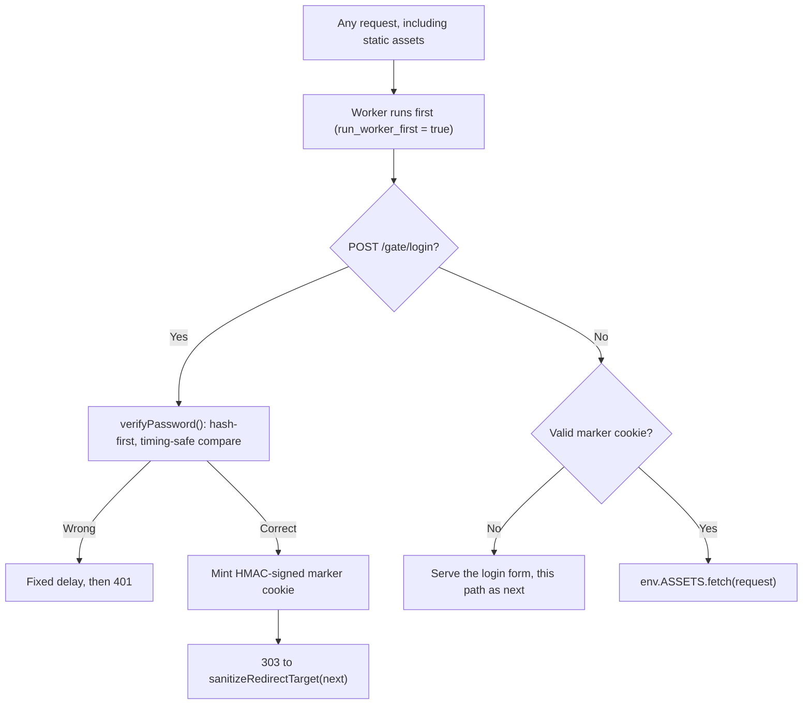

## Overview -- A Gate Is Not Auth

A **password gate** keeps a staging or preview deploy out of search engines and off casual passers-by: one shared password, known to everyone who is supposed to see the site, protects the whole thing behind a single cookie. That is a fundamentally different job from **authentication**.

:::danger[A gate has no identity, no per-user boundary, and no revocation short of rotating the password]
Everyone who passes the gate gets the exact same marker cookie. There is no username, no per-user session, and no way to tell one visitor from another. If the site handles real user data, needs different permissions for different people, or must be able to kick out one specific visitor without logging out everyone else, this recipe is the wrong tool -- reach for [Cloudflare Access](./cloudflare-access.mdx) when the viewers are all people you can allowlist in advance, or [HTTP-only Cookie Sessions](./cookie-sessions.mdx) / [Auth with Pages Functions](./auth-functions.mdx) when the site needs its own accounts. Use a password gate only for what it actually is: a shared secret that keeps a non-production site off Google and out of casual view.
:::

## The Gate Flow

Every request -- HTML, JSON, and every static asset -- has to reach the Worker first, or the gate can be bypassed by requesting a file directly. That requires `run_worker_first = true`; the default `false` lets Cloudflare's asset layer answer a matching static file before the Worker ever runs, silently bypassing any gate wrapped around it. See [Workers Static Assets: Routing Traps](../workers/static-assets.mdx#routing-traps) for the full mechanism and the array-form middle ground that exists for other use cases (it is not a fit here, since a gate needs default-deny over the whole site, not a bounded subtree).



## Wrangler Config and Secrets

```toml
name = "my-preview-site"
main = "./dist/_worker.js"
compatibility_date = "2025-01-01"

[assets]
directory = "./dist"
binding = "ASSETS"
not_found_handling = "404-page"
# Every request must reach the Worker so the gate runs before any asset
# is served. See Workers Static Assets: Routing Traps for what happens
# at the default `false`.
run_worker_first = true
```

Two secrets, neither of which is the plaintext password:

```bash
# Compute the digest locally once; the plaintext password is never stored
# anywhere, not even as a Worker secret. `-r` prints "<hex>  *stdin" --
# copy just the hex portion into the prompt below.
printf '%s' 'correct-horse-battery-staple' | openssl dgst -sha256 -r
npx wrangler secret put GATE_PASSWORD_HASH

# A separate signing key for the marker cookie, unrelated to the password.
openssl rand -hex 32 | npx wrangler secret put GATE_SECRET
```

```typescript
interface Env {
  ASSETS: Fetcher;
  GATE_PASSWORD_HASH: string; // sha256 hex digest of the real password
  GATE_SECRET: string; // HMAC signing key for the marker cookie
}
```

:::note[`GATE_PASSWORD_HASH` is a plain digest, not a password-storage hash]
A single shared preview password is not the same threat model as a multi-user login system. SHA-256 is fast on purpose here -- it exists only to avoid comparing raw variable-length strings (see below), not to resist an attacker who has stolen the digest and wants to brute-force it offline. If this gate ever protects something with real per-user credentials, that needs a slow, salted password hash (bcrypt/scrypt/Argon2), which is out of scope for a shared gate password.
:::

### A Worker Secret Is Not a GitHub Actions Secret

`npx wrangler secret put GATE_PASSWORD_HASH` writes to **Cloudflare's** secret store, and that store is the only one the deployed Worker reads when it evaluates `env.GATE_PASSWORD_HASH`. A GitHub Actions repository secret of the same name -- `gh secret set GATE_PASSWORD_HASH` -- is a different store entirely: it is injected into the workflow process as `${{ secrets.GATE_PASSWORD_HASH }}`, and the running Worker never sees it.

Setting one while expecting the other fails silently, and it looks like success from every angle a reader is likely to check: CI green, deploy green, the secret visibly present on the repository's settings page -- and `env.GATE_PASSWORD_HASH` still `undefined` at runtime. Nothing warns, because from each store's own point of view nothing is wrong.

The only authoritative check is against Cloudflare's store:

```bash
npx wrangler secret list
```

An empty `[]` means the Worker has no secrets bound at all, whatever the repository settings page shows. Redeploying does not repair it: on a redeploy wrangler asks the API to inherit each secret's existing value from the previous version, so a name that was never in Cloudflare's store simply stays absent. Declaring the names wrangler should enforce turns that silent runtime `undefined` into a deploy-time error instead:

```toml
[secrets]
required = ["GATE_PASSWORD_HASH", "GATE_SECRET"]

# Worker-level config does not inherit into named environments. Without
# this second block, `wrangler deploy --env preview` skips the check
# entirely -- and a preview deploy is exactly where a gate runs.
[env.preview.secrets]
required = ["GATE_PASSWORD_HASH", "GATE_SECRET"]
```

See [Declaring Required Secrets](../workers/wrangler-config.mdx#bindings-declaring-required-secrets) for the full dev / first-deploy / redeploy matrix.

To provision from CI rather than by hand, pipe the repository secret into the Worker store as a deploy step -- the one place the two stores legitimately meet:

```yaml
- name: Bind the gate password hash as a Worker secret
  run: echo "$GATE_PASSWORD_HASH" | npx wrangler secret put GATE_PASSWORD_HASH
  env:
    GATE_PASSWORD_HASH: ${{ secrets.GATE_PASSWORD_HASH }}
    CLOUDFLARE_API_TOKEN: ${{ secrets.CLOUDFLARE_API_TOKEN }}
```

A piped value is right-trimmed before it is stored, so `echo`'s trailing newline is harmless -- that is also what makes the `openssl rand -hex 32 | npx wrangler secret put GATE_SECRET` form above work. Only *trailing* whitespace is stripped, though: a stray leading space survives into the stored value and yields a 65-character "digest" that can never match the 64 characters `verifyPassword` computes.

The mirror-image trap -- reaching for `wrangler secret put` to fix a broken **CI credential**, which is a workflow-side secret and not a Worker secret at all -- is covered in [Deploy from Zero](../workers/deploy-from-zero.mdx#ci-token-edit-cloudflare-workers-is-not-enough).

### Unbound Secrets Must Refuse Deliberately, Not Crash

Neither secret has a safe default, so it is worth stating outright what happens today when one is unbound -- because the answer is "fail-closed by accident", and an accident is easy to optimize away:

| Unbound secret | Runtime behavior |
| --- | --- |
| `GATE_PASSWORD_HASH` | `timingSafeEqualHex` reads `b.length` on `undefined` and throws `TypeError: Cannot read properties of undefined (reading 'length')` -- a 500, and no login accepted |
| `GATE_SECRET` | `crypto.subtle.importKey()` rejects the zero-length key with `DataError: Imported HMAC key length (0) must be a non-zero value...` -- a 500, and no marker minted or verified |

Both refuse, which is the right outcome. But `GATE_PASSWORD_HASH` refuses as the side effect of an unhandled exception rather than as a decision, so `verifyPassword` below opens with an explicit guard that states the contract instead. `GATE_SECRET` needs no hand-written equivalent: the runtime's zero-length-key `DataError` is a deterministic hard failure at `importKey`, not a value-dependent one. What both cases do need is for the next reader to recognize that 500 as the gate working, not as a bug to patch around.

:::danger[A committed fallback turns fail-closed into fail-open]
The tempting patch for that 500 is a default:

```typescript
const hash = env.GATE_PASSWORD_HASH || DEV_PASSWORD_HASH; // never do this
```

That one line makes `DEV_PASSWORD_HASH` the **deployed** password for every request served while the secret is missing -- and "the secret is missing" is not hypothetical, it is precisely the state the Actions-secret-vs-Worker-secret mix-up above produces: in production, silently, with a green deploy behind it. A gate that fails open at the exact moment its secret is misconfigured is worse than no gate, because it still looks like one.

A local value belongs in `.dev.vars`, which `wrangler dev` binds as a real secret and which is neither committed nor deployed. If a hardcoded fallback is genuinely unavoidable, gate it on the request's own hostname being loopback (`localhost`, `127.0.0.1`, `[::1]`) so it can never apply to a deployed request -- but `.dev.vars` removes the need for one. [Local Dev Bindings](../workers/local-dev-bindings.mdx) covers that path, including the process-env variant of this same failure, where an auth gate reads `undefined`, resolves to "inert", and returns `200` where the test expected `401`.
:::

## Verifying the Password: Hash First, Then Compare in Constant Time

A naive `===` or a hand-rolled character loop over the raw submitted password and the raw stored password leaks the password's length (and, for a naive loop, its first mismatching byte) through timing -- the comparison returns as soon as the two variable-length strings diverge. Hashing first turns the input into a **fixed-length** digest, and only that fixed-length digest is compared.

A hand-rolled XOR loop over the two digests is not itself a safe finish, though: ECMAScript makes no constant-time guarantee for any particular piece of JS, and a JIT compiler is free to optimize a comparison loop in ways that reintroduce the timing signal it was written to avoid. `crypto.subtle.timingSafeEqual()` is the Workers runtime's own primitive for exactly this comparison -- implemented outside JS execution, not left to the engine's discretion:

```typescript
async function sha256Hex(input: string): Promise<string> {
  const bytes = new TextEncoder().encode(input);
  const digest = await crypto.subtle.digest("SHA-256", bytes);
  return Array.from(new Uint8Array(digest))
    .map((b) => b.toString(16).padStart(2, "0"))
    .join("");
}

// Both arguments are fixed-length hex digests (64 chars for SHA-256) by the
// time this runs -- that is what makes the length check below safe (the
// digest length is public, not the secret's) and what guarantees the two
// encoded buffers are the same length, which crypto.subtle.timingSafeEqual()
// requires: it throws, rather than returning false, on a length mismatch.
function timingSafeEqualHex(a: string, b: string): boolean {
  if (a.length !== b.length) return false;
  const encoder = new TextEncoder();
  return crypto.subtle.timingSafeEqual(encoder.encode(a), encoder.encode(b));
}

async function verifyPassword(submitted: string, env: Env): Promise<boolean> {
  // No secret bound -- refuse every login deliberately, rather than letting an
  // undefined hash reach `b.length` in timingSafeEqualHex and throw a 500.
  if (typeof env.GATE_PASSWORD_HASH !== "string" || env.GATE_PASSWORD_HASH === "") {
    return false;
  }
  const submittedHash = await sha256Hex(submitted);
  return timingSafeEqualHex(submittedHash, env.GATE_PASSWORD_HASH);
}
```

This is the compare this recipe uses everywhere a secret is checked: hash the variable-length input first, then run `crypto.subtle.timingSafeEqual()` only against the resulting fixed-length digests. [Bot Worker](./bot-worker.mdx) and [Signing Webhooks with HMAC-SHA256](./webhook-signing.mdx) use the same shape for the same reason.

## The Marker Cookie

### Server-Issued and Unguessable, Not a Predictable Constant

The cookie that marks "this visitor already passed the gate" must not be something a visitor could hand-craft. A fixed value like `gate=1` is forgeable by anyone who inspects the cookie once -- it carries no proof it was ever issued by the server. The marker below is an HMAC over an expiry timestamp, keyed by `GATE_SECRET`: unforgeable without the key, and its own expiry is covered by the signature, so tampering with it invalidates the cookie instead of extending it.

```typescript
const MARKER_COOKIE_NAME = "gate_ok";
const MARKER_TTL_SECONDS = 60 * 60 * 12; // 12 hours

async function hmacHex(message: string, secret: string): Promise<string> {
  const key = await crypto.subtle.importKey(
    "raw",
    new TextEncoder().encode(secret),
    { name: "HMAC", hash: "SHA-256" },
    false,
    ["sign"],
  );
  const sig = await crypto.subtle.sign("HMAC", key, new TextEncoder().encode(message));
  return Array.from(new Uint8Array(sig))
    .map((b) => b.toString(16).padStart(2, "0"))
    .join("");
}

async function mintMarker(env: Env): Promise<string> {
  const expiresAt = Math.floor(Date.now() / 1000) + MARKER_TTL_SECONDS;
  const signature = await hmacHex(`gate:${expiresAt}`, env.GATE_SECRET);
  return `${expiresAt}.${signature}`;
}

async function verifyMarker(cookieValue: string | undefined, env: Env): Promise<boolean> {
  if (!cookieValue) return false;
  const [expiresAtRaw, signature] = cookieValue.split(".");
  if (!expiresAtRaw || !signature) return false;

  const expiresAt = Number(expiresAtRaw);
  if (!Number.isInteger(expiresAt) || expiresAt < Math.floor(Date.now() / 1000)) {
    return false; // malformed, or past its own signed expiry
  }

  // The signature is a fixed-length hex digest already -- no separate
  // hashing step needed before the timing-safe compare here.
  const expected = await hmacHex(`gate:${expiresAtRaw}`, env.GATE_SECRET);
  return timingSafeEqualHex(signature, expected);
}
```

:::tip[Rotating `GATE_SECRET` revokes every existing marker cookie at once]
Because `verifyMarker` checks the signature against `GATE_SECRET` and nothing else, replacing that secret instantly invalidates every marker cookie currently held by every visitor -- everyone has to log in again. Rotating `GATE_PASSWORD_HASH` alone does **not** do this: it only changes what a new login accepts, and does nothing to markers already issued under the old password. If a leaked password is the concern, rotate both.
:::

### Cookie Attributes Are Not Optional

```typescript
function buildMarkerCookie(value: string): string {
  const parts = [
    `${MARKER_COOKIE_NAME}=${value}`,
    "HttpOnly",
    "Secure",
    "SameSite=Lax",
    "Path=/",
    `Max-Age=${MARKER_TTL_SECONDS}`,
  ];
  return parts.join("; ");
}
```

- **`HttpOnly`** -- the marker never needs to be read by page JavaScript; keeping it out of `document.cookie` closes off one XSS exfiltration path.
- **`Secure`** -- never sent over plain HTTP.
- **`Path=/`** -- explicit, and load-bearing. The cookie is minted from a `POST /gate/login` handler; without an explicit `Path`, a browser defaults it to the directory of the request that set it (`/gate/`), which would scope the marker to `/gate/*` and leave the rest of the site ungated. `Path=/` is what makes the gate apply everywhere.
- **`Max-Age`** -- mirrors `MARKER_TTL_SECONDS`, the same value baked into the signed `expiresAt`. The cookie attribute and the signed payload expire together on purpose: the attribute is what makes the browser stop sending an old cookie on its own, and the signed timestamp is what stops a client from simply re-sending a copy of the cookie it saved before that happened.
- **`SameSite=Lax`** -- a shared link into a gated preview (a Slack link, an email) is a top-level cross-site `GET` navigation, which `Lax` still allows the cookie through; `Strict` would force a second gate hit on every such link. [HTTP-only Cookie Sessions' CSRF section](./cookie-sessions.mdx#csrf-the-cookie-is-ambient) ends with the same `Lax`-vs-`Strict` trade-off, which applies here unchanged. This gate has no state-changing route besides the login POST itself, so there is no separate CSRF surface to gate beyond the password check already in front of it.

See [HTTP-only Cookie Sessions](./cookie-sessions.mdx) for the general-purpose cookie parse/serialize helpers if the project already has them -- this gate needs exactly one cookie, so it is built directly here instead of pulling in a generic serializer.

## Login Is POST-Only, With a Fixed Delay on Failure

The login route only ever accepts `POST`. A `GET` that could submit a password would put the password in server logs, browser history, and the `Referer` header of whatever the visitor clicks next -- all things a fetched form `POST` avoids.

```typescript
const FAILURE_DELAY_MS = 800;

async function handleLogin(request: Request, env: Env): Promise<Response> {
  if (request.method !== "POST") {
    return new Response("Method Not Allowed", { status: 405, headers: { Allow: "POST" } });
  }

  const form = await request.formData();
  const submitted = String(form.get("password") ?? "");
  const nextRaw = String(form.get("next") ?? "");

  const ok = await verifyPassword(submitted, env);
  if (!ok) {
    // A small fixed delay on every failure is cheap and needs no storage --
    // it caps a naive online brute-force sweep to a handful of guesses per
    // second per connection. It is not a substitute for real rate limiting
    // if the gate is worth automating against at scale; for that, add a
    // per-IP failure counter in KV with expiry, the same TTL-based shape as
    // Bot Worker's [rate limiting](./bot-worker.mdx#rate-limiting-with-kv).
    await new Promise((resolve) => setTimeout(resolve, FAILURE_DELAY_MS));
    return new Response("Incorrect password", { status: 401 });
  }

  const marker = await mintMarker(env);
  const target = sanitizeRedirectTarget(nextRaw);

  return new Response(null, {
    status: 303,
    headers: new Headers([
      ["Location", target],
      ["Set-Cookie", buildMarkerCookie(marker)],
    ]),
  });
}
```

## Redirect After Login Reuses the SSRF Recipe's Sanitizer

The `next` value above arrives as untrusted `POST` form data -- a visitor's browser sends back whatever was in the hidden field of the login form, and nothing stops a crafted request from putting an arbitrary value there instead. That is exactly the shape [SSRF and Redirect Safety, Part 2](./ssrf-and-redirect-safety.mdx#part-2-redirect-target-sanitizer) covers: same-origin-path validation, decode-once-then-validate, and rejection of `//host`, backslash, and embedded CR/LF. Import `sanitizeRedirectTarget` from there rather than re-implementing it -- the gate's login flow and the general redirect-after-login flow have identical validator semantics, so there is only one implementation to keep correct.

```typescript
import { sanitizeRedirectTarget } from "./redirect-safety"; // see SSRF and Redirect Safety, Part 2
```

The **other** appearance of `next` -- when the gate first renders the login form for a blocked `GET` request -- is not the untrusted one. It comes straight from `url.pathname + url.search` on the request the Worker is already serving, so it is same-origin by construction and only needs HTML-escaping before it is written into the hidden field, not the open-redirect sanitizer:

```typescript
function escapeHtmlAttr(value: string): string {
  return value
    .replace(/&/g, "&amp;")
    .replace(/"/g, "&quot;")
    .replace(/</g, "&lt;")
    .replace(/>/g, "&gt;");
}

function gateFormHtml(next: string): string {
  return `<!doctype html>
<html>
<body>
<form method="POST" action="/gate/login">
<input type="password" name="password" required autofocus />
<input type="hidden" name="next" value="${escapeHtmlAttr(next)}" />
<button type="submit">Enter</button>
</form>
</body>
</html>`;
}
```

Escaping here guards against HTML injection, a different problem from the open redirect `sanitizeRedirectTarget` guards against. The two checks solve different problems and both apply: `sanitizeRedirectTarget` runs once, on the value that comes back through the login `POST` and is used in a `Location` header; `escapeHtmlAttr` runs on the value written into the form's HTML, regardless of where that value came from.

## Wiring It All Together

```typescript
export default {
  async fetch(request: Request, env: Env): Promise<Response> {
    const url = new URL(request.url);

    if (url.pathname === "/gate/login") {
      return handleLogin(request, env);
    }

    const cookies = parseCookieHeader(request.headers.get("Cookie") ?? "");
    const passed = await verifyMarker(cookies[MARKER_COOKIE_NAME], env);
    if (!passed) {
      const next = url.pathname + url.search;
      return new Response(gateFormHtml(next), {
        status: 401,
        headers: { "Content-Type": "text/html; charset=utf-8" },
      });
    }

    // Gate passed -- serve the real site, assets included, ourselves.
    return env.ASSETS.fetch(request);
  },
};

function parseCookieHeader(header: string): Record<string, string> {
  const cookies: Record<string, string> = {};
  for (const pair of header.split(";")) {
    const trimmed = pair.trim();
    const eq = trimmed.indexOf("=");
    if (eq === -1) continue;
    cookies[trimmed.slice(0, eq)] = trimmed.slice(eq + 1);
  }
  return cookies;
}
```

`run_worker_first = true` makes every request -- HTML, JSON, and every file under `directory` -- reach this handler first. Once the marker cookie checks out, the Worker serves the actual asset itself via `env.ASSETS.fetch(request)`, exactly the pairing described in [The Complete Gating Fix](../workers/static-assets.mdx#routing-traps): the flag alone only changes routing, and the Worker still has to authorize and then serve the asset itself.

## Related

- [Wrangler Config: Declaring Required Secrets](../workers/wrangler-config.mdx#bindings-declaring-required-secrets) -- the `[secrets] required` checklist that turns an unbound `GATE_PASSWORD_HASH` into a deploy-time error instead of a runtime 500.
- [Workers Static Assets](../workers/static-assets.mdx) -- `run_worker_first`, and why the default `false` silently bypasses any gate wrapped around a static site.
- [SSRF and Redirect Safety](./ssrf-and-redirect-safety.mdx) -- the redirect-target sanitizer this recipe reuses for post-login redirects.
- [Bot Worker](./bot-worker.mdx) -- the `timingSafeEqualHex` tip on hashing variable-length secrets before comparing.
- [Signing Webhooks with HMAC-SHA256](./webhook-signing.mdx) -- the same hash-first, timing-safe compare applied to webhook signature verification.
- [Cloudflare Access](./cloudflare-access.mdx) -- identity-backed authorization at the edge, for the case where every viewer can be allowlisted in advance. This gate keeps the job Access cannot do: handing a link to an outside viewer who costs nothing to enroll because there is nothing to enroll.
- [HTTP-only Cookie Sessions](./cookie-sessions.mdx) -- the pattern to reach for once the site needs real per-user identity instead of one shared password.
