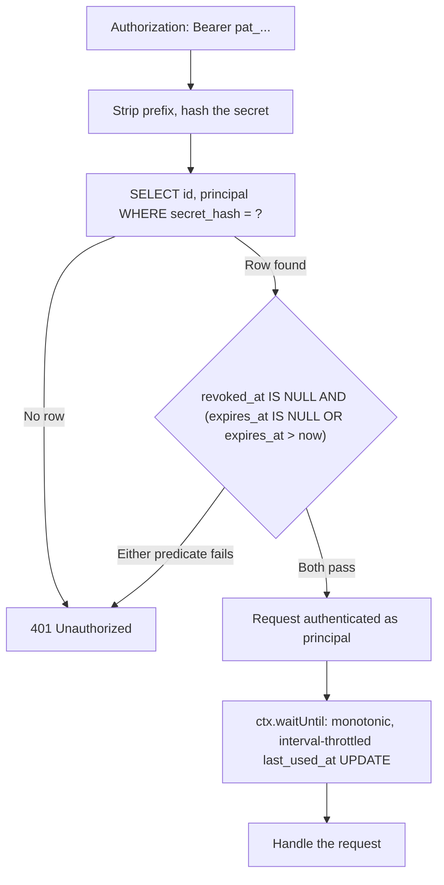

## Overview

A personal API token is a long-lived credential a user mints from their own account settings to call your API programmatically -- from a CI pipeline, a CLI tool, a cron job -- without carrying their browser session along. It plays a different role than the [HTTP-only session cookie](./cookie-sessions.mdx): a session is short-lived and tied to a browser, a personal token is long-lived, explicitly opted into, and revocable independently of any login.

That difference in lifetime is exactly what makes personal tokens dangerous if handled carelessly. A leaked session cookie expires in minutes. A leaked API token, unless the storage, revocation, and management-route design are all correct, can remain valid indefinitely and give an attacker the same power the legitimate owner has over their own account. This recipe covers the parts that make that not true: a token shape that never round-trips the raw secret through storage, a schema that soft-revokes instead of deletes, a revocation check with two independently-explained predicates, a hard rule that the token itself can never touch its own management routes, and a `last_used_at` column that updates without corrupting itself under concurrent traffic.

## Token Shape

A minted token looks like `pat_kR3n2Y8mQvL1xT7wZs4Jc9Hn6Ff0Ea5Dg2Bk8Ii3Cc7Aa1` -- a static, recognizable prefix followed by 256 bits of random secret, base64url-encoded.

```typescript
const TOKEN_PREFIX = "pat_"; // "personal access token" -- recognizable prefix for secret scanners
const SECRET_BYTES = 32; // 256 bits of entropy

function generateSecret(): string {
  const bytes = new Uint8Array(SECRET_BYTES);
  crypto.getRandomValues(bytes);
  let binary = "";
  for (const byte of bytes) binary += String.fromCharCode(byte);
  return btoa(binary).replace(/\+/g, "-").replace(/\//g, "_").replace(/=+$/, "");
}
```

The prefix is not decorative. A fixed, greppable prefix is what lets secret-scanning tools (GitHub's push protection, your own CI linter) recognize a leaked token in a commit or a log line before it is ever presented to your API. `crypto.getRandomValues` -- not `Math.random`, which is not cryptographically secure -- is the only acceptable source for the secret half.

256 bits of entropy is deliberate: it is what lets the next section hash the secret with a single fast, unsalted SHA-256 instead of a slow, salted password hash. A human-chosen password needs bcrypt or argon2 precisely because its entropy is low enough to be brute-forced; a 256-bit random value generated by `crypto.getRandomValues` is not.

## Schema

```sql
CREATE TABLE api_tokens (
  id           TEXT PRIMARY KEY,          -- server-generated UUID, safe to display and log
  principal    TEXT NOT NULL,             -- owning account/user id
  secret_hash  TEXT NOT NULL UNIQUE,      -- SHA-256 hex digest of the token secret
  name         TEXT NOT NULL,             -- user-supplied label, e.g. "CI deploy key"
  created_at   INTEGER NOT NULL,
  expires_at   INTEGER,                   -- NULL = never expires
  revoked_at   INTEGER,                   -- NULL = not revoked
  last_used_at INTEGER                    -- updated opportunistically, see below
);

CREATE INDEX idx_api_tokens_principal ON api_tokens (principal);
```

`id` is a server-generated UUID, never derived from the token and never secret -- it is what the management routes reference when listing or revoking, so a token can be identified in a UI without ever exposing anything the secret hash was built from. `secret_hash`'s `UNIQUE` constraint gives SQLite the index the verification lookup needs; `idx_api_tokens_principal` is what makes listing one owner's tokens cheap.

## Hash-Only Storage

The raw secret is never written to D1 -- only its hash is:

```typescript
async function sha256Hex(input: string): Promise<string> {
  const bytes = new TextEncoder().encode(input);
  const digest = await crypto.subtle.digest("SHA-256", bytes);
  return Array.from(new Uint8Array(digest))
    .map((b) => b.toString(16).padStart(2, "0"))
    .join("");
}
```

This is the same reasoning that governs any secret-at-rest: a database dump, a misconfigured backup, or a compromised replica should never be enough on its own to impersonate a token holder. If only `secret_hash` exists in storage, recovering the original secret from it requires reversing SHA-256, not reading a column.

:::note[No salt, and no `wrangler secret put`]
Unlike a password, this secret does not need a per-row salt -- 256 bits of `crypto.getRandomValues` entropy already makes a precomputed rainbow table infeasible, so a plain SHA-256 digest is adequate. And unlike the JWT session pattern in [HTTP-only Cookie Sessions](./cookie-sessions.mdx), this scheme needs no shared signing key in `wrangler secret put` at all -- every token's security lives entirely in its own random secret, not in a server-side key that would compromise every token at once if it leaked.
:::

## Minting a Token

```typescript
interface Env {
  DB: D1Database;
}

const DEFAULT_TTL_MS = 365 * 24 * 60 * 60 * 1000; // 1 year, unless the caller opts into no expiry

export interface MintedToken {
  id: string;
  token: string; // shown to the caller exactly once -- never stored, never retrievable again
}

export async function mintToken(
  env: Env,
  principal: string,
  name: string,
  ttlMs: number | null = DEFAULT_TTL_MS,
): Promise<MintedToken> {
  const id = crypto.randomUUID();
  const secret = generateSecret();
  const secretHash = await sha256Hex(secret);
  const now = Date.now();
  const expiresAt = ttlMs === null ? null : now + ttlMs;

  await env.DB.prepare(
    `INSERT INTO api_tokens (id, principal, secret_hash, name, created_at, expires_at)
     VALUES (?, ?, ?, ?, ?, ?)`,
  )
    .bind(id, principal, secretHash, name, now, expiresAt)
    .run();

  return { id, token: `${TOKEN_PREFIX}${secret}` };
}
```

:::danger[Mint-once means once]
`mintToken` is the only place the raw token ever exists as a value your code can read. It is returned to the caller in the mint response and nowhere else -- the list endpoint below returns `id`, `name`, and timestamps, never `secret_hash`, and there is no "reveal" or "reset" endpoint that reconstructs it. If the owner loses the value, the only remedy is revoking this token and minting a new one. Design your UI around that: show the raw token once, in a copy-to-clipboard box, with a clear "you will not see this again" warning, and never log it -- not even at debug level.
:::

## Verifying a Token

```typescript
export interface VerifiedToken {
  id: string;
  principal: string;
}

interface TokenRow {
  id: string;
  principal: string;
}

export async function verifyToken(
  env: Env,
  ctx: ExecutionContext,
  authHeader: string | null,
): Promise<VerifiedToken | null> {
  if (!authHeader?.startsWith(`Bearer ${TOKEN_PREFIX}`)) {
    return null;
  }
  const secret = authHeader.slice(`Bearer ${TOKEN_PREFIX}`.length);
  const secretHash = await sha256Hex(secret);
  const now = Date.now();

  const row = await env.DB.prepare(
    `SELECT id, principal FROM api_tokens
     WHERE secret_hash = ?
       AND revoked_at IS NULL
       AND (expires_at IS NULL OR expires_at > ?)`,
  )
    .bind(secretHash, now)
    .first<TokenRow>();

  if (!row) {
    return null;
  }

  ctx.waitUntil(touchLastUsed(env.DB, row.id, now));

  return row;
}
```

The lookup itself is a plain indexed equality match on `secret_hash`, evaluated by SQLite -- not a JavaScript `===` comparison your code performs after fetching a candidate row. There is no manual constant-time-compare step to remember here, unlike [comparing HMAC digests](./webhook-signing.mdx#verifying-on-the-consumer-side): the comparison already happens inside the query engine, over a fixed-length, uniformly-distributed SHA-256 digest.

## Double-Guarded Soft Revoke

Revocation is a soft delete: `revoked_at` gets a timestamp, the row stays. Deleting the row outright would throw away the audit trail (who had a token, for how long, and when it stopped being valid) and would let a future token collide on a reused `id`.

The `WHERE` clause above enforces two independent predicates, and a token must pass both to authenticate -- dropping either one reopens a distinct failure mode:

- **`revoked_at IS NULL`** is the owner's explicit kill switch. This is what "I clicked Revoke" means at the storage layer. Without this predicate, revoking a token in the UI would update a row nobody ever checks -- the token would keep authenticating forever, no matter what the management UI shows.
- **`expires_at IS NULL OR expires_at > now`** is passive, time-based decay that does not depend on the owner remembering to act. Without this predicate, a token minted for a one-off script and then simply forgotten -- never explicitly revoked, because nobody thought to -- stays valid indefinitely. Time-based expiry is what bounds the damage of a credential nobody is actively managing.

A token generated for a CI job that ran once, five years ago, and was never revoked is exactly the case `expires_at` exists to close. A token the owner actively distrusts today, well before its expiry, is exactly the case `revoked_at` exists to close. Neither predicate substitutes for the other.

```typescript
export async function revokeToken(env: Env, principal: string, id: string): Promise<boolean> {
  const revoked = await env.DB.prepare(
    `UPDATE api_tokens
     SET revoked_at = ?
     WHERE id = ? AND principal = ? AND revoked_at IS NULL
     RETURNING id`,
  )
    .bind(Date.now(), id, principal)
    .first();

  return revoked !== null;
}

export interface TokenSummary {
  id: string;
  name: string;
  created_at: number;
  expires_at: number | null;
  revoked_at: number | null;
  last_used_at: number | null;
}

export async function listTokens(env: Env, principal: string): Promise<TokenSummary[]> {
  const { results } = await env.DB.prepare(
    `SELECT id, name, created_at, expires_at, revoked_at, last_used_at
     FROM api_tokens
     WHERE principal = ?
     ORDER BY created_at DESC`,
  )
    .bind(principal)
    .all<TokenSummary>();

  return results; // secret_hash is never selected, let alone returned
}
```

`revokeToken`'s `WHERE` clause scopes by `principal` as well as `id` -- a caller can only ever revoke their own tokens, never guess another account's token id and disable it out from under them.

## Management Routes Reject the Token

The `/account/tokens` routes -- mint, list, revoke -- must authenticate the caller with their session, never with the API token itself. This is a separate rule from the double guard above, and it closes a different hole: even a token that is unexpired and unrevoked must never be accepted as credentials for managing tokens.

A session cookie is authentication, not CSRF protection. It is ambient -- a browser attaches it to a cross-site request exactly as it does to a same-site one -- so `authenticate` below confirms the caller *has a valid session*, not that the caller *meant to make this request*. Every state-changing route here layers the Origin-tuple gate from [HTTP-only Cookie Sessions' CSRF section](./cookie-sessions.mdx#csrf-the-cookie-is-ambient) on top of that, checked only after the session is confirmed valid: no session yet -> `401` immediately, before there is any ambient credential worth protecting; valid session but the wrong `Origin` -> `403`.

```typescript
import { isTrustedOrigin, requiresCsrfCheck } from "./csrf"; // see HTTP-only Cookie Sessions, CSRF section

type AuthResult =
  | { kind: "session"; principal: string }
  | { kind: "token"; principal: string; tokenId: string };

async function authenticate(
  request: Request,
  env: Env,
  ctx: ExecutionContext,
): Promise<AuthResult | null> {
  const authHeader = request.headers.get("Authorization");
  if (authHeader) {
    const verified = await verifyToken(env, ctx, authHeader);
    return verified && { kind: "token", principal: verified.principal, tokenId: verified.id };
  }
  const session = await verifySessionCookie(request, env); // your own session check, see HTTP-only Cookie Sessions
  return session && { kind: "session", principal: session.principal };
}

export async function handleCreateToken(
  request: Request,
  env: Env,
  ctx: ExecutionContext,
): Promise<Response> {
  const auth = await authenticate(request, env, ctx);

  if (!auth || auth.kind !== "session") {
    // A valid, unexpired, unrevoked token is still rejected here. No
    // separate error code either -- the same 401 an anonymous caller
    // gets, so a leaked token can't be used to probe whether it's
    // otherwise still valid.
    return new Response("Unauthorized", { status: 401 });
  }

  // Session confirmed -- now confirm the request itself is trusted before
  // it mutates anything. A crafted cross-site form POST rides the same
  // ambient cookie `authenticate` just accepted; this is what stops it.
  if (requiresCsrfCheck(request) && !isTrustedOrigin(request)) {
    return new Response("Forbidden", { status: 403 });
  }

  const { name } = (await request.json()) as { name: string };
  const minted = await mintToken(env, auth.principal, name);

  return new Response(JSON.stringify(minted), {
    status: 201,
    headers: { "Content-Type": "application/json" },
  });
}
```

:::danger[Why this rule exists]
If a leaked token could authenticate to its own management routes, it would stop being a single, revocable credential and become a self-perpetuating one. An attacker holding one stolen token could list every other token's metadata to pick a target, mint new tokens that survive the owner revoking the one that leaked, or revoke the owner's own tokens to lock them out of the very API they need to clean up the breach. Requiring a session -- something an attacker holding only a leaked token does not have -- is what keeps a single compromised token a single, contained incident.
:::

:::note[Why this route is reachable without a CORS preflight]
`request.json()` parses the body regardless of the request's `Content-Type` header -- it happens to be JSON here, but nothing checks that the header actually said so. A cross-site `<form>` POST with `enctype="text/plain"` never triggers a CORS preflight, and its body can still be crafted to parse as the JSON this handler expects. A form is all a CSRF attempt needs here -- no `fetch()`, no custom headers, nothing a browser would flag before the request goes out. The Origin check above is what actually stops it; Content-Type sniffing would not.
:::

`handleListTokens` and `handleRevokeToken` follow the identical shape: call `authenticate`, reject anything that isn't `kind === "session"`. `handleRevokeToken` -- the other state-changing route here -- also applies the same `requiresCsrfCheck` / `isTrustedOrigin` gate before it touches `revokeToken`; `handleListTokens` is a `GET` and skips it, since `requiresCsrfCheck` already excludes safe methods.

## Tracking `last_used_at` Without a Race

`verifyToken` above calls `ctx.waitUntil(touchLastUsed(...))` after the row is found -- the update happens after the response has already started, so it costs nothing on the request's critical path.

```typescript
const LAST_USED_MIN_INTERVAL_MS = 60_000; // coalesce writes to at most once a minute per token

async function touchLastUsed(db: D1Database, id: string, now: number): Promise<void> {
  await db
    .prepare(
      `UPDATE api_tokens
       SET last_used_at = ?
       WHERE id = ?
         AND (last_used_at IS NULL OR (last_used_at < ? AND ? - last_used_at > ?))`,
    )
    .bind(now, id, now, now, LAST_USED_MIN_INTERVAL_MS)
    .run();
}
```

The `last_used_at IS NULL OR last_used_at < ?` half of the predicate is not optional. A token used for automated, high-frequency API calls will have many requests in flight concurrently, each firing its own `waitUntil` write with its own `now` timestamp -- and `waitUntil` callbacks are not guaranteed to complete in the order the requests that scheduled them arrived. Without the monotonic guard, a request that started earlier (and so carries an earlier `now`) can have its write land *after* a request that started later, silently overwriting a fresher `last_used_at` with a stale one. With the guard, a write only ever moves the timestamp forward -- an out-of-order completion targeting an already-newer row simply matches zero rows and does nothing, exactly the same fenced-write shape as the completion write in [Idempotency-Key Ledger on D1](./idempotency-ledger.mdx#fencing-a-pending-reservation-takeover).

The monotonic guard alone does not bound how *often* the row is written, only the order writes are allowed to land in. The same high-frequency token has a distinct `now` on nearly every request, so without a further check `touchLastUsed` would run a D1 write on almost every request that touches it -- `ctx.waitUntil` takes the write off the response's critical path, but does nothing to reduce the write volume D1 itself has to serialize, and that volume is what actually bottlenecks under enough traffic. The `? - last_used_at > ?` half of the predicate adds a floor: once `last_used_at` has been set inside the last `LAST_USED_MIN_INTERVAL_MS`, further writes are skipped until that window elapses, coalescing a token used many times a second down to one write per minute. This folds into the same `WHERE` clause rather than replacing the monotonic check -- monotonicity is what makes a stale write safe to skip, the interval is what makes skipping the common case instead of the exception.

## Route Table

| Method | Path | Auth | Notes |
|---|---|---|---|
| `POST` | `/account/tokens` | Session only | Mints a token; the raw value is returned exactly once |
| `GET` | `/account/tokens` | Session only | Lists `id`, `name`, and timestamps -- `secret_hash` is never selected |
| `DELETE` | `/account/tokens/:id` | Session only | Soft-revoke: sets `revoked_at`, scoped to the caller's own `principal` |
| Any protected API route (e.g. `/api/*`) | `Bearer pat_...` | API token only | Gated by the double predicate; `last_used_at` updates via `ctx.waitUntil` |

Every row is exclusive, not just "typically used with": the management routes actively reject a bearer token (see above), and the protected API routes have no session fallback in this recipe -- an interactively logged-in browser hitting `/api/*` without a token is unauthenticated there too. Two different credential types, two disjoint sets of routes, no overlap. (A real API surface might reasonably let a logged-in browser call the same routes via its session as well; this recipe keeps the two domains disjoint so the token boundary stays easy to reason about and easy to test.)

## Wiring It Into a Worker



A single `fetch` handler dispatches management routes to session-only handlers and everything else through token verification:

```typescript
export default {
  async fetch(request: Request, env: Env, ctx: ExecutionContext): Promise<Response> {
    const url = new URL(request.url);

    if (url.pathname === "/account/tokens" && request.method === "POST") {
      return handleCreateToken(request, env, ctx);
    }
    if (url.pathname === "/account/tokens" && request.method === "GET") {
      return handleListTokens(request, env, ctx);
    }
    if (url.pathname.startsWith("/account/tokens/") && request.method === "DELETE") {
      return handleRevokeToken(request, env, ctx);
    }

    // Everything else is a token-protected API route.
    const auth = await authenticate(request, env, ctx);
    if (!auth || auth.kind !== "token") {
      return new Response("Unauthorized", { status: 401 });
    }
    return handleApiRequest(request, env, auth.principal);
  },
};
```

`handleApiRequest` is your actual API logic, now running with a verified `principal` and no further token bookkeeping to do -- `verifyToken` already updated `last_used_at` before this line runs.

## See also

- [HTTP-only Cookie Sessions](./cookie-sessions.mdx) -- the session-cookie auth that management routes require here, and the source of the [Origin-tuple CSRF gate](./cookie-sessions.mdx#csrf-the-cookie-is-ambient) they layer on top of it.
- [Idempotency-Key Ledger on D1](./idempotency-ledger.mdx) -- the same D1 fundamentals (conditional `UPDATE ... RETURNING`, fenced writes) applied to a different problem.
- [Signing Webhooks with HMAC-SHA256](./webhook-signing.mdx) -- the other place this site hashes with Web Crypto, and why that one needs a constant-time compare while this one doesn't.
