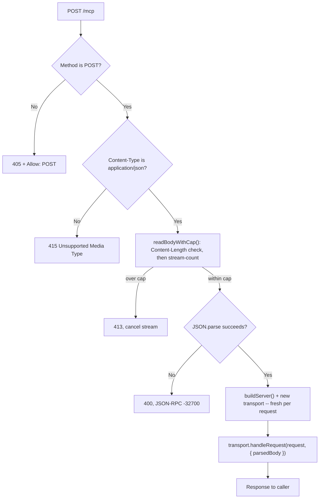

## Overview

A remote MCP (Model Context Protocol) server is just a Worker: an HTTP endpoint that speaks JSON-RPC over the MCP Streamable HTTP transport, so any MCP-compatible client -- Claude, an IDE integration, another agent -- can call `initialize`, `tools/list`, and `tools/call` against it without a local process to manage. The `@modelcontextprotocol/sdk` package ships everything needed to build one, but its defaults are shaped for a long-lived Node.js server -- picking the wrong transport, trusting the wrong headers, or importing the wrong half of the package produces a Worker that either doesn't run, silently balloons its bundle, or accepts more than it should.

This recipe builds a stateless MCP server -- no session, no Durable Object, a fresh `McpServer` and transport instantiated on every request -- and covers the decisions that make that safe and small: which transport module actually speaks the Fetch API, why per-request instantiation is nearly free on Workers specifically, a request gate that gives every non-POST caller a clean `405` before the transport ever runs, a body cap enforced *before* any JSON parsing happens, and a bundle-size check that catches an accidental import of the SDK's client half.

If the endpoint needs OAuth-authenticated sessions, server-initiated notifications, or state that outlives a single request, that is a Durable-Object-backed `McpAgent` from Cloudflare's own Agents SDK, not this recipe -- see [Related](#related).

## Transport Choice: WebStandard, Not Node-Shaped

`@modelcontextprotocol/sdk` ships two HTTP server transports for the same Streamable HTTP wire protocol, and they are not interchangeable on Workers:

```typescript
// Don't -- Node-shaped: handleRequest(req, res) expects Node's
// http.IncomingMessage / http.ServerResponse, and the module pulls in
// @hono/node-server as an adapter to produce them. A Worker's fetch()
// handler never has either object -- it has a Fetch API Request.
import { StreamableHTTPServerTransport } from "@modelcontextprotocol/sdk/server/streamableHttp.js";

// Do -- WebStandard: handleRequest(req: Request) takes and returns the
// Fetch API Request/Response your Worker already speaks natively.
import { WebStandardStreamableHTTPServerTransport } from "@modelcontextprotocol/sdk/server/webStandardStreamableHttp.js";
```

`streamableHttp.js` is built for a Node HTTP server: its `handleRequest` signature is `(req: IncomingMessage, res: ServerResponse, parsedBody?) => Promise<void>`, and it depends on `@hono/node-server` to bridge Node's request/response objects to the Fetch API internally. None of that bridging buys a Worker anything -- `fetch(request: Request, env, ctx)` already hands you a standard `Request` and expects a standard `Response` back. `webStandardStreamableHttp.js` implements the same protocol directly against those types, with no Node shim in between and no `@hono/node-server` in the dependency graph this Worker actually needs.

## Stateless Config, Fresh Server Per Request

```typescript
import { McpServer } from "@modelcontextprotocol/sdk/server/mcp.js";
import { WebStandardStreamableHTTPServerTransport } from "@modelcontextprotocol/sdk/server/webStandardStreamableHttp.js";
import { z } from "zod";

function buildServer(): McpServer {
  const server = new McpServer({ name: "wisdom-mcp", version: "1.0.0" });

  server.registerTool(
    "echo",
    {
      title: "Echo",
      description: "Echoes the input message back",
      inputSchema: { message: z.string() },
    },
    async ({ message }) => ({
      content: [{ type: "text", text: message }],
    }),
  );

  return server;
}
```

`sessionIdGenerator: undefined` on the transport constructor is what puts it in stateless mode -- no `Mcp-Session-Id` is minted, no session state is tracked between requests, and every POST to `/mcp` is handled as if it were the only request the server has ever seen. That also means no resumable streams and no server-initiated notifications between calls; a client can't open a long-lived connection and expect to be pushed messages later. In exchange, there is nothing to pin to a particular instance, nothing to expire, and nothing to leak between callers.

```typescript
const transport = new WebStandardStreamableHTTPServerTransport({
  sessionIdGenerator: undefined, // stateless: no session tracking between requests
  enableJsonResponse: true, // plain JSON responses -- no SSE stream for this recipe
});
```

`buildServer()` and the transport above are both created **inside** the `fetch` handler, once per incoming request -- never at module scope, never cached across requests. A tool registered once at module scope would still work for a single isolate, but it would tie every future request on that isolate to whatever module-level state the tool closed over, which is exactly the shared, cross-request state a stateless design is trying to avoid.

## Isolate, Not Process: Why Per-Request Instantiation Is Cheap

Creating a new server object for every request looks wasteful if the mental model is a long-lived Node process: booting a fresh Express app, re-registering routes, and re-establishing connection pools on every single request would be a real cost, and no one does that. Workers are not that model. The unit that stays warm and gets reused across requests is the **V8 isolate**, not a process -- the module graph is already loaded, already parsed, already JIT-warmed by the time a request arrives at a warm isolate. `buildServer()` running again inside that isolate is just allocating a handful of JS objects and executing a few synchronous `registerTool()` calls -- no process fork, no new V8 context, no re-parsing of this file. The genuinely per-request cost is the object graph itself (the `McpServer` instance and its transport), not the environment it runs in.

This is also why the stateless design fits the platform: Workers can route a request to any warm isolate handling this script, anywhere at the edge, with no affinity to "the one that has the session." A session-based design would need to pin a client to one Durable Object instance to keep that guarantee; the stateless design here has no guarantee to keep, so any isolate can answer any request.

## The Request Gate: POST-Only, 405 + Allow Header

The Streamable HTTP transport's own `handleRequest` routes `GET` to an SSE stream and `DELETE` to session termination -- both meaningful only when a session exists. This recipe's transport has no session (`sessionIdGenerator: undefined`), so neither verb has anything to do here; letting the transport handle them anyway means a `GET` or `DELETE` falls through to the transport's own missing-session-id error instead of a clean, predictable response. Gate the method **before** the transport ever sees the request instead, and answer everything but `POST` the same way:

```typescript
function jsonRpcError(
  status: number,
  code: number,
  message: string,
  extraHeaders: Record<string, string> = {},
): Response {
  return new Response(JSON.stringify({ jsonrpc: "2.0", id: null, error: { code, message } }), {
    status,
    headers: { "content-type": "application/json", ...extraHeaders },
  });
}

// Inside the fetch handler, before any body is read:
if (request.method !== "POST") {
  return jsonRpcError(405, -32000, "Method not allowed", { Allow: "POST" });
}
```

The response body is still a valid JSON-RPC error envelope (`code: -32000`, the same generic server-error code the SDK itself uses for its own method-not-allowed case), so a client that always tries to parse the body as JSON-RPC gets something coherent either way -- it just also gets a stable `405` and `Allow: POST` from a check that runs before the SDK is involved at all.

## The Body Cap: Enforced Before Any JSON Parsing

MCP payloads can carry binary content -- an image a tool returns, a file a resource read echoes back -- inline as a base64 string inside the JSON body. Base64 inflates the true byte count by roughly 4/3, so a request that looks moderate on the wire can still force a large in-memory decode; a request that's deliberately oversized can force an even larger one. `await request.json()` (or `.text()`) buffers the **entire** body into memory before your code gets any chance to object to its size -- by the time a size check after that call could run, the expensive part already happened.

The fix is to check size **before** parsing, in two layers, because the obvious first check is not enough on its own:

```typescript
const MAX_BODY_BYTES = 256 * 1024; // 256 KiB -- generous for JSON-RPC args, tight against base64-inflated abuse

async function readBodyWithCap(request: Request, maxBytes: number): Promise<string> {
  // Content-Length is attacker-supplied and can be absent entirely (chunked
  // transfer-encoding) or simply wrong -- a cheap early reject, not the guard.
  const declaredLength = request.headers.get("content-length");
  if (declaredLength && Number(declaredLength) > maxBytes) {
    throw new Error(`Body exceeds ${maxBytes} bytes (Content-Length: ${declaredLength})`);
  }

  if (!request.body) return "";

  // Stream-count the actual bytes and abort mid-stream once the cap is
  // crossed, instead of letting request.json()/.text() buffer everything
  // first and only checking size after the fact.
  const reader = request.body.getReader();
  const chunks: Uint8Array[] = [];
  let total = 0;
  for (;;) {
    const { done, value } = await reader.read();
    if (done) break;
    total += value.byteLength;
    if (total > maxBytes) {
      await reader.cancel();
      throw new Error(`Body exceeds ${maxBytes} bytes while streaming`);
    }
    chunks.push(value);
  }

  const bytes = new Uint8Array(total);
  let offset = 0;
  for (const chunk of chunks) {
    bytes.set(chunk, offset);
    offset += chunk.byteLength;
  }
  return new TextDecoder().decode(bytes);
}
```

The `Content-Length` check is a cheap first pass that rejects an honestly-labeled oversized request without touching the body at all. It cannot be the only check: `Content-Length` is absent on a chunked request, and nothing stops a client from sending a small declared length and a larger actual stream (or vice versa). The streaming loop is the real boundary -- it counts bytes as they arrive and cancels the reader the moment the running total crosses the cap, so the worst case is buffering `maxBytes` plus one chunk, never an unbounded body.

## Content-Type and the JSON-RPC Error Shape

Validate `Content-Type` before the body cap even runs -- there is no reason to read a single byte of a request that was never going to be JSON:

```typescript
const contentType = request.headers.get("content-type") ?? "";
if (!contentType.includes("application/json")) {
  return jsonRpcError(415, -32000, "Content-Type must be application/json");
}
```

Once the body is read and capped, a `JSON.parse` failure gets JSON-RPC's own reserved code for exactly this case -- `-32700`, parse error -- rather than the generic `-32000` used above:

```typescript
let parsedBody: unknown;
try {
  parsedBody = JSON.parse(bodyText);
} catch {
  return jsonRpcError(400, -32700, "Parse error: invalid JSON");
}
```

Every rejection this recipe's own gate produces -- method, content-type, body size, parse failure -- returns the same `{ jsonrpc: "2.0", id: null, error: { code, message } }` envelope the SDK's transport itself returns for its internal rejections (invalid `Accept`, missing session, unsupported protocol version). A client that already knows how to read a JSON-RPC error from this endpoint doesn't need a second code path for the checks that happen to run before the SDK does.

Putting the gate together, in the order each check actually runs:

```typescript
interface Env {
  // no bindings required for this minimal example -- add KV, D1, or secrets
  // as your registered tools need them
}

export default {
  async fetch(request: Request, env: Env): Promise<Response> {
    const url = new URL(request.url);
    if (url.pathname !== "/mcp") {
      return new Response("Not found", { status: 404 });
    }

    if (request.method !== "POST") {
      return jsonRpcError(405, -32000, "Method not allowed", { Allow: "POST" });
    }

    const contentType = request.headers.get("content-type") ?? "";
    if (!contentType.includes("application/json")) {
      return jsonRpcError(415, -32000, "Content-Type must be application/json");
    }

    let bodyText: string;
    try {
      bodyText = await readBodyWithCap(request, MAX_BODY_BYTES);
    } catch (err) {
      return jsonRpcError(413, -32000, (err as Error).message);
    }

    let parsedBody: unknown;
    try {
      parsedBody = JSON.parse(bodyText);
    } catch {
      return jsonRpcError(400, -32700, "Parse error: invalid JSON");
    }

    // Fresh server + transport per request -- see "Stateless Config" above.
    const server = buildServer();
    const transport = new WebStandardStreamableHTTPServerTransport({
      sessionIdGenerator: undefined,
      enableJsonResponse: true,
    });
    await server.connect(transport);

    // request.body was already drained by readBodyWithCap above -- pass the
    // parsed result directly so handleRequest uses it instead of trying to
    // read the (now-empty) stream itself.
    return transport.handleRequest(request, { parsedBody });
  },
};
```

## Pin the SDK to an Exact Version

```json
{
  "dependencies": {
    "@modelcontextprotocol/sdk": "1.30.0"
  }
}
```

Not `"^1.30.0"` -- an exact version, no range operator. This package's minor releases have changed behavior this recipe's own security logic leans on: a past minor bump took its default JSON-schema validator from `ajv@6.12.6` to `ajv@8.17.1`, which broke builds that depended on the older version's Workers-compatible behavior, and transport-level details like status-code mapping and error shapes have shifted between releases too. A floating `^1.x` range means a routine `npm install` or a CI cache miss can pick up one of those changes -- silently altering the `405` contract, the JSON-RPC error codes, or the dependency graph checked in [Bundle Size](#bundle-size-import-only-the-server-half) -- without a single line of this repository changing. Pin exact, and re-run the [verification checklist](#verification-checklist) deliberately on every bump.

## Bundle Size: Import Only the Server Half

The SDK publishes separate subpath exports for its two halves -- `@modelcontextprotocol/sdk/client/*` for building something that connects *out* to someone else's MCP server, and `@modelcontextprotocol/sdk/server/*` for building the server itself, which is all this recipe needs. Every import in this recipe comes from `.../server/mcp.js` and `.../server/webStandardStreamableHttp.js`; nothing here imports from `.../client/*` or from the package's bare root `@modelcontextprotocol/sdk`.

That distinction is worth enforcing deliberately because the two halves don't cost the same. The client half carries its own transport and auth stack, and the package's default JSON-schema validation path depends on `ajv` plus `ajv-formats` -- dependencies with a documented history of bloating or breaking Workers bundles. Copying an example that imports a type from the package root, or reaching for a client-side helper "just for the type," is enough to drag that graph into a Worker that never needed it at runtime.

Confirm what actually shipped rather than assuming it from the import list:

```bash
npx wrangler deploy --dry-run
```

`--dry-run` builds the real deployable bundle without publishing it and reports its size. Run it once against a clean, server-only import set to establish a baseline, then again after any dependency bump or refactor -- a size jump that isn't explained by a deliberate feature addition is the signal that something reached across to the client half, or that the default `ajv`-based validator got pulled in. The SDK also ships a `@modelcontextprotocol/sdk/validation/cfworker` provider built specifically to avoid dragging `ajv` into a Workers bundle at all, worth reaching for if a `--dry-run` regression traces back to the default validator.

## CORS and Auth: Who May Call This Endpoint

Decide this explicitly -- an MCP endpoint that accepts `tools/call` is accepting requests that can have real side effects, not just serving data:

- **No CORS header at all** if only non-browser MCP clients will ever call this endpoint (another Worker, a backend job, `mcp-remote` run locally as a stdio-to-HTTP bridge). Browsers enforce CORS; non-browser HTTP clients don't check it, so omitting `Access-Control-Allow-Origin` is a real restriction against browser-based callers specifically, not an oversight.
- If a browser-based MCP client genuinely needs to call this endpoint directly, set `Access-Control-Allow-Origin` to a small, explicit allowlist -- never `*` -- for the same reason.
- Authenticate the caller before `buildServer()` or `handleRequest` ever run, with a bearer token or API key checked against `Authorization`. The same shape covered in [Personal API Tokens](./personal-api-tokens.mdx) applies directly here: an unauthenticated MCP endpoint hands `tools/list`, and whatever `tools/call` actually does, to anyone who can reach the URL.
- The transport constructor also exposes `allowedHosts` / `allowedOrigins` / `enableDnsRebindingProtection` for DNS-rebinding protection, but the current SDK marks all three `@deprecated` in favor of "external middleware" -- in practice, your own `Host` / `Origin` check in the fetch handler, run alongside the method and content-type gates above, not a transport constructor option.

## Verification Checklist

Run these against a deployed Worker (or `wrangler dev`) in order -- a real MCP client sends `initialize` first, so this transcript does too. Treat the response bodies below as illustrative of the fields that matter (`jsonrpc`, `id`, `result`/`error`); exact key order or extra metadata fields the SDK adds are not a contract to match byte-for-byte.

**1. `initialize`**

```bash
curl -s -X POST https://your-worker.example.workers.dev/mcp \
  -H "Content-Type: application/json" \
  -H "Accept: application/json, text/event-stream" \
  -d '{
    "jsonrpc": "2.0",
    "id": 1,
    "method": "initialize",
    "params": {
      "protocolVersion": "2025-11-25",
      "capabilities": {},
      "clientInfo": { "name": "curl-check", "version": "1.0.0" }
    }
  }'
```

```json
{"jsonrpc":"2.0","id":1,"result":{"protocolVersion":"2025-11-25","capabilities":{"tools":{}},"serverInfo":{"name":"wisdom-mcp","version":"1.0.0"}}}
```

Match `protocolVersion` to whatever your installed SDK version actually advertises -- check its `LATEST_PROTOCOL_VERSION` export rather than assuming the value above still holds after a bump.

**2. `tools/list`**

```bash
curl -s -X POST https://your-worker.example.workers.dev/mcp \
  -H "Content-Type: application/json" \
  -H "Accept: application/json, text/event-stream" \
  -d '{"jsonrpc":"2.0","id":2,"method":"tools/list","params":{}}'
```

```json
{"jsonrpc":"2.0","id":2,"result":{"tools":[{"name":"echo","title":"Echo","description":"Echoes the input message back","inputSchema":{"type":"object","properties":{"message":{"type":"string"}},"required":["message"]}}]}}
```

**3. `tools/call`**

```bash
curl -s -X POST https://your-worker.example.workers.dev/mcp \
  -H "Content-Type: application/json" \
  -H "Accept: application/json, text/event-stream" \
  -d '{"jsonrpc":"2.0","id":3,"method":"tools/call","params":{"name":"echo","arguments":{"message":"hello from curl"}}}'
```

```json
{"jsonrpc":"2.0","id":3,"result":{"content":[{"type":"text","text":"hello from curl"}]}}
```

**4. The 405 probe**

```bash
curl -s -i -X GET https://your-worker.example.workers.dev/mcp
```

```
HTTP/1.1 405 Method Not Allowed
Allow: POST
content-type: application/json

{"jsonrpc":"2.0","id":null,"error":{"code":-32000,"message":"Method not allowed"}}
```

This response comes from this recipe's own gate, before the SDK transport ever runs -- confirm that by checking it also fires for `PUT` and `DELETE`, not just `GET`.



## Related

[Personal API Tokens](./personal-api-tokens.mdx) covers the bearer-token auth shape referenced above. For a session-based MCP server -- OAuth-authenticated clients, server-initiated notifications, state that outlives one request -- reach for a Durable-Object-backed `McpAgent` from Cloudflare's Agents SDK instead of this stateless pattern; the two are different tools for different session requirements, not two ways to do the same thing.
