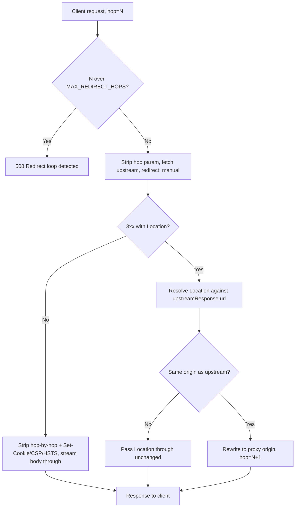

## Overview

A reverse proxy Worker sits in front of exactly one upstream origin, fixed at deploy time, and forwards each request to it -- rewriting whatever needs rewriting on the way through so the client only ever sees the proxy's own hostname. That "fixed at deploy time" clause is not incidental; it is the whole safety model this recipe rests on, and the next section spells out why.

Every request through this Worker crosses two legs, and each needs its own pass:

- **Request leg** -- client to Worker to upstream. Hop-by-hop headers get stripped, the outbound target is built from the fixed upstream origin, and the body streams through unread.
- **Response leg** -- upstream to Worker to client. Hop-by-hop headers get stripped again (a different set, computed from the upstream's own `Connection` header), a handful of security/session headers get stripped as a deliberate trust-model choice, and the body streams back unread.

This recipe builds both legs, then layers on manual redirect handling, caching, and the two traps that actually surface once real traffic hits it.

## Fixed Target, Not a URL Rewriter

Everything below assumes `UPSTREAM_ORIGIN` is a fixed value -- an environment variable or binding set at deploy time -- never a value derived from the incoming request (a query parameter, a header, a path segment that gets decoded into a hostname).

:::danger[A caller-controlled target turns this recipe into an SSRF vector]
The moment the upstream origin comes from anything the caller can influence, this stops being a reverse proxy and becomes exactly the outbound-fetch problem covered in [SSRF and Redirect Safety](./ssrf-and-redirect-safety.mdx): a Worker that will fetch whatever URL it's handed, including your own infrastructure or a cloud metadata endpoint. If the product genuinely needs to proxy to a caller-nominated target, start from that recipe's blocklist-or-allowlist guard instead -- everything here, including the redirect handling below, assumes the target is already known and trusted.
:::

## Header Hygiene on Both Legs

### The Static List

RFC 9110 designates a fixed set of headers as **hop-by-hop**: meaningful only for the single connection they arrived on, never something an intermediary forwards to the next hop.

| Header | Why it's hop-by-hop |
| --- | --- |
| `Connection` | Names this connection's own control tokens -- see below |
| `Keep-Alive` | Connection-management parameters for this hop only |
| `Proxy-Authenticate` | Authentication challenge between this client and this proxy |
| `Proxy-Authorization` | Credentials for this proxy, not the next one |
| `TE` | Transfer codings this hop is willing to accept |
| `Trailer` | Announces trailer fields for this hop's framing |
| `Transfer-Encoding` | Describes this hop's wire framing, not the message body |
| `Upgrade` | Protocol upgrade for this connection only |

### The Part Most Proxies Miss: Headers Nominated by Connection

The static list above is not the complete picture. RFC 9110 §7.6.1 also lets either side name **additional** headers as hop-by-hop for one specific message, by listing them in the `Connection` header itself -- `Connection: close, X-Internal-Trace` means `X-Internal-Trace` is just as message-local as `Connection` and `TE` are, and a forwarding intermediary has to strip it too, even though it appears nowhere on the static list above.

```typescript
// Static hop-by-hop headers per RFC 9110 §7.6.1 -- meaningful only for a
// single connection, never forwarded by an intermediary.
const STATIC_HOP_BY_HOP_HEADERS = [
  "connection",
  "keep-alive",
  "proxy-authenticate",
  "proxy-authorization",
  "te",
  "trailer",
  "transfer-encoding",
  "upgrade",
];

/**
 * Strip hop-by-hop headers before forwarding a message to the next hop.
 * Applied to both legs: once on the request on its way to the upstream,
 * once on the response on its way back to the client.
 */
function stripHopByHopHeaders(headers: Headers): Headers {
  const result = new Headers(headers);

  // Connection can nominate EXTRA headers as hop-by-hop for this message
  // only -- e.g. `Connection: close, X-Internal-Trace`. Those named headers
  // are just as message-local as the static list and must be stripped too.
  const nominated = (headers.get("connection") ?? "")
    .split(",")
    .map((name) => name.trim().toLowerCase())
    .filter(Boolean);

  for (const name of [...STATIC_HOP_BY_HOP_HEADERS, ...nominated]) {
    result.delete(name);
  }

  return result;
}
```

Run this once on the request's headers before the outbound `fetch()`, and once on the upstream response's headers before building the client response -- the `Connection` header the client sent and the one the upstream sent back can nominate entirely different extra names, so each leg needs its own pass rather than one shared strip list.

## Building the Outbound Request

```typescript
const upstreamTarget = new URL(requestUrl.pathname + requestUrl.search, env.UPSTREAM_ORIGIN);

const upstreamResponse = await fetch(upstreamTarget, {
  method: request.method,
  headers: stripHopByHopHeaders(request.headers),
  body: request.body, // streamed through unread -- see "Pass-Through Body Rule" below
  redirect: "manual", // see "Manual Redirects" below
});
```

A couple of details that trip up a first attempt:

- **You cannot forward the client's `Host` header, and you don't need to.** `Host` is a forbidden header name in the Fetch API -- Workers derives it from the fetch target URL, and any attempt to set it explicitly is silently ignored. Since the whole point of a fixed-upstream proxy is that the outbound request always targets `env.UPSTREAM_ORIGIN`, the correct outbound `Host` is whatever that origin's hostname is; there is nothing to forward. If downstream code at the upstream needs to know the original public hostname the client connected to, send it explicitly as `X-Forwarded-Host` (and `X-Forwarded-Proto`, `X-Forwarded-For`) instead of fighting the runtime over `Host`.
- **No `duplex` option needed.** Browser and Node `fetch()` require `duplex: "half"` when the body is a `ReadableStream`; Workers' `fetch()` doesn't have that requirement, so `body: request.body` works as-is for streaming request bodies.

## Manual Redirects: Rewriting Location and Capping the Chain

Leaving `fetch()` on its default `redirect: "follow"` hands the entire redirect chain to the runtime and returns only the final response -- the client never sees the intermediate 3xx, and the proxy never gets a chance to rewrite `Location` before it would otherwise leak the upstream's real hostname to a browser that thinks it's still talking to the proxy. `redirect: "manual"` makes each hop visible as its own `Response`, so the proxy can rewrite it before deciding what the client sees.

### Resolve Relative, Rewrite the Origin

A `Location` value can be relative, and it resolves against the response that carried it -- not the original request URL, which may differ after earlier same-origin hops:

```typescript
const MAX_REDIRECT_HOPS = 5;
const HOP_COUNT_PARAM = "__proxy_hop";

function rewriteLocationForClient(
  location: string,
  upstreamResponseUrl: string,
  upstreamOrigin: string,
  proxyOrigin: string,
  hopCount: number,
): string {
  // Relative Location values resolve against the response that carried
  // them, per RFC 9110 §10.2.2 -- never against the original request URL.
  const target = new URL(location, upstreamResponseUrl);

  if (target.origin !== upstreamOrigin) {
    // Left the fixed, configured upstream entirely -- outside this
    // recipe's trust model (see "Fixed Target" above), but not necessarily
    // wrong: an OAuth callback or a payment redirect legitimately leaves
    // the proxied origin. Pass it through unchanged rather than rewriting
    // a host nobody configured this proxy to serve.
    return target.href;
  }

  // Same-origin hop: rewrite so the client keeps talking to the proxy's
  // own public hostname, never the upstream's real one.
  const rewritten = new URL(target.pathname + target.search + target.hash, proxyOrigin);
  rewritten.searchParams.set(HOP_COUNT_PARAM, String(hopCount + 1));
  return rewritten.href;
}
```

### Capping the Chain Across, Not Within, a Single Fetch Call

This is a different loop-capping problem than the per-hop redirect re-check in [SSRF and Redirect Safety](./ssrf-and-redirect-safety.mdx#per-hop-redirect-re-check). That guard loops **inside one `fetch()` call**, because the target is untrusted and every hop has to be re-validated before the code follows it further. Here the upstream is fixed and trusted, but the proxy hands each redirect straight back to the client instead of following it -- so the chain crosses **multiple independent client round trips**: the browser follows the rewritten `Location` back to the proxy, and a fresh, stateless Worker invocation handles it with no memory of how many hops came before. There is no in-memory counter that survives between them.

The fix is to carry the hop count somewhere that does survive: inside the redirect URL itself. `rewriteLocationForClient` above appends `HOP_COUNT_PARAM` to every same-origin rewrite; the handler reads it back off the incoming request and refuses to continue past `MAX_REDIRECT_HOPS`:

```typescript
function currentHopCount(url: URL): number {
  const raw = url.searchParams.get(HOP_COUNT_PARAM);
  const parsed = raw ? Number.parseInt(raw, 10) : 0;
  return Number.isFinite(parsed) && parsed >= 0 ? parsed : 0;
}
```

The counter is proxy-internal bookkeeping -- strip it from the URL before it ever reaches the upstream, the same way hop-by-hop headers get stripped before crossing a hop.



## The Response Leg: Cookies, CSP, and HSTS Are a Trust-Model Choice

`Set-Cookie`, `Content-Security-Policy` (and its `-Report-Only` variant), and `Strict-Transport-Security` all describe trust in a specific origin's identity -- and once this proxy serves the upstream's content under its own public hostname, that identity is no longer the upstream's. Forwarding these headers unmodified doesn't just risk leaking implementation details; it can be actively wrong:

- **`Set-Cookie`** -- a cookie the upstream set with no explicit `Domain` is host-only, scoped to the upstream's exact hostname. Forwarded verbatim to a client that only ever talks to the proxy's hostname, the browser stores (or silently drops) a cookie scoped to a domain it never actually connects to -- it does nothing useful and may leak the upstream's real hostname into the cookie itself.
- **`Content-Security-Policy`** -- a policy authored for the upstream's own hostname (`script-src 'self' https://upstream-actual-host.example`) stops matching once the same bytes are served from the proxy's hostname instead; `'self'` now resolves to a different origin than the one the policy author had in mind.
- **`Strict-Transport-Security`** -- a browser associates HSTS with whichever origin actually served the response, not with whoever authored the header. Forward it unmodified and the *proxy's* domain (and every subdomain, if `includeSubDomains` is set) becomes HSTS-pinned in every visitor's browser, from a header the upstream never intended for that domain.

This recipe's default is to strip all three, along with `Content-Security-Policy-Report-Only`, and treat the proxy's own origin as authoritative for session state and security policy, independent of whatever the upstream happens to send:

```typescript
// Response headers this recipe never forwards -- each one is a
// trust-boundary decision, not routine hygiene. See "The Response Leg" above.
const STRIPPED_RESPONSE_HEADERS = [
  "set-cookie",
  "content-security-policy",
  "content-security-policy-report-only",
  "strict-transport-security",
];
```

:::note[This recipe's trust model, not a universal proxy rule]
Stripping these three is the right default when the proxy and the upstream are different trust boundaries -- which is the common case, and the one this recipe is written for. If the proxy is intentionally transparent instead -- an internal load balancer in front of a service you also control, where the upstream's cookies and CSP are meant to apply verbatim to the public-facing domain -- forwarding them through (or rewriting `Domain` and CSP host references to match the proxy's hostname, rather than stripping outright) is the correct choice instead. [HTTP-only Cookie Sessions](./cookie-sessions.mdx) covers hand-rolling that `Set-Cookie` rewrite if a session needs to survive the hop.
:::

## The Pass-Through Body Rule and the workerd Content-Encoding Trap

### Don't Read What You Don't Need To

Never buffer the upstream response body -- no `.text()`, `.json()`, `.arrayBuffer()`, and no piping it through a `TransformStream` for logging -- unless the recipe genuinely needs to transform it. As long as `upstreamResponse.body` streams straight through untouched, Cloudflare's documented pass-through optimization applies: nothing decodes, nothing recompresses, and `Content-Encoding` stays truthful for exactly the bytes on the wire.

```typescript
function buildClientResponse(upstreamResponse: Response): Response {
  const headers = stripHopByHopHeaders(upstreamResponse.headers);
  for (const name of STRIPPED_RESPONSE_HEADERS) headers.delete(name);

  // Stream the body through unread -- see below for what happens the
  // moment something reads it instead.
  return new Response(upstreamResponse.body, {
    status: upstreamResponse.status,
    statusText: upstreamResponse.statusText,
    headers,
  });
}
```

### The Trap: workerd Doesn't Update Content-Encoding After It Decodes the Body

[`workerd#5112`](https://github.com/cloudflare/workerd/issues/5112) tracks exactly this: read a compressed `fetch()` response's body from JavaScript, and workerd hands back **decoded** bytes -- the Fetch spec requires that -- but leaves `Content-Encoding` on the `Response` object saying `gzip` (or whatever the original encoding was), because the spec never says to remove it. Once code downstream copies that header onto a new `Response` without knowing the body it's pairing it with is already plain, the client receives decoded bytes labeled as still compressed, and its own decoder chokes on data that was never actually gzip in the first place.

Cloudflare's own maintainer response on the issue is worth reading in full for the framing: it's spec-compliant, not a workerd bug to fix, and production doesn't reproduce it the same way, because Cloudflare's edge (FL) runs its own decompression pass with consistent header handling in front of every Worker -- `workerd` (what actually runs under `wrangler dev`) doesn't have that layer. That gap is exactly why this trap is easy to miss in development: a proxy that reads the body -- even for something as small as a debug log calling `response.clone().text()` -- can look correct locally and mismatch in production, or the reverse, depending on which encoding is involved and whether the read happens at all.

The rule this recipe follows: the moment anything reads `response.body` through JavaScript, in any environment, `Content-Encoding` on that response can no longer be trusted to describe the bytes you're holding. Either delete the header before forwarding what you read (correct if you're re-serving the decoded bytes uncompressed) or compress them yourself and set `Content-Encoding` to match what you actually send -- never forward the header you got from `fetch()` unexamined once you've touched the body it described. Drop `Content-Length` in the same situation; the original value counted the upstream's encoded bytes, not whatever you're sending now.

## Edge Caching: cacheEverything Is a Shared Cache, Not a Private One

Cloudflare's fetch-time `cf.cacheEverything` option caches the upstream response at Cloudflare's edge even if the upstream's own `Cache-Control` said not to -- useful in front of an upstream that isn't cache-header-disciplined, or that you don't control. But "cache" here means Cloudflare's **shared** edge cache: the same cached object is served to every visitor who hits the same cache key at the same PoP, not a private, per-visitor cache the way a browser cache is.

That has one non-negotiable consequence: **never cache the response to a request that carried `Authorization` or `Cookie`.** Doing so means the first visitor's authenticated or personalized response becomes the second visitor's response too, for as long as the cache entry lives -- a straightforward cross-user data leak, regardless of what the upstream's own `Cache-Control` said.

```typescript
function isCacheableRequest(request: Request): boolean {
  return (
    (request.method === "GET" || request.method === "HEAD") &&
    !request.headers.has("authorization") &&
    !request.headers.has("cookie")
  );
}
```

```typescript
const upstreamResponse = await fetch(upstreamTarget, {
  method: request.method,
  headers: stripHopByHopHeaders(request.headers),
  body: request.body,
  redirect: "manual",
  cf: isCacheableRequest(request)
    ? { cacheEverything: true, cacheTtl: 300 }
    : { cacheTtl: 0 },
});
```

:::warning[The default cache key doesn't know about anything else the response varies on]
The check above guards the one case that turns caching into a credential leak. It does not make caching safe for every response: Cloudflare's default cache key is derived from the URL, not from `Accept-Language`, a mobile/desktop `User-Agent` split, or any other request property the upstream's response might vary on. A response that varies along one of those axes but shares a cache key with every variant serves the wrong content to some visitors -- a correctness bug, not a leak, but still a bug. Fixing it means customizing the cache key (or otherwise making it `Vary`-aware) to capture whatever the upstream actually varies on, which is out of scope here.
:::

## Putting It Together

```typescript
export interface Env {
  UPSTREAM_ORIGIN: string; // fixed at deploy time -- see "Fixed Target" above
}

const REDIRECT_STATUSES = new Set([301, 302, 303, 307, 308]);

export default {
  async fetch(request: Request, env: Env): Promise<Response> {
    const upstreamOrigin = new URL(env.UPSTREAM_ORIGIN).origin;
    const requestUrl = new URL(request.url);

    const hopCount = currentHopCount(requestUrl);
    if (hopCount > MAX_REDIRECT_HOPS) {
      return new Response("Redirect loop detected", { status: 508 });
    }

    // Hop counter is this proxy's own bookkeeping -- never forward it upstream.
    requestUrl.searchParams.delete(HOP_COUNT_PARAM);
    const upstreamTarget = new URL(requestUrl.pathname + requestUrl.search, env.UPSTREAM_ORIGIN);

    const upstreamResponse = await fetch(upstreamTarget, {
      method: request.method,
      headers: stripHopByHopHeaders(request.headers),
      body: request.body,
      redirect: "manual",
      cf: isCacheableRequest(request)
        ? { cacheEverything: true, cacheTtl: 300 }
        : { cacheTtl: 0 },
    });

    const location = upstreamResponse.headers.get("location");
    if (REDIRECT_STATUSES.has(upstreamResponse.status) && location) {
      const rewritten = rewriteLocationForClient(
        location,
        upstreamResponse.url,
        upstreamOrigin,
        requestUrl.origin,
        hopCount,
      );
      const headers = stripHopByHopHeaders(upstreamResponse.headers);
      for (const name of STRIPPED_RESPONSE_HEADERS) headers.delete(name);
      headers.set("location", rewritten);
      return new Response(null, { status: upstreamResponse.status, headers });
    }

    return buildClientResponse(upstreamResponse);
  },
};
```

## Related

- [SSRF and Redirect Safety](./ssrf-and-redirect-safety.mdx) -- the outbound-fetch guard and redirect-target sanitizer for the different case of a caller-supplied, not fixed, target.
- [HTTP-only Cookie Sessions](./cookie-sessions.mdx) -- hand-rolled `Set-Cookie` parsing and serialization, needed if a session cookie has to survive the hop instead of being stripped.
- [Standalone Workers](../workers/standalone-workers.mdx) -- where a proxy Worker like this one fits as its own deployable project.
