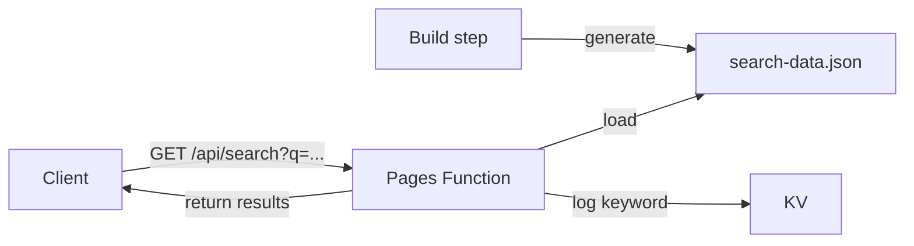

## Architecture

A search API pattern using:

- **Build-time index**: Generate a search index JSON during the build step
- **Pages Function**: Serve search queries at runtime using MiniSearch
- **KV logging**: Log search keywords to KV for analytics



## Build-Time Index Generation

Generate the search index during the build:

```javascript
// scripts/generate-search-index.mjs
import MiniSearch from 'minisearch';
import fs from 'fs';

const documents = loadDocuments(); // Your document loading logic

const miniSearch = new MiniSearch({
  fields: ['title', 'description', 'content'],
  storeFields: ['title', 'description', 'slug', 'createdAt'],
});

miniSearch.addAll(documents);

fs.writeFileSync(
  'functions/pj/my-site/api/search-data.json',
  JSON.stringify(documents) // Store raw docs, MiniSearch indexes at runtime
);
```

## Pages Function

```typescript
// functions/pj/my-site/api/search.ts
import MiniSearch from 'minisearch';
// @ts-expect-error JSON import bundled by esbuild
import searchData from './search-data.json';

interface Env {
  KEYWORD_LOGS: KVNamespace;
}

let searchIndex: MiniSearch | null = null;

function getSearchIndex(): MiniSearch {
  if (!searchIndex) {
    searchIndex = new MiniSearch({
      fields: ['title', 'description', 'content'],
      storeFields: ['title', 'description', 'slug', 'createdAt'],
    });
    searchIndex.addAll(searchData);
  }
  return searchIndex;
}

export const onRequestGet: PagesFunction<Env> = async (context) => {
  const url = new URL(context.request.url);
  const query = url.searchParams.get("q")?.trim();

  if (!query) {
    return new Response(JSON.stringify({ results: [] }), {
      headers: { "Content-Type": "application/json" },
    });
  }

  // Log keyword asynchronously
  const logKey = `search:${Date.now()}:${crypto.randomUUID()}`;
  context.waitUntil(
    context.env.KEYWORD_LOGS.put(logKey, JSON.stringify({
      query,
      timestamp: new Date().toISOString(),
    }), { expirationTtl: 86400 * 30 })
  );

  const index = getSearchIndex();
  const results = index.search(query, { fuzzy: 0.2 });

  return new Response(JSON.stringify({ results }), {
    headers: { "Content-Type": "application/json" },
  });
};
```

## Wrangler Config

```toml
compatibility_date = "2024-12-01"

[[kv_namespaces]]
binding = "KEYWORD_LOGS"
id = "your-kv-namespace-id"
```

## CI Considerations

The function imports `minisearch` at runtime. Ensure it is installed before deploying:

```yaml
- name: Install function dependencies
  run: pnpm add -w minisearch

- name: Deploy
  run: pnpm dlx wrangler@4 pages deploy deploy --project-name=my-site
```
