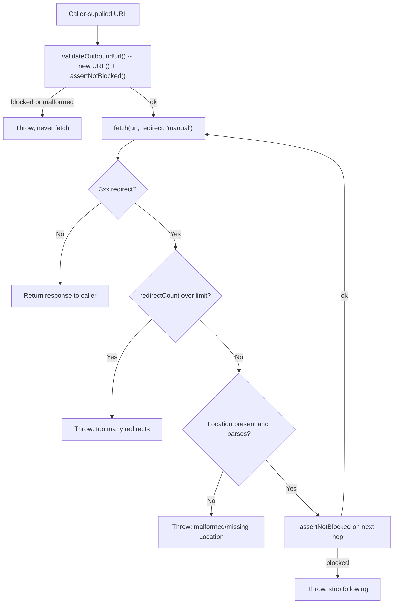

## Overview

Two related but distinct risks show up whenever a Worker deals with a URL it did not choose itself:

- **Server-side request forgery (SSRF):** the Worker makes an **outbound** `fetch()` to a URL supplied, in whole or in part, by an untrusted caller -- a webhook target, a link-preview generator, an "import from URL" feature. Point that fetch at your own infrastructure or a cloud metadata endpoint and the Worker becomes a proxy for reaching things the caller could never reach directly.
- **Open redirect / response splitting:** the Worker reads an untrusted value -- a `?next=` or `?returnTo=` query parameter after login is the classic case -- and echoes it back as the target of a redirect it sends to the browser. Get this wrong and the Worker becomes a trusted-looking bounce to an attacker's site, or worse, a way to inject extra HTTP headers into its own response.

This recipe covers both halves: an outbound-fetch guard with a full literal-host blocklist and per-hop redirect re-checking, and a redirect-target sanitizer that survives percent-encoding tricks, backslashes, and CRLF injection.

## Part 1: The SSRF Guard

### What a Literal-Host Blocklist Can and Cannot Do

The guard below rejects a `fetch()` before it happens if the target URL's **hostname**, as written in the URL, matches a known-dangerous literal: a loopback address, a private range, a cloud metadata endpoint, and a handful of encoding tricks that hide one of those behind an unfamiliar syntax.

:::danger[A blocklist checks a string, not the address `fetch()` actually connects to]
The check below runs against `url.hostname` -- a string parsed out of the URL before any network activity happens. It has no visibility into DNS resolution, which happens inside the platform's `fetch()` implementation. A hostname like `attacker-controlled.example` is not itself on any blocklist; if it resolves to `169.254.169.254` -- whether that is true the moment your check runs, or only becomes true later via DNS rebinding after a TTL expires -- the blocklist has nothing to say about it, because there was never a blocked literal in the URL to catch.

**If the set of legitimate destinations is known ahead of time -- a fixed list of webhook providers, a handful of internal services -- a hostname or URL ALLOWLIST checked against that fixed set is the stronger pattern and closes this gap entirely.** Reach for the blocklist below only when the product genuinely requires accepting arbitrary user-supplied URLs and an allowlist is not feasible.
:::

### The Blocklist

| Blocked value | Why |
| --- | --- |
| `localhost` (hostname) and `127.0.0.0/8` (its IPv4 loopback range) | Loopback -- reaches the Worker's own runtime or a co-located service |
| `10.0.0.0/8`, `172.16.0.0/12`, `192.168.0.0/16` | RFC 1918 private address ranges |
| `169.254.0.0/16`, including `169.254.169.254` | Link-local range; `169.254.169.254` specifically is the well-known cloud instance-metadata endpoint on AWS, GCP, and Azure |
| `::1` | IPv6 loopback |
| `fc00::/7` | IPv6 unique local address (ULA) range -- the IPv6 analogue of RFC 1918 |
| `fe80::/10` | IPv6 link-local range |
| `::ffff:a.b.c.d` (IPv4-mapped IPv6) | An IPv4 address wrapped in IPv6 syntax -- must be unwrapped and re-checked, not treated as a distinct address family |
| `64:ff9b::/96` (NAT64 well-known prefix) | Also embeds an IPv4 address in its low 32 bits -- same unwrap-and-recheck requirement |
| Bare integer host, decimal/hex/octal (`http://2130706433/`, `http://0x7f000001/`, `http://017700000001/`) | Each is valid URL syntax for `127.0.0.1` -- covered in detail below |

### Normalize First, Never Parse the Raw String Yourself

Every check above has to run against the output of `new URL()`, never against the raw input string. `new URL()` implements the WHATWG URL Standard, the same parser Workers, browsers, and Node all share, and it does most of the hard normalization work before your code ever sees a hostname:

```typescript
new URL("http://trusted.example@evil.example/").hostname; // "evil.example" -- userinfo stripped from the host
new URL("http://[::FFFF:127.0.0.1]/").hostname; // "[::ffff:7f00:1]" -- IPv4-mapped, canonical hex form
new URL("http://2130706433/").hostname; // "127.0.0.1" -- bare decimal integer
new URL("http://0x7f000001/").hostname; // "127.0.0.1" -- bare hex integer
new URL("http://017700000001/").hostname; // "127.0.0.1" -- bare octal integer
new URL("http://127.1/").hostname; // "127.0.0.1" -- shorthand IPv4
```

That last block is the reason the bare-integer row in the blocklist table matters: `2130706433`, `0x7f000001`, and `017700000001` are all valid URL host syntax for `127.0.0.1`, and `new URL()` folds every one of them into the same canonical dotted-decimal string. A naive guard that runs a dotted-decimal regex like `/^(\d{1,3}\.){3}\d{1,3}$/` against the **raw, unparsed** host string never matches `2130706433` at all -- it falls through as if it were an ordinary hostname, neither rejected nor recognized as an IP literal to range-check. Calling `new URL()` first and checking `.hostname` closes that gap by construction: by the time your code looks at it, every one of those forms has already become `127.0.0.1`.

One normalization `new URL()` does **not** do: it leaves a trailing dot on an ordinary hostname alone.

```typescript
new URL("http://LOCALHOST./").hostname; // "localhost." -- not "localhost"
```

DNS treats `example.com.` and `example.com` as the same fully-qualified name, so a check that only matches the exact string `"localhost"` misses `"localhost."`. The guard below strips a trailing dot explicitly as its own normalization step, on top of what `new URL()` already provides.

### The Guard Implementation

```typescript
interface Ipv4Range {
  base: string;
  bits: number;
}

// Literal ranges rejected outright. These are the forms an attacker can put
// directly in a URL -- a DNS name that later resolves to one of these is a
// different problem, covered above.
const BLOCKED_IPV4_RANGES: Ipv4Range[] = [
  { base: "127.0.0.0", bits: 8 }, // loopback
  { base: "10.0.0.0", bits: 8 }, // RFC1918 private
  { base: "172.16.0.0", bits: 12 }, // RFC1918 private
  { base: "192.168.0.0", bits: 16 }, // RFC1918 private
  { base: "169.254.0.0", bits: 16 }, // link-local, incl. 169.254.169.254 cloud metadata
];

// Prefix (first 6 groups of 8) an IPv4-mapped or NAT64 IPv6 address must
// match. The final 2 groups carry the embedded IPv4 address in both cases.
const IPV4_MAPPED_PREFIX = [0, 0, 0, 0, 0, 0xffff];
const NAT64_WELL_KNOWN_PREFIX = [0x64, 0xff9b, 0, 0, 0, 0];

function ipv4ToInt(ip: string): number | null {
  const parts = ip.split(".");
  if (parts.length !== 4) return null;
  let n = 0;
  for (const part of parts) {
    // Canonical decimal octet only -- no leading zeros, no hex, no whitespace.
    if (!/^(25[0-5]|2[0-4]\d|1\d\d|[1-9]?\d)$/.test(part)) return null;
    n = (n << 8) | Number(part);
  }
  return n >>> 0;
}

function isBlockedIpv4(ip: string): boolean {
  const target = ipv4ToInt(ip);
  if (target === null) return false;
  return BLOCKED_IPV4_RANGES.some(({ base, bits }) => {
    const baseInt = ipv4ToInt(base)!;
    const mask = bits === 0 ? 0 : (~0 << (32 - bits)) >>> 0;
    return (target & mask) === (baseInt & mask);
  });
}

// Expand a bracketed, "::"-compressed IPv6 literal (exactly what url.hostname
// produces) into its 8 16-bit groups. Returns null if it does not parse.
function expandIpv6(hostname: string): number[] | null {
  const inner = hostname.replace(/^\[|\]$/g, "");
  const parts = inner.split("::");
  if (parts.length > 2) return null; // more than one "::" is not valid IPv6

  const toGroups = (s: string) => (s === "" ? [] : s.split(":").map((h) => parseInt(h, 16)));
  const head = toGroups(parts[0]);
  const tail = parts.length === 2 ? toGroups(parts[1]) : [];
  if (head.some(Number.isNaN) || tail.some(Number.isNaN)) return null;

  if (parts.length === 1) {
    return head.length === 8 ? head : null;
  }
  const zeros = 8 - head.length - tail.length;
  return zeros >= 0 ? [...head, ...Array(zeros).fill(0), ...tail] : null;
}

// If `groups` starts with `prefix`, extract the last 2 groups as an IPv4
// address. Used for both IPv4-mapped (::ffff:a.b.c.d) and NAT64 (64:ff9b::/96).
function unwrapEmbeddedIpv4(groups: number[], prefix: number[]): string | null {
  if (groups.length !== 8 || !prefix.every((g, i) => groups[i] === g)) return null;
  const hi = groups[6];
  const lo = groups[7];
  return [(hi >> 8) & 0xff, hi & 0xff, (lo >> 8) & 0xff, lo & 0xff].join(".");
}

function isBlockedHost(hostname: string): boolean {
  // Strip a trailing dot -- new URL() does not do this, and DNS treats
  // "example.com." and "example.com" as the same name.
  const host = hostname.replace(/\.$/, "");

  if (host === "localhost") return true;
  if (isBlockedIpv4(host)) return true;

  if (host.startsWith("[") && host.endsWith("]")) {
    const groups = expandIpv6(host);
    if (!groups) return true; // unparsable IPv6 literal -- fail closed

    if (groups.every((g, i) => g === (i === 7 ? 1 : 0))) return true; // ::1
    if ((groups[0] & 0xfe00) === 0xfc00) return true; // fc00::/7 ULA
    if ((groups[0] & 0xffc0) === 0xfe80) return true; // fe80::/10 link-local

    // Unwrap first so a bypass can't hide behind either encoding, then
    // reject the encoding outright -- a legitimate outbound URL has no
    // reason to arrive as an IPv4-mapped or NAT64 IPv6 literal at all.
    if (unwrapEmbeddedIpv4(groups, IPV4_MAPPED_PREFIX)) return true;
    if (unwrapEmbeddedIpv4(groups, NAT64_WELL_KNOWN_PREFIX)) return true;
  }

  return false;
}

function assertNotBlocked(url: URL): void {
  if (url.protocol !== "http:" && url.protocol !== "https:") {
    throw new Error(`SSRF guard: unsupported protocol ${url.protocol}`);
  }
  if (isBlockedHost(url.hostname)) {
    throw new Error(`SSRF guard: blocked host ${url.hostname}`);
  }
}

function validateOutboundUrl(input: string): string {
  let url: URL;
  try {
    url = new URL(input);
  } catch {
    throw new Error(`SSRF guard: malformed URL: ${input}`);
  }
  assertNotBlocked(url);
  return url.href;
}
```

### Per-Hop Redirect Re-Check

Validating the entry URL is not enough. A URL that passes the check can still 302 to `http://169.254.169.254/latest/meta-data/` -- and by default, `fetch()` follows redirects internally, invisible to any guard code wrapped around it.

:::warning[The default `redirect: "follow"` bypasses this entire guard]
With the default redirect mode, `fetch()` resolves the whole redirect chain itself and hands back only the final response. Your `assertNotBlocked()` call never sees the intermediate hop, so a validated entry URL that redirects to a blocked host reaches it anyway. `redirect: "manual"` is what makes the redirect visible as a `Response` your code inspects before deciding whether to follow it.
:::

```typescript
const MAX_REDIRECTS = 5;

export async function fetchGuarded(input: string, init: RequestInit = {}): Promise<Response> {
  let currentUrl = validateOutboundUrl(input);

  for (let redirectCount = 0; ; redirectCount++) {
    const res = await fetch(currentUrl, { ...init, redirect: "manual" });

    const isRedirect = res.status >= 300 && res.status < 400 && res.status !== 304;
    if (!isRedirect) return res;

    if (redirectCount >= MAX_REDIRECTS) {
      throw new Error(`SSRF guard: exceeded ${MAX_REDIRECTS} redirects fetching ${input}`);
    }

    const location = res.headers.get("Location");
    if (!location) {
      throw new Error(`SSRF guard: redirect (${res.status}) with no Location header`);
    }

    let nextUrl: URL;
    try {
      // Resolve relative to the URL that issued this redirect, not the
      // original input -- a relative Location is relative to its own hop.
      nextUrl = new URL(location, currentUrl);
    } catch {
      throw new Error(`SSRF guard: malformed Location header: ${location}`);
    }

    assertNotBlocked(nextUrl); // same checks as the entry guard, every hop
    currentUrl = nextUrl.href;
  }
}
```



Every hop -- including the first -- goes through the exact same `assertNotBlocked()`, so there is only one place the blocklist logic lives.

## Part 2: Redirect-Target Sanitizer

### The Problem

A "redirect back to where you came from" flow -- most commonly a post-login `?next=` or `?returnTo=` parameter -- reads a value the caller controls and reflects it into a `Location` the browser will follow. Get this wrong two different ways:

- **Open redirect:** the value points off-site, and the login flow becomes a trusted-looking bounce to an attacker's page.
- **Response splitting:** the value contains characters that corrupt the response the Worker itself sends -- most dangerously, embedded CR/LF bytes that inject additional header lines if the `Location` value ever ends up concatenated into a raw header string instead of going through the platform's `Headers` API.

### Validate After Percent-Decoding, Exactly Once

A check that scans the **raw, still-encoded** query value never sees the dangerous bytes -- `%0d%0a` reads as four harmless ASCII characters until it is decoded into an actual CR/LF pair. Validation has to run on the decoded string.

Decode **exactly once**, and validate that single result -- never decode in a loop until the string stops changing. Repeated decoding lets the attacker choose how many layers deep the real payload sits: a value like `%250d%250a` decodes once to the literal four characters `%0d%0a` (harmless, no control bytes present) and should stay that way. Decoding it a second time turns it into real CR/LF -- a bug the sanitizer must not introduce by over-decoding what it was only ever supposed to check once.

### Reject Control Characters and Backslash, Anchor to a Fixed Origin

```typescript
const SITE_ORIGIN = "https://app.example.com";

/**
 * Sanitize a client-supplied redirect target (?next=, ?returnTo=, etc.) into
 * a same-origin path safe to send back in a Location header.
 */
export function sanitizeRedirectTarget(raw: string | null): string {
  const FALLBACK = "/";
  if (!raw) return FALLBACK;

  // Decode percent-encoding exactly once, then validate this result and
  // never decode again downstream.
  let decoded: string;
  try {
    decoded = decodeURIComponent(raw);
  } catch {
    return FALLBACK; // malformed percent-encoding
  }

  // Reject C0 control characters (includes CR and LF) and backslash.
  // Response-splitting needs CR/LF; the WHATWG URL parser treats "\" as a
  // path separator for special schemes, which is its own bypass -- see below.
  if (/[\x00-\x1f\x7f\\]/.test(decoded)) {
    return FALLBACK;
  }

  // Must be a same-origin path. A protocol-relative "//host" is not fixed up
  // -- it is rejected outright, because a browser resolves it as absolute.
  if (!decoded.startsWith("/") || decoded.startsWith("//")) {
    return FALLBACK;
  }

  // Build the final URL against a fixed, hardcoded origin -- never against
  // request.url or a Host header, both of which are attacker-influenced.
  const target = new URL(decoded, SITE_ORIGIN);
  if (target.origin !== SITE_ORIGIN) {
    return FALLBACK; // defense in depth; unreachable given the checks above
  }

  return target.pathname + target.search + target.hash;
}
```

:::tip[The platform throws on embedded CR/LF too -- treat that as a backstop, not the defense]
Constructing a `Headers` object with a raw CR/LF in a value throws (`TypeError: ... is an invalid header value`), because the Fetch standard requires implementations to reject control characters in header values -- Workers and Node share this behavior since both implement the same standard. That is a useful fail-safe, but it is not a substitute for the explicit check above: it turns a missed validation bug into an unhandled exception rather than a clean fallback redirect, and it only helps on code paths that build the response through the standard `Headers`/`Response` API in the first place.
:::

### Three Attack Shapes, Worked

| Raw `next` value | After one percent-decode | What happens |
| --- | --- | --- |
| `//evil.example/steal` | `//evil.example/steal` (nothing encoded) | Starts with `//`, rejected before `new URL()` runs. A browser resolves a protocol-relative `//evil.example` as `https://evil.example` -- same scheme, different origin -- which is exactly why this is refused outright rather than "fixed up" by prepending a slash. |
| `%2Fdashboard%0D%0ASet-Cookie:%20evil=1` | `/dashboard\r\nSet-Cookie: evil=1` | The decoded string contains real CR/LF bytes, matched by the control-character check and rejected. Checking the raw, still-encoded value would have missed this entirely. |
| `/\evil.example/steal` | `/\evil.example/steal` (nothing encoded) | Contains a backslash, rejected by the same regex. Without that check, `new URL("/\\evil.example/steal", SITE_ORIGIN)` resolves to `https://evil.example/steal` -- the WHATWG URL parser treats `\` as equivalent to `/` for special schemes, so a leading backslash is a second, less obvious way to reach the `//host` bypass above. |

### Wiring It Into a Login Handler

```typescript
export function loginSuccessResponse(request: Request): Response {
  const url = new URL(request.url);
  const target = sanitizeRedirectTarget(url.searchParams.get("next"));
  return Response.redirect(new URL(target, SITE_ORIGIN).href, 303);
}
```

`sanitizeRedirectTarget` already guarantees `target` is a same-origin path, so re-anchoring it to `SITE_ORIGIN` here just produces the absolute URL `Response.redirect()` requires -- it is not a second layer of validation.

## Related

[HTTP-Only Cookie Sessions](./cookie-sessions.mdx) covers the login flow this redirect sanitizer typically sits inside. [Bot Worker](./bot-worker.mdx) is the shape of Worker most likely to need the outbound-fetch guard -- any handler that fetches a URL supplied by an external, untrusted caller.
