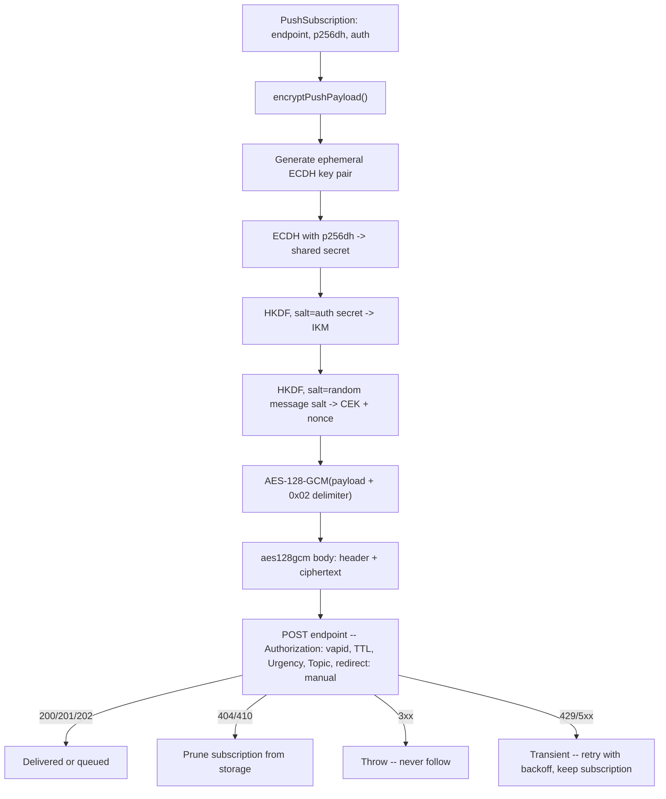

## Overview

The Web Push flow has two halves. In the browser, a service worker calls
`PushManager.subscribe()` with your VAPID public key and gets back a
`PushSubscription` -- an `endpoint` URL (pointing at whichever push service the
browser uses: Firefox's autopush, Chrome/Edge's FCM, Safari's) plus two
per-subscription keys, `p256dh` and `auth`. The client sends that subscription
to your server to store. This recipe is entirely about the other half: the
server ("application server" in the spec's terms) that later wants to push a
notification, encrypts a payload for that specific subscription, signs a VAPID
JWT to prove who it is, and `POST`s the result to `endpoint`. Subscribing and
showing the notification in the `push` event handler are standard Push API /
Notifications API work that never touches a Worker -- out of scope here.

Three RFCs define the wire format: [RFC 8291](https://www.rfc-editor.org/rfc/rfc8291.html)
(message encryption, `aes128gcm`), [RFC 8292](https://www.rfc-editor.org/rfc/rfc8292.html)
(VAPID), and [RFC 8030](https://www.rfc-editor.org/rfc/rfc8030.html) (the HTTP
delivery protocol itself -- `TTL`, `Urgency`, `Topic`). None of it is
Workers-specific; it all runs the same way on any server. What Workers changes
is *how* you implement it.

## Why `web-push` Doesn't Run on Workers

The obvious move is `npm install web-push` and call it a day. That package is
built directly on Node's `crypto` module (`crypto.createECDH`,
`crypto.createSign`) and Node's `http`/`https` request APIs -- neither of
which the Workers runtime exposes by default. A `nodejs_compat` compatibility
flag provides a partial `node:crypto` shim, but this recipe does not depend on
it either way: everything below runs on the Web Crypto API (`crypto.subtle`),
which ships in the Workers runtime unconditionally. This is the same "no
`node:crypto`" theme as [Signing Webhooks with HMAC-SHA256](./webhook-signing.mdx)
and [Personal API Tokens](./personal-api-tokens.mdx) -- just applied to
elliptic-curve signing and key agreement instead of HMAC and SHA-256.

## VAPID: Proving You Sent This

VAPID (RFC 8292) lets a push service tell your application server apart from
anyone else pushing messages, without a prior registration step. You generate
an ECDSA key pair on the P-256 curve once; the public key is the
`applicationServerKey` you hand to `PushManager.subscribe()` in the browser,
and every push request carries an `ES256`-signed JWT proving you hold the
matching private key.

### Generating and Storing the VAPID Key Pair

Generate this once -- in a scratch Worker route you delete afterward, in a
local Node 19+ REPL, or in a browser console. All three expose the same
`crypto.subtle`.

```typescript
interface VapidKeyJwk {
  kty: "EC";
  crv: "P-256";
  d: string; // private scalar, base64url -- secret
  x: string; // public X coordinate, base64url
  y: string; // public Y coordinate, base64url
}

function base64UrlEncode(bytes: Uint8Array): string {
  let binary = "";
  for (const byte of bytes) binary += String.fromCharCode(byte);
  return btoa(binary).replace(/\+/g, "-").replace(/\//g, "_").replace(/=+$/, "");
}

async function generateVapidKeyPair(): Promise<{
  publicKey: string;
  privateKeyJwk: VapidKeyJwk;
}> {
  const keyPair = await crypto.subtle.generateKey(
    { name: "ECDSA", namedCurve: "P-256" },
    true, // extractable -- this run only, to print the values once
    ["sign", "verify"],
  );
  const publicRaw = await crypto.subtle.exportKey("raw", keyPair.publicKey);
  const privateKeyJwk = (await crypto.subtle.exportKey(
    "jwk",
    keyPair.privateKey,
  )) as VapidKeyJwk;

  return {
    publicKey: base64UrlEncode(new Uint8Array(publicRaw)),
    privateKeyJwk,
  };
}
```

`publicKey` is the base64url-encoded uncompressed EC point (65 bytes for
P-256, `0x04 || X || Y`) -- this is exactly what
`PushManager.subscribe({ applicationServerKey })` expects, and exactly what
goes in the Authorization header's `k=` parameter below. `privateKeyJwk` is a
full JWK object, not a bare scalar -- store the whole thing. The next section
explains why.

### Trap: WebCrypto Cannot Import a Raw Private Scalar

```typescript
async function importVapidPrivateKey(jwk: VapidKeyJwk): Promise<CryptoKey> {
  return crypto.subtle.importKey(
    "jwk",
    { ...jwk, ext: true },
    { name: "ECDSA", namedCurve: "P-256" },
    false,
    ["sign"],
  );
}
```

:::danger[Trap: "raw" import only accepts the public half of an EC key]
`crypto.subtle.importKey("raw", ...)` for `"ECDSA"`/`"ECDH"` only accepts the
**public** point (`0x04 || X || Y`). There is no `"raw"` private-key import
for elliptic-curve keys in WebCrypto -- unlike an HMAC or AES secret, which
`importKey("raw", ...)` happily accepts as a bare byte string (see
[Signing Webhooks with HMAC-SHA256](./webhook-signing.mdx)). A private EC key
has to come in as `"jwk"` or `"pkcs8"`, and a JWK needs `x` and `y` alongside
`d` -- the private scalar alone is not enough. This is exactly why
`generateVapidKeyPair` above exports `"jwk"`, not just `d`: it is the only
call that hands you the full `{ x, y, d }` triple this import needs. If your
only saved artifact is a bare 32-byte scalar copied out of some other tool,
you cannot reconstruct a WebCrypto-importable key from it without also
recomputing `x`/`y` from the curve -- store the whole JWK as the secret from
day one, never just `d`.
:::

### Signing the VAPID JWT

```typescript
function jsonToBase64Url(value: unknown): string {
  return base64UrlEncode(new TextEncoder().encode(JSON.stringify(value)));
}

// RFC 8292 caps exp at 24h from the request. This recipe uses a much shorter
// window: a leaked JWT is replayable against the push service until it
// expires, so there is no reason to hand out anything near the ceiling.
const VAPID_EXP_SECONDS = 60 * 60; // 1 hour

async function signVapidJwt(
  audienceOrigin: string,
  subject: string,
  privateKeyJwk: VapidKeyJwk,
): Promise<string> {
  const header = { typ: "JWT", alg: "ES256" };
  const claims = {
    aud: audienceOrigin, // scheme + host of the push endpoint, no path -- see below
    exp: Math.floor(Date.now() / 1000) + VAPID_EXP_SECONDS,
    sub: subject, // "mailto:push@example.com" -- optional per RFC 8292, but several push services reject requests without it
  };
  const signingInput = `${jsonToBase64Url(header)}.${jsonToBase64Url(claims)}`;

  const privateKey = await importVapidPrivateKey(privateKeyJwk);
  const signature = await crypto.subtle.sign(
    { name: "ECDSA", hash: "SHA-256" },
    privateKey,
    new TextEncoder().encode(signingInput),
  );

  return `${signingInput}.${base64UrlEncode(new Uint8Array(signature))}`;
}
```

`aud` is the **origin** of the push endpoint -- scheme and host only, no path,
no trailing slash. `new URL(subscription.endpoint).origin` produces exactly
this. Getting `aud` wrong (a full URL, a different host) is a silent rejection
at the push service, not a WebCrypto error, so it is worth double-checking
against the actual `endpoint` you are about to `POST` to, not a cached or
assumed value.

### Trap: WebCrypto's ECDSA Signature Is Already Raw r‖s

:::warning[Trap: do not DER-decode a WebCrypto ECDSA signature]
JWS -- and therefore VAPID's `ES256` -- requires the signature as two
fixed-width big-endian integers concatenated, `r || s`: 32 bytes each for
P-256, 64 bytes total (the IEEE P1363 format). `crypto.subtle.sign({ name:
"ECDSA", hash: "SHA-256" }, ...)` already returns exactly that layout. This is
the opposite of `node:crypto`'s `sign()`, which defaults to ASN.1 DER encoding
and needs an explicit `{ dsaEncoding: "ieee-p1363" }` option to match. Code
ported from a Node-based JWT library that DER-decodes the signature before
base64url-encoding it will corrupt a WebCrypto signature that was never DER in
the first place -- on Workers, the fix is to do nothing to it. Base64url the
raw output of `crypto.subtle.sign` directly, as `signVapidJwt` does above.
:::

### The Authorization Header

```typescript
function vapidAuthorizationHeader(jwt: string, publicKey: string): string {
  return `vapid t=${jwt}, k=${publicKey}`;
}
```

`k` is the same base64url public key as the `applicationServerKey` the browser
already has from `PushManager.subscribe()` -- the push service checks that the
JWT in `t` was signed by the key named in `k`, and separately that `k` matches
the key the subscription was created against. A key pair mismatch between what
the browser subscribed with and what the server signs with fails at the push
service, not at your code -- keep exactly one VAPID key pair per environment
and never regenerate it without re-subscribing every client.

## Encrypting the Payload (`aes128gcm`)

RFC 8291 layers on top of RFC 8188's generic `aes128gcm` content encoding.
Each subscription carries two client-side secrets from `PushSubscription.keys`:
`p256dh` (the client's own ECDH public key) and `auth` (a 16-byte secret,
shared once at subscribe time). Encrypting a payload for that subscription
means:

1. Generate a fresh **ephemeral** ECDH key pair on P-256 for this message.
2. Run ECDH between that ephemeral private key and the client's `p256dh`
   public key to get a shared secret.
3. HKDF that shared secret, salted with the subscription's `auth` secret, into
   32 bytes of input keying material (IKM).
4. HKDF the IKM again -- this time salted with a fresh 16-byte **message**
   salt, unrelated to `auth` -- into a 16-byte content-encryption key (CEK)
   and a 12-byte nonce.
5. AES-128-GCM-encrypt the payload with that CEK and nonce, after appending a
   single `0x02` padding-delimiter byte (RFC 8188's "this is the last record"
   marker).
6. Prefix the ciphertext with the `aes128gcm` header: the message salt, a
   record-size field, and this message's ephemeral public key -- so the
   receiving browser can redo steps 2-4 without any side channel.

```typescript
async function hkdf(
  ikm: ArrayBuffer,
  salt: ArrayBuffer,
  info: ArrayBuffer,
  lengthBits: number,
): Promise<ArrayBuffer> {
  const key = await crypto.subtle.importKey("raw", ikm, "HKDF", false, ["deriveBits"]);
  return crypto.subtle.deriveBits({ name: "HKDF", hash: "SHA-256", salt, info }, key, lengthBits);
}

function concatBytes(...arrays: Uint8Array[]): Uint8Array {
  const total = arrays.reduce((sum, a) => sum + a.length, 0);
  const out = new Uint8Array(total);
  let offset = 0;
  for (const a of arrays) {
    out.set(a, offset);
    offset += a.length;
  }
  return out;
}

function base64UrlDecode(value: string): Uint8Array {
  const padded = value
    .replace(/-/g, "+")
    .replace(/_/g, "/")
    .padEnd(Math.ceil(value.length / 4) * 4, "=");
  const binary = atob(padded);
  const bytes = new Uint8Array(binary.length);
  for (let i = 0; i < binary.length; i++) bytes[i] = binary.charCodeAt(i);
  return bytes;
}

const textEncoder = new TextEncoder();
const RECORD_SIZE = 4096; // rs field -- see "Push payloads are small" below

async function encryptPushPayload(
  payload: Uint8Array,
  p256dhB64: string,
  authB64: string,
): Promise<Uint8Array> {
  const uaPublicRaw = base64UrlDecode(p256dhB64); // 65 bytes: 0x04 || X || Y
  const authSecret = base64UrlDecode(authB64); // 16 bytes

  // Public-key import -- "raw" works here, unlike the private-key trap above.
  const uaPublicKey = await crypto.subtle.importKey(
    "raw",
    uaPublicRaw,
    { name: "ECDH", namedCurve: "P-256" },
    false,
    [],
  );

  const asKeyPair = await crypto.subtle.generateKey(
    { name: "ECDH", namedCurve: "P-256" },
    true,
    ["deriveBits"],
  );
  const asPublicRaw = new Uint8Array(await crypto.subtle.exportKey("raw", asKeyPair.publicKey));

  const sharedSecret = await crypto.subtle.deriveBits(
    { name: "ECDH", public: uaPublicKey },
    asKeyPair.privateKey,
    256,
  );

  // RFC 8291 stage 1: shared secret -> IKM, salted with the subscription's
  // own (long-lived) auth secret -- not the message salt used below.
  const ikmInfo = concatBytes(textEncoder.encode("WebPush: info\0"), uaPublicRaw, asPublicRaw);
  const ikm = await hkdf(sharedSecret, authSecret, ikmInfo, 256);

  // RFC 8188 stage 2: a fresh, message-specific salt derives the actual CEK
  // and nonce from the IKM above -- this salt goes in the header, in the clear.
  const salt = crypto.getRandomValues(new Uint8Array(16));
  const cekBits = await hkdf(ikm, salt, textEncoder.encode("Content-Encoding: aes128gcm\0"), 128);
  const nonceBits = await hkdf(ikm, salt, textEncoder.encode("Content-Encoding: nonce\0"), 96);

  const cek = await crypto.subtle.importKey("raw", cekBits, { name: "AES-GCM" }, false, [
    "encrypt",
  ]);

  // Single-record aes128gcm: 0x02 marks this as the last (and only) record.
  const recordPlaintext = concatBytes(payload, new Uint8Array([0x02]));
  const ciphertext = new Uint8Array(
    await crypto.subtle.encrypt({ name: "AES-GCM", iv: nonceBits }, cek, recordPlaintext),
  );

  // Header: salt(16) || rs(4, big-endian) || idlen(1) || keyid(idlen)
  const header = new Uint8Array(16 + 4 + 1 + asPublicRaw.length);
  header.set(salt, 0);
  new DataView(header.buffer).setUint32(16, RECORD_SIZE, false);
  header[20] = asPublicRaw.length;
  header.set(asPublicRaw, 21);

  return concatBytes(header, ciphertext);
}
```

:::note[Push payloads are small on purpose]
RFC 8030 caps a push message's encrypted content at 4096 octets, and push
services enforce close to that limit. A single `aes128gcm` record's overhead
is fixed -- an 86-byte header for a P-256 key id, a 16-byte GCM tag, and the
1-byte padding delimiter, roughly 103 bytes -- which leaves on the order of
3900 plaintext bytes of headroom: comfortably enough for a JSON payload naming
a notification's title, body, and target URL, but not for arbitrary
application data. This recipe always produces a single record; the
multi-record chunking `aes128gcm` supports for larger streams (RFC 8188
Section 4) has no reason to exist for a push payload this size.
:::

### Known-Answer Test Vector (RFC 8291)

Encryption prose without a checkable vector is how subtle bugs ship -- a
transposed HKDF `info` string, a salt/auth-secret swap, or a header field in
the wrong order all still "work" against a real browser during manual
testing, because the browser's decryption failure is silent. Run
`encryptPushPayload` against these fixed inputs, taken verbatim from
[RFC 8291 Section 5](https://www.rfc-editor.org/rfc/rfc8291.html#section-5),
and diff the result byte-for-byte against the expected output before trusting
an implementation.

| Input | Value (base64url) |
| --- | --- |
| Plaintext | `V2hlbiBJIGdyb3cgdXAsIEkgd2FudCB0byBiZSBhIHdhdGVybWVsb24` (`"When I grow up, I want to be a watermelon"`) |
| `auth` secret | `BTBZMqHH6r4Tts7J_aSIgg` |
| Message salt | `DGv6ra1nlYgDCS1FRnbzlw` |
| User agent (receiver) private key | `q1dXpw3UpT5VOmu_cf_v6ih07Aems3njxI-JWgLcM94` |
| User agent (receiver) public key -- `p256dh` | `BCVxsr7N_eNgVRqvHtD0zTZsEc6-VV-JvLexhqUzORcxaOzi6-AYWXvTBHm4bjyPjs7Vd8pZGH6SRpkNtoIAiw4` |
| Application server (sender) ephemeral private key | `yfWPiYE-n46HLnH0KqZOF1fJJU3MYrct3AELtAQ-oRw` |
| Application server (sender) ephemeral public key | `BP4z9KsN6nGRTbVYI_c7VJSPQTBtkgcy27mlmlMoZIIgDll6e3vCYLocInmYWAmS6TlzAC8wEqKK6PBru3jl7A8` |

Intermediate values, if your implementation exposes them for debugging:

| Derived value | Value (base64url) |
| --- | --- |
| ECDH shared secret | `kyrL1jIIOHEzg3sM2ZWRHDRB62YACZhhSlknJ672kSs` |
| IKM | `S4lYMb_L0FxCeq0WhDx813KgSYqU26kOyzWUdsXYyrg` |
| Content encryption key (CEK) | `oIhVW04MRdy2XN9CiKLxTg` |
| Nonce | `4h_95klXJ5E_qnoN` |

Expected output -- the full `aes128gcm` body (header + ciphertext), 144 bytes,
base64url:

```
DGv6ra1nlYgDCS1FRnbzlwAAEABBBP4z9KsN6nGRTbVYI_c7VJSPQTBtkgcy27ml
mlMoZIIgDll6e3vCYLocInmYWAmS6TlzAC8wEqKK6PBru3jl7A_yl95bQpu6cVPT
pK4Mqgkf1CXztLVBSt2Ks3oZwbuwXPXLWyouBWLVWGNWQexSgSxsj_Qulcy4a-fN
```

To reproduce this with `encryptPushPayload` above, the only change needed is
making the ephemeral key pair and the salt injectable instead of randomly
generated (`crypto.getRandomValues` and `crypto.subtle.generateKey` obviously
cannot be pinned to a fixed test value) -- import the fixed private/public
keys as JWK/raw exactly as the function already does for the real ones, and
supply the fixed salt directly instead of calling `crypto.getRandomValues`.
Everything else -- the HKDF calls, the info strings, the header layout -- runs
unchanged.

## Sending the Push

### TTL, Urgency, and Topic

RFC 8030 defines three request headers that shape delivery behavior. None of
them are optional to think about -- omitting them means accepting whatever
default the push service happens to choose, which varies by service:

- **`TTL`** (seconds): how long the push service may hold the message and
  retry delivery while the device is offline. `TTL: 0` means "deliver right
  now if the device is currently connected, otherwise drop it" -- correct for
  something ephemeral like a live cursor update, where a stale delivery
  minutes later is worse than no delivery. A nonzero `TTL` is an upper bound
  on retry duration, not a delivery guarantee; push services are explicitly
  permitted to drop a message before `TTL` expires under resource pressure.
- **`Urgency`**: one of `very-low`, `low`, `normal`, `high`. Lets a push
  service on a battery-constrained device defer low-urgency delivery to save
  power. Pick the lowest urgency the notification's purpose tolerates --
  `high` is for things a user is actively waiting on (an incoming call, a
  two-factor code), not routine updates.
- **`Topic`**: an opaque string. A second push with the same `Topic` as a
  still-undelivered one **replaces** it in the push service's queue instead of
  queuing both -- the device ends up seeing only the latest. Use it for
  anything where only the newest value matters (a sync-now ping, an unread
  count) so a device that was briefly offline does not wake up to a backlog of
  now-stale pushes.

```typescript
const headers = new Headers({
  Authorization: vapidAuthorizationHeader(jwt, env.VAPID_PUBLIC_KEY),
  "Content-Type": "application/octet-stream",
  "Content-Encoding": "aes128gcm",
  TTL: String(ttlSeconds), // 0 = deliver now or drop, never queue
  Urgency: urgency, // "very-low" | "low" | "normal" | "high"
});
if (topic) headers.set("Topic", topic);
```

### Never Follow a Push Service Redirect

A `PushSubscription.endpoint` is client-submitted data -- it arrives from
`PushManager.subscribe()` under normal use, but nothing on the server
independently verifies that. The server is doing an outbound `fetch()` to a
URL it did not choose, the same shape of risk covered in
[SSRF and Redirect Safety](./ssrf-and-redirect-safety.mdx).

:::danger[A push service redirecting is never legitimate]
None of FCM, Mozilla's autopush, or Apple's web push service ever 3xx a
delivery request under normal operation. `fetch()`'s default
`redirect: "follow"` would silently replay the `Authorization` header --
carrying the VAPID JWT -- and the encrypted body to whatever host a `Location`
header names, invisible to any check wrapped around the call. Send with
`redirect: "manual"` and treat any `3xx` response as a hard failure, exactly
the discipline [SSRF and Redirect Safety](./ssrf-and-redirect-safety.mdx#part-1-the-ssrf-guard-per-hop-redirect-re-check)
uses for outbound fetches in general -- there is no legitimate hop to follow
here, so there is nothing to rebuild the request for.
:::

### 404/410 vs Transient Failures

The response status splits into three actionable buckets, and conflating any
two of them either leaks dead subscriptions forever or throws away live ones:

- **`201` (or `200`/`202`, depending on the service):** delivered or queued
  successfully. Nothing to do.
- **`404` or `410`:** the subscription is permanently gone -- the user
  uninstalled the app, revoked notification permission, or cleared browser
  data. The push service is telling you, definitively, to stop trying. Prune
  the subscription from storage on this response, not on some accumulated
  failure count.
- **`429` or `5xx`:** transient. Retry with backoff; do not prune. A
  subscription is not dead just because the push service was briefly
  overloaded or down.

```typescript
export interface PushSubscription {
  endpoint: string;
  keys: { p256dh: string; auth: string };
}

export interface Env {
  VAPID_PUBLIC_KEY: string;
  VAPID_PRIVATE_KEY_JWK: string; // JSON-stringified VapidKeyJwk
  VAPID_SUBJECT: string; // "mailto:push@example.com"
}

export type PushResult =
  | { outcome: "delivered" }
  | { outcome: "expired"; status: number } // caller must prune the subscription
  | { outcome: "transient"; status: number }; // caller should retry with backoff

const PUSH_SUCCESS = new Set([200, 201, 202]);

export async function sendPushMessage(
  subscription: PushSubscription,
  payload: Uint8Array,
  env: Env,
  options: {
    ttlSeconds?: number;
    urgency?: "very-low" | "low" | "normal" | "high";
    topic?: string;
  } = {},
): Promise<PushResult> {
  const endpointUrl = new URL(subscription.endpoint);
  const privateKeyJwk = JSON.parse(env.VAPID_PRIVATE_KEY_JWK) as VapidKeyJwk;
  const jwt = await signVapidJwt(endpointUrl.origin, env.VAPID_SUBJECT, privateKeyJwk);
  const body = await encryptPushPayload(payload, subscription.keys.p256dh, subscription.keys.auth);

  const headers = new Headers({
    Authorization: vapidAuthorizationHeader(jwt, env.VAPID_PUBLIC_KEY),
    "Content-Type": "application/octet-stream",
    "Content-Encoding": "aes128gcm",
    TTL: String(options.ttlSeconds ?? 0),
    Urgency: options.urgency ?? "normal",
  });
  if (options.topic) headers.set("Topic", options.topic);

  const res = await fetch(subscription.endpoint, {
    method: "POST",
    headers,
    body,
    redirect: "manual", // see "Never Follow a Push Service Redirect" above
  });

  if (PUSH_SUCCESS.has(res.status)) {
    return { outcome: "delivered" };
  }
  if (res.status === 404 || res.status === 410) {
    return { outcome: "expired", status: res.status };
  }
  if (res.status >= 300 && res.status < 400) {
    throw new Error(`Push endpoint returned an unexpected redirect: ${res.status}`);
  }
  // 429 / 5xx, and anything else not covered above -- treat as transient.
  return { outcome: "transient", status: res.status };
}
```



## Wrangler Config: Secret vs Vars

`VAPID_PUBLIC_KEY` is not sensitive -- it is handed to every subscribing
browser as `applicationServerKey`, so there is no confidentiality to protect.
`VAPID_SUBJECT` is a contact address, also not sensitive. `VAPID_PRIVATE_KEY_JWK`
contains the private scalar `d` -- anyone holding it can sign VAPID JWTs as
you and, combined with a captured `endpoint`/`p256dh`/`auth`, forge push
deliveries. It must never sit in `wrangler.toml`.

```toml
name = "push-sender"
main = "src/index.ts"
compatibility_date = "2025-01-01"

[vars]
VAPID_PUBLIC_KEY = "BP4z9KsN6nGRTbVYI_c7VJSPQTBtkgcy27mlmlMoZIIgDll6e3vCYLocInmYWAmS6TlzAC8wEqKK6PBru3jl7A8"
VAPID_SUBJECT = "mailto:push@example.com"
VAPID_PRIVATE_KEY_JWK = ""
```

```bash
npx wrangler secret put VAPID_PRIVATE_KEY_JWK
# paste the JSON-stringified { kty, crv, d, x, y } from generateVapidKeyPair()
```

:::danger[Secrets vs Vars]
The blank `VAPID_PRIVATE_KEY_JWK` in `[vars]` is only a placeholder for local
typing -- the real value is set with `wrangler secret put VAPID_PRIVATE_KEY_JWK`
and never committed. Leaking it is equivalent to leaking every VAPID-signed
push identity for this Worker at once, the same blast radius as the shared
signing keys covered in [HTTP-only Cookie Sessions](./cookie-sessions.mdx) and
[Signing Webhooks with HMAC-SHA256](./webhook-signing.mdx).
:::

## Related

[SSRF and Redirect Safety](./ssrf-and-redirect-safety.mdx) covers the
redirect-rejection and outbound-fetch discipline this recipe applies to push
delivery. [Signing Webhooks with HMAC-SHA256](./webhook-signing.mdx) and
[Personal API Tokens](./personal-api-tokens.mdx) are this site's other
`crypto.subtle`-only recipes -- HMAC and SHA-256 there, ECDSA/ECDH/HKDF here.
