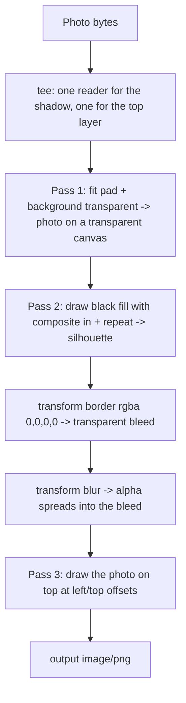

## Overview -- One Chain, Many Layers, and Every Handle Is Single-Use

The Images binding is usually introduced as a resize-and-transcode RPC: bytes in, smaller bytes out. That framing undersells it. `env.IMAGES` also composites -- `.draw()` accepts a second image (or another `.input()` chain) and blends it into the current one with Porter-Duff modes, absolute offsets, tiling, and per-layer opacity. A whole class of work that would otherwise mean shipping a decoder into the Worker, or running an offline batch with Sharp, is a handful of chained calls that execute off-Worker and cost wall-clock rather than CPU.

The worked example on this page is a **drop-shadow card**: an arbitrary user photo, contained on a transparent canvas, with a soft blurred shadow generated from the photo's own silhouette rather than from a fixed asset. It exercises every composition primitive worth documenting, and every one of them has a behaviour you cannot infer from the parameter list.

The observations below come from a bounded `wrangler dev --remote` probe against the real high-fidelity binding on Wrangler `4.85.0`, plus the deployed renderer that followed. Two of them cost real debugging time:

- `composite` applies **only inside the overlay's bounding box**, so a 1×1 fill composited `in` touches exactly one pixel unless you also pass `repeat: true`.
- A transformer is **consumed** the first time it is drawn or output. Reusing one throws `IMAGES_TRANSFORM_ERROR 9525`, and the failure surfaces in the *second* branch of a pipeline that looked correct in the first.

:::warning[None of this works under a plain `wrangler dev`]
The offline low-fidelity binding supports `width`, `height`, `rotate`, and output `format` -- and nothing else. Every option on this page (`fit`, `background`, `border`, `blur`, `composite`, `repeat`, `opacity`, positioning) needs the high-fidelity binding: `wrangler dev --remote`, or a deployment. See [the binding support matrix](../workers/local-dev-bindings.mdx#the-binding-support-matrix). A composition pipeline that "passes locally" has not been tested at all.
:::

## The Pipeline, in the Order the Binding Applies It

Composition is not commutative and the binding does not reorder anything for you. Chained `.transform()` calls apply in sequence, `.draw()` blends at the point it appears, and `.output()` ends the chain. The card is three passes, each ending in an `.output()` whose bytes feed the next:



Each numbered pass below explains one edge of that graph. The assembled function is in [The Whole Renderer](#the-whole-renderer).

## Transparent Padding Is What Makes Every Later Step Possible

`fit: "pad"` fits the image inside the requested box and fills the remainder. What it fills the remainder *with* is `background`, and the default is **opaque white** -- which is exactly the wrong thing here, because an opaque canvas has no transparent pixels for the silhouette to carve out or for the blur to spread into.

```ts
const padded = await env.IMAGES
  .input(photo)
  .transform({ width: 640, height: 480, fit: "pad", background: "transparent" })
  .output({ format: "image/png" });
```

Two things to get right:

- **Keep the output format alpha-capable.** `image/png`, `image/webp`, and `image/avif` carry an alpha channel; `image/jpeg` does not, and an intermediate JPEG silently flattens the transparency you just asked for against a background you did not choose. The passes below stay on PNG for that reason and only pick a delivery format at the end.
- **`background` also exists on `.output()`.** Setting it there composites the alpha away at encode time. That is useful as a deliberate final flatten, and a trap when copy-pasted into an intermediate pass.

Confirmed against the high-fidelity binding: `fit: "pad"` with `background: "transparent"` produces a genuine alpha channel, not white pixels that merely look empty.

## The Silhouette -- and the Bounding Box That Silently Shrinks It

`composite: "in"` shows the overlay only where the *base* is opaque. Draw an opaque black layer onto the padded photo with that mode and the result is the photo's silhouette in black, with the padded surround still transparent. That is the shadow, before it is softened.

The catch is in one sentence of Cloudflare's [draw documentation](https://developers.cloudflare.com/images/optimization/draw-overlays/): *the composite mode only affects the area within the overlay's bounding box.* Outside that box the base image is preserved untouched.

An isolated probe will not surface this, because a probe naturally uses a base and an overlay of the same size -- the bounding box covers everything and the mode appears global. Production code tends to use a **1×1 fill asset**, since a solid colour needs no more than that. With a 1×1 overlay the bounding box is one pixel: `composite: "in"` blackens that single pixel and leaves every other photo pixel as-is. Feed *that* through a border and a blur and you get a weak coloured halo instead of a shadow -- a result that looks like a blur-radius bug and is not one.

`repeat: true` tiles the overlay across the whole canvas, which grows the bounding box to the full frame and makes the composite behave the way the isolated probe suggested it would:

```ts
// A 1x1 opaque black PNG, inlined so no asset fetch is needed.
const BLACK_PIXEL =
  "iVBORw0KGgoAAAANSUhEUgAAAAEAAAABCAIAAACQd1PeAAAADElEQVR42mNgYGAAAAAEAAHI6uv5AAAAAElFTkSuQmCC";

// A fresh stream per call -- see the single-use rule below.
const blackPixel = () => new Blob([BLACK_PIXEL]).stream();

const silhouette = env.IMAGES
  .input(padded.image())
  .draw(env.IMAGES.input(blackPixel(), { encoding: "base64" }), {
    composite: "in",
    // Without `repeat`, `composite` only touches the overlay's 1x1 bounding box.
    repeat: true,
    opacity: 0.35,
  });
```

`opacity` on the same call is how the shadow gets its strength: with `in`, the result's alpha is the overlay's alpha multiplied by the base's, so `0.35` yields a 35%-black silhouette directly rather than needing a separate fade pass. `repeat` also accepts `"x"` and `"y"` for one-axis tiling.

:::tip[Rule of thumb for `composite`]
Any composite mode plus an overlay smaller than the base is a bug unless you meant to affect only that rectangle. Either size the overlay to the base or pass `repeat`.
:::

## Bleed the Canvas Before You Blur It

A blur spreads pixels outward. If the silhouette already touches the edge of its canvas, there is nowhere for the spread to go and the shadow is clipped flat on that side. The canvas has to grow *before* the blur, and it has to grow with transparent pixels so the added margin does not become a visible frame.

`border` does exactly that. With `color: "rgba(0,0,0,0)"` it expands the canvas without rescaling the content -- confirmed on a 4×2 input, which came back 10×8 under `width: 3` with its two-by-four content untouched at the centre:

```ts
.transform({ border: { color: "rgba(0,0,0,0)", width: BLEED } })
```

Note that `border` is applied *after* any resize in the same chain, so the final dimensions are the resized box plus twice the border width on each axis. Budget for that when you compute the offsets of later layers -- everything drawn afterwards is positioned in the **bled** coordinate space, not the original box.

:::warning[The per-side `border` form has no `color` in the TypeScript types]
`ImageTransform["border"]` is a union: `{ color?, width? }` **or** `{ top?, bottom?, left?, right? }`. The second arm carries no `color`, so the asymmetric-bleed shape you would write by analogy with Cloudflare's own `cf.image` example -- `{ color: "rgba(0,0,0,0)", top: 8, bottom: 24 }` -- does not typecheck against `@cloudflare/workers-types`. For an offset shadow, use the uniform `width` form sized to the largest side you need and shift the top layer instead.
:::

## Blur Is Alpha-Aware

`blur` takes an integer from `0` to `250` and, on the high-fidelity binding, operates on the alpha channel as well as on colour: alpha spreads outward into fully transparent pixels, which is precisely what turns a hard silhouette into a soft shadow. A blur that only touched RGB would leave the silhouette's edge crisp and merely smear its colour.

```ts
.transform({ blur: BLUR })
```

Two practical notes. The blur runs on the current canvas, so it must come after the bleed -- reversing the two chained `.transform()` calls clips the shadow. And the radius is in output pixels, so a card rendered at 2× device pixel ratio needs roughly twice the radius to look the same; do not carry a radius across resolutions unscaled.

## Absolute Positioning and Opacity on `draw()`

`draw()` positions the overlay by pixel offsets from named edges: `top`, `left`, `bottom`, `right`. Omit all four and the overlay is centred; `0` sits flush against that edge. Setting both `left` and `right`, or both `top` and `bottom`, is an error rather than a stretch instruction. Offsets were honoured at exact pixel coordinates in the probe -- `{ left: 2, top: 3, opacity: 0.5 }` landed where it said it would, with the opacity applied.

For the card, the photo goes back on top of the blurred shadow, inset by the bleed so it lands over its own silhouette, and lifted by a few pixels so the shadow reads as a drop rather than a glow:

```ts
.draw(photoLayer, { left: BLEED, top: BLEED - SHADOW_DROP })
```

The output dimensions are always the **base** image's. An overlay is drawn onto that canvas and never expands it, so anything positioned past the edge is cropped, not accommodated. This is the other half of the bleed calculation: the bleed exists to give both the blur *and* the offset layer room inside a canvas that will not grow on its own.

## Every Transformer Is Consumed Once -- Error 9525

This is the rule most likely to bite, because a pipeline can be entirely correct and still fail on its second branch.

An `ImageTransformer` -- whatever `env.IMAGES.input(...)` returns, and whatever `.transform()` returns after it -- is a **single-use** handle. Calling `.output()` on it, or passing it to `.draw()`, consumes it. A second use of the same handle throws:

```text
IMAGES_TRANSFORM_ERROR 9525: ImageTransformer consumed; you may only call .output() or draw a transformer once
```

The tempting factorisation is exactly the one that breaks:

```ts
// Wrong: `overlay` is consumed by the first draw.
const overlay = env.IMAGES.input(overlayStream).transform({ width: 2, height: 2 });

await env.IMAGES.input(firstBackdrop)
  .draw(overlay, { left: 0, top: 0 })
  .output({ format: "image/png" });

await env.IMAGES.input(secondBackdrop)
  .draw(overlay, { left: 6, top: 6 })   // throws 9525
  .output({ format: "image/png" });
```

A fresh `input()` per branch fixes it, but that only moves the problem down a level: `input()` takes a `ReadableStream`, and a stream is single-use too. Reading the same body twice fails just as reliably, for an unrelated reason. So the rule has two halves, and both must hold:

- **A fresh transformer per consumption.** Build the chain inside the branch, or wrap it in a function that returns a new one -- never hoist it into a shared `const`.
- **A fresh stream per input.** `ReadableStream.prototype.tee()` splits one body into two independent readers; chain `tee()` calls for more. Cloudflare's own rounded-corners example tees a single mask body four ways for exactly this reason. For a small constant asset, a helper that constructs the stream on each call (as `blackPixel()` above does) is simpler than teeing.

```ts
// Right: a factory, so every branch gets its own handle and its own stream.
const overlay = () =>
  env.IMAGES.input(blackPixel(), { encoding: "base64" }).transform({ width: 2, height: 2 });
```

If you need to *react* to the failure rather than prevent it, `ImagesError` carries a numeric `code`, so `9525` can be matched without string-matching the message:

```ts
try {
  return await renderShadowCard(env, photo, box);
} catch (err) {
  if ((err as ImagesError).code === 9525) {
    // A handle was reused -- a bug in the pipeline, not a transient failure. Do not retry.
  }
  throw err;
}
```

Worth internalising: 9525 is a **programming error, not a transient one**. Retrying the same code path reproduces it exactly. Treat it like a `TypeError`, not like a 5xx.

## The Whole Renderer

Assembled, with the three passes and both halves of the single-use rule visible:

```ts
// A 1x1 opaque black PNG, inlined so the shadow needs no asset fetch.
const BLACK_PIXEL =
  "iVBORw0KGgoAAAANSUhEUgAAAAEAAAABCAIAAACQd1PeAAAADElEQVR42mNgYGAAAAAEAAHI6uv5AAAAAElFTkSuQmCC";

const BLEED = 24;          // transparent margin added before the blur, in output pixels
const BLUR = 8;            // blur radius, in output pixels
const SHADOW_ALPHA = 0.35; // strength of the silhouette
const SHADOW_DROP = 6;     // how far the photo is lifted above its shadow

interface Env {
  IMAGES: ImagesBinding;
}

// A new stream on every call -- streams, like transformers, are single-use.
const blackPixel = () => new Blob([BLACK_PIXEL]).stream();

export async function renderShadowCard(
  env: Env,
  photo: ReadableStream<Uint8Array>,
  box: { width: number; height: number },
): Promise<Response> {
  // Two independent readers of the same upload: one feeds the shadow, one is drawn on top.
  const [forShadow, forTop] = photo.tee();

  const contain = { ...box, fit: "pad", background: "transparent" } as const;

  // Pass 1 -- photo contained on a transparent canvas.
  const padded = await env.IMAGES
    .input(forShadow)
    .transform(contain)
    .output({ format: "image/png" });

  // Pass 2 -- silhouette, bled, blurred.
  const shadow = await env.IMAGES
    .input(padded.image())
    .draw(env.IMAGES.input(blackPixel(), { encoding: "base64" }), {
      composite: "in",
      repeat: true, // without this, the composite only touches the fill's 1x1 bounding box
      opacity: SHADOW_ALPHA,
    })
    .transform({ border: { color: "rgba(0,0,0,0)", width: BLEED } })
    .transform({ blur: BLUR })
    .output({ format: "image/png" });

  // Pass 3 -- the photo back on top, in the bled coordinate space.
  return (
    await env.IMAGES
      .input(shadow.image())
      .draw(env.IMAGES.input(forTop).transform(contain), {
        left: BLEED,
        top: BLEED - SHADOW_DROP,
      })
      .output({ format: "image/webp", quality: 90 })
  ).response();
}
```

:::warning[Every `.output()` is a billed transformation]
Calls to the binding are billed as unique transformations -- each unique combination of source image and parameters, once per calendar month. A three-pass pipeline is three of them per distinct card, not one. Cache the result (`[cache] enabled = true` plus a `Cache-Control` header on the response) so repeat requests never re-run the chain, and render at ingestion rather than per request wherever the inputs are known in advance. `.info()` is free.
:::

## Degrading Instead of Failing

A composition pipeline has more ways to fail than a resize does, and most of them are not worth taking a page down for. The shape that held up in production: **the composed card is an enhancement; the plain photo is the contract.** Wrap the chain, and on any `ImagesError` fall back to serving the original bytes at the requested size -- a card without its shadow is a cosmetic regression, while a 500 is an outage.

The exception is 9525. It is deterministic, so a fallback that swallows it hides a real bug forever; log it distinctly from the transient codes.

## Verifying It -- Goldens, Tolerances, and the EXIF Surprise

Because the local binding cannot run any of this, the only honest test is against the real thing. What worked:

- **Offline goldens from Sharp.** Reimplement the same pipeline in a Node script with Sharp and commit the outputs. Sharp and Cloudflare's pipeline are different implementations, so the comparison is a **tolerance**, not an equality: across portrait, landscape, square, and EXIF-orientation-6 inputs, deployed cards differed from the offline goldens by only **0.97--1.30 mean RGB levels per channel**. A threshold around 2--3 levels catches a genuinely broken composite (the 1×1 bounding-box bug moved it far past that) without failing on encoder noise.
- **A preview-deploy gate, not a local one.** Run the comparison against a deployed preview in CI. `wrangler dev --remote` is right for interactive probing; it is the wrong dependency for a check that has to pass on every PR.
- **Cover the orientation cases explicitly.** The production Images pipeline **auto-orients** an EXIF-orientation-6 JPEG before applying `fit`, even when the application's own stored `width` and `height` for that file remain transposed. Code that computes a target box from stored dimensions will therefore disagree with what the binding actually did. Either normalise orientation at ingestion, or read the post-transform dimensions with `.info()` rather than trusting the database.

:::note[Probe with the smallest images that can show the effect]
Every observation on this page came from inputs of a few pixels -- a 4×2 image is enough to prove that a border expanded a canvas to 10×8 without rescaling, and small enough to read pixel-by-pixel in the response. Save the real photographs for the golden comparison.
:::

## Related

- [Worker-Side Image Preprocessing and BlurHash Placeholders](./worker-image-preprocessing-blurhash.mdx) -- the ingestion side: validation before decoding, bounded in-Worker pixel work, and placeholder metadata.
- [Wrangler Configuration](../workers/wrangler-config.mdx#images) -- declaring the `[images]` binding, and the fact that named environments do not inherit it.
- [Local Development with Bindings](../workers/local-dev-bindings.mdx#the-binding-support-matrix) -- what the offline binding does and does not emulate.
- Cloudflare: [Optimize with Workers](https://developers.cloudflare.com/images/optimization/binding/), [Draw overlays and watermarks](https://developers.cloudflare.com/images/optimization/draw-overlays/), [Features](https://developers.cloudflare.com/images/optimization/features/).
