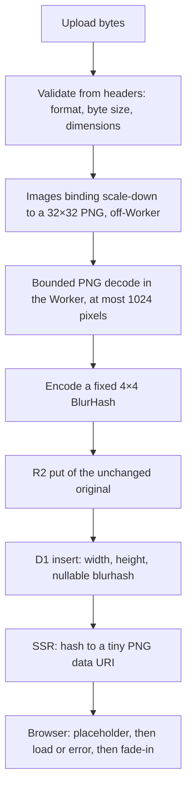

## Overview -- The Placeholder Is Metadata Computed Once, Not a Transform Per Request

A BlurHash is a short string -- 36 characters for the fixed 4×4 variant used here -- that encodes a handful of DCT coefficients of an image. Decoding it yields a blurry, colour-accurate thumbnail a page can paint before the real image arrives. The interesting question on Workers is not the encoding (the `blurhash` package is a few KB of pure JavaScript) but **where the pixels it needs come from**. The encoder wants an RGBA buffer, and decoding a 4 MB JPEG inside a Worker to get one is the wrong shape of work for the runtime: unbounded CPU, unbounded memory, and a decoder dependency you now have to trust with user-controlled bytes.

The pipeline below computes the hash **once, at ingestion**, from a deliberately tiny raster, and stores it next to the image's dimensions as ordinary metadata. Every later read is a row lookup. The only per-request work left is the SSR step that decodes the 36-character hash into a PNG no wider than 16 pixels -- cheap, but it runs once per rendered card, so the number to measure is a full list page, not one upload (or cache the rendered data URI).



Everything downstream of validation is best-effort: a transform or decode failure stores `NULL`, the upload still succeeds, and the browser contract treats a missing hash as "show the image", not as an error. The code on this page is taken from a production gallery whose Workers-runtime integration tests, deployed smoke test, and a 294-row backfill all passed -- the numbers quoted below come from that run.

## Validate From Headers Before Decoding Anything

Reject what you can from the first few dozen bytes, before any decoder sees the file. Three checks, all cheap:

- **Format** by magic bytes -- never by `Content-Type` or the filename, both of which are client-supplied.
- **Byte size** against a hard cap. `Content-Length` is a useful early reject, but it is a hint: a client can lie or omit it, so the cap is re-checked on the buffered bytes.
- **Dimensions** from the container header. This reads width and height without decoding a single pixel, which is what makes it safe to run on untrusted input.

| Format | Where the dimensions live | Guard |
|---|---|---|
| PNG | IHDR chunk: width and height as big-endian u32 at bytes 16–23 | Check the 8-byte signature first; IHDR is always the first chunk |
| JPEG | The first SOF marker (`0xFFC0`–`0xFFCF`, excluding `C4`, `C8`, `CC`): height then width as big-endian u16 at segment offsets 3 and 5 | Walk the marker table; standalone markers (`D0`–`D9`, `01`) carry no length field |
| WebP | `VP8 ` (lossy: 14-bit width/height after the `9D 01 2A` start code), `VP8L` (lossless: 14-bit values plus one, packed after `0x2F`), `VP8X` (extended: 24-bit canvas size plus one) | Check the RIFF chunk size against the buffer before reading past it |

```ts
export const MAX_UPLOAD_BYTES = 4 * 1024 * 1024;
export const ALLOWED_IMAGE_TYPES = ["image/jpeg", "image/png", "image/webp"] as const;
export type AllowedImageType = (typeof ALLOWED_IMAGE_TYPES)[number];
export type ImageExt = "jpg" | "png" | "webp";

export function sniffImageType(
  bytes: Uint8Array,
): { contentType: AllowedImageType; ext: ImageExt } | null {
  if (bytes[0] === 0xff && bytes[1] === 0xd8 && bytes[2] === 0xff) {
    return { contentType: "image/jpeg", ext: "jpg" };
  }
  if (
    bytes.length >= 8 &&
    [0x89, 0x50, 0x4e, 0x47, 0x0d, 0x0a, 0x1a, 0x0a].every(
      (value, index) => bytes[index] === value,
    )
  ) {
    return { contentType: "image/png", ext: "png" };
  }
  if (
    bytes.length >= 12 &&
    bytes[0] === 0x52 && bytes[1] === 0x49 && bytes[2] === 0x46 && bytes[3] === 0x46 &&
    bytes[8] === 0x57 && bytes[9] === 0x45 && bytes[10] === 0x42 && bytes[11] === 0x50
  ) {
    return { contentType: "image/webp", ext: "webp" };
  }
  return null;
}

/** Cheap pre-parse reject. `Content-Length` is a hint, not authoritative. */
export function contentLengthExceedsLimit(request: Request): boolean {
  const raw = request.headers.get("content-length");
  if (raw === null || !/^\d+$/.test(raw)) return false;
  const length = Number(raw);
  // A syntactically numeric value can still overflow to Infinity. Treat that
  // as oversized instead of falling through to request.formData().
  return !Number.isSafeInteger(length) || length > MAX_UPLOAD_BYTES;
}

type StoreFailure =
  | { ok: false; reason: "empty" }
  | { ok: false; reason: "too-large"; size: number; limit: number }
  | { ok: false; reason: "unsupported-type" }
  | { ok: false; reason: "undecodable" };

type ValidatedImage = {
  ok: true;
  contentType: AllowedImageType;
  ext: ImageExt;
  size: number;
  width: number;
  height: number;
};

function validateImage(bytes: ArrayBuffer): ValidatedImage | StoreFailure {
  const size = bytes.byteLength;
  if (size === 0) return { ok: false, reason: "empty" };
  if (size > MAX_UPLOAD_BYTES) return { ok: false, reason: "too-large", size, limit: MAX_UPLOAD_BYTES };

  const view = new Uint8Array(bytes);
  const imageType = sniffImageType(view);
  if (!imageType) return { ok: false, reason: "unsupported-type" };
  // Reads PNG IHDR / JPEG SOF / WebP VP8, VP8L, VP8X headers -- no pixel decode.
  const dimensions = readImageDimensions(view);
  if (!dimensions) return { ok: false, reason: "undecodable" };
  return { ok: true, ...imageType, size, ...dimensions };
}
```

The header reader is worth writing yourself rather than pulling in a probe library -- it is about a hundred lines for three formats, and every branch returns `null` on truncation or a non-positive dimension instead of throwing. A file that passes validation is not proven decodable; it is proven *worth handing to the next stage*.

Two refinements the snippet leaves to the caller. **Cap the declared dimensions too**: a 4 MB file can legitimately declare a 60,000×60,000 raster, and while the Images binding will shrink or refuse it off-Worker, a per-axis ceiling (checked per axis, so the product can never overflow) keeps the transform request sane and doubles as the SSR guard. And **for multipart forms, compare `Content-Length` against the file cap plus a small framing allowance *before* calling `request.formData()`** -- the header describes the whole multipart body, not the file, and `formData()` buffers all of it before any per-file check can run.

## Downsample Before Any Pixel Work: the Images Binding Does the Heavy Decode Off-Worker

The one idea that makes this pipeline fit a Worker: **never decode the original in JavaScript**. The Cloudflare Images binding is an RPC to a service outside the isolate, so awaiting it is I/O, not CPU time against your budget. Ask it for a `scale-down` to at most 32×32 with a PNG output, and the only pixels your code ever touches are the ≤1,024 in that result.

```toml
# wrangler.toml -- environment bindings are non-inheritable, so a preview
# environment has to declare the binding again.
[images]
binding = "IMAGES"

[env.preview.images]
binding = "IMAGES"
```

```ts
import { encode as encodeBlurhash } from "blurhash";

export const BLURHASH_COMPONENTS = 4;
export const MAX_BLURHASH_AXIS = 32;
export const MAX_BLURHASH_PIXELS = MAX_BLURHASH_AXIS * MAX_BLURHASH_AXIS;
export const MAX_TRANSFORMED_PNG_BYTES = 64 * 1024;

type BlurhashStage = "transform" | "buffer" | "decode" | "normalise" | "encode";

function freshByteStream(bytes: ArrayBuffer): ReadableStream<Uint8Array> {
  return new ReadableStream({
    start(controller) {
      controller.enqueue(new Uint8Array(bytes));
      controller.close();
    },
  });
}

/** Best-effort wrapper used by photo ingestion; it never exposes upload data in logs. */
export async function tryGeneratePhotoBlurhash(env: Env, originalBytes: ArrayBuffer): Promise<string | null> {
  let stage: BlurhashStage = "transform";
  try {
    const transformed = await env.IMAGES.input(freshByteStream(originalBytes))
      .transform({ fit: "scale-down", width: MAX_BLURHASH_AXIS, height: MAX_BLURHASH_AXIS })
      .output({ format: "image/png", anim: false });
    stage = "buffer";
    const png = await readBounded(transformed.image(), MAX_TRANSFORMED_PNG_BYTES);
    stage = "decode";
    const decoded = decodeTransformedPng(png);
    stage = "normalise";
    const image = ensureMinimumAxes(decoded.pixels, decoded.width, decoded.height);
    stage = "encode";
    return encodeBlurhash(
      image.pixels,
      image.width,
      image.height,
      BLURHASH_COMPONENTS,
      BLURHASH_COMPONENTS,
    );
  } catch (error) {
    console.warn({
      event: "photo_blurhash_generation_failed",
      stage,
      errorType: error instanceof Error ? error.name : typeof error,
      // ImagesError carries a numeric code (9422 = transformation quota exhausted);
      // the code is safe to log and separates "quota" from "outage" and "bad input".
      errorCode: typeof (error as { code?: unknown })?.code === "number" ? (error as { code: number }).code : undefined,
    });
    return null;
  }
}
```

Three details in that function carry weight:

- **`scale-down`, not `contain` or `cover`.** It never enlarges and never crops, so a 6×5 test fixture comes back as 6×5 and a 4000×3000 photo comes back as 32×24 -- aspect ratio preserved, exactly the input a placeholder wants.
- **A bounded read of the output stream.** `readBounded` accumulates chunks and cancels the reader the moment the running total passes 64 KiB -- the same shape as [`readBodyWithCap`](./remote-mcp-workers.mdx#the-body-cap-enforced-before-any-json-parsing) in the MCP recipe, applied to a binding's output instead of a request body. A 32×32 PNG is a few hundred bytes to a few KiB; the cap exists so that a misbehaving transform can never make the Worker buffer something large.
- **A fixed 4×4 component count.** BlurHash lets the encoder pick 1–9 components per axis; fixing it at 4×4 gives a constant 36-character string, a constant decode cost, and a validator that can check the size flag -- `U`, the base83 digit for `(4-1) + (4-1) * 9 = 30` -- as the first character.

`anim: false` and the `errorCode` field are two small additions on top of the production code, re-verified in the local Workers runtime for this page: the first pins a static, single-frame output (the decoder's APNG rejection below stays as defence in depth), the second is explained in the best-effort section.

`ensureMinimumAxes` nearest-neighbour upsamples anything smaller than 4 pixels on an axis: the encoder needs at least as many pixels per axis as components, and a 1×1 upload is still a valid upload.

```ts
async function readBounded(
  stream: ReadableStream<Uint8Array>,
  limit: number,
): Promise<Uint8Array> {
  const reader = stream.getReader();
  const chunks: Uint8Array[] = [];
  let length = 0;

  try {
    while (true) {
      const { done, value } = await reader.read();
      if (done) break;
      if (!(value instanceof Uint8Array)) throw new Error("invalid transformed chunk");
      length += value.byteLength;
      if (length > limit) {
        await reader.cancel("transformed PNG exceeds byte limit");
        throw new Error("transformed PNG exceeds byte limit");
      }
      chunks.push(value);
    }
  } finally {
    reader.releaseLock();
  }

  const bytes = new Uint8Array(length);
  let offset = 0;
  for (const chunk of chunks) {
    bytes.set(chunk, offset);
    offset += chunk.byteLength;
  }
  return bytes;
}

function ensureMinimumAxes(
  pixels: Uint8ClampedArray,
  width: number,
  height: number,
): { pixels: Uint8ClampedArray; width: number; height: number } {
  const targetWidth = Math.max(BLURHASH_COMPONENTS, width);
  const targetHeight = Math.max(BLURHASH_COMPONENTS, height);
  if (targetWidth === width && targetHeight === height) return { pixels, width, height };

  const resized = new Uint8ClampedArray(targetWidth * targetHeight * 4);
  for (let y = 0; y < targetHeight; y += 1) {
    const sourceY = Math.min(height - 1, Math.floor(y * height / targetHeight));
    for (let x = 0; x < targetWidth; x += 1) {
      const sourceX = Math.min(width - 1, Math.floor(x * width / targetWidth));
      const source = (sourceY * width + sourceX) * 4;
      resized.set(pixels.subarray(source, source + 4), (y * targetWidth + x) * 4);
    }
  }
  return { pixels: resized, width: targetWidth, height: targetHeight };
}
```

:::note[Raw pixel output may let you skip the PNG decode entirely]
Current Workers types also list `format: "rgb" | "rgba"` in `ImageOutputOptions` -- raw pixels straight from the binding, with the output dimensions derived from the source aspect ratio you already validated (raw output carries no header). That would replace the whole PNG stage below with one bounded read of 32 × 32 × 4 = 4 KiB. The pipeline on this page was validated with the PNG path; if you adopt raw output, verify it in the local simulator *and* on a deployment, and keep `readBounded` -- a raw buffer has no header to sanity-check against.
:::

## Decode the Tiny PNG Without Trusting It

The transformed PNG comes from Cloudflare's own service, so the threat model is mild -- but the decoder is a JavaScript dependency (`fast-png`) running inside the Worker on bytes the code did not produce, and the guards cost almost nothing. They also keep the pipeline safe when the transform does *not* behave as expected (see the local-versus-deployed section below): if a 200×200 PNG ever arrives, the contract check rejects it before a single row of pixels is inflated.

Three layers, in order:

1. **IHDR contract.** Width and height ≤ 32, width × height ≤ 1,024, bit depth 8, a colour type that maps to a channel count, no interlacing, no unknown compression or filter method.
2. **Inflate preflight with a byte budget.** PNG pixel data is zlib-compressed, and a tiny IDAT can expand without bound. Inflate it once through `fflate`'s streaming `Unzlib` with a callback that throws once the running total exceeds `height * (1 + width * channels)` -- the exact byte count a well-formed image must produce. `Unzlib` inflates each `push()` in full before calling back, so the IDAT is pushed in 512-byte slices: deflate's ~1032:1 ceiling then caps what any one slice can expand to at about 512 KiB, instead of the ~66 MB a single push of a 64 KiB stream could reach before the check ran. The same chunk walk rejects `iCCP` (embedded profiles), APNG chunks, and any unknown *critical* chunk.
3. **Decode and normalise.** Only now call the real decoder (with CRC checking on), cross-check its reported width, height, depth, and channels against the IHDR contract, and expand grey, grey+alpha, RGB, and RGBA into one RGBA buffer -- honouring `tRNS` transparency so a transparent PNG does not silently become opaque.

One thing the normalisation cannot fix: **BlurHash has no alpha channel.** The encoder reads RGB and ignores alpha, so a transparent pixel contributes whatever RGB sits underneath it -- often black. If transparent uploads matter, composite onto a known background first (the binding's `background` output option, or a compositing step on the RGBA buffer) and use the same background in the backfill, or the two paths will disagree.

```ts
import { decode as decodePng } from "fast-png";
import { Unzlib } from "fflate";

type PngContract = {
  width: number;
  height: number;
  channels: 1 | 2 | 3 | 4;
};

const PNG_SIGNATURE = [0x89, 0x50, 0x4e, 0x47, 0x0d, 0x0a, 0x1a, 0x0a] as const;
// Colour type -> channel count. Indexed colour (3) is deliberately absent: the
// transform never emits it, and a palette would make the byte budget below wrong.
const PNG_CHANNELS = new Map<number, PngContract["channels"]>([
  [0, 1],
  [2, 3],
  [4, 2],
  [6, 4],
]);

function inspectPngContract(bytes: Uint8Array): PngContract {
  if (bytes.byteLength < 33) throw new Error("truncated PNG");
  for (let index = 0; index < PNG_SIGNATURE.length; index += 1) {
    if (bytes[index] !== PNG_SIGNATURE[index]) throw new Error("invalid PNG signature");
  }

  const view = new DataView(bytes.buffer, bytes.byteOffset, bytes.byteLength);
  if (
    view.getUint32(8) !== 13 ||
    bytes[12] !== 0x49 || bytes[13] !== 0x48 || bytes[14] !== 0x44 || bytes[15] !== 0x52
  ) {
    throw new Error("invalid PNG IHDR");
  }

  const width = view.getUint32(16);
  const height = view.getUint32(20);
  if (width === 0 || height === 0) throw new Error("zero PNG dimension");
  if (width > MAX_BLURHASH_AXIS || height > MAX_BLURHASH_AXIS) {
    throw new Error("PNG dimension exceeds limit");
  }
  if (width * height > MAX_BLURHASH_PIXELS) throw new Error("PNG pixel count exceeds limit");
  if (bytes[24] !== 8) throw new Error("unsupported PNG bit depth");

  const channels = PNG_CHANNELS.get(bytes[25]);
  if (channels === undefined) throw new Error("unsupported PNG colour type");
  if (bytes[26] !== 0 || bytes[27] !== 0) throw new Error("unsupported PNG compression or filter");
  if (bytes[28] !== 0) throw new Error("unsupported interlaced PNG");
  return { width, height, channels };
}

function chunkType(bytes: Uint8Array, offset: number): string {
  return String.fromCharCode(bytes[offset], bytes[offset + 1], bytes[offset + 2], bytes[offset + 3]);
}

// fflate's Unzlib inflates a whole push() before it calls back, so the budget
// is only checked per push. Deflate expands at most ~1032:1, which bounds one
// slice to ~512 KiB of inflated data no matter what the IDAT contains.
const INFLATE_PUSH_BYTES = 512;

/**
 * Inflate once with a strict output budget before handing data to fast-png.
 * Pushing in small slices keeps a malicious IDAT from expanding far past the
 * budget before the check runs.
 */
function verifyPngDataBudget(bytes: Uint8Array, contract: PngContract): void {
  const expectedBytes = contract.height * (1 + contract.width * contract.channels);
  let inflatedBytes = 0;
  const inflater = new Unzlib((chunk) => {
    inflatedBytes += chunk.byteLength;
    if (inflatedBytes > expectedBytes) throw new Error("inflated PNG data exceeds pixel budget");
  });

  const view = new DataView(bytes.buffer, bytes.byteOffset, bytes.byteLength);
  let offset = 8;
  let sawIdat = false;
  let idatEnded = false;
  let sawIend = false;

  while (offset < bytes.byteLength) {
    if (bytes.byteLength - offset < 12) throw new Error("truncated PNG chunk");
    const length = view.getUint32(offset);
    if (length > bytes.byteLength - offset - 12) throw new Error("PNG chunk exceeds encoded data");
    const typeOffset = offset + 4;
    const type = chunkType(bytes, typeOffset);
    const dataOffset = offset + 8;

    if (offset === 8 && type !== "IHDR") throw new Error("PNG IHDR is not first");
    if (offset !== 8 && type === "IHDR") throw new Error("duplicate PNG IHDR");
    if (type === "iCCP") throw new Error("embedded PNG profile is unsupported");
    if (type === "acTL" || type === "fcTL" || type === "fdAT") {
      throw new Error("animated PNG is unsupported");
    }

    if (type === "IDAT") {
      if (idatEnded) throw new Error("non-consecutive PNG IDAT chunks");
      sawIdat = true;
      for (let start = dataOffset; start < dataOffset + length; start += INFLATE_PUSH_BYTES) {
        inflater.push(bytes.subarray(start, Math.min(start + INFLATE_PUSH_BYTES, dataOffset + length)), false);
      }
    } else if (sawIdat) {
      idatEnded = true;
    }

    if (type === "IEND") {
      if (length !== 0) throw new Error("invalid PNG IEND");
      sawIend = true;
      offset += 12;
      break;
    }

    // Reject unknown critical chunks (uppercase first letter); this also rejects a
    // suggested PLTE, which the transform never emits. Remaining ancillary chunks
    // are bounded by their encoded size and fast-png reads or skips them -- iCCP,
    // the one it would inflate, was rejected above.
    if (type !== "IHDR" && type !== "IDAT" && type.charCodeAt(0) <= 0x5a) {
      throw new Error("unsupported critical PNG chunk");
    }
    offset += length + 12;
  }

  if (!sawIdat || !sawIend || offset !== bytes.byteLength) throw new Error("incomplete PNG chunk sequence");
  inflater.push(new Uint8Array(0), true);
  if (inflatedBytes !== expectedBytes) throw new Error("inflated PNG data is inconsistent");
}

export function decodeTransformedPng(
  bytes: Uint8Array,
): { pixels: Uint8ClampedArray; width: number; height: number } {
  const contract = inspectPngContract(bytes);
  verifyPngDataBudget(bytes, contract);
  const decoded = decodePng(bytes, { checkCrc: true });
  if (
    decoded.width !== contract.width ||
    decoded.height !== contract.height ||
    decoded.depth !== 8 ||
    decoded.channels !== contract.channels
  ) {
    throw new Error("decoded PNG metadata is inconsistent");
  }

  const expectedLength = contract.width * contract.height * contract.channels;
  if (decoded.data.BYTES_PER_ELEMENT !== 1 || decoded.data.length !== expectedLength) {
    throw new Error("decoded PNG channel data is inconsistent");
  }

  const transparency = decoded.transparency;
  if (transparency !== undefined) {
    const expected = contract.channels === 1 ? 1 : contract.channels === 3 ? 3 : 0;
    if (transparency.length !== expected) throw new Error("invalid PNG transparency data");
  }

  const rgba = new Uint8ClampedArray(contract.width * contract.height * 4);
  for (let pixel = 0; pixel < contract.width * contract.height; pixel += 1) {
    const source = pixel * contract.channels;
    const target = pixel * 4;
    if (contract.channels === 1) {
      const grey = decoded.data[source];
      rgba[target] = grey;
      rgba[target + 1] = grey;
      rgba[target + 2] = grey;
      rgba[target + 3] = transparency?.[0] === grey ? 0 : 255;
    } else if (contract.channels === 2) {
      const grey = decoded.data[source];
      rgba[target] = grey;
      rgba[target + 1] = grey;
      rgba[target + 2] = grey;
      rgba[target + 3] = decoded.data[source + 1];
    } else {
      const red = decoded.data[source];
      const green = decoded.data[source + 1];
      const blue = decoded.data[source + 2];
      rgba[target] = red;
      rgba[target + 1] = green;
      rgba[target + 2] = blue;
      rgba[target + 3] = contract.channels === 4
        ? decoded.data[source + 3]
        : transparency?.[0] === red && transparency[1] === green && transparency[2] === blue
          ? 0
          : 255;
    }
  }
  return { pixels: rgba, width: contract.width, height: contract.height };
}
```

## Images Binding, Pure-JS Decoder, or WASM: Pick by Where the Big Decode Happens

| Path | Where the original is decoded | CPU / memory in the Worker | Bundle cost | Local dev | Use it for |
|---|---|---|---|---|---|
| **Images binding** (`env.IMAGES`) | Off-Worker, in Cloudflare's service | Only the tiny result | None | A subset of options is emulated | Shrinking the original -- always the first step |
| **Pure-JS decoder** (`fast-png`, `jpeg-js`, …) | Inside the isolate | Proportional to pixel count | Tens of KB | Full | Decoding an already-bounded raster |
| **WASM codec** (photon, squoosh codecs, libvips builds) | Inside the isolate | Proportional to pixel count, plus instantiation | Hundreds of KB to MB of `.wasm` | Full | A transform the binding cannot express, on already-bounded input |
| **Sharp** | -- | -- | Native addon: cannot run in `workerd` | -- | Node-only tooling such as a backfill script, never the Worker |

The rule that falls out: **use the binding to make the problem small, then use JavaScript to solve the small problem.** A pure-JS or WASM decoder is fine on a 32×32 PNG; it is an unbounded CPU and memory liability on a 4 MB original. Reaching for WASM to decode originals in-Worker trades the Images quota for a code-size hit, a per-isolate instantiation cost, and the 128 MB memory ceiling as your new failure mode -- and it still needs the byte and dimension caps above, because a small file can decode to a very large raster.

Two reasons to skip the binding and decode a bounded raster directly: the account cannot use Images transformations, or the input is already small by construction (an icon endpoint, a sprite sheet). In both cases header validation still runs first, and `MAX_BLURHASH_PIXELS` still applies -- to the decoded raster, not to the file size.

## Best-Effort by Design: NULL Is a Valid Outcome, and the Log Never Contains the Image

Everything after validation is optional. `tryGeneratePhotoBlurhash` returns `null` on any failure, the upload proceeds, and the D1 column is nullable. That is a product decision as much as an engineering one: a placeholder is a nicety, and an upload that fails because a nicety failed is a bug.

The `catch` logs exactly three things: the stage that failed, the error's constructor name, and -- when the binding threw an `ImagesError` -- its numeric `code`. Not the message (a decoder's message can quote bytes), not the key, not the user, not the dimensions. The stage tells "the Images service is down" (`transform`) from "the decoder rejected something" (`decode`) from "the output blew the budget" (`buffer`); the code tells a quota exhaustion (`9422`) from an outage or a bad input inside the `transform` stage. That is all an operator needs.

:::warning[Images transformations have a quota, and hitting it must not fail uploads]
Each generated hash costs one Images transformation. On the Free plan the allowance is a fixed number of *unique* transformations per month (5,000 at the time of writing -- check the current pricing page), and every upload is a new image, so budget roughly one per upload; past it the binding fails with `ERROR 9422`. In this design that surfaces as one `transform`-stage warning per upload and a `NULL` hash, while the original still lands in R2 and the row still lands in D1. A deliberate backfill later fills the gap. If the placeholder were required, the quota would be an outage.
:::

The failure ordering is therefore explicit:

| Stage that fails | User sees | Stored |
|---|---|---|
| Validation (format, size, dimensions) | 4xx, re-select the file | Nothing |
| Transform / buffer / decode / encode | Success | R2 object and D1 row with `blurhash = NULL` |
| R2 `put()` | 5xx, retry | Nothing -- nothing was written yet |
| D1 insert | 5xx, retry | Nothing -- the R2 object is deleted best-effort (next section) |

One decision the table leaves open: header inspection only proves a *plausible* image. When the binding rejects the bytes as not-an-image after the header check accepted them, you are about to store an original that browsers may fail to render too. The validated design keeps that best-effort -- the header check is the gate, and the row still lands -- but the stricter alternative is to treat an input-format error from the binding as a 4xx and reserve `NULL` for quota and transient failures. Either is defensible; write the choice into your failure table.

## Persist the Blob First and the Row Last, and Compute the Hash Before Either

Metadata is derived from the bytes about to be stored, so the ordering is: validate → hash → R2 `put()` → D1 insert. Two consequences:

- **The hash is computed before the R2 write.** A hash failure therefore never leaves an orphaned object behind -- there is nothing to clean up; the code proceeds with `null`.
- **The R2 object exists before any row references it** -- the same [blob first, row last](../storage/r2.mdx#pairing-r2-with-d1-blob-first-row-last) invariant the R2 page derives for every R2 + D1 pair: a row must never point at a blob that does not exist.

```ts
/** Validate, best-effort preprocess, then persist unchanged original photo bytes. */
export async function preprocessAndStorePhoto(
  env: Env,
  bytes: ArrayBuffer,
): Promise<PhotoStoreResult> {
  const validated = validateImage(bytes);
  if (!validated.ok) return validated;
  const blurhash = await tryGeneratePhotoBlurhash(env, bytes);
  const key = buildKey("photos", crypto.randomUUID(), validated.ext);
  await env.BUCKET.put(key, bytes, { httpMetadata: { contentType: validated.contentType } });
  return { ...validated, key, blurhash };
}
```

The original is stored **unchanged** -- the 32×32 PNG is a throwaway intermediate that never touches R2. Unchanged includes its metadata: EXIF, and any GPS position in it, is served exactly as uploaded unless something else strips it -- a product decision this recipe does not make for you. The upload handler then inserts the row, and if that insert fails it deletes the object it just wrote, best-effort:

```ts
let stored: PhotoStoreResult;
try {
  stored = await preprocessAndStorePhoto(env, await photo.arrayBuffer());
} catch (error) {
  const failure = storageFailure(error);
  return renderPage({ request, user, values, error: failure.message, status: failure.status, photoReselect: true });
}
if (!stored.ok) {
  const failure = resultFailure(stored);
  return renderPage({ request, user, values, error: failure.message, status: failure.status, photoReselect: true });
}

let photoId: number;
try {
  photoId = await insertPhoto(env, {
    userId: user.id,
    title,
    description,
    r2Key: stored.key,
    contentType: stored.contentType,
    width: stored.width,
    height: stored.height,
    blurhash: stored.blurhash,
    tags,
  });
} catch {
  // A thrown D1 error is not proof the insert did not commit. Delete the object
  // only when the query succeeds AND finds no row; if D1 is unreachable, leave
  // the orphan for the reclamation job rather than risk a dangling pointer.
  const committed = await env.DB
    .prepare("SELECT id FROM photos WHERE r2_key = ?")
    .bind(stored.key)
    .first<{ id: number }>()
    .catch(() => undefined);
  if (committed === null) {
    try {
      await deleteObjects(env, [stored.key]);
    } catch {
      // Cleanup is best effort; never replace the user-facing D1 failure.
    }
  }
  return renderPage({
    request,
    user,
    values,
    error: "Could not save your photo, please try again.",
    status: 500,
    photoReselect: true,
  });
}
```

The production handler deletes unconditionally in that `catch`; the existence check above is the stricter form. `batch()` is transactional, but a network failure *after* the commit surfaces as the same exception, and deleting the object then would manufacture the exact dangling pointer the ordering exists to prevent. The check is cheap because `r2_key` is a unique UUID, and it only deletes on a definite "no row" -- an unreachable D1 leaves an orphan, which the [reclamation job](../storage/r2.mdx#pairing-r2-with-d1-reclaiming-orphaned-blobs) collects after its grace period.

Retry semantics follow from immutable keys: the user retries, the handler mints a **new** UUID key, and any leftover object from the previous attempt is an orphan, never a dangling pointer. What a new key does *not* give you is idempotency: a client that retries after a timeout on a request that actually committed creates a duplicate photo. If that matters, hand the client an idempotency key and claim it before the write -- the [Idempotency-Key ledger](./idempotency-ledger.mdx) recipe is that pattern.

## D1 Column or R2 customMetadata: Follow the Read Path

Both stores can hold a 36-character string. The deciding question is **which store the page that needs the hash is already reading**.

| Read path | Right home for the hash |
|---|---|
| A gallery or list page rendering N cards from N D1 rows | **D1 column** -- the hash arrives in the same `SELECT`; `customMetadata` would cost N extra `head()` calls before the first byte of HTML |
| A serving proxy that already does `env.BUCKET.get(key)` for the object | `customMetadata` is available for free -- but it arrives *with the image bytes*, which is too late to paint a placeholder for that same image |
| A backfill or audit that must find rows still missing a hash | **D1 column** -- `WHERE blurhash IS NULL` is one query; R2 cannot be asked "which objects lack this metadata key" without listing the whole bucket and calling `head()` on each object |

For a placeholder the answer is D1 (or whichever row store your list page reads), because the whole point is to have the hash *before* the image request goes out. Writing a copy into `customMetadata` at `put()` time is harmless -- it keeps the object self-describing if the row is ever lost -- but it is a secondary copy, not the read path.

```sql
-- width / height are NOT NULL: they come from header validation and always exist.
-- blurhash is nullable: generation is best-effort, and legacy rows predate the feature.
ALTER TABLE photos ADD COLUMN blurhash TEXT;
```

## Synchronous, Queues, or waitUntil(): Pick by What the Response Promises

| Where the hash is computed | Guarantee | Cost | When it fits |
|---|---|---|---|
| **Synchronously, inside the upload request** (this recipe) | The response reflects the final state: the row is written with a hash or with `NULL` | One Images RPC of latency on the upload; a few ms of CPU on ≤1,024 pixels | The work is small and bounded, and "upload done" should mean "metadata done" |
| **`ctx.waitUntil()` after responding** | Best-effort -- silently cancelled at the 30-second elapsed cutoff -- and it needs a second D1 write | Zero added latency; two writes instead of one; a race with any concurrent backfill | The upload response is latency-critical and a missing hash is acceptable for a while |
| **Queues** | At-least-once, with retries and a dead-letter queue, in a consumer with its own CPU budget | A producer `send()` awaited before responding, carrying the row id and R2 key -- never the bytes, since a Queues message is capped at 128 KB; a consumer Worker; the placeholder becomes eventually consistent | Heavier derivatives (several sizes, format conversion), or when a transform quota error should be retried later rather than persisted as `NULL` |

Synchronous is the right default *because* the downsample moved the expensive part off-Worker: what remains is one awaited RPC and a trivial encode, well inside a request. The moment the per-upload work grows -- multiple derivatives, a WASM codec on a bigger raster -- the CPU cost moves the decision to Queues, not to `waitUntil()`. `waitUntil()` extends elapsed time, not CPU, and cancels without telling anyone; the [runtime gotchas](../workers/runtime-gotchas.mdx#ctx-waituntil-and-scheduled-two-different-clocks) page covers the two clocks and the [Queues escape](../workers/runtime-gotchas.mdx#ctx-waituntil-and-scheduled-two-different-clocks-three-escapes-when-30-seconds-isn-t-enough).

If you do defer, insert the row with `blurhash = NULL` **first** and let the background task fill it with a conditional update, so it can never clobber a backfill or a concurrent writer:

```ts
export default {
  async fetch(request: Request, env: Env, ctx: ExecutionContext): Promise<Response> {
    const bytes = await request.arrayBuffer();
    // validateAndStore is preprocessAndStorePhoto without the hash step; the
    // delete-on-insert-failure cleanup from the previous section still applies.
    const stored = await validateAndStore(env, bytes, { prefix: "photos" });
    if (!stored.ok) return failureResponse(stored);
    const id = await insertPhoto(env, { ...rowFrom(stored), blurhash: null });

    // Best-effort: shares the 30s elapsed window with every other waitUntil()
    // in this invocation, and is cancelled silently if it overruns.
    ctx.waitUntil(
      tryGeneratePhotoBlurhash(env, bytes).then(async (blurhash) => {
        if (blurhash === null || !isCanonicalPhotoBlurhash(blurhash)) return;
        await env.DB
          .prepare("UPDATE photos SET blurhash = ? WHERE id = ? AND blurhash IS NULL")
          .bind(blurhash, id)
          .run();
      }),
    );
    return Response.json({ id }, { status: 201 });
  },
};
```

## Runtime Constraints to Record Before Shipping

Write these down in the repo (a README or runbook), because each one is invisible in a passing local test:

- **Bundling: Sharp must never reach the Worker.** Sharp is a native libvips binding; it cannot run in `workerd` at all, so any import path from Worker code into the backfill helper is a build-time or boot-time failure. Keep Sharp a `devDependency`, keep the backfill under `scripts/` as Node-only `.mjs`, and add a check that the built bundle does not contain it:

  ```sh
  # Fails if the Node-only Sharp path leaked into the Worker bundle.
  if grep -q 'sharp' dist/_worker.js; then
    echo "sharp leaked into the Worker bundle" >&2
    exit 1
  fi
  ```

- **Code size.** `blurhash`, `fast-png`, and `fflate` are small pure-JS packages -- tens of KB combined, minified. A WASM codec is what moves the needle; check it against the compressed Worker size limit for your plan (3 MB on Free, 10 MB on Paid at the time of writing) before adopting one.
- **Initialisation.** Keep module scope free of decoder setup or WASM instantiation. A Worker that does image work only on uploads should not pay for it on every cold start of every route.
- **CPU.** After the downsample, in-Worker work is bounded by `MAX_BLURHASH_PIXELS` (1,024 pixels), so it fits inside even the Free plan's 10 ms CPU budget; the Images RPC itself is wall-clock, not CPU. The number to actually measure is the SSR side -- one BlurHash decode plus one PNG encode per rendered card -- on your largest list page.
- **Memory.** The largest allocations are the original upload buffer (capped by `MAX_UPLOAD_BYTES`) and the ≤64 KiB PNG. Both are far from the 128 MB isolate limit; the caps are what keep it that way.
- **Images quota and cost.** One transformation per upload counts against the account's Images allowance (see the warning above). Budget it against expected upload volume, not page views -- page views never transform.
- **Local versus deployed.** The next section.

### The Local Images Binding Is a Subset, So Verify Fit and Crop Against a Deployment

`wrangler dev` emulates the Images binding without credentials, which is what makes the Workers-runtime tests below possible. But the local implementation covers only a subset of the transform options -- observed as `width`, `height`, `rotate`, and `format` -- and does not reproduce Cloudflare's network-side decoding and cropping behaviour. In practice:

- The output content type, and that a raster no larger than 32×32 comes back, **can** be asserted locally.
- `fit` semantics -- including the exact output dimensions, since `scale-down` is what decides them -- `gravity: "auto"`, and anything that depends on the real decoder **cannot**; verify those once against a deployed preview.
- The pipeline is safe either way: `inspectPngContract` rejects any raster over 32×32, so a local transform that ignored `fit` and returned something unexpected would produce a `decode`-stage `NULL`, not an unbounded decode.

Treat the local binding as "the shape of the API is right" and the deployed check as "the pixels are right". The [binding support matrix](../workers/local-dev-bindings.mdx#the-binding-support-matrix) lists it alongside the other bindings.

## The Browser Contract: Placeholder, Then Load or Error, Then Fade-In -- and the Image Is Never Hidden by Default

The rendering side has one non-negotiable rule: **an image must never end up invisible because JavaScript did not run, ran late, or ran twice.** Every decision below follows from it.

### SSR Turns the Hash Into a Tiny PNG, and Validates It First

The server decodes the hash into a PNG no wider than 16 pixels and inlines it as a `data:` URI on the wrapper's `::before` -- so the placeholder paints from the HTML alone, with no client-side decode, no canvas, and no script dependency. Width and height come from the row too, so the box has its final aspect ratio before any bytes arrive and there is no layout shift.

```ts
import { decode } from "blurhash";
import { encode as encodePng } from "fast-png";

const BASE83_ALPHABET = "0123456789ABCDEFGHIJKLMNOPQRSTUVWXYZabcdefghijklmnopqrstuvwxyz#$%*+,-.:;=?@[]^_{|}~";
const BASE83 = new Set(BASE83_ALPHABET);
const BLURHASH_COMPONENTS = 4;
const SIZE_FLAG = (BLURHASH_COMPONENTS - 1) + (BLURHASH_COMPONENTS - 1) * 9;
const HASH_LENGTH = 4 + 2 * BLURHASH_COMPONENTS * BLURHASH_COMPONENTS;

export const PLACEHOLDER_MAX_SOURCE_AXIS = 100_000;
export const PLACEHOLDER_MAX_DECODE_AXIS = 16;
export const PLACEHOLDER_MIN_DECODE_AXIS = 4;
export const PLACEHOLDER_MAX_PIXELS = PLACEHOLDER_MAX_DECODE_AXIS ** 2;
export const PLACEHOLDER_MAX_DATA_URI_BYTES = 4 * 1024;

export type ImagePlaceholder = {
  dataUri: string;
  width: number;
  height: number;
};

export function isCanonicalPhotoBlurhash(value: unknown): value is string {
  if (typeof value !== "string" || value.length !== HASH_LENGTH) return false;
  if (BASE83_ALPHABET.indexOf(value[0] ?? "") !== SIZE_FLAG) return false;
  for (const character of value) if (!BASE83.has(character)) return false;
  return true;
}

function boundedDimension(value: number): number {
  if (!Number.isFinite(value)) return 1;
  return Math.min(PLACEHOLDER_MAX_SOURCE_AXIS, Math.max(1, Math.round(value)));
}

/** Preserve the stored aspect ratio while keeping decode work at a fixed tiny budget. */
export function placeholderDimensions(sourceWidth: number, sourceHeight: number): { width: number; height: number } {
  const width = boundedDimension(sourceWidth);
  const height = boundedDimension(sourceHeight);
  if (width >= height) {
    return {
      width: PLACEHOLDER_MAX_DECODE_AXIS,
      height: Math.max(PLACEHOLDER_MIN_DECODE_AXIS, Math.round(PLACEHOLDER_MAX_DECODE_AXIS * height / width)),
    };
  }
  return {
    width: Math.max(PLACEHOLDER_MIN_DECODE_AXIS, Math.round(PLACEHOLDER_MAX_DECODE_AXIS * width / height)),
    height: PLACEHOLDER_MAX_DECODE_AXIS,
  };
}

/** Best-effort bounded SSR conversion. Invalid database values never reach markup. */
export function createImagePlaceholder(
  blurhash: unknown,
  sourceWidth: number,
  sourceHeight: number,
): ImagePlaceholder | null {
  if (!isCanonicalPhotoBlurhash(blurhash)) return null;
  try {
    const dimensions = placeholderDimensions(sourceWidth, sourceHeight);
    if (dimensions.width * dimensions.height > PLACEHOLDER_MAX_PIXELS) return null;
    const pixels = decode(blurhash, dimensions.width, dimensions.height);
    if (pixels.byteLength !== dimensions.width * dimensions.height * 4) return null;
    const png = encodePng({ ...dimensions, data: pixels, depth: 8, channels: 4 });
    const dataUri = `data:image/png;base64,${base64(png)}`;
    // A base64 data URI is pure ASCII, so length is the byte count.
    if (dataUri.length > PLACEHOLDER_MAX_DATA_URI_BYTES) return null;
    return { dataUri, ...dimensions };
  } catch {
    return null;
  }
}
```

Helpers such as `base64`, `buildKey`, `deleteObjects`, `readImageDimensions`, and `insertPhoto` are project glue and are left out of the snippets. `isCanonicalPhotoBlurhash` runs on every render because the column is just `TEXT`: a hand-edited row, a buggy backfill, or a future format change must degrade to "no placeholder", never to a broken `background-image`. The component makes the fallback explicit -- no hash, no wrapper, just the image:

```tsx
/** SSR-only wrapper: without JS, the real image remains fully visible. */
export function PlaceholderImage({ blurhash, fit, wrapperClass = "", ...image }: Props) {
  const placeholder = createImagePlaceholder(blurhash, image.width, image.height);
  if (!placeholder) return ;

  return (
    <span
      data-image-placeholder="true"
      data-placeholder-fit={fit}
      class={`relative block ${wrapperClass}`.trim()}
      style={`--image-placeholder:url("${placeholder.dataUri}")`}
    >
      
    </span>
  );
}
```

### CSS: Opacity 1 Is the Default, and Only a Pending Attribute Changes It

```css
/* The pseudo-element survives gallery innerHTML snapshots; the image remains
   visible until the controller marks a hash-bearing, incomplete image pending. */
[data-image-placeholder="true"]::before {
  position: absolute;
  inset: 0;
  background-image: var(--image-placeholder);
  background-position: center;
  background-repeat: no-repeat;
  background-size: cover;
  content: "";
}
[data-image-placeholder="true"][data-placeholder-fit="contain"]::before {
  background-size: contain;
}
[data-placeholder-image="true"] {
  position: relative;
  opacity: 1;
  transition: opacity 180ms ease;
}
[data-image-placeholder="true"][data-placeholder-pending] > [data-placeholder-image="true"] {
  opacity: 0;
}

@media (prefers-reduced-motion: reduce) {
  [data-placeholder-image="true"] {
    transition-duration: 0.01ms;
  }
}
```

The image is `position: relative` and later in DOM order, so it stacks above the `::before`. With no attribute it is fully opaque and simply covers the placeholder; with `data-placeholder-pending` it goes transparent and the placeholder shows through; on reveal it fades back to 1 over the placeholder. `cover` versus `contain` on the pseudo-element mirrors the `object-fit` of the real image so the blur sits where the photo will land.

### JS: Mark Pending Only What Is Genuinely Incomplete, Reveal on Load *and* Error

The controller's job is narrow: after JavaScript starts, find hash-bearing images that are still loading, hide them behind their placeholder, and reveal them when they settle -- successfully or not.

```ts
const IMAGE_SELECTOR = 'img[data-placeholder-image="true"]';
const WRAPPER_SELECTOR = '[data-image-placeholder="true"]';

export class ImagePlaceholderController {
  readonly #document: Document;
  #observer: MutationObserver | null = null;

  static mount(document = globalThis.document): ImagePlaceholderController | null {
    return document ? new ImagePlaceholderController(document) : null;
  }

  private constructor(document: Document) {
    this.#document = document;
    // Capture-phase listeners must exist before the first scan: cached images can
    // settle while initial reconciliation is walking the document.
    document.addEventListener("load", this.#onSettle, true);
    document.addEventListener("error", this.#onSettle, true);
    document.addEventListener("zfb:after-swap", this.#onAfterSwap);
    if (typeof MutationObserver !== "undefined") {
      this.#observer = new MutationObserver(this.#onMutations);
      this.#observer.observe(document, { childList: true, subtree: true });
    }
    this.reconcile(document);
  }

  /** Reset serialized/stale state, then resolve every image currently under root. */
  reconcile(root: ParentNode = this.#document): void {
    this.#images(root).forEach((image) => this.#prepare(image));
  }

  destroy(): void {
    this.#observer?.disconnect();
    this.#document.removeEventListener("load", this.#onSettle, true);
    this.#document.removeEventListener("error", this.#onSettle, true);
    this.#document.removeEventListener("zfb:after-swap", this.#onAfterSwap);
  }

  #images(root: ParentNode): HTMLImageElement[] {
    const images: HTMLImageElement[] = [];
    if (root instanceof HTMLImageElement && root.matches(IMAGE_SELECTOR)) images.push(root);
    root.querySelectorAll<HTMLImageElement>(IMAGE_SELECTOR).forEach((image) => images.push(image));
    return images;
  }

  #wrapper(image: HTMLImageElement): HTMLElement | null {
    return image.closest<HTMLElement>(WRAPPER_SELECTOR);
  }

  #resetState(wrapper: HTMLElement): void {
    wrapper.removeAttribute("data-placeholder-pending");
    wrapper.removeAttribute("data-placeholder-loaded");
    wrapper.removeAttribute("data-placeholder-error");
  }

  #reveal(image: HTMLImageElement): void {
    const wrapper = this.#wrapper(image);
    if (!wrapper) return;
    this.#resetState(wrapper);
    wrapper.setAttribute(image.naturalWidth > 0 ? "data-placeholder-loaded" : "data-placeholder-error", "true");
  }

  #prepare(image: HTMLImageElement): void {
    const wrapper = this.#wrapper(image);
    if (!wrapper) return;
    this.#resetState(wrapper);
    // `complete` cannot flip mid-scan: load/error are delivered as separate tasks,
    // and the capture-phase listeners registered before the scan catch those.
    if (image.complete) {
      this.#reveal(image);
      return;
    }
    wrapper.setAttribute("data-placeholder-pending", "true");
  }

  readonly #onSettle = (event: Event): void => {
    const target = event.target;
    if (target instanceof HTMLImageElement && target.matches(IMAGE_SELECTOR)) this.#reveal(target);
  };

  readonly #onAfterSwap = (): void => {
    this.reconcile(this.#document);
  };

  readonly #onMutations: MutationCallback = (records): void => {
    for (const record of records) {
      for (const node of record.addedNodes) {
        if (node instanceof Element) this.#images(node).forEach((image) => this.#prepare(image));
      }
    }
  };
}
```

Each branch of that class pins down a state the browser suite tests explicitly:

| State | Handling |
|---|---|
| Image already cached or complete when JS runs | `image.complete` is true → reveal immediately, never mark pending |
| Image settles right after the initial scan | Capture-phase `load` / `error` listeners are registered **before** `reconcile()` runs, so an event queued while the synchronous scan was walking the document still reveals the image |
| Load error (404, blocked, corrupt) | `error` reveals just like `load`; `naturalWidth === 0` distinguishes the two for styling, but the image is unhidden either way |
| Lazy image (`loading="lazy"`) far below the fold | Pending until the browser actually fetches it; the placeholder is the right thing to show meanwhile |
| Cards appended by infinite scroll | `MutationObserver` prepares every added subtree |
| SPA navigation swapping the document | The router's `after-swap` event triggers a full `reconcile()` |
| Back/forward cache restore (`pageshow` with `persisted`) | The caller invokes `reconcile()` -- serialized `data-placeholder-*` attributes are stale and must be reset |
| Reduced motion | The transition duration collapses; the attribute flow is unchanged |
| No JavaScript at all | Nothing ever sets `data-placeholder-pending`, so the image is visible over its placeholder from the first paint |

Mount from the client entry once per document, and re-run `reconcile()` on a bfcache restore:

```ts
const images = ImagePlaceholderController.mount();
window.addEventListener("pageshow", (event) => {
  if (event.persisted) images?.reconcile();
});
```

### Rows Without a Hash Keep the Plain Image

`createImagePlaceholder` returns `null` for `NULL`, so a legacy row renders a bare `` -- exactly what it rendered before the feature existed. No opacity rule applies (there is no wrapper) and no controller touches it. This is the fallback the next section relies on: the site is correct before, during, and after a backfill, and the backfill is purely additive.

## Legacy Rows: Keep the Fallback, Backfill Deliberately and Off-Worker

New uploads get a hash at ingest. Rows that predate the feature stay `NULL` until an operator fills them, and the right tool for that is **not** the Worker: a backfill decodes full originals, which is exactly the unbounded work the ingestion path refused to do. It is a Node script with Sharp, run under explicit limits.

What the validated script does, in the order that makes it safe to rerun:

1. **Selects only what needs work** -- `WHERE blurhash IS NULL AND id > ?cursor`, paged by immutable id and capped by `--limit` (default 100, hard maximum 10,000).
2. **Reads R2 only.** Every original is fetched, never written, replaced, or deleted. Download size, object size, and Sharp's `limitInputPixels` are all bounded (4 MiB, 4 MiB, and 16 million pixels by default), with a per-row timeout and a concurrency cap.
3. **Produces the same 32×32 → 4×4 shape** as the Worker path -- Sharp's `.rotate()` with no argument auto-orients from EXIF, and `fit: "inside", withoutEnlargement: true` is the Sharp spelling of `scale-down` -- so backfilled and ingest-time hashes are interchangeable. Verify orientation parity once against a deployment with a rotated-EXIF fixture.
4. **Validates every generated hash** against the canonical alphabet before writing (next section).
5. **Writes conditionally** -- `UPDATE photos SET blurhash = ? WHERE id = ? AND blurhash IS NULL` -- so a concurrent upload or a second backfill instance is never clobbered. `--force` is the explicit opt-in to overwrite non-null values.
6. **Requires explicit remote names.** `--remote` refuses to run without both `--d1 <name>` and `--bucket <name>` on the command line; it never silently picks up the production bindings from `wrangler.toml`.
7. **Dry-runs first.** `--dry-run` selects, reads, decodes, and reports, with zero D1 updates and zero R2 mutations.

```sh
# Local state first, against the same --persist-to directory wrangler dev uses.
node scripts/backfill-blurhash.mjs --d1 img-gallery --bucket img-gallery --persist-to .wrangler/state --dry-run --limit 100
node scripts/backfill-blurhash.mjs --d1 img-gallery --bucket img-gallery --persist-to .wrangler/state --limit 100

# Remote: both resource names are mandatory, and the dry run comes first.
node scripts/backfill-blurhash.mjs --remote --d1 img-gallery --bucket img-gallery --dry-run --limit 100
node scripts/backfill-blurhash.mjs --remote --d1 img-gallery --bucket img-gallery --limit 100
```

A failed row stays `NULL` and is reported without image bytes or credentials; rerunning the same bounded command is the recovery path. In the production run behind this page, 294 legacy rows went from nullable to 294 present / 0 missing / 0 malformed, R2 stayed read-only throughout, and an immediate rerun selected 0 rows -- which is the idempotency check worth writing into the runbook.

:::note[The backfill and the Worker share the encoder, not the decoder]
`blurhash` (the encoder) is a runtime dependency used by both. Sharp is a `devDependency` imported only under `scripts/`. That split is what the bundle check in the constraints section protects.
:::

## Validate Generated Hashes Against the Real Base83 Alphabet -- the Comma Pitfall

:::danger[The base83 alphabet contains a comma, and a hand-written character class will forget it]
BlurHash's base83 digits are `0-9`, `A-Z`, `a-z`, and the 21 punctuation characters `#$%*+,-.:;=?@[]^_{|}~`. In the production backfill behind this page, a validator written as a regex character class omitted `,` -- easy to do, since a comma inside `[...]` reads like a separator -- and rejected 21 perfectly valid generated hashes before the bug was caught. The conditional write meant those rows were *safely* left `NULL` rather than corrupted, and a rerun after the fix filled them. Across the finished run, 64 of the 294 hashes contain a comma -- so a validator with this bug silently discards roughly one in five images' placeholders.
:::

Three rules follow:

1. **Validate with an explicit alphabet string, or the library's own validator** -- never a regex class typed from memory.
2. **Test every punctuation digit individually**, comma included. A test that only checks a couple of known-good hashes passes with the bug in place.
3. **Keep validation before the conditional write**, in both the Worker and the backfill. A malformed hash must become `NULL` and a log line, never a row.

```ts
import { describe, expect, it } from "vitest";
import { isCanonicalPhotoBlurhash } from "../../lib/image-placeholder";

const PUNCTUATION = "#$%*+,-.:;=?@[]^_{|}~";

describe("isCanonicalPhotoBlurhash", () => {
  it("accepts every base83 punctuation digit, comma included", () => {
    for (const digit of PUNCTUATION) {
      // "U" is the 4x4 size flag; the remaining 35 digits may be any base83 character.
      expect(isCanonicalPhotoBlurhash(`U${digit.repeat(35)}`)).toBe(true);
    }
  });

  it("rejects the wrong length, the wrong size flag, and non-alphabet characters", () => {
    expect(isCanonicalPhotoBlurhash(`U${"0".repeat(34)}`)).toBe(false);
    expect(isCanonicalPhotoBlurhash(`L${"0".repeat(35)}`)).toBe(false);
    expect(isCanonicalPhotoBlurhash(`U${"0".repeat(34)} `)).toBe(false);
    expect(isCanonicalPhotoBlurhash(`U${"0".repeat(34)}"`)).toBe(false);
    expect(isCanonicalPhotoBlurhash(null)).toBe(false);
  });
});
```

The validator is a *format* check -- length, size flag, alphabet -- not a proof that the string decodes to sensible pixels. That is deliberate: the SSR decode is wrapped in `try` and returns `null` on anything the library rejects, so the validator only has to be cheap and correct about the alphabet.

## Testing: Deterministic Fixtures in Unit Tests, Plus a Real Workers-Runtime Pass

Node-only tests cannot prove this pipeline. Sharp is not in the Worker, the Images binding is not in Node, and `workerd`'s I/O rules differ from Node's (the [stored-fetch trap](../workers/runtime-gotchas.mdx#the-stored-fetch-receiver-trap-passes-in-node-throws-in-production) is the classic example). Three layers:

**Deterministic fixtures.** Check in tiny *real* JPEG, PNG, and WebP files as base64 strings -- a few hundred bytes each, decodable by any decoder, with known dimensions. Base64 keeps them portable into the isolate without a filesystem, and without Sharp to generate them at test time.

```ts
export const PNG_FIXTURE = fixture(
  "png",
  "image/png",
  "png",
  6,
  5,
  "iVBORw0KGgoAAAANSUhEUgAAAAYAAAAFCAYAAABmWJ3mAAAACXBIWXMAAAPoAAAD6AG1e1JrAAAAEklEQVR4nGMQWfDsDDbMQAcJAG4cR/Xn+WWaAAAAAElFTkSuQmCC",
);
```

**Unit tests (Node, fast).** The pure functions -- header validation, `inspectPngContract`, `verifyPngDataBudget`, `decodeTransformedPng`, `isCanonicalPhotoBlurhash`, `createImagePlaceholder` -- against the fixtures and against crafted rejects: an IHDR claiming 33×1, an IDAT that inflates past the budget, an `iCCP` chunk, an APNG `acTL`, a truncated chunk table, and a hash with a comma.

**Workers-runtime integration (`@cloudflare/vitest-pool-workers`).** The test runs *inside* `workerd` with the project's real local bindings and calls the actual ingestion function:

```ts
/// <reference types="@cloudflare/vitest-pool-workers/types" />

import { env } from "cloudflare:test";
import { describe, expect, it } from "vitest";
import type { Env } from "../../lib/env";
import { isCanonicalPhotoBlurhash } from "../../lib/image-placeholder";
import { getObject, preprocessAndStorePhoto } from "../../lib/storage";
import { imageFixtureArrayBuffer, REAL_IMAGE_FIXTURES } from "../helpers/image-fixtures";

describe("local Images upload preprocessing", () => {
  it.each(REAL_IMAGE_FIXTURES)(
    "decodes a real $name, stores a fixed-4x4 hash, and preserves the original bytes",
    async (fixture) => {
      const worker = env as unknown as Env;
      const result = await preprocessAndStorePhoto(worker, imageFixtureArrayBuffer(fixture));
      expect(result).toMatchObject({
        ok: true,
        contentType: fixture.contentType,
        width: fixture.width,
        height: fixture.height,
        size: fixture.bytes.byteLength,
      });
      if (!result.ok) throw new Error(`unexpected ${fixture.name} validation failure: ${result.reason}`);
      expect(isCanonicalPhotoBlurhash(result.blurhash)).toBe(true);
      expect(result.blurhash).toHaveLength(36);

      const object = await getObject(worker, result.key);
      expect(object).not.toBeNull();
      expect(object?.httpMetadata?.contentType).toBe(fixture.contentType);
      expect(new Uint8Array(await object!.arrayBuffer())).toEqual(fixture.bytes);

      await worker.BUCKET.delete(result.key);
    },
  );
});
```

```ts
// vitest.config.ts -- the integration project boots workerd with the real wrangler.toml bindings.
import { cloudflareTest } from "@cloudflare/vitest-pool-workers";
import { defineConfig } from "vitest/config";

export default defineConfig({
  test: {
    projects: [
      {
        extends: true,
        test: { name: "unit", environment: "node", include: ["tests/unit/**/*.test.ts"] },
      },
      {
        extends: true,
        plugins: [cloudflareTest({ wrangler: { configPath: "./wrangler.toml" } })],
        test: { name: "integration", include: ["tests/integration/**/*.test.ts"] },
      },
    ],
  },
});
```

Run it after `build` when the Worker entry is a build artefact (`main = "./dist/_worker.js"`), because the pool loads whatever `wrangler.toml` points at. What it proves: the binding is wired, the transform → decode → encode path runs under `workerd`, the hash is canonical, and the R2 object is byte-identical to the upload. What it cannot prove: real crop and fit behaviour (the local subset) -- which is the next layer's job.

**Deployed smoke (Playwright against a preview or production URL).** Hold the image requests at the network layer, assert that the SSR placeholders are painted and the images sit at `opacity: 0`, then release the requests and assert `opacity: 1` with the `data-placeholder-loaded` attribute. Add one error case (a 404 image) to prove the reveal-on-error path, one nullable row to prove the fallback, and a reduced-motion run. The production check behind this page observed 24 painted placeholders with image opacity 0 followed by the loaded state at opacity 1 on the live site -- the assertion no unit test can stand in for. Add a deployed *dimension* check as well: run the transform against a deployed preview with portrait, landscape, and sub-32-pixel fixtures and assert the output sizes -- the `fit` semantics the local simulator cannot prove.

## Related

- [R2 (Object Storage)](../storage/r2.mdx) -- the blob-first / row-last invariant, immutable UUID keys, and the orphan reclamation job that retries here depend on.
- [Runtime Gotchas](../workers/runtime-gotchas.mdx) -- the `waitUntil()` elapsed budget versus the CPU budget, and the Queues escape.
- [Local Dev: Binding Support Matrix](../workers/local-dev-bindings.mdx) -- which bindings emulate locally, including the Images subset.
- [Idempotency-Key Ledger on D1](./idempotency-ledger.mdx) -- the claim-before-mutate pattern that makes a client retry idempotent, which a fresh UUID key alone does not give you.
- [Cron + D1 Queue](./cron-d1-queue.mdx) -- the work-queue shape to reach for when preprocessing outgrows a single request.
- [Wrangler Config](../workers/wrangler-config.mdx) -- per-environment bindings, and why `[env.preview.images]` has to be repeated.
- [Layered Image Composition with the Images Binding](./worker-image-composition.mdx) -- the other half of the same binding: `draw()`, Porter-Duff modes, transparent bleed, and the single-use transformer rule behind error `9525`.
