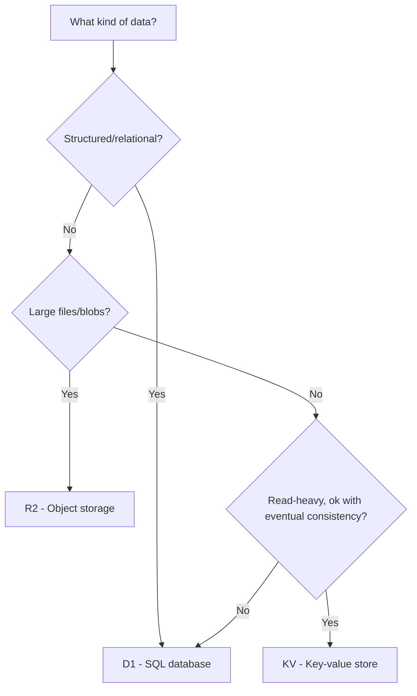

Cloudflare offers three storage services, each optimized for different access patterns.

## Overview

| Service | Type | Best For | Consistency |
|---|---|---|---|
| **KV** | Key-value store | Read-heavy, eventually consistent data | Eventual |
| **D1** | SQL database (SQLite) | Relational data, complex queries | Strong |
| **R2** | Object storage (S3-compatible) | Files, images, large blobs | Strong |

## Choosing the Right Service

## In This Section

- [KV](./kv.mdx) -- Key-value namespace usage patterns
- [D1](./d1.mdx) -- SQL database with SQLite
- [R2](./r2.mdx) -- Object storage for files
