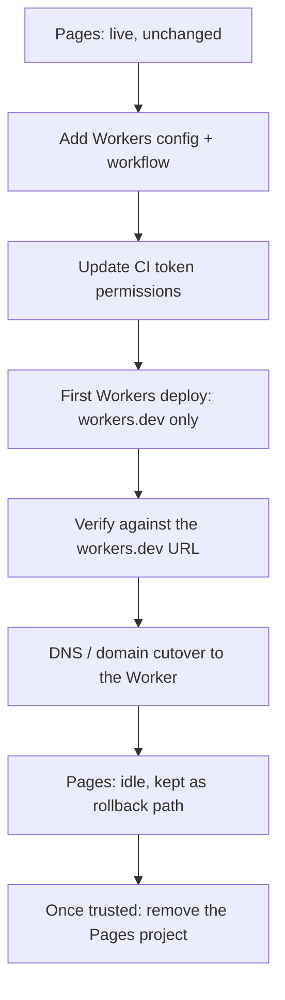

## Why Migrate

[Workers Static Assets](./static-assets.mdx) is the successor to Cloudflare Pages for static + SSR sites -- one Worker owns both the asset directory and the request logic, instead of a separate Pages project with its own deploy pipeline. If you are starting fresh, build on Workers Static Assets directly. This page is for the other case: a site is already live on Pages, and you want to move it to Workers without a gap in service.

Read [Workers Static Assets](./static-assets.mdx) before migrating -- the `[assets]` traps documented there (gating order, SPA fallback, trailing-slash rewrites) apply to the Worker you're about to stand up, regardless of how you got there.

## The Live-Migration Order

The site stays served by Pages for most of this sequence. Nothing about production changes until the DNS/domain cutover step -- everything before it is additive, sitting next to the existing Pages deploy untouched.



1. **Add the Workers config and workflow.** Commit a `wrangler.toml` with an `[assets]` block and a new deploy workflow file, alongside the existing Pages project and its own workflow. Nothing runs against production yet -- this step only adds files.
2. **Update the CI token's permissions.** The Workers deploy needs permissions the Pages token never carried (see [The Token Delta](#the-token-delta) below). Edit the *existing* token rather than minting a new one -- this matters for rollback, covered later.
3. **First Workers deploy, `*.workers.dev` only.** Deploy without attaching any route or custom domain. This exercises the whole pipeline -- config, token, build, asset upload -- without touching live traffic.
4. **Verify against the `workers.dev` URL.** Confirm the asset layer serves the right files and any Worker logic behaves correctly, side by side with the still-live Pages site.
5. **DNS/domain cutover.** Only this step moves real traffic -- see below.
6. **Leave the old Pages project in place.** Don't delete it once the Worker is live. It is the rollback path, not a leftover.
7. **Remove it later, once trusted.** After the Workers deploy has carried production traffic long enough to trust it, decommission the Pages project, its workflow, and any Pages-only token permissions.

## The Token Delta

A Pages deploy token and a Workers deploy token overlap less than you'd expect, and the difference is easy to get wrong in exactly the direction that breaks a live cutover.

| Scope | Pages token (existing) | Workers, `*.workers.dev` only | Workers, custom domain / route |
| --- | --- | --- | --- |
| Account -- Cloudflare Pages | Edit | -- | -- |
| Account -- Workers Scripts | -- | Edit | Edit |
| Account -- Account Settings | Read | Read | Read |
| Zone -- Workers Routes | -- | -- | Edit |
| Zone -- DNS | -- | -- | Edit |
| Zone -- Zone | -- | -- | Read |

Say this precisely: **a `*.workers.dev`-only Workers deploy needs no Zone rows at all.** It swaps `Account -- Cloudflare Pages: Edit` for `Account -- Workers Scripts: Edit` and nothing else changes in shape -- same account-only blast radius as the Pages token it replaces.

The Zone rows only appear once you attach a custom domain or route. That's because Workers Custom Domains and Routes are zone-scoped resources, while Pages custom domains are managed through the account-scoped Pages API and never touched the Zone permission category at all. If your site is only ever going to live at a `workers.dev` URL, stop at the middle column -- you're done. If it needs the same custom domain the Pages site currently answers on, budget for the Zone rows before you get to the cutover step, not during it.

:::note[Full permission stack, beyond this table]
This table covers only the Pages-vs-Workers delta. For D1, KV, R2, Vectorize, Workers AI, and the empirically-verified custom-domain permission set (including the `Zone -- DNS: Edit` vs `Zone -- Zone: Read`-only discrepancy across wrangler versions), see [CI Token: "Edit Cloudflare Workers" Is Not Enough](./deploy-from-zero.mdx).
:::

Editing the existing token's permissions keeps its secret value unchanged -- no `gh secret set` needed for the permission bump itself. Minting a brand-new token instead means the old secret value still works for Pages but the new one isn't wired up anywhere yet, which is exactly backwards for a migration that wants both paths live at once.

## The Transitional-Window Trick: a Self-Skipping Preflight

The new Workers workflow lands in step 1, but you don't want it to actually deploy until step 3 -- the token doesn't have the right permissions yet, and even once it does, you want a deliberate moment where you flip it on rather than the first push after merge silently becoming the first real deploy.

Give the workflow a preflight job that gates every other job on a single flag, instead of leaving the workflow absent from `main` until it's ready:

```yaml
jobs:
  preflight:
    runs-on: ubuntu-latest
    outputs:
      active: ${{ steps.check.outputs.active }}
    steps:
      - id: check
        run: echo "active=${{ vars.WORKERS_MIGRATION_ACTIVE == 'true' }}" >> "$GITHUB_OUTPUT"

  deploy:
    needs: preflight
    if: needs.preflight.outputs.active == 'true'
    runs-on: ubuntu-latest
    timeout-minutes: 10
    steps:
      - name: Deploy to Cloudflare Workers
        run: npx wrangler@4 deploy
        env:
          CLOUDFLARE_API_TOKEN: ${{ secrets.CLOUDFLARE_API_TOKEN }}
          CLOUDFLARE_ACCOUNT_ID: ${{ secrets.CLOUDFLARE_ACCOUNT_ID }}
```

Until the `WORKERS_MIGRATION_ACTIVE` repository variable is set to `true`, `preflight` runs, evaluates to `active=false`, and `deploy` reports **skipped** -- not failed. That gets you a workflow that is merged, syntax-checked, and secret-resolved on every push through the whole transitional window, without it being able to deploy anything by accident. Flip the variable once the token is updated and you've verified the first manual deploy, and the exact same PR-tested workflow starts deploying for real -- there's no separate "activation" code path to trust for the first time.

The build/deploy job split itself follows the same shape as [Production Deploy](../cicd/production-deploy.mdx) -- only the preflight gate in front of it is new.

## DNS and Domain Cutover

Everything up to this point is invisible to visitors. The cutover is the one step that actually moves traffic, and it's a detach-then-attach operation, not an additive one: a hostname can only be attached to one destination at a time, so the custom domain has to come off the Pages project before (or in the same motion as) attaching it to the Worker.

```toml
routes = [
  { pattern = "example.com", custom_domain = true }
]
```

`custom_domain = true` has Cloudflare create and manage the DNS record and edge certificate for you, the same way Pages custom domains do -- see the Zone permissions above for what that costs the token. Once attached, treat the propagation window the same way a fresh custom domain attach behaves: expect a brief window where the edge can answer with Cloudflare's own error pages while the record and certificate settle, and don't let a same-second smoke test convince you the cutover failed. See [A Freshly Attached Custom Domain Is Not Immediately Usable](./deploy-from-zero.mdx) for the AAAA-before-A and certificate-settling detail -- it applies here even more sharply, because this time real traffic is riding through the gap.

## Rollback: Retain the Pages Path, Not Just the Project

Rollback means pointing the custom domain back at Pages. That only works if the Pages side is still a complete, deployable path -- not just an undeleted project sitting in the dashboard.

Keep, until the cutover is trusted:

- **The Pages project itself.** Necessary but not sufficient on its own.
- **The Pages deploy workflow file.** If you delete it once the Worker goes live, a rollback can't ship a fix to Pages either -- you'd be reverting to a project that's frozen at whatever commit it last deployed, with no path to update it if the reason for rolling back needs a code change, not just a DNS flip.
- **The token credentials that workflow uses.** This is why editing the existing Pages token to add Workers permissions (rather than minting a separate Workers-only token) matters: the same `CLOUDFLARE_API_TOKEN` secret still carries `Account -- Cloudflare Pages: Edit`, so the Pages workflow keeps working the moment you need it, with nothing to recreate or re-wire under pressure.

Only once the Workers deploy has carried production traffic long enough to trust -- and you've deliberately decided rollback is no longer a live option -- remove the Pages project, delete its workflow file, and strip the now-unused `Account -- Cloudflare Pages: Edit` permission from the token. Doing any of that earlier converts "leave the Pages project in place" from a real rollback path into a decommissioned husk that looks like one.

Related pages: [Workers Static Assets](./static-assets.mdx) for the `[assets]` config model, [Deploy from Zero](./deploy-from-zero.mdx) for the full CI token permission picture, and [Production Deploy](../cicd/production-deploy.mdx) for the underlying workflow shape.
